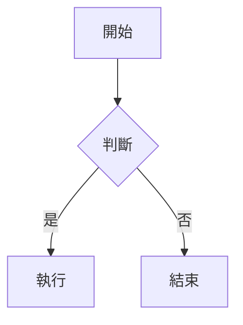

# CF Generate Docs Skill

為所有 CF 系專案生成多語言、角色分層的使用說明書。

---

## Phase 1：專案探索

執行前先自動偵測專案環境，不需要使用者手動提供：

1. 讀取 `package.json` → 取得專案名稱、版本號
2. 讀取 `CLAUDE.md`（若存在）→ 了解專案目標、技術棧、重要路徑
3. 讀取 `docs/CHANGELOG.md`（若存在）→ 了解最新功能清單
4. 讀取 `.env.local.example` 或 `.env.example`（若存在）→ 了解整合服務
5. 掃描 `src/` 目錄結構 → 推斷主要功能模組
6. 若有 Supabase → 讀取 `src/lib/supabase.ts` 或類似路徑，取得 project_id
7. 若有 API route 說明文件（如 `SECTION_DESCRIPTIONS`）→ 作為功能摘要參考

**偵測結果摘要**（開始生成前列出）：
```
專案名稱：xxx
版本：x.x.x
偵測到的角色：user, super_admin（或其他）
偵測到的語言：zh-TW, en, ja（或依 CLAUDE.md 指定）
儲存後端：Supabase / 本地檔案
```

---

## Phase 2：決定生成組合

### 預設語言

| 代碼 | 語言 |
|------|------|
| `zh-TW` | 繁體中文（台灣） |
| `en` | English |
| `ja` | 日本語 |

若 CLAUDE.md 或專案設定有指定語言，以其為準。

### 預設角色

| 角色 | 說明 |
|------|------|
| `user` | 一般使用者：日常操作功能 |
| `super_admin` | 超級管理員：系統設定、使用者管理、進階功能 |

若專案有其他角色（如 `admin`, `viewer`, `developer`），依 CLAUDE.md 或程式碼中的 role 定義追加。

生成組合 = 語言 × 角色，例如預設為 **6 份**（3 語言 × 2 角色）。

---

## Phase 3：撰寫規範

### 3.1 文件結構（配合左側 TOC 導覽）

```
# 專案名稱 — 角色名稱使用說明

## 快速開始
### 系統需求
### 首次登入 / 初始設定

## [功能模組 1]
### 子功能 A
### 子功能 B

## [功能模組 2]
...

## 工作流程圖
### 核心流程
### [其他流程]

## 常見問題 FAQ

## 版本資訊
```

規則：
- `#` 只用一次（頁面主標題）
- `##` 為主章節（會出現在左側 TOC）
- `###` 為次章節
- 每個 `##` 至少 3-5 個條列項目，避免空洞
- 章節不超過 8 個 `##`，保持 TOC 簡潔

### 3.2 語氣與用字

- **zh-TW**：繁體中文，台灣慣用語，友善口語，避免大陸用語（如「点击」→「點擊」、「文件」→「檔案」）
- **en**：清晰直接，使用主動語態，避免過度技術術語
- **ja**：敬體（です／ます調），專業但親切

### 3.3 內容深度

| 角色 | 重點 |
|------|------|
| `user` | 操作步驟（截圖替代文字說明）、Bot 指令、常見問題 |
| `super_admin` | 系統設定、權限管理、整合服務設定、資料維護 |

---

## Phase 4：Mermaid 流程圖規範

每份文件 **至少一張** mermaid 流程圖，放在 `## 工作流程圖` 章節。

### 語法

````markdown

````

### 圖表類型選擇

| 場景 | 類型 |
|------|------|
| 操作流程、資料流 | `flowchart TD` |
| 系統元件關係 | `flowchart LR` |
| 服務間互動時序 | `sequenceDiagram` |
| 狀態機（如任務狀態） | `stateDiagram-v2` |

### user 文件建議圖表

- 系統整體運作流程（從使用者操作到資料存入）
- 核心功能操作流程（依專案主功能而定）
- 任務 / 工單狀態流轉（若有）

### super_admin 文件建議圖表

- 系統架構圖（前端、後端、資料庫、Bot、外部服務）
- 使用者權限層級（RLS / Role 示意）
- 關鍵整合服務設定流程

### 品質要求

- 節點文字簡短（10 字以內）
- 每張圖不超過 15 個節點，複雜流程拆成多圖
- 節點 ID 用英文，顯示文字用該文件語言

---

## Phase 5：儲存後端

### 5A：Supabase（若專案使用 Supabase）

自動從 `src/lib/supabase.ts` 或環境變數取得 project_id，使用 `mcp__supabase__execute_sql`：

```sql
INSERT INTO docs_content (locale, section, content, generated_at)
VALUES ('{locale}', '{section}', '{markdown內容}', now())
ON CONFLICT (locale, section) DO UPDATE
SET content = EXCLUDED.content,
    generated_at = EXCLUDED.generated_at;
```

確認 `docs_content` 資料表存在，欄位：`locale`, `section`, `content`, `generated_at`。
若不存在，提示使用者先執行建表 migration。

### 5B：本地檔案（fallback 或非 Supabase 專案）

若無 Supabase，將文件寫入：

```
docs/
  generated/
    zh-TW-user.md
    zh-TW-super_admin.md
    en-user.md
    en-super_admin.md
    ja-user.md
    ja-super_admin.md
```

### 5C：自訂後端

若 CLAUDE.md 或使用者指定其他儲存方式（如 Notion、CMS API），依指示執行。

---

## Phase 6：品質檢查

每份文件生成後自我檢查：

- [ ] 有 `#` 主標題
- [ ] 至少 4 個 `##` 章節
- [ ] 至少 1 張 mermaid 流程圖
- [ ] 所有 mermaid 語法正確（無缺漏括號、箭頭）
- [ ] 語言風格一致（無混用）
- [ ] 內容對應正確角色（user 不含 admin 專屬功能，反之亦然）
- [ ] 版本資訊章節包含正確版本號

---

## Phase 7：完成回報

```
✅ 文件生成完成

專案：{name} v{version}
儲存後端：{Supabase project_id / 本地路徑}
生成組合：

  zh-TW × user        ✓  (~xxx 字)
  zh-TW × super_admin ✓  (~xxx 字)
  en    × user        ✓  (~xxx 字)
  en    × super_admin ✓  (~xxx 字)
  ja    × user        ✓  (~xxx 字)
  ja    × super_admin ✓  (~xxx 字)

總計：6/6 完成
```

若有任何組合失敗，列出原因並提供重試指令。
