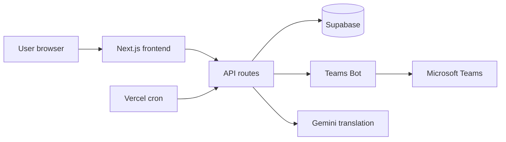
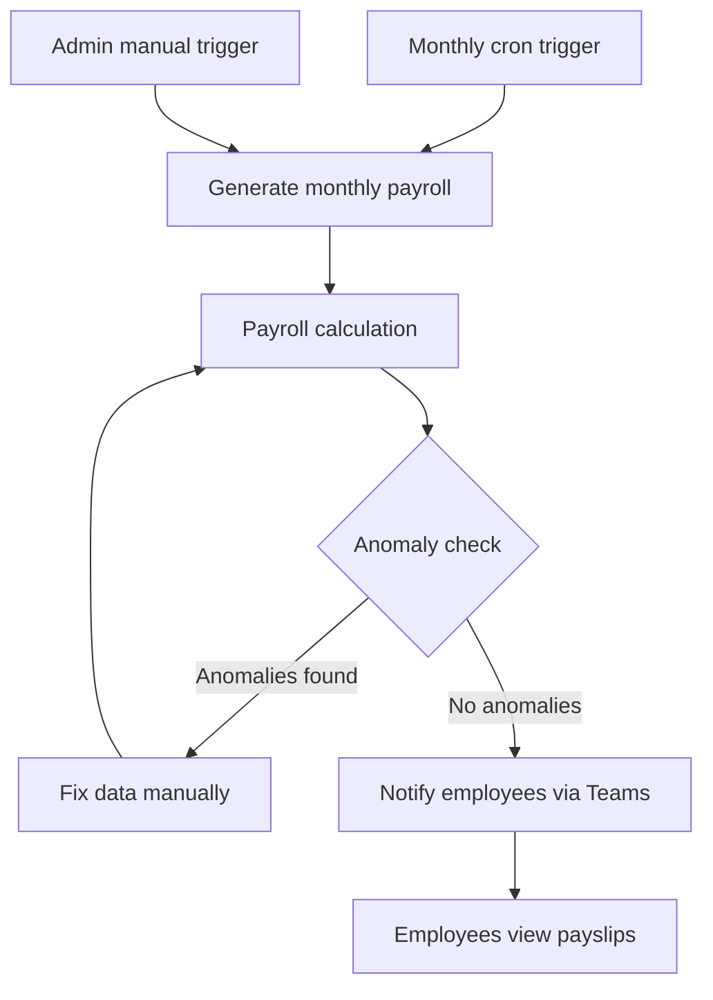
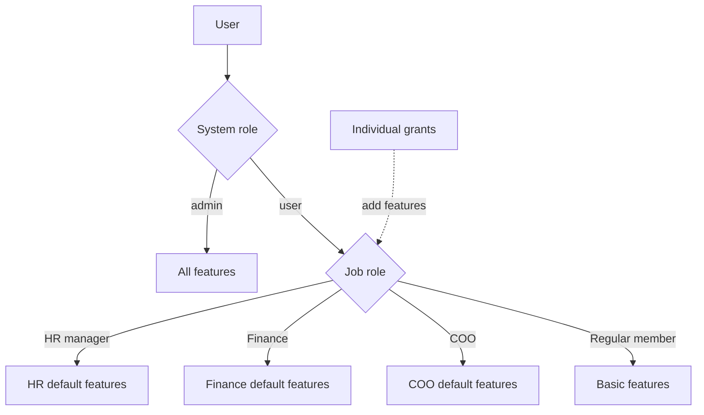

# myOPS — Administrator Guide

This guide is for system administrators (Admin) of myOPS (CancerFree Biotech's operations management system, available at `https://ops.cancerfree.io`), as well as HR managers, finance staff, and the COO who hold job roles or individual feature grants. It covers the permission model, user and organization management, HR and finance operations, the announcement and document workflow, and system maintenance plus Teams Bot configuration.

## Quick Start

### System Requirements

- Use any modern browser (latest Chrome, Edge, Safari, or Firefox). No software installation is required.
- Desktop, tablet, and mobile are all supported: tablets show a top bar with a hamburger menu, and phones get a bottom navigation bar.
- You need a company-issued Microsoft account (Microsoft Entra ID). The system signs everyone in through Microsoft.
- The interface supports Traditional Chinese, English, and Japanese. Switch languages in your personal settings; system notifications (including Teams messages) go out in each recipient's language.

### First Sign-In

1. Open `https://ops.cancerfree.io` and click "Sign in with Microsoft".
2. Complete Microsoft account verification as prompted. On first sign-in, the system requests basic profile and calendar permissions (used to sync approved leave to your calendar).
3. After your first successful sign-in, the system creates your account automatically with the default role of regular member.
4. Ask an existing administrator to set your correct system role, job role, department, and manager on the "User Management" page.

### Permission Model

myOPS permissions work in three layers that stack on top of each other:

- **System role (admin / user)**: `admin` has full access to every feature and setting in the system, with no restrictions.
- **Job role (job_role)**: A regular user can hold one of `member` (regular member), `hr_manager` (HR manager), `finance` (Finance), or `coo` (Chief Operating Officer). Each role carries a default set of features:
  - **HR manager**: publish announcements, cross-department view, attendance management, leave and overtime approval, bonus management, report viewing, plus access to the "HR Management" page and user management (limited to allowed fields such as department, manager, deputy approver, and account deactivation).
  - **Finance**: cross-department view, payroll viewing, report viewing, plus access to the "Finance Management" page to manage overtime rates and labor/health insurance brackets.
  - **COO**: publish announcements, contract approval, project management, overtime approval, payroll and report viewing, and management of "COO Settings".
- **Individual grants (granted_features)**: Feature switches you can assign to anyone regardless of job role — 12 in total, including publish announcements (publish_announcement), contract approval (approve_contract), signature export (export_signatures), cross-department view, project management, attendance management, leave approval, overtime approval, payroll viewing, bonus management, report viewing, and feedback management.
- **COO read-only view**: When the COO opens the HR Management or Finance Management pages, everything is read-only. The COO can see leave types, balances, rates, bonuses, and insurance brackets, but cannot change them.
- Only an Admin can change job roles and individual grants. HR managers cannot change anyone's system role or grants.

## User and Organization Management

### User Management

Go to "Admin → User Management" to see the company-wide account list. Click a user to edit:

- **Basic settings**: system role (Admin only), job role (Admin only), department, employment type (full-time / part-time, etc.), and work region.
- **Manager and deputy approver**: assign each user a direct manager and a deputy approver. When the manager is unavailable, the deputy approver handles leave and overtime requests.
- **Account status**: deactivate an account (turn off is_active). A deactivated user cannot sign in and is excluded from payroll generation.
- **Adding users**: accounts are created automatically the first time an employee signs in with their Microsoft account. Administrators never create accounts manually — just complete the role and department settings after the first sign-in.

### HR Profile

Each user also has an HR profile page (User Management → user → HR Profile), maintained by an Admin or HR manager:

- **Hire date / termination date**: the hire date drives seniority and leave balance calculations; entering a termination date starts the offboarding process.
- **Voluntary pension contribution rate**: set a 0–6% voluntary labor pension contribution rate, which flows into the monthly payroll calculation.
- **Bank details**: bank code and account number are used for salary transfers. The account number is masked by default; click to reveal the full value.

### Recommended Offboarding Flow

1. Enter the termination date (termination_date) on the HR profile.
2. Confirm the final month's payroll and unused leave settlement are complete.
3. Return to the user edit page and deactivate the account.
4. If needed, check the "Audit Log" for the account's recent activity.

### Companies and Departments

- "Company Management" lets you add and edit companies (for a multi-entity group structure). Users can belong to different companies.
- "Department Management" lets you create and adjust departments. Departments determine cross-department view permissions and report aggregation scope.
- After you change a user's department or company, their visible data scope updates immediately.

## HR and Attendance Management

HR features are consolidated on the "HR Management" page (editable by Admin and HR managers; read-only for the COO):

### Leave Types and Balances

- **Leave type management**: define leave types (annual, sick, personal, etc.), whether they are paid, and who they apply to.
- **Leave balances**: set each employee's annual balance for every leave type, and adjust or look up remaining balances at any time.
- Managers or deputy approvers review the leave requests employees submit. The system notifies the applicant of the result instantly via Teams.

### Attendance and Overtime

- **Attendance management** (Admin → Attendance Management): view and correct clock-in/out records for everyone.
- **Attendance anomaly check**: the system automatically collects anomalous punches (missing punches, unusual hours) into two lists — automatic checks for full-time staff and missing punches for part-timers — so HR can confirm and resolve them one by one.
- **Overtime rate management**: set overtime rate multipliers by time slot and type as the basis for payroll calculation. The minimum lead time (in hours) for submitting overtime requests is adjustable in System Settings.

### Bonus Management

- Add bonus items for individual employees; they are included in that month's payroll calculation.
- Grant bonus management access through the job role (HR manager) or an individual grant (bonuses_manage).
- The COO can view the bonus list read-only for review purposes.

## Finance and Payroll Management

Finance features are consolidated on the "Finance Management" page (editable by Admin and the Finance role; read-only for the COO):

### Labor and Health Insurance Brackets

- Import labor and health insurance bracket tables from an Excel file: click the upload area to choose a file, review the parsed preview (the system reads the first worksheet only), and submit once everything looks correct.
- Bracket tables are managed by year. Re-import after each annual government adjustment.
- A successful import shows a record-count confirmation; if the file format is wrong or the content is empty, the screen explains the error.

### Monthly Payroll Generation and Calculation

- The system can generate the full company payroll automatically each month via a scheduled job, and an Admin or HR can also trigger "Generate Monthly Payroll" manually from the management page.
- The payroll calculation combines: base salary, attendance and leave records, overtime rates, bonuses, insurance brackets, and voluntary pension contribution rates.
- After payslips are generated, the Teams Bot notifies each employee that their payslip is ready (sent in the employee's language).
- The auto-generation day and payday are adjustable in System Settings. Payroll-related endpoints are protected by multi-factor authentication (MFA).

### Payroll Anomaly Check and Annual Payroll

- **Payroll anomaly check**: automatically compares the current month against historical data and lists anomalies (drastic amount changes, missing data). Confirm every item before payday.
- **Annual payroll**: Admin and HR can view month-by-month payroll summaries for everyone across the year; regular employees see only their own annual records.
- Recommended flow: generate monthly payroll → run the anomaly check → fix the data and recalculate → confirm everything before releasing.

## Announcements, Documents, and System Maintenance

### Publishing Announcements and Read Receipts

- Anyone with publish permission (Admin, HR manager, COO, or an individual grant) can create announcements and documents and pick the recipient list.
- When publishing, you can require a read receipt (on by default): recipients must click to confirm they have read it, and the system tracks who has not confirmed.
- Set a reminder window in days — recipients who miss the deadline receive a reminder. Publishing also pushes a Teams notification.
- Anyone with signature export permission can export the confirmation/signature list for audit records.

### Contract Approval Flow

- An uploaded contract starts in "Pending Review" status. Someone with contract approval permission (the COO or an individual approve_contract grant) approves or rejects it.
- The reviewer clicks "Approve" or "Reject" directly on the contract detail page, and the status updates immediately.
- Adjust the contract review reminder schedule in System Settings so contracts never sit unreviewed for long.

### AI Translation

- Announcements and documents support one-click AI translation: using the Chinese content as the source, the system generates English and Japanese versions for colleagues who read other languages.
- Translation uses the Google Gemini service. Enter a Gemini API Key in "System Settings" first.
- Always have someone review proper nouns in the translation before publishing.

### Audit Log and Feedback Management

- **Audit Log** (Admin → Audit Log): records significant operations in the system. Filter by action type, search by keyword, and browse by page to trace data changes.
- **Feedback Management** (Admin → Feedback Management): review issues and suggestions reported by employees (including screenshots), and update the handling status to track progress.

### System Settings

"Admin → System Settings" centralizes global parameters (Admin only). The main setting groups are:

- **Integration keys**: service credentials such as the Gemini API Key (AI translation) and Teams Bot secret.
- **Payroll parameters**: payroll auto-generation day and payday.
- **Overtime and approval**: minimum lead hours for overtime requests, the hour threshold at which project overtime notifies the COO, and the MFA review session validity in minutes.
- **Notification schedule switches**: daily to-do digest, clock-in/out reminders (automatic for full-time / missing punches for part-timers), and contract review reminders.
- **Maintenance mode**: when enabled, regular user operations pause so you can perform system maintenance.

### Teams Bot

- The Bot proactively sends six message types: daily to-do digest, clock-in/out reminders, real-time notifications, leave approval results, payslip-ready notifications, and announcement notifications.
- **Schedule (Taipei time, Monday–Friday)**: daily to-do digest at 08:30, clock-in reminder at 07:00, clock-out reminder at 17:30.
- **Conversation reference mechanism**: after an employee installs (or is added to) the myOPS Bot in Teams, the system matches the member's email to their myOPS account and stores a conversation reference. Only then can the Bot message that employee proactively. Employees who have not installed the Bot are silently skipped, without affecting other notification flows.
- Bot messages go out in Chinese, English, or Japanese based on the recipient's language setting. A failed Bot push never blocks the main system flow (for example, payroll still generates normally).
- For the full Azure Bot creation, Teams installation, and deployment steps, see the setup guide: `docs/teams-bot-setup.md`.

## Workflow Diagrams

### System Architecture

### Monthly Payroll Cycle

### Permission Layers

## FAQ

- **Q: A new colleague signed in but cannot see any admin features?**
  A: Accounts are created automatically on first sign-in with the default role of regular member. An Admin must go to "User Management" to assign a job role or individual grants, and set the department and manager.
- **Q: Why can't an HR manager change someone's system role?**
  A: Only an Admin can change system roles, job roles, and individual grants. HR managers can only edit allowed fields such as department, manager, deputy approver, and account status.
- **Q: An employee is not receiving Teams notifications. What should I do?**
  A: Confirm the employee has installed the myOPS Bot in Teams (the system needs the conversation reference) and that their Teams account email matches their myOPS account. Employees without the Bot are skipped without errors.
- **Q: The AI translation button does nothing or shows an error?**
  A: First confirm a valid Gemini API Key is set in "System Settings" and that the document has Chinese content (translation uses Chinese as the source).
- **Q: The insurance bracket Excel upload fails?**
  A: The system reads only the first worksheet of the file. Make sure the columns match the template, the content is not empty, and the correct year is selected, then upload again.
- **Q: Payroll was generated with wrong amounts. Can I rerun it?**
  A: Yes. Fix the source data first (attendance, overtime rates, bonuses, HR profile), then trigger the payroll calculation again from Finance Management, and verify with the "Payroll anomaly check".
- **Q: Why can't the COO edit anything on the HR Management page?**
  A: This is by design. The COO has read-only access to HR and Finance settings; only the Admin and the matching job role can edit.
- **Q: Does an employee's data disappear after they leave?**
  A: No. Deactivating an account only blocks sign-in and removes the person from the payroll list. Historical attendance, leave, and payroll records are all retained for lookup and audit.

## Version Information

- **Applies to version**: v0.3.1
- **Document date**: 2026-06-11
- Highlights of this release: Teams Bot integration went live (six proactive notification types, trilingual delivery based on recipient language, Azure setup guide `docs/teams-bot-setup.md`), and Vercel cron fixes (clock-in reminders and the daily digest now trigger correctly).
- Related recent updates: HR/Finance management embedded directly into the settings pages with COO read-only support (v0.2.47), the job_role system launched (v0.2.44), and API error messages localized into multiple languages (v0.2.49).
- If this document differs from the actual system screens, the system takes precedence. Please report discrepancies through the "Feedback" feature.
