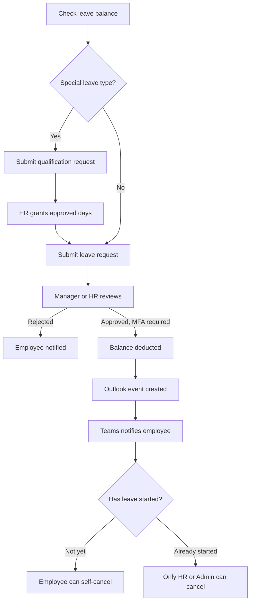
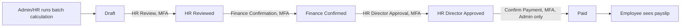
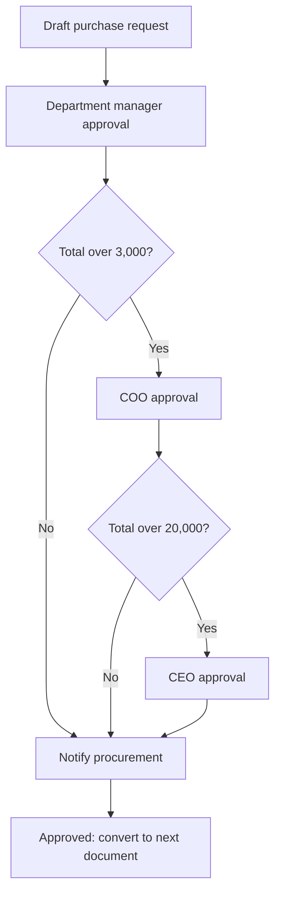

# myOPS — Administrator & HR Guide

myOPS is CancerFree Biotech's internal operations platform, covering attendance, leave, payroll, procurement, HR, documents, projects, and more, at `https://ops.cancerfree.io`. This guide is written for Administrators and HR staff — the people who manage system settings, user permissions, and company-wide data — and it also covers every feature available to regular employees, since admins and HR need to understand both sides of each workflow to support their colleagues.

Permissions in myOPS are unusually granular: almost every page checks a different combination of system role, job role, and individual feature grants. Read "Understanding the Permission Model" below before you start granting access, and treat the **Permission Matrix** section near the end of this guide as the single source of truth whenever a page's behavior seems inconsistent with another page.

## Getting Started

### System Requirements

- Use any modern browser — the latest Chrome, Edge, Safari, or Firefox. No software installation is required.
- Desktop, tablet, and phone are all supported. Tablets show a top bar with a hamburger menu; phones get a bottom navigation bar.
- Sign-in is handled entirely through a company-issued Microsoft account (Microsoft Entra ID). There is no separate myOPS password.
- The interface supports Traditional Chinese, English, and Japanese. Each user picks their own language in Personal Settings, and system notifications — including Teams messages — go out in the recipient's chosen language.

### First Sign-In and Account Setup

1. Open `https://ops.cancerfree.io` and sign in with a company Microsoft account.
2. On first sign-in, myOPS automatically creates an account for the employee with the default system role of regular member. **Accounts are never created manually** — there is no "add user" button anywhere in the system.
3. An existing Administrator (or an HR user with the right grant — see below) must then open User Management and set the new employee's department, employment type, work region, manager, and deputy approver.
4. Only an Administrator can assign a job role (HR Manager, Finance, COO, CEO) or individual feature grants. Do this as soon as possible — many modules stay invisible or non-functional for a new hire until roles are set.
5. Encourage every new employee to enroll in MFA (multi-factor authentication) early. A large number of approval, void, and sensitive-write actions across the system require a completed MFA challenge (AAL2); anyone who hasn't enrolled is redirected to `/mfa/verify` the first time they hit one of those actions.

### Understanding the Permission Model

myOPS combines three independent permission layers, and — this is the part that trips people up — **different pages use different combinations of them.** There is no single, unified "is this person HR?" check.

- **System role**: every account is either `admin` or a regular member. `admin` bypasses almost every other check in the system and can reach nearly all pages and actions.
- **Job role** (`job_role`): a regular member can additionally be tagged `hr_manager`, `finance`, `coo`, or `ceo`. Job roles are set per person on the User Management page and are meant to represent an organizational title.
- **Individual feature grants** (`granted_features`): a set of 15 independent flags — `hr_manager`, `finance_payroll`, `approve_contract`, `publish_announcement`, `expense_approve`, `confirm_payroll`, `approve_payroll`, `procurement_unit`, `procurement_manage`, `procurement_payment_approve`, `asset_manage`, `manage_projects`, `lab_manage`, `training_manage`, and `coo_notify` — that can be handed to *any* user regardless of their job role. Note that `hr_manager` exists as both a job role value and a separate individual grant; a page may check one, the other, or either.

Because these checks are mixed and matched per page, an employee who has `job_role='hr_manager'` is **not** automatically able to do everything an "HR person" can do elsewhere in the system, and vice versa. Some concrete patterns to keep in mind as you read the rest of this guide:

- Pages that check **`job_role` only** (granting the individual `hr_manager` feature does nothing here): HR Management, Leave Types, Leave Balances, Attendance Anomalies.
- Pages that check **individual grants only** (setting `job_role='hr_manager'` alone does nothing here): User Management, Onboarding/Offboarding, Recruiting — these three also lack a sidebar link for non-Admin HR, so the person needs the URL even once granted.
- Pages that accept **either signal**: Clock-In company records, Shift Management.
- Pages that are **Admin-only with no HR exception at all**: Geofences, Employee HR Profile, Department Master, Company Master, Teams Bot Policy, Operations Dashboard, Feedback Management, Daily Report Group Management, and System Settings.
- "Can see the page" and "can successfully complete the action" are sometimes two different checks. This shows up most often in Finance/Procurement pages — a job role might unlock the form while the underlying API still 403s until the right individual grant is also present.

When in doubt, use the Permission Matrix section of this guide, not the sidebar link visibility, to determine what a role can actually do.

## Attendance, Leave, Overtime & Payroll

### Attendance & Leave

#### Clock In / Out — `/attendance`

Every employee punches in and out here and reviews their own history. HR and Admin use the same page's "Company Records" tab to see everyone's punches. The old `/admin/attendance` route now only redirects here — it is not a separate page.

- Punch in or out with GPS; if an admin has turned on "enforce clock-in range," your location must fall inside one of the defined zones or the punch is rejected.
- Check today's punch times at a glance, including a flag for whether either punch was auto-filled by the system.
- Browse your own punch history and calculated work hours by year and month under "My Records."
- Submit a backdated-punch request (date, type, time, reason) if you forgot to clock in or out. The approver is assigned automatically by a database trigger — usually your manager — and cannot be chosen manually.
- **Admin/HR**: filter company-wide punches in "Company Records" by month, employee, or employment type, and review summary cards (today's punch count, average attendance days, auto-fill count).
- **Admin/HR**: void an abnormal punch record (a reason is required and stays on the audit trail) or reverse a void.
- Approving or rejecting a backdated request, and voiding or un-voiding a record, all require MFA (AAL2). Without MFA enrollment, the action fails and redirects to `/mfa/verify`.

*Who can do what*: everyone can use "My Records." "Company Records" is available to anyone matching **`role=admin` OR `job_role='hr_manager'` OR `granted_features` contains `hr_manager`** — any one of the three qualifies. This page recognizes `job_role` as a valid HR signal; several other pages in this section do not, so don't generalize this rule elsewhere.

#### Leave — `/leave`

Employees apply for leave online, check balances, and request qualification for special leave types. Managers, HR, and Admin review pending requests; HR/Admin can also view every employee's leave and cancel an already-approved leave on someone's behalf.

- Check your current balance for each leave type (annual leave accrues on your work anniversary; every other type resets on the calendar year).
- Submit a leave request — pick the type, start/end dates, full or half day, a reason, and optionally a delegate to cover for you. The system calculates the number of days and checks it against your balance automatically.
- Review "My Records" for history and status; cancel a request that's still pending; and self-cancel an already-approved leave **as long as it hasn't started yet** — this returns the balance and removes the Outlook event.
- Apply for special leave types (marriage, bereavement, maternity, etc.) through "Special Leave Qualification" first — HR must grant you a number of days before you can file the actual leave request for that type.
- **Admin/HR**: approve or reject pending leave requests (approval requires MFA). Approving automatically deducts the balance and creates an all-day Outlook event; rejecting or cancelling removes it.
- **Admin/HR**: browse the read-only "Company Records" view across the whole company.
- **Admin/HR**: cancel someone else's already-approved leave on their behalf. **Once a leave has started, only HR or Admin can cancel it — a manager cannot**, even though a manager can approve the original request. The action is logged for audit and sends a Teams notification to the employee.

*Who can do what*: HR here means **`role=admin` OR `granted_features` contains `hr_manager`** — note that `job_role` is *not* checked on this page, unlike the Clock-In page above. Pending-request approval is also open to the employee's direct manager.

#### Leave Calendar — `/leave/calendar`

A month-view calendar of leave across a department or the whole company, including leave type and reason, meant to help managers coordinate scheduling. **There is currently no link or button anywhere in the app that leads here** — it's an orphan page reachable only by typing the URL directly. If you want this feature retained or merged into the Company Calendar, raise it with engineering; for now, treat it as available-but-hidden.

- View a month calendar with a dot per day showing how many people are on leave (green = approved, yellow = pending).
- Click a day to see the full list for that date: name, leave type, date range, days, and status.
- Check "My department only" to filter quickly, and page between months to look at past or future periods.
- **Admin/HR**: use the department dropdown to switch between any department or view the whole company. Regular employees and managers are locked to their own department.

*Who can do what*: everyone can view this page read-only, restricted to their own department, except HR/Admin (`role=admin` OR `granted_features` contains `hr_manager`) who can see any department or the whole company. There is no editing capability anywhere on this page.

#### Overtime — `/overtime`

Employees submit overtime requests (paid according to Labor Standards Act day-type multipliers), and can optionally link a request to a project. This page has an important interface gap you should know about before troubleshooting a complaint.

- Submit an overtime request: date (the day type is detected automatically), start/end time, an optional linked project, and a reason. The system calculates hours automatically, and a request crossing midnight counts as one extra day.
- Check "My Requests" for your own history and status.
- **Interface gap**: the "Pending" tab shows *every* employee's company-wide pending overtime requests, complete with Approve/Reject buttons, regardless of who is logged in. Clicking Approve, however, is checked on the backend, and anyone who is not the requester's direct manager, the linked project's lead, an Admin, or a holder of the `coo_notify` grant gets a 403 error. **This is expected behavior, not a data leak** — seeing the request is not the same as being able to approve it.
- **`hr_manager` cannot approve overtime at all**, whether held as a job role or as an individual grant. HR/Admin only get read access to company-wide records here, not approval rights.
- **Admin/HR**: browse the read-only "Company Records" tab, filterable by month, employee, and status.
- Approved overtime requires MFA to approve/reject, and feeds into the payroll draft using the day-type multiplier (1.34×/1.67× on a workday, 1.34×/1.67×/2.67× on a rest day, 2× on a national holiday).

*Who can do what*: submitting and viewing your own requests is open to everyone. The "Pending" tab is *displayed* to `role=admin` OR `granted_features` contains `hr_manager`, but the actual approve/reject action is only granted to the requester's direct manager, the linked project's lead, `role=admin`, or `granted_features` contains `coo_notify`. Company-wide "Records" viewing requires `role=admin` OR `granted_features` contains `hr_manager`.

#### Business Trips — `/business-trips`

Employees request business trips online. The approver is fixed at submission time to whoever was the employee's direct manager on that day — if the org chart changes later, the approver on that request does not change.

- Submit a trip request: destination, reason, start/end dates, and an optional detailed itinerary.
- Check "My Trips" for history and status; cancel a request while it's still pending.
- Once approved, click "Create Expense Report" to jump straight into the Expenses module with the trip pre-filled.
- **Admin/HR**: review pending trip requests (approval requires MFA) — the approver is whoever was the direct manager at submission time, or Admin/HR.
- **Admin/HR**: browse the read-only "Company Records" across the whole company.

*Who can do what*: the pending-approval role is the manager assigned at submission time, plus `role=admin` OR `granted_features` contains `hr_manager`. Company Records access uses the same HR check.

#### Company Calendar — `/calendar`

A whole-company month view combining company events, approved leave, and approved business trips — designed for general visibility, not scheduling detail.

- View a month calendar: company events in green, coworkers on leave in blue (deliberately shown only as "on leave," never the leave type — this changed in v0.9.9 specifically to protect health-related privacy), and coworkers on trips in purple (destination shown, since it isn't private).
- Click a day to see the full list; RSVP to any company event as attending, not attending, or undecided, and expand to see who else responded.
- **Admin/HR**: create, edit, and delete company events (title, description, start/end dates).

*Who can do what*: everyone can view and RSVP. Managing events requires `role=admin` OR `granted_features` contains `hr_manager` — this page does **not** check `job_role`, matching the Leave page's HR rule, not the Clock-In page's. Note that this calendar's "leave without type" rule is a deliberate, separate design decision from the Leave Calendar page above, which does show leave type to the same audience — don't merge the two descriptions.

#### Attendance Anomalies — `/admin/attendance-anomalies`

A read-only report: full-time employees with 3+ consecutive days of auto-filled punches in the last 30 days, and interns who missed more than 3 punches this month. The same component is also embedded, read-only, inside HR Management.

- View the "consecutive auto-fill" list for full-time staff (5+ days is highlighted in red).
- View the "intern missed punches" list for the current month.
- There is no export button, no "mark as handled" action — this page is pure reporting, meant to prompt a manual conversation with the employee or their manager.

*Who can do what*: **`role=admin` OR `job_role='hr_manager'` OR `job_role='coo'`.** This page checks `job_role` only — it does **not** recognize the individual `hr_manager` grant, unlike most other HR pages in this guide. Someone who was only given the individual grant will be redirected to a no-permission page here.

#### Leave Types — `/admin/leave-types`

Maintains the company's list of leave types — name, who it applies to, whether it's paid, the annual cap, how many days of advance notice are required, and whether it's active. This is the data source for the dropdown on the Leave request form.

- Add a new leave type: name, eligible group, pay treatment, annual cap, advance-notice days, and active/inactive.
- Edit any field on an existing leave type.
- There is no read-only mode on this standalone page — a COO can edit everything here, which is different from the read-only version embedded in HR Management (see below); describe this page's own behavior, not the embedded one.
- Whether a type requires HR qualification approval first (`requires_qualification`) has no UI control at all yet — it can only be set directly in the database.

*Who can do what*: **`role=admin` OR `job_role='hr_manager'` OR `job_role='coo'`.** Like Attendance Anomalies, this checks `job_role` only, not the individual grant.

#### Leave Balances — `/admin/leave-balances`

Adjusts each employee's approved days per leave type for the current year (or current anniversary period for annual leave), with a bulk "auto-fill by seniority" tool. This is the data source behind the balance an employee sees on the Leave page, and since v0.9.7 it is the only sidebar entry point for balance maintenance.

- Adjust granted days per employee and leave type in a spreadsheet-style table, then click "Save."
- Run "Auto-fill annual leave by seniority" to batch-generate or update annual-leave balances based on hire date — it does not overwrite balances you've already adjusted manually.
- Filter to a single employee with the dropdown, and see how many days of each type they've already used.

*Who can do what*: **`role=admin` OR `job_role='hr_manager'` OR `job_role='coo'`.** Same `job_role`-only check as Leave Types — the individual `hr_manager` grant is not recognized here, and there is no read-only mode.

#### Shift Management — `/admin/shifts`

Defines multiple clock-in shifts (start/end time, workdays, grace period, break minutes) and assigns them to employees; late-arrival detection on the Clock-In page uses whichever shift is assigned to the employee for that day.

- Add or edit a shift: name, start/end time, workdays, flexible grace period, break minutes, and active status.
- Assign the current applicable shift to each employee (only active shifts appear in the picker).

*Who can do what*: **`role=admin` OR `job_role='hr_manager'` OR `granted_features` contains `hr_manager`.** This page checks both signals — but, notably, **not `job_role='coo'`**. The COO can edit Leave Types, Leave Balances, and view Attendance Anomalies, but cannot open this page at all — don't assume COO access is consistent across this group of pages.

#### Geofences (Clock-In Range) — `/admin/geofences`

Defines the geographic coordinates where punching in is allowed (multiple locations supported) and a master switch for "enforce range." When enforcement is on, a punch outside every defined zone is rejected.

- Toggle "enforce clock-in range" on or off (off by default — coordinates are still recorded, they just aren't used to block anyone).
- Add a zone: name, latitude/longitude (or "use my current location"), and radius.
- Enable, disable, or delete a zone; you can define several zones, and a punch inside *any* one of them qualifies.

*Who can do what*: **`role=admin` only.** This is the single page in the entire attendance/leave group that recognizes no HR signal at all — not `job_role`, not any individual grant. HR and the COO cannot open it under any configuration and need to ask an Administrator (or IT) to make changes.

### Payroll & Compensation

#### Payroll — `/payroll`

The main payroll page shows a different view depending on who's looking. A regular employee only sees "My Payslips" (limited to slips in **HR Director-approved** or **paid** status, last 12 months). HR, Finance, and anyone with the `view_payroll` grant get an additional "Payroll Table" tab for batch calculation, manual creation, and bulk approval. **There is no scheduled job that generates payroll drafts** — batch calculation is a manual button click, not a monthly cron.

- "My Payslips": browse your own approved/paid payslips from the last 12 months; open one for the full breakdown.
- **Admin/HR**: view the current month's company-wide payroll records in the "Payroll Table" tab.
- **Admin/HR**: run "Batch Calculation" for active, full-time, Taiwan-based employees with a monthly salary on file — it computes the draft using salary, approved overtime, unpaid-leave deductions, bonuses, and the insurance bracket tables. **Re-running it overwrites any payslip already in the approval workflow and clears its approval history** — the system warns you how many records will be affected before you confirm.
- **Admin/HR**: manually create a single payslip (blocked if a non-draft payslip already exists that month, to prevent bypassing the approval chain).
- **Admin/HR**: "Bulk Approve" advances every payslip at the same stage forward in one click (one button each for HR Review, Finance Confirmation, HR Director Approval, and Payment Confirmed). Under the hood it still calls the original API per payslip with the same MFA and state-machine checks — a partial failure names exactly which slips didn't go through.
- Export to Excel via `/api/export/payroll` is available to `role=admin` or holders of `hr_manager`/`finance_payroll` grants, but has **no button in the UI** — you must open the URL directly with a year/month parameter.

*Who can do what*: viewing your own payslip is universal. The payroll table requires `role=admin`/`hr` or the `view_payroll` grant. Batch calculation needs `role=admin`, `job_role='hr_manager'`, or the `hr_manager` grant. Manual creation is `role=admin`/`hr`.

#### Payroll Detail — `/payroll/{id}`

The full breakdown for a single month: gross pay, deductions, net pay, employer-side contributions, approval trail, and anomaly flags. **`—` and `NT$0` mean different things** — `—` means the figure hasn't been calculated yet, while `NT$0` means it *was* calculated and genuinely came out to zero (this really happens when the insurance bracket table for that year hasn't been uploaded).

- View your own approved/paid payslip in full, along with any flags raised by the payroll anomaly scan.
- See the employer's side of labor/health insurance and the 6% pension contribution — not just your own take-home portion.
- Jump to "Annual Payroll Summary" from here.
- **Admin/HR**: anyone with the `view_payroll` grant can open any employee's payslip, in any status, including its full approval trail. There are no approval buttons on this page itself — approvals happen from the Payroll Table.

*Who can do what*: you can view your own slip only when it's HR Director-approved or paid. `role=admin`/`hr` or `view_payroll` grant holders can view any employee's slip in any status.

#### Annual Payroll Summary — `/payroll/annual`

A year-over-year view of your January–December payroll. **Important inconsistency to note**: when you look up your own annual record, the query has no status filter — it relies entirely on RLS (Row-Level Security), which allows you to see your own records in *every* status, including drafts still in review. This differs from "My Payslips" and Payroll Detail above, which only show approved/paid slips. Describe the actual visible range for each page rather than assuming they match.

- Pick a year (current year ± 2) to see your own month-by-month breakdown and annual total, unfiltered by status.
- Months with no data yet show `—`, meaning HR hasn't created that month's payslip.
- **Admin/HR**: switch the employee dropdown to view any active employee's annual summary.

*Who can do what*: viewing your own record (all statuses) is universal. Switching to view someone else's requires `role=admin`, `role=hr`, or the `view_payroll` grant.

#### Payroll Anomaly Check — `/admin/payroll/anomalies`

Scans a chosen month's payroll records and flags five conditions: overtime beyond 46 hours, net pay differing more than 20% from the prior month, unpaid-leave deductions exceeding half of base pay, new hires/departures that month, and full-time base salary of zero. There is **no standalone sidebar entry** — the practical way in is the embedded block inside Finance Management, or typing the URL directly.

- Run an anomaly scan for a chosen month — this clears that month's old flags first and re-scans against all five rules.
- View already-flagged anomalies without triggering a new scan (reads existing database flags only).
- Each result lists the employee, net pay, and which rule(s) it triggered (a record can trigger more than one).

*Who can do what*: `role=admin`, `job_role='finance'`/`'coo'`, or holders of the `hr_manager`/`finance_payroll` grants. Regular employees cannot open this page at all. **This page cannot modify payroll** — it only flags and displays; corrections happen back in the Payroll Table or Payroll Detail.

#### Labor & Health Insurance Bracket Tables — `/admin/insurance-brackets`

Upload and review the annual labor/health insurance premium bracket tables. If a year's table hasn't been uploaded, batch payroll calculation still runs — the resulting premiums simply come out to zero (the page warns you, but does not block the calculation).

- Upload a bracket table (xlsx/xls/csv) — column names in Chinese or English aliases are auto-detected, with a preview and a list of any skipped rows and why.
- Download a blank template (headers only, no sample figures).
- Upload for a full year overwrites the previous table for that year (delete-then-insert inside a single database transaction).
- Switch years to review the currently active table.
- **Important**: page access and upload permission are two separate checks. `role=admin`, `job_role='finance'`, or `job_role='coo'` can all *see* this page and its form, but the upload only succeeds for `role=admin` or a holder of the `finance_payroll` grant — a `job_role='finance'`/`'coo'` user without that grant will see the form but get a 403 when they click upload.

*Who can do what*: page access is `role=admin`/`finance`/`coo`. Actually completing an upload requires `role=admin` or the `finance_payroll` grant.

#### Labor Pension Contribution Bracket Table — `/admin/insurance-brackets`

Shares the exact same page as the insurance bracket tables above (a third, independent section further down), but the underlying data table, API, and calculation are completely separate. The system ships pre-loaded with the official 2026 table (62 brackets). An individual's voluntary contribution rate is set on their HR Profile page — this page only controls the monthly contribution wage and the employer's 6%.

- Upload a pension bracket table (xlsx/xls/csv, Chinese column aliases supported), with the same preview/skip-reason/blank-template flow as the insurance tables.
- A full-year upload overwrites the year's table inside a single transaction.
- Switch years to review the table and see the employer's 6% contribution calculated from the monthly wage bracket.

*Who can do what*: same split as insurance brackets — page access is `role=admin`/`finance`/`coo`, but a successful upload needs `role=admin` or the `finance_payroll` grant.

#### Bonus Management — `/admin/bonuses`

Create, view, and delete employee bonus records (year-end, performance, project, or other), filterable by year. Batch payroll calculation only folds a bonus into an employee's pay when **both** the year and the month match — a bonus with the month left blank is never included in any payroll run. There's no dedicated sidebar entry either; the practical entry point is the embedded block in HR Management (which correctly shows read-only where appropriate). On this standalone page, however, the read-only flag isn't wired up: `job_role='hr_manager'`/`'coo'` users see full edit buttons here and only discover the 403 after clicking.

- Add a bonus record: employee, type, amount, an *optional* month, and a description. **Leaving the month blank means the amount is never picked up by any payroll run — always fill it in if the bonus should hit a specific month.**
- Delete a bonus record (with a confirmation dialog; not recoverable).
- Switch years to review records and see the year's total.

*Who can do what*: page access is `role=admin`, `job_role='hr_manager'`/`'coo'`, or the `finance_payroll` grant. **Actually creating or deleting a bonus requires `role=admin` or the `finance_payroll` grant** — `job_role='hr_manager'` alone will see the buttons but get a 403.

## Procurement, Inventory, Projects & Approvals

### Vendor & Product Master Data

#### Vendor Master — `/procurement/vendors`

Maintains around 37 fields of vendor basic, contact, billing, and banking information, used to auto-fill data on RFQs and purchase requests. There is currently **no delete button** in the UI (the schema has a `deleted_at` column, but nothing calls it).

- Browse the vendor list (searchable, sortable, paginated); click a row to open a detail dialog with all four field groups.
- **`procurement_manage` grant or admin**: add or edit a vendor directly — a plain `procurement_unit` user does not see this button.
- Alternative path that doesn't need `procurement_manage`: submit a "Vendor Evaluation" that goes through COO approval; once approved, it writes into this master file automatically and generates a vendor code (`V-YYMM-NNN`).

*Who can do what*: viewing requires `procurement_unit` or `procurement_manage`. Adding/editing directly requires `procurement_manage` or admin.

#### Product Master — `/procurement/products`

Maintains purchasable product records and the "purchase unit × conversion factor = stock unit" dual-unit conversion, plus a look at historical vendor quotes for comparison. The "Vendor Quotes" table you see here is populated automatically from adopted quotes on approved RFQs — it is not something you type in on this page.

- Browse the product list (searchable); the table shows dual-unit conversion and current stock level.
- Open a product's detail dialog for specs, category, stock level, the conversion formula, and its "Vendor Quotes" comparison history.
- Click a product name to jump to its "Inbound/Outbound Ledger" for stock movement history.
- **`procurement_manage` grant or admin**: add, edit, or delete a product (deletion asks for confirmation first).

*Who can do what*: viewing requires `procurement_unit` or `procurement_manage`. Add/edit/delete requires `procurement_manage` or admin.

#### Product Ledger — `/procurement/products/[id]`

A single product's stock movement record: current lots on hand, yearly in/out totals, and a line-by-line history. Entries are generated automatically when inbound/outbound orders are posted — this page itself is purely read-only.

- View the product summary card and "current lots on hand" (lots expiring within 90 days, or already expired, are color-flagged).
- Pick a year to see inbound/outbound totals and the ending balance, then expand line items — each links back to the originating inbound or outbound order.

*Who can do what*: viewing requires `procurement_unit` or `procurement_manage`. The underlying data is generated by `procurement_manage` users posting inbound/outbound orders elsewhere — not on this page.

#### Vendor / Product Evaluations — `/procurement/evaluations`

Two forms sharing one page (as tabs): registering a new vendor through an approval workflow, and logging the source of a price comparison. Once a vendor evaluation is approved, it writes automatically into the Vendor Master. **Correction worth calling out**: the product-evaluation tab currently only has two fields — "source RFQ number" and a note — there is no line-item price-comparison editor, and it does **not** automatically record any pricing. The mechanism that actually writes vendor pricing is the RFQ approval flow described below; don't describe product evaluation as "auto-logging" comparisons.

- Switch between the "Vendor Evaluation" and "Product Evaluation" tabs (both searchable, sortable, paginated).
- Vendor Evaluation: fill in 22 vendor fields plus a note and submit for approval; once the COO approves it, it writes to (or updates) the Vendor Master and generates a vendor code.
- Product Evaluation: fill in a source RFQ number and a note only — this simply documents who is vouching for a price comparison; it does not log the comparison items itself.
- Open the detail dialog to see the approval timeline, and approve/reject your own pending step (MFA required) when it's your turn.

*Who can do what*: viewing and creating drafts requires `procurement_unit` or `procurement_manage`. Vendor Evaluation is always approved by the COO (`job_role`); Product Evaluation is approved by the submitter's direct manager (or the submitter themselves, if they have no manager). Both require MFA.

### Procurement Documents & Payments

#### RFQs (Quotation Requests) — `/procurement/rfqs`

A requester lists items and names a quotation officer; the officer records multiple vendor quotes per item, marks one "adopted" per item, and sends it to the department manager for approval. Once approved, it converts in one click into a purchase request with items and adopted prices pre-filled. **Note**: on the "My Pending Approvals" home widget, links to this document type are null — the badge shows but isn't clickable — so users need to open this page's own list and click in themselves.

- Create an RFQ draft and add or remove line items; the assigned quotation officer records multiple vendor quotes per item and checks "adopted" (only one adoption allowed per item).
- Upload vendor quote attachments (multiple files, stored in the procurement bucket).
- Submit for approval — uniquely, **the quotation officer can keep editing content even while it's in the approval workflow**; this is a deliberate exemption, not a bug.
- Once approved, click "Convert to Purchase Request" to auto-fill items and adopted unit prices (if every adopted quote came from the same vendor, that vendor's details are pre-filled too).
- **`procurement_manage`/admin, with MFA**: "Void & Copy" an approved or rejected RFQ, creating a fresh draft with the same content.
- If the department has no manager, or the requester *is* the manager, a holder of `procurement_payment_approve` can sign in their place to avoid a stuck approval.

*Who can do what*: viewing requires `procurement_unit` or `procurement_manage` (admin always can). Creating/editing drafts requires the author or `procurement_manage`. During approval, only the assigned quotation officer can edit; everyone else is read-only. Approval is a two-step chain: quotation officer → department manager (or a `procurement_payment_approve` holder standing in). Voiding requires `procurement_manage`/admin and MFA.

#### Purchase Requests — `/procurement/purchase-requests`

Records an order placed with a vendor — items, amount, and payment terms — through a "department manager → COO (if total > NT$3,000) → CEO (if total > NT$20,000) → notify procurement" chain. **All monetary totals (subtotal, tax, grand total) are always recalculated server-side and overwrite whatever the browser sent** — this is different from Goods Receipts below, be precise about which document does this. Since v1.0.4, a given purchase request can have at most one non-voided AP payment request linked to it at a time.

- Create a draft, pick a vendor (auto-fills tax ID, contact, and payment details), and build the item list from the product catalog or by typing manually.
- Subtotal/tax/total are calculated automatically (tax can be manually overridden); before submitting, preview exactly which approval stages this request will pass through given its current total.
- Submit for approval — the system auto-saves the draft first.
- Once approved, click "Convert to Goods Receipt" or "Convert to Deposit Payment Request."
- **`procurement_manage`/admin, with MFA**: "Void Only" or "Void & Copy."
- **Admin, via `/admin/coo-settings`**: adjust the COO/CEO approval thresholds (default NT$3,000 / NT$20,000) — a stage below its threshold simply isn't created.

*Who can do what*: viewing requires `procurement_unit` or `procurement_manage`. Editing a draft is restricted to the author or `procurement_manage`, and only while still in draft. Approval: department manager (can be delegated) → COO by `job_role` (created only if total > NT$3,000) → CEO by `job_role` (created only if total > NT$20,000) → notify procurement (any `procurement_unit` member, always kept regardless of amount). All stages require MFA.

#### Goods Receipts — `/procurement/goods-receipts`

Records the result of a vendor delivery — inspection outcome, amount, invoice details, and an optional deposit-already-paid flag — then converts into an inbound order, an AP payment request, or, for asset managers, directly into an asset. Approval here is a two-step "last editor → any procurement staff member" confirmation. **Note the contrast with Purchase Requests**: this document's monetary fields are UI-consistent only — the API itself still accepts arbitrary numbers (a deliberate v1.0.4 decision), unlike the purchase request's server-enforced recalculation. Keep these two behaviors described separately.

- Create a receipt, optionally pulling in a source purchase-request number; fill in vendor/amount/invoice details and upload the invoice and delivery slip.
- Check "deposit already paid" and enter the deposit payment request number and amount — this is normally auto-filled back from an approved deposit request.
- Submit for approval: last editor confirms, then any holder of `procurement_unit` confirms again.
- Once approved, click "Convert to Inbound Order" or "Convert to Payment Request."
- **`asset_manage` grant holders**: "Convert to Asset" — one click turns an approved receipt into an asset record.
- **`procurement_manage`/admin, with MFA**: "Void & Copy" — blocked if there's an un-voided downstream document, and the block message lists which document(s) are in the way.

*Who can do what*: viewing requires `procurement_unit` or `procurement_manage`. Editing a draft requires `procurement_unit` or `procurement_manage` (the "vendor code" field is always read-only unless you hold one of those two grants). Approval requires MFA, from the last editor, then any `procurement_unit` holder. Converting to asset additionally requires `asset_manage`. Voiding requires `procurement_manage`/admin and MFA.

#### Deposit Payment Requests — `/procurement/payments?tab=deposit`

Manages deposit payments to vendors, usually generated as a draft from a purchase request's "Deposit Payment" conversion button, with banking details auto-filled from the Vendor Master. Once approved, the linked goods receipt automatically shows "deposit already paid." **There is no delete API and no void button for this document type** — a mis-created draft cannot be removed, only edited or left unsent.

- Convert from a source purchase request, or create a draft directly by hand.
- Fill in the deposit amount, total, remittance deadline (required before you can submit), actual remittance date, and banking details (can override the Vendor Master defaults).
- Submit for a single accounting approval stage.
- **`job_role='finance'` or admin, with MFA**: approve or reject. **The person who created the request cannot approve their own submission** — this is a deliberate separation of duties.

*Who can do what*: viewing/creating/editing drafts requires `procurement_unit` or `procurement_manage`. Editing someone else's draft requires `procurement_manage` or admin. Approval requires `job_role='finance'` or admin, with MFA, and is never available to the submitter.

#### AP (Accounts Payable) Payment Requests — `/procurement/payments?tab=ap`

Manages the formal payment to a vendor for goods received, usually converted from an approved goods receipt via its "Request Payment" button. Since v1.0.4, a single purchase request can have only one non-voided AP payment request at a time (enforced by a database unique index) — split payments should use this document's own "Create Installment" feature rather than opening a second AP request. Like deposit requests, there is **no delete or void button**.

- Convert from an approved goods receipt, pulling in vendor, tax ID, amount, and the source receipt/purchase-request references.
- Fill in the payment month, total amount, any amount adjustment, payment method, banking details, and whether it's paid in installments.
- Submit for a single accounting approval stage.
- If "installments" is checked, once approved you can click "Create Installment" to spin off the next period's draft (period numbers auto-increment).
- **`job_role='finance'` or admin, with MFA**: approve or reject; the submitter can never approve their own request.

*Who can do what*: same pattern as Deposit Requests — viewing/drafting needs `procurement_unit`/`procurement_manage`; approval needs `job_role='finance'` or admin with MFA, and is never available to the person who submitted it.

#### Installment Payment Requests — `/procurement/payments?tab=installment`

When an AP payment request is split across multiple payments, each installment gets its own document. Period numbers are assigned automatically and can only be created through the "Create Installment" button on the parent AP request's detail page — **there is no way to create one from scratch without a source document.** Each installment can carry its own invoice upload; a database unique index (added in v0.8.5) prevents two people from accidentally creating the same period number at once.

- From the parent AP request's detail page, click "Create Installment" to open the next period's draft (the period number is pre-filled and cannot be edited).
- Fill in the payment month, amount, invoice number and date, and upload the invoice file (stored in the procurement bucket).
- Submit for a single accounting approval stage.
- **`job_role='finance'` or admin, with MFA**: approve or reject.

*Who can do what*: viewing requires `procurement_unit` or `procurement_manage`. Creating one requires the parent AP request to already be approved and marked as installment-based; any `procurement_unit`/`procurement_manage`/admin user can click the button. Editing a draft is the author or `procurement_manage`/admin. Approval is `job_role='finance'` or admin, with MFA.

#### Document Conversion Chain

This isn't a standalone page — it's a set of buttons embedded on the source document's detail page that copy an approved document's content into the next stage's draft. The full chain across the whole system is: **RFQ → Purchase Request → Goods Receipt / Deposit Request → Inbound Order / AP Request → Installment Request.** A source document must be in "approved" status before any conversion button appears.

- RFQ → Purchase Request: pulls in every line item, using each item's adopted quote for the unit price, with subtotal/tax/total pre-calculated.
- Purchase Request → Goods Receipt: pulls in vendor, tax, and amount details, and automatically checks whether an approved deposit request already exists to pre-mark "deposit paid."
- Purchase Request → Deposit Payment Request: pulls in vendor and banking details.
- Goods Receipt → Inbound Order: calculates the quantity still owed based on the upstream "not yet received" quantity × the conversion factor. This can be done in multiple batches (partial receiving is allowed); only the posting step blocks you from exceeding the total.
- Goods Receipt → AP Payment Request: pulls in vendor, tax ID, amount, and the purchase-request ID (used to enforce the one-AP-per-request rule).
- AP Payment Request → Installment Request: auto-numbers the next period.
- **`procurement_manage`/admin**: if a duplicate-prevention rule blocks a new conversion, you can void the conflicting target document first and then retry.

*Who can do what*: any `procurement_unit`, `procurement_manage`, or admin user can click a conversion button — the same access as ordinary procurement/inventory work. Conversion itself doesn't require MFA (it only creates a new draft); the approval that follows does.

#### Void / Void & Copy

A shared backend capability that marks an approved or rejected document "voided" with a recorded reason, optionally also creating a fresh draft copy. **Void buttons exist only on the RFQ, Purchase Request, and Goods Receipt detail pages.** Inbound orders, outbound orders, and all three payment-request types have **no void entry point in the UI at all**, even though the underlying API could theoretically process one — an already-approved inbound order or AP request can be neither deleted nor voided; the only recourse is a reversal (for inbound/outbound orders, see below) or asking an Admin to intervene directly. Before v0.6.4, voiding required only read access and would incorrectly reverse inventory — this was a security fix, not a design choice, and is now locked down.

- **`procurement_manage`/admin, with MFA**: on the RFQ, Purchase Request, or Goods Receipt detail page only, enter a reason and void the document.
- **`procurement_manage`/admin, with MFA**: "Void & Copy" — voids the document and simultaneously creates a fresh draft to restart the workflow.
- Voiding a Goods Receipt first checks whether any un-voided inbound order or AP request downstream exists — if so, it's blocked and the blocking document numbers are listed.
- If the inbound/outbound order being voided has already been posted, the system automatically reverses the posting first before marking it voided.
- A plain `procurement_unit` member cannot void their own document, even one they created.

*Who can do what*: **`procurement_manage` or admin only**, with MFA, and only on RFQ/PR/GR documents. Viewing the voided status and reason is open to anyone who could already see the document.

### Inbound/Outbound Orders & Stock

#### Inbound Orders — `/procurement/inventory?tab=inbound`

Creates, edits, submits, and posts inbound orders that bring goods into the warehouse, writing to lot-level stock and the ledger. You can fill one in by hand or scan a barcode to auto-fill. The single approval stage is unusual: **the creator confirms their own submission** (a self-review field, not a peer review), though MFA is still required. Once posted, an inbound order **cannot be deleted or voided** — this is a known gap in the current interface; the correct fix for a mistake is to reverse the posting and revert to draft, or ask an Admin for help.

- Create a draft (optional source goods-receipt number, document date, note, and line items); scanning a barcode automatically detects whether it matches an existing lot (adds to it) or starts a new one.
- Edit or delete your own draft (only allowed before it's posted).
- Submit for approval — a single stage, self-confirmed by the creator, still requiring MFA.
- Once approved, click "Post" to apply the stock into warehouse inventory and the ledger, and to update the originating purchase request's "received so far" progress.
- Reverse a posting — this undoes an already-posted order, but is blocked if the stock has already been consumed by a later outbound order.
- **`procurement_manage`/admin**: edit or delete anyone's draft, and reverse postings on their behalf.
- A v0.9.9 safeguard prevents the cumulative inbound quantity for a single goods receipt from exceeding the receipt's inspected quantity.

*Who can do what*: viewing, creating, and editing your own draft requires `procurement_unit`, `procurement_manage`, or admin. Editing/deleting someone else's draft, or reversing a posting on their behalf, requires `procurement_manage` or admin. Approval is self-confirmed by the creator (MFA required either way).

#### Outbound Orders — `/procurement/inventory?tab=outbound`

Shares the exact same interface and scanning mechanism as inbound orders, but pulls stock *out* of the warehouse (issue, consumption, or scrap) by picking an existing lot rather than a product. It's not a perfect mirror of the inbound flow: there's no "new lot?" field, posting/reversal never writes back to any upstream purchase request, and — same as inbound orders — there is no void button.

- Create a draft (optional shipment number, document date, note, and line items) by selecting an existing stock lot and quantity; scanning a barcode finds the matching lot and adds to the line automatically.
- Edit or delete your own draft.
- Submit for approval — single stage, self-confirmed by the creator, MFA required.
- Once approved, click "Post" to deduct stock (blocked if there isn't enough on hand); reverse a posting to add the deduction back.
- **`procurement_manage`/admin**: edit/delete anyone's draft, and reverse postings on their behalf.

*Who can do what*: identical access pattern to inbound orders — `procurement_unit`/`procurement_manage`/admin for your own work, `procurement_manage`/admin for acting on someone else's draft.

#### Stock Lookup / Barcode Scan — `/procurement/inventory?tab=stock`

A mobile-first tool for scanning a barcode scanner or phone camera against a product code, stock code, or lot number to instantly find every matching lot, quantity, warehouse, and expiry. A full searchable/sortable stock list sits below it. This is a pure read-only tool — nothing here writes any data.

- Type or scan a code; the system checks it against all three identifier types (product code, stock code, lot number) and returns every matching lot.
- Results show the product's basic info plus each lot's stock code, lot number, expiry, warehouse, and quantity.
- Use the full stock list below to search or sort by any column, with pagination.

*Who can do what*: `procurement_unit`, `procurement_manage`, or admin — the same access group as inbound/outbound orders, since all three share one login/permission set. This same scan widget is also embedded directly inside the inbound/outbound "new order" forms for rapid line-item entry.

### Approval Center & Teams Bot

#### Approval Center — `/approvals`

A single inbox that aggregates every item currently waiting on your approval — leave, overtime, backdated punches, business trips, expense reports, documents/contracts, payroll, and procurement, eight categories in all. Approve/Reject buttons here call the exact same API as the originating module — this page does not implement a second approval system, it's purely a convenience aggregator. (Bulk payroll-stage approval, described earlier, is a Payroll module feature, not something this page adds.)

- See every category you're due to review on one page, with a total count at the top.
- Approve or reject item by item (rejecting opens a dialog requiring a reason).
- An approved expense item's button changes to "Mark as Paid" once its status is "approved."
- Payroll items advance automatically to the correct next stage (HR Review / Finance Confirmation / HR Director Approval / Payment Confirmed) when you click Approve.
- Click the external-link icon to jump to that document's full detail page.
- Refresh manually; if an action fails because MFA isn't complete, the message tells you to finish MFA first.
- What categories you actually see depends on your role/grants — for example, you need `approve_contract` to see the documents/contracts section, and `expense_approve` to see the expense section. If you have no procurement-related grant and no procurement step assigned to you personally, the procurement category is silently empty — that's expected, not an error.

*Who can do what*: everyone can open this page, but the categories and counts shown depend entirely on your role and grants — a regular employee may see it completely empty. Acting on an item requires whatever permission the originating module requires (direct manager, admin, or a grant such as `approve_contract`, `expense_approve`, `confirm_payroll`, `approve_payroll`, `procurement_unit`, `procurement_manage`).

#### Teams One-Tap Approval Policy — `/admin/bot-policy`

An Admin-only settings page controlling, one at a time, whether each of 10 procurement document types uses a "deep link" (open the web app, complete MFA) or "one-tap" (approve/reject buttons live directly on the Teams card, no MFA) approval style. Everything defaults to deep-link — the safest mode — and turning on one-tap for a document type trades away MFA protection for convenience. Changes save immediately and apply to the *next* notification sent; a card that already went out to Teams is not retroactively changed.

- **Admin only**: toggle one-tap on or off, per document type, for all 10 procurement types (RFQ, Purchase Request, Goods Receipt, Inbound Order, Outbound Order, Deposit Request, AP Request, Installment Request, Vendor Evaluation, Product Evaluation) — off by default.
- **Admin only**: for document types with a monetary amount, set a one-tap threshold — at or above the threshold, the system always forces deep-link + MFA regardless of the toggle.
- The page includes an explainer describing the security trade-off of skipping MFA for convenience.

*Who can do what*: **`role=admin` only** — the page redirects anyone else, including HR, Finance, and COO, to a no-permission page.

#### Teams One-Tap Approval & Notification Cards — `/api/bot/approve`

This isn't a web page — it's a Teams notification card, relayed by the Dr.Ave bot, and it **only covers the 10 procurement document types.** Leave, overtime, expenses, documents/contracts, payroll, and every other approval in the system send plain-text Teams notifications that always require clicking through to the web app and completing MFA — don't imply this mechanism applies system-wide. v1.0.5 fixed a compatibility bug in how Dr.Ave forwards these cards (nested vs. flat payload format); one-tap buttons were effectively broken for anyone who received them between 7/29 and 7/31.

- Receive a Teams card automatically when it's your turn to approve one of the 10 covered document types — no need to open the web app proactively.
- If one-tap is enabled for that document type and the amount is under the configured threshold, the card has direct Approve/Reject buttons, and clicking one completes the approval with **no MFA step**.
- Otherwise, the card only offers "Go to Approval" — clicking opens the web page, where MFA is still required.
- **Reject always works with one tap, regardless of policy** — rejecting a document is never gated by the one-tap threshold, since declining doesn't need the extra protection approving does.
- You'll see a success/failure reply in Teams — for example, if the policy changed between the notification being sent and you clicking it, you're told to use the web app instead.
- Every action is tagged `via: teams_one_tap` in the audit log, distinguishing it from a web-based approval.

*Who can do what*: whoever is the current approver for that document sees and can act on the card; identity is verified by Dr.Ave via the actor's email. Only an Admin controls scope and thresholds, from the Bot Policy page above — this endpoint itself has no configuration UI and only accepts authenticated server-to-server callbacks.

#### Teams Text Command Queries — `/api/bot/query`

A private-message interface with the Dr.Ave bot for typed (not button) queries: pending-approval count, leave balance, and payroll stage, via three fixed keyword groups. Anything else falls through to the AI policy Q&A feature, if the `ask_ai` flag is enabled. **This endpoint never processes an approval or rejection** — it's query-only; don't confuse it with the one-tap approval card above.

- Type "pending" (or similar) to see how many procurement approval steps are currently waiting on you.
- Type "leave" (or similar) to see your remaining balance for each leave type this year.
- Type "payroll" (or similar) to see which stage your current month's payslip is at.
- Any other question falls back to AI-generated answers sourced from company documents (with citations), if the `ask_ai` flag is on; otherwise you get a "command not understood" reply.
- Replies are localized in your own account's language setting.

*Who can do what*: any active user can query — replies are always scoped to the asker's own data. Only Admin can toggle the `ask_ai` fallback in System Settings.

### Projects & Collaboration

#### Project List — `/projects`

Shows every company project as a card and lets you create one or add anyone to any project's member list. **Two things to flag clearly**: the list itself is visible to everyone (queried with a service client, with no filtering by membership), while the detail page has strict access control — and there is **no link from this list into a project's detail page**; you currently have to type the URL directly. Don't describe clicking a project name as a way in.

- Browse every project card: name, description, owner, status, member count, and creation date.
- Open "Manage Members" to see a project's current members and roles, and add any user as a member.
- **`manage_projects` grant or admin**: click "Create Project" and fill in a name and description. Admin can assign any user as the project lead from a dropdown; a plain grant holder can only assign themselves — either way, the lead is automatically added as the first member.
- **Admin**: enable/disable the Projects module in System Settings, and grant `manage_projects` to specific users on the User Management page.

*Who can do what*: viewing every project card is open to anyone with the Projects module enabled. Creating a project needs admin or `manage_projects`. **Adding members has no role check on the backend at all** — anyone who can reach this page can add anyone to any project, regardless of whether they're the lead. Don't describe member management as lead-restricted.

#### Project Detail — `/projects/[id]`

Shows a single project's basic details, member list, and linked overtime requests. Access is restricted to admin, the project lead, or a project member — anyone else is redirected to a no-permission page. **Known display bug**: the query that loads project members doesn't select the `role` column, so every member — including the lead — shows a plain gray "Member" badge; the orange "Lead" badge never actually appears on this page (the separate member dialog on the Project List page uses a different, working comparison against `project_lead_id`, so that one displays correctly).

- View the project's name, description, status, start/end dates, and lead.
- View the member list (everyone displays as "Member" due to the display bug above — don't describe a special lead badge appearing here).
- View overtime requests linked to this project (date, requester, time range, hours, approval status).
- "Add Member" is shown to admin or the project lead in the UI, but — as on the Project List page — **the backend places no actual role restriction on this action.**

*Who can do what*: viewing requires admin, the project lead, or a listed member; everyone else is redirected. There's no in-app link to reach this page — it's URL-only, same as the list page's detail linking gap.

### Daily Reporting & Team Oversight

#### Daily Report — `/daily-report`

Field staff (sales, case managers, etc.) fill in three tabs each day — "Today's Schedule," "Completion Report," and "KPI Values" — replacing a separate standalone reporting site. The "Fill from Template" and "Fill from Task" buttons only appear once template rows already exist in the database — **there is currently no screen anywhere that lets a user create or delete their own templates**, so don't describe how to "create a schedule template" in user-facing material.

- Switch dates with the date picker ("today" is calculated in Taipei time).
- "Today's Schedule": add, edit, or delete schedule items and check them off — checking one off automatically syncs to the matching item in "Completion Report."
- "Completion Report": add, edit, or delete manual entries; checking one off writes back to the matching schedule item — the two tabs stay in sync both directions.
- "KPI": enter values for indicators your manager or HR set up in advance (only active indicators appear); input auto-saves after a 600ms pause, and switching dates before a value saves doesn't lose it — it's saved to the date it was actually typed for.
- Creating, editing, or disabling KPI indicators isn't done here — that happens on the "Team Overview" page by a group viewer or admin.

*Who can do what*: anyone with the Daily Report module enabled can fill in and view only their own report — this page has no management functions of any kind.

#### My Tasks — `/daily-report/tasks`

View tasks and subtasks assigned by a group viewer or admin; mark a task "pending confirmation" once done. Viewers/admins create tasks, assign members, and confirm completion. **The create-task form has no "add subtask" field** — every new task starts with zero subtasks; don't describe subtasks as something you set up at creation time.

- See tasks assigned to you (priority, status, due date).
- Expand to view subtasks (read-only for regular members — checking them off is viewer/admin only).
- Click "Mark Complete" to move a task into "pending confirmation."
- **Viewer/admin**: create a task from the form above (title, priority, due date, and multi-select assignees) — new tasks always start with no subtasks.
- **Viewer/admin**: expand a task to check/uncheck subtasks, click "Confirm Complete" on pending-confirmation tasks to formally close them, and delete tasks (with a confirmation dialog); viewers/admins see every task in their group, not just their own.

*Who can do what*: a regular member sees only tasks assigned to them and can only mark the whole task complete — no subtask checkboxes, no delete, no creation. Full management requires being a viewer for that group, or admin.

#### Team Overview — `/daily-report/team`

Lets a manager (viewer) or admin review a group's members' daily schedules, completion reports, and KPIs for a chosen date. Regular members can also view — read-only — their groupmates' schedules and completion reports (deliberately, per the code's own comments, so teammates can support each other), but **not** their KPI figures, and this is where KPI indicators themselves get managed.

- Pick a group (a dropdown appears if you belong to more than one) and a date, to see every member's schedule and completion checkmarks for that day.
- Regular members see their groupmates' schedule/completion data, but the KPI section is missing entirely for them — this is enforced by the backend API not returning the data at all, not just hidden in the UI.
- **Viewer/admin**: additionally see every member's KPI figures (target, unit, actual reported value).
- **Viewer/admin**: open "KPI Indicator Management" to add an indicator for a member (name, quantitative/qualitative, target, unit, period), edit it, disable/re-enable it (data is preserved and can be restored), or permanently delete it (historical data stays but stops displaying).
- **Admin**: switch to view any group, not just ones you're a viewer for.

*Who can do what*: viewing a group's schedule/completion is open to any member of that group, plus admin who can switch groups freely. KPI figures and KPI indicator management require being that group's viewer, or admin. Someone in no group at all (and not admin) is redirected to a no-permission page.

#### Daily Report Group Management — `/admin/daily-report/groups`

The Admin-only tool for creating groups (mapped to departments/teams), assigning members and viewers (managers), and thereby deciding who can file reports and who can aggregate/manage KPIs. This is the *first* step in turning on the whole daily-report feature chain: enable the module first, then build groups and assign members — only then will members see anything to fill in on the Daily Report page.

- **Admin only**: create a group (name and description).
- **Admin only**: add members in the create/edit form, and toggle each one's role between `member` (files reports) and `viewer` (oversees and manages KPIs).
- **Admin only**: edit an existing group's name, description, or membership.
- **Admin only**: delete a group (this removes its member assignments too, with a confirmation step).

*Who can do what*: **admin only** — not even a group's own viewer can reach this page; they only work with the group once an Admin has already set it up.

#### Operations Dashboard — `/insights`

An Admin-only company operations overview: this month's attendance/overtime summary, this year's leave and expense totals, and six-month trend and distribution bar charts. It's a pure read-only report with **no filters, no date-range picker, and no export** — don't promise those capabilities in any communication without confirming with engineering first.

- **Admin only**: four summary cards — this month's attendance person-days, this month's overtime hours, this year's total leave days, and this year's total expense amount.
- **Admin only**: three six-month trend bar charts — overtime hours, attendance person-days, and purchase-request amounts.
- **Admin only**: this year's leave distribution (by type) and expense distribution (by accounting category) bar charts.
- **Admin only**: a six-month overtime-hours-by-project distribution chart.

*Who can do what*: **`role=admin` only** — the code hard-checks `role !== 'admin'` and redirects, independent of the module's general feature-flag setting; enabling the feature flag for other roles does not open this page to them.

### Assets & Lab Supplies

#### Lab Supplies — `/lab`

Manages reagent/consumable items and their batches (lot number + expiry), records usage/opening/disposal movements, and surfaces low-stock and expiry alerts. Everyone can browse stock and expiry status; only managers can add/edit items and batches, or perform movements. **Be precise about the split**: "everyone can view" applies only to items, batches, and expiry alerts — the "Movement History" button is entirely gated behind manager status and is invisible to a regular employee; describe these two as separate capabilities, not one blanket "view" permission.

- "Item List": search/filter by keyword or category, and see storage conditions, current total quantity, and a low-stock badge.
- Expand an item to see all its batches (lot number, expiry, quantity, receipt date, status).
- Switch to "Expiry Alerts" to see batches expiring within 60 days (or already expired).
- **`lab_manage` grant or admin**: add, edit, or delete items; "receive new batch" (lot number, expiry, quantity, receipt date).
- **`lab_manage` grant or admin**: perform "Use" (deducts stock), "Open," or "Dispose" (with confirmation) on an in-stock batch.
- **`lab_manage` grant or admin, hidden from regular employees**: click "Movement History" to see a batch's complete history (receipt/use/open/dispose/adjustment, with who and when).

*Who can do what*: viewing items/batches/expiry alerts is open to anyone with the Lab Supplies module enabled. Management actions and movement history require `lab_manage` or admin.

#### Assets — Asset List — `/assets`

The company's equipment ledger (IT gear, lab instruments, furniture, other) — searchable and filterable; expand any asset to see full details and its maintenance/calibration/repair/checkout/return history. The "Asset List," "Add Asset," and "Due Reminders" tabs all live at the same URL, `/assets`.

- Search assets by code, name, or serial number, and filter by category or status.
- Expand an asset to see its full record and history (maintenance, calibration, repair, checkout, return, notes, with downloadable attachments).
- **`asset_manage` grant or admin**: edit an asset's core fields (custodian, status, calibration/maintenance cycle and dates); delete an asset.
- **`asset_manage` grant or admin**: add a new history record (maintenance/calibration/repair/checkout/return/note) — checkout/return can assign a custodian and updates it automatically; attachments can be uploaded.

*Who can do what*: viewing is open to every employee (read-only). Editing, deleting, or adding a history record requires `asset_manage` or admin — a regular employee sees the list but not the edit/delete/add-record buttons.

#### Assets — Add Asset — `/assets`

Where an asset manager registers new equipment, optionally pulling vendor, amount, and date straight from an already-approved procurement Goods Receipt (integrated since v0.6.7). Regular employees never see this tab.

- **Asset managers only**: fill in the new-asset form — asset code, name, and category are required, everything else optional.
- **Asset managers only**: pick an already-approved Goods Receipt from a dropdown to auto-fill vendor name, amount, and purchase date (fields remain editable after pre-fill).
- Clicking "Convert to Asset" from a Goods Receipt's detail page lands here directly, with that receipt pre-selected via a `?gr=<id>` parameter — a given receipt can only be converted once, preventing the same purchase from being double-counted in the asset ledger.

*Who can do what*: **`asset_manage` grant or admin only.**

#### Assets — Due Reminders — `/assets`

Lists calibration/maintenance items due within 60 days (or already overdue), sorted by due date; disposed assets never appear here. Unlike the training-certificate reminder page (which is manager-only), **this tab has no manager restriction at all** — the API only checks whether the module is enabled, not `asset_manage`.

- View the company-wide list of calibration/maintenance items due within 60 days, or overdue, sorted by due date. Available to every employee.

*Who can do what*: everyone with the Assets module enabled can view this tab. There's nothing to act on here directly — actually scheduling new maintenance/calibration happens back on the Asset List by an asset manager.

## People, Documents & System Administration

### HR Organization & Employee Records

#### User Management — `/admin/users`

The company-wide account list: adjust department, system role, job role, employment info, and deactivate accounts for departing staff. **Accounts cannot be created here** — every account is created automatically the first time someone signs in with Microsoft Entra ID.

- Search and browse the full company user list.
- Edit: department, employment type, work region, direct manager, deputy approver, and active/inactive status.
- **Admin only**: edit system role (`member`/`admin`), job role (`member`/`hr_manager`/`finance`/`coo`/`ceo`), and the 15 individual feature grants (e.g., `hr_manager`, `finance_payroll`, `asset_manage`).
- Deactivating a user triggers a "handoff check" dialog (unresolved contracts, in-progress projects, pending leave/overtime, unpaid payroll) — **this check and its backing API are Admin-only**; a non-Admin HR user clicking it gets an empty dialog with no confirm button, and must instead use the plain "Edit" dialog to change status directly, without seeing the handoff warnings.
- **Admin only**: the HR-profile icon on each row opens `/admin/users/[id]/profile` for salary and personal data; a non-Admin HR user who clicks it is redirected to a no-permission page even though the icon is visible to them.

*Who can do what*: **`role=admin`, or a user with `granted_features` containing `hr_manager`.** Setting `job_role='hr_manager'` alone is *not* sufficient here — you also need the individual grant checked in "Individual Feature Grants." (Conversely, someone with only `job_role='hr_manager'` will see the "Users" link in the sidebar but land on a no-permission page if they click it — a known gap, not a feature.) A non-Admin HR user can only change department, employment type, work region, manager, and deputy approver, and toggle active status — they cannot touch system role, job role, or grants, promote anyone to Admin, or deactivate an Admin account.

#### Employee HR Profile — `/admin/users/[id]/profile`

Sensitive personal data: hire/termination dates, birthday, phone, address, emergency contact, salary settings, bank account, and national ID. Bank account and national ID are masked by default; clicking the eye icon reveals the plaintext.

- **Admin only**: basic info — Chinese name, hire date, termination date, birthday, phone, mailing address, registered address.
- **Admin only**: emergency contact name and phone.
- **Admin only**: salary settings — pay type (monthly/hourly), amount, and voluntary pension contribution rate (0–6%).
- **Admin only**: banking info — bank code/account (toggle masked/plaintext).
- **Admin only**: identity info — document type/number (toggle masked/plaintext).

*Who can do what*: **`role=admin` only**, checked identically on both the page and the API, with no exceptions — not even HR, COO, or Finance can open it, even with the `hr_manager` grant. This is the single most restricted page across the whole HR module group. **Employees cannot see their own HR profile either** — there is currently no "my profile" page exposing hire date, address, emergency contact, salary, or bank details to the employee themselves.

#### Department Master — `/admin/departments`

Maintains the department list (code + name) used across dropdowns in User Management, Recruiting, approvals, and elsewhere. Only adding and editing are supported — there's no delete.

- **Admin only**: add a department (name and code — code is capped at 10 characters and auto-uppercased).
- **Admin only**: edit an existing department's name or code (deleting a department requires engineering to intervene directly at the database level).

*Who can do what*: **`role=admin` only** — no HR exception of any kind, unlike User Management and Onboarding/Offboarding below.

#### Company Master — `/admin/companies`

Maintains the "partner company" master file (name + alias list) used when tagging the company associated with a contract or document. Aliases let different spellings of the same external company map to one record. This "company" list represents *external* organizations myOPS does business with — not CancerFree Biotech's own legal entities.

- **Admin only**: search existing companies by name or alias.
- **Admin only**: add a company (name + a comma-separated list of aliases).
- **Admin only**: edit an existing company's name or aliases (no delete function).

*Who can do what*: **`role=admin` only** — same as Department Master, HR has no access under any configuration.

#### Onboarding / Offboarding — `/admin/lifecycle`

HR tracks each new hire's or departing employee's handoff checklist (10 default items for onboarding, 8 for offboarding), checking items off, timestamping them, adding notes, and adding custom items. **There is no sidebar link to this page for non-Admin HR** — the link only appears in the Admin-only management menu, so a non-Admin HR user needs to know the URL. The whole feature is gated by a `feature.lifecycle` flag, off by default (an Admin themselves is never blocked by this flag); since v0.8.5, disabling the flag blocks the API too, not just the page.

- **Admin, or `hr_manager` grant holder (needs the URL directly if not Admin)**: pick an employee and type (onboarding/offboarding) to auto-generate a checklist from the default template.
- Check items off one by one (records the completion time), add notes, delete items, and add custom items with a category.
- Mark the whole checklist "complete" once every item is done; unchecking any item automatically reverts the checklist to "in progress."
- Delete an entire checklist.

*Who can do what*: **`role=admin`, or `granted_features` containing `hr_manager`** — the same check as User Management, but with no sidebar entry point for the non-Admin case.

#### Recruiting — `/admin/recruiting`

Manages job postings and candidates through the pipeline (applied → screening → interview → offer → hired/rejected), with résumé uploads and multi-round interview scoring. v0.6.2 fixed a leak where any logged-in user could download a candidate's résumé — access is now restricted to HR/Admin only. Same as Onboarding/Offboarding, there's **no sidebar entry for non-Admin HR**, and the module is gated by a `feature.recruiting` flag, off by default.

- **Admin, or `hr_manager` grant holder (needs the URL directly if not Admin)**: create, edit, or close job postings (title, department, description, requirements, headcount, status).
- Add a candidate (name, email, phone, source, résumé upload in PDF/Word/image — downloadable by HR/Admin only).
- Drag or switch a candidate through pipeline stages: applied → screening → interview → offer → hired/rejected.
- Add interview records (date, a 1–5 star rating, written feedback, and the interviewer's name).
- Delete a posting or a candidate.

*Who can do what*: **`role=admin`, or `granted_features` containing `hr_manager`** — same pattern as User Management and Onboarding/Offboarding, again with no sidebar link for the non-Admin case.

#### HR Management — `/admin/hr-settings`

A consolidated HR settings page embedding six blocks: attendance/overtime system parameters, leave types, leave balances (now just a link out to the dedicated page), overtime rate management, a read-only attendance-anomalies view, and annual bonus record management. **This page's HR check uses `job_role`, not `granted_features`** — the opposite of User Management, Onboarding/Offboarding, and Recruiting above. Someone who only has the individual `hr_manager` grant (without `job_role='hr_manager'`) cannot open this page, and vice versa, someone with only `job_role='hr_manager'` (without the grant) cannot open User Management/Onboarding/Recruiting.

- **Editable by admin or `job_role='hr_manager'`; read-only (lock icon shown) for `job_role='coo'`**: edit six HR system parameters — default clock-in/out times, auto-punch check delay, intern missed-punch alert threshold, full-time auto-punch reminder days, and minimum overtime advance-notice hours.
- Leave Types block (add/edit) — the same underlying component as the standalone `/admin/leave-types` page, but here it correctly shows read-only to the COO, unlike the standalone page.
- A link out to `/admin/leave-balances` for individual balance adjustments (this page no longer has its own balance table).
- Overtime rate management block (rate names and multipliers).
- Read-only attendance-anomalies view (same list as the standalone page: recent auto-fill anomalies and interns with missed punches).
- Annual bonus record management (add/view bonuses for the year) — correctly respects the read-only flag here, unlike the standalone `/admin/bonuses` page.

*Who can do what*: viewing requires `role=admin`, `job_role='hr_manager'`, or `job_role='coo'`. Editing is limited to admin and `job_role='hr_manager'` — the COO gets a read-only view with lock icons on every block.

### Performance Reviews

#### Performance — My Review — `/performance`

During an open review cycle, employees start their own review, set goals (weights must total 100%), submit them, self-rate item by item once a manager approves the goals, and view final results once the manager's scoring is locked. All three performance tabs share the same URL, `/performance`.

- Switch between review cycles in the dropdown — only an open cycle lets you start a new review.
- Add, edit, or delete goals (title, description, weight %) — the total weight must equal exactly 100% before you can submit.
- Submit goals for manager approval; if rejected, you'll see the reason and can revise and resubmit.
- Once approved, self-rate each goal 1–5 with written commentary — you must rate every item before submitting.
- After the cycle is locked, review your self-rating, your manager's rating, the weighted score, the final total, your manager's overall comment, and a snapshot of the KPIs tied to that period's Daily Reports.

*Who can do what*: **you, and only you, can see your own review.** Even an HR or Admin account cannot approve or score their own review — being the reviewee overrides any other role you hold.

#### Performance — Team Review — `/performance`

A manager reviews their direct reports' (or anyone listed as their manager on a given review record) progress, approves/rejects goals, scores item by item, and locks the review. HR additionally gets a "whole company" view. Same page as "My Review," different tab.

- View each direct report's current stage (setting goals / awaiting approval / awaiting self-rating / awaiting scoring / complete).
- Approve or reject a submitted goal set (rejection requires a reason, and MFA).
- At the scoring stage, rate each goal 1–5 with commentary, plus an overall score (half-points allowed) and overall comment, then lock it with MFA.
- View an employee's self-ratings and commentary alongside the matching period's Daily Report KPI snapshot.
- **HR/Admin**: switch to "whole company" scope to see every employee's review.
- **HR/Admin**: reopen a completed review back to "awaiting manager scoring" (requires MFA) if a correction is needed.

*Who can do what*: any manager with direct reports (or named as manager on a specific review record) can review their own reports; HR/Admin can additionally switch to whole-company scope. Even HR/Admin cannot score their own review.

#### Performance — Cycle Management — `/performance`

HR/Admin create review cycles (name + start/end dates), open them for employees to fill in, and close them afterward. Status can only move `draft → open → closed → open`, in that order — you cannot skip a stage — and a cycle can only be deleted while still in draft. Regular employees never see this tab at all.

- **HR/Admin only**: create a new cycle (name, start date, end date).
- **HR/Admin only**: open a cycle (`draft`/`closed` → `open`) — only once open can employees start filling in goals.
- **HR/Admin only**: close a cycle (`open` → `closed`).
- **HR/Admin only**: delete a cycle — only allowed while it's still in draft and unused by anyone.

*Who can do what*: **`role=admin` or `granted_features` containing `hr_manager`** — no one else can even see this tab.

### Training & Certifications

#### Training — My Training — `/training`

Employees see courses assigned to them with a required/optional flag, upload a completion certificate and note once done, and see their own cumulative completed hours for the year (calculated in Taipei time). All training tabs share the URL `/training`.

- View your assigned courses (required flag, hours, and a link to the materials).
- Click "Mark Complete" to upload a completion certificate or attachment with a note.
- See your total completed training hours for the current year.
- **Training managers**: revert any employee's completed record back to incomplete, adjust the recorded hours, or cancel that assignment entirely — an employee cannot undo their own "complete" mark.

*Who can do what*: viewing/completing your own assignments is universal. Reverting, adjusting hours, or canceling an assignment requires being a training manager (`role=admin` or `granted_features` containing `training_manage`).

#### Training — Course Management — `/training`

Training managers create, edit, and delete courses (category, materials link, hours, required flag), assign them to employees, and track a completion roster. Regular employees never see this tab.

- **Training managers only**: create a course (title, category, materials link, hours, required or optional).
- **Training managers only**: edit or delete an existing course.
- **Training managers only**: assign a course to one or more employees (only those not already assigned appear in the picker).
- **Training managers only**: expand a course to see the assignment roster and completion progress, and cancel an individual assignment.

*Who can do what*: **`role=admin` or `granted_features` containing `training_manage`** only.

#### Training — Certifications — `/training`

Employees log their own professional certifications (issuing body, certificate number, dates, attachment); anything expiring within 30 days is auto-flagged "expiring soon," and anything past its date is flagged "expired." Training managers can switch to view everyone's certifications.

- Add or edit your own certification (name, issuing body, certificate number, issue date, expiry date, attachment, notes).
- View all of your own certifications, with expiry status clearly flagged.
- **Training managers**: check "all employees" to view everyone's certifications, including the holder's name.
- **Training managers**: add a certification on behalf of any employee (choosing the holder), and edit or delete any employee's certification.

*Who can do what*: editing your own record, and viewing it, is universal (`canEdit` = manager or the record owner). Deleting a record, or adding one on someone else's behalf, is training-manager-only; the "holder" field on the add form is only visible to training managers.

#### Training — Expiry Reminders — `/training`

A training-manager-only tab listing every certification company-wide expiring within 60 days (or already expired), sorted by due date with days remaining/overdue shown, calculated in Taipei time. Regular employees never see this tab.

- **Training managers only**: view the company-wide list of certifications expiring within 60 days or already expired, sorted by due date.

*Who can do what*: **training managers only** (`role=admin` or `granted_features` containing `training_manage`). This same list also feeds the "Certifications Expiring Soon" dashboard card, visible only to training managers.

### Documents, Announcements & Contracts

#### Documents — `/documents`

The general document hub: browse, search, filter, and upload announcements/regulations, contracts/NDAs/MOUs, and internal documents. The "Expired" filter option is effectively dead — status is only ever `pending`/`approved`/`rejected`/`archived`; "expired" is a separate visual warning computed from the `expires_at` date, not a real status — don't describe it as a formal state.

- Search and browse documents you have permission to see, filtered by folder, type, status, or keyword. Visibility follows RLS: "shared" (announcements/regulations) is visible to everyone; "internal" documents are limited to your own department; "contracts" is limited to the uploader, the assigned owner, admin, or holders of the `approve_contract` grant.
- Upload a document: title, type (which determines its folder automatically), and an optional file.
- Uploading a contract type (NDA/MOU/Contract/Amendment) lets you tag an associated company and an expiry date.
- Uploading an "Internal" document is **auto-approved on submission** — no review wait.
- **`publish_announcement` grant or admin**: the upload form gains "Announcement" and "Regulation" types, with a category and Chinese-language content field.
- **`approve_contract` grant or admin**: approve or reject a pending document from its detail page (requires MFA; you cannot approve your own upload).
- **`approve_contract`/`publish_announcement` grant or admin**: run AI OCR text extraction on a document with an attachment, feeding full-text search and the AI policy Q&A index.

*Who can do what*: see the RLS breakdown above for viewing; anyone logged in can upload; approval needs admin or `approve_contract` (plus MFA); publishing an announcement needs admin or `publish_announcement`.

#### Document Detail — `/documents/[id]`

A single document's detail page, serving both ordinary document review and announcement publishing/read-acknowledgment in one place. **Important**: every announcement card in the app — across all three Announcements tabs — links here, not to `/announcements/[id]`. If an approval/rejection fails because MFA isn't complete, the page only shows a text toast; unlike the "Acknowledge" button below, it does **not** automatically redirect you to `/mfa/verify`.

- View the full document record, download the attachment, and see the audit trail (upload/approve/reject/translate/acknowledge/reminder/OCR, etc.).
- If the document is an announcement addressed to you and you haven't acknowledged it yet, complete MFA and click "Acknowledge" right here.
- **`approve_contract` grant or admin**: approve or reject a pending document (MFA required; you cannot approve your own upload); an already-approved contract or internal document (non-announcement) can be archived with one click.
- **`publish_announcement` grant or admin**: while an announcement is pending, select recipients, decide whether acknowledgment is required and set a reminder interval, then click "Publish" — this is equivalent to approving the document, building the recipient list, and sending a Teams notification, all at once.
- **`approve_contract`/`publish_announcement` grant or admin**: run AI OCR on an attachment; publishers can additionally run AI translation of announcement content (Chinese → English/Japanese, clearly marked as AI-translated).

*Who can do what*: viewing follows the same RLS rules as the Documents list. Approve/reject/OCR needs admin or `approve_contract`; publishing/translation needs admin or `publish_announcement`; acknowledging is limited to the announcement's designated recipient.

#### Announcements — `/announcements`

An announcement overview with three tabs: "Pending Acknowledgment," "All," and "Publishing Report" (publishers only). **Every card in all three tabs navigates to `/documents/{id}`, never `/announcements/{id}`** — describe the actual destination URL, not the tab you started from.

- "Pending Acknowledgment": announcements addressed to you that you haven't confirmed reading yet — click through to the document detail page to acknowledge.
- "All": search by keyword and filter by category (HR / Administration / Regulatory / Urgent) across every announcement.
- **`publish_announcement` grant or admin**: "Publishing Report" tab lists each published announcement's recipient list and acknowledgment status.
- **`publish_announcement` grant or admin**: send a Teams reminder to anyone who hasn't acknowledged yet (4-hour cooldown to avoid spamming the same person).
- **`publish_announcement` grant or admin**: export a specific announcement's acknowledgment list to Excel (name, email, department, status, timestamp).

*Who can do what*: everyone can view "Pending" and "All" (shared folder is open to all logged-in users); "Publishing Report," reminders, and export require admin or `publish_announcement`; acknowledging is limited to the designated recipient.

#### Announcement Detail (standalone, currently unlinked) — `/announcements/[id]`

A standalone announcement detail page showing content in your preferred language (Chinese/English/Japanese, with an AI-translation fallback note) plus acknowledgment. **Nothing in the app currently links here** — every announcement card routes to `/documents/[id]` instead, so this page is only reachable by typing the URL directly. It's an orphan route; whether to keep or connect it is a decision for the project owner (Po), not something this guide should assume either way.

- Content displays automatically in your language preference; if multiple language versions exist, you can switch manually and see whether a version is AI-translated.
- If you're the designated recipient and haven't acknowledged yet, complete MFA and click "Acknowledge" right here — this shares the same underlying API as the Document Detail page, so status stays in sync either way.
- View this announcement's audit trail.
- This page itself has **no** approve/publish/reminder/export capability — all management actions live on `/documents/[id]` and `/announcements`.

*Who can do what*: any logged-in user who opens the URL directly can view an announcement (`ANN`/`REG` type documents), with no additional visibility check on this specific page. Acknowledging is limited to the designated recipient. There is no management capability here at all.

#### Feedback — My Feedback — `/feedback`

Your personal feedback history: track your own submissions and their status, expand to see attached screenshots and admin replies, and reply in the thread. **Correction for anyone using older documentation**: this was mistakenly described as anonymous in older material; it was explicitly corrected in v0.8.4 — feedback is **named, and visible to Admin only.** Do not describe it as anonymous.

- View every piece of feedback you've submitted (type, status, submission time, attachment count).
- Expand to read the full description and any attached screenshots (click to view full size).
- Reply in the thread with the Admin — if a submission is already "Done" or "Rejected," adding a new reply automatically reopens it to "Open."
- This page only shows *your own* feedback — Admin must go to `/admin/feedback` to see and manage everyone's.

*Who can do what*: viewing is limited to your own submissions (RLS restricts to `submitted_by = you`). Anyone can reply in their own thread; changing status (Open/In Progress/Done/Rejected) is Admin-only, done from `/admin/feedback`.

#### Submit Feedback — `/feedback/new`

The submission form: pick a type (feature request or bug report), write a title and description, and optionally attach one screenshot. Feedback is the **only** one of nine feature toggles in the system that's enabled by default — the other eight (attendance, leave, overtime, payroll, documents, announcements, contracts, projects) all default to off until an Admin turns them on.

- Choose a type: feature request or bug report.
- Fill in a title and description (both required); optionally attach a screenshot.
- After submitting, you're taken back to "My Feedback" with the new item marked "Open."
- This form has no management capability — category and status are locked by a database check constraint and can only be changed on `/admin/feedback`.

*Who can do what*: anyone signed in, as long as the Feedback module (enabled by default) hasn't been turned off.

#### Feedback Management (Admin) — `/admin/feedback`

The company-wide feedback list: Admin reviews everything anyone submits, filters it, opens details with attachments, changes status, and replies in-thread. The "View" dialog reuses the exact same comment component as the expanded list on `/feedback` — behavior is identical either way.

- **Admin only**: view all company feedback, filterable by status (Open/In Progress/Done/Rejected) and type (feature request/bug report).
- **Admin only**: change a submission's status directly from a dropdown.
- **Admin only**: open the detail dialog to read the full description and attachments, and reply to the submitter in the thread.
- A submitter replying on a "Rejected" or "Done" item automatically reopens it to "Open" — this happens regardless of who replies.

*Who can do what*: **`role=admin` only** — no other role, including HR, can open this page.

#### Audit Log (Admin/HR) — `/admin/audit`

A site-wide audit log for document-related events: search, filter, and page through everything (upload/approve/reject/acknowledge/archive/restore/download/AI-translation/reminder/OCR). The "Related Document" column is **plain text** (a title, or the first 8 characters of a document ID) — it is not a clickable link; cross-reference it manually in the Documents or Contracts module if you need to open that record.

- **Admin/HR only**: search by keyword across action types, or filter by a specific action type from a dropdown.
- **Admin/HR only**: browse 50 records per page across the entire history (timestamp, actor, action, related document title, note).

*Who can do what*: **`admin` and `hr` roles only** for the full site-wide log. A regular employee only sees a narrower "audit history" panel on the side of any single document they already have access to — never the full cross-company log.

#### Contracts — `/contracts`

A dedicated view of NDAs/MOUs/contracts/amendments — really just a filtered subset of `folder='contracts'` from the shared Documents table — with expiry dates color-coded. **Uploading happens on the Documents page's upload form** — there is no separate upload button here.

- Search and page through the contracts you have permission to see, filtered by type, status, associated company, or keyword.
- Expiry dates are color/icon-flagged: already expired or due within 30 days (red), due in 31–90 days (orange).
- **`approve_contract` grant or admin**: see every contract company-wide, not just your own uploads.
- The system automatically sends a Teams reminder to reviewers 90 and 30 days before a contract expires — this runs on a background schedule, not a button click.

*Who can do what*: **admin and `approve_contract` grant holders see every contract; everyone else only sees contracts they uploaded or are listed as owner on** — colleagues cannot see each other's contracts by default.

#### Contract Detail — `/contracts/[id]`

A single contract/NDA/MOU's detail page. **It has no "Archive" and no "OCR" button** — those two actions exist only on `/documents/[id]`; to archive or OCR a contract, open the same underlying document via the Documents module instead. As with document approvals, if MFA fails during approve/reject, the page only shows a text toast — it does not auto-redirect to `/mfa/verify`, unlike the announcement "Acknowledge" flow.

- View the contract's details (associated company, uploader, upload time, file size, expiry date with a days-remaining reminder), and download the attachment.
- See up to 10 other documents linked to the same company for cross-reference, and the audit trail.
- **`approve_contract` grant or admin**: while pending, approve (confirmation dialog + MFA) or reject (reason + MFA) — you cannot approve your own upload.

*Who can do what*: viewing follows the same visibility rule as the Contracts list. Approving/rejecting needs admin or `approve_contract`, with MFA, and is never available to the uploader of that specific contract.

### Expense Management & System Administration

#### Employee Expense Reports — `/expenses`

Online submission, review, and payout of out-of-pocket expenses, reorganized around accounting categories since v0.10.2. The UI is **TWD-only** (the amount field is labeled TWD and no currency field is submitted). The trash-can icon on the list calls a `PATCH {action: 'cancel'}`, not a delete — a DELETE endpoint technically exists but nothing in the interface calls it, so don't describe records as deletable.

- Create a new report: accounting category, expense date, filing month (can differ from the expense date), invoice/receipt number, reason, and amount.
- Upload a receipt or invoice photo or PDF (multiple files supported, downloaded via short-lived signed links).
- Pull in an already-approved business trip with one click to pre-fill the destination and dates.
- Check "My Expenses" for the status of every report you've filed (pending/approved/rejected/paid/cancelled).
- Cancel your own still-pending report (with a confirmation step — the record isn't deleted, just marked cancelled).
- **`expense_approve` grant or admin**: in the "Pending" tab, approve or reject (with a note) a submitted report, or mark an already-approved one "Paid" — all three actions require MFA, and **you can never act on your own submission.**
- **`expense_approve` grant or admin**: export expense details to Excel — the button in the UI exports everything regardless of month (the API itself supports a `?month=` filter, but the interface doesn't currently expose it).

*Who can do what*: viewing your own reports and submitting/cancelling is universal. The "Pending" tab, approval, payout marking, and export require admin or `expense_approve` — and even those users can never approve their own report.

#### Finance Management Settings — `/admin/finance-settings`

The management entry point for payroll-related system parameters (pay day, etc.), the labor/health insurance and pension bracket tables, and the payroll anomaly scan. The insurance-bracket and anomaly-scan tools each also have their own standalone route (described earlier) — this page simply embeds the same components.

- **Admin or `job_role='coo'` can view, read-only**: pay day and payroll auto-generation day settings, plus the currently active insurance/pension bracket tables — the COO sees a lock icon and cannot edit.
- **Admin or `job_role='finance'` only**: edit "pay day (day of month)" and "payroll auto-generation day."
- **Admin or `job_role='finance'` only**: manage all three bracket tables (labor insurance, health insurance, pension contribution wage) — add/view per-bracket figures by year, or upload an official Excel file to import an entire table at once.
- **Admin or `job_role='finance'` only**: run the payroll anomaly scan for a chosen year/month, listing every flagged payslip for manual review before payday.

*Who can do what*: page access is `role=admin`, `job_role='coo'` (read-only), or `job_role='finance'` (can edit). **`job_role='hr_manager'` has no access to this page at all.**

#### COO Settings — `/admin/coo-settings`

Operational policy thresholds: the Teams notification threshold for project-linked overtime, contract-expiry reminder timing, and the purchase request's amount-based approval thresholds (added v0.10.2).

- **Admin or `job_role='hr_manager'` can view, read-only**: current overtime notification threshold, contract reminder days, and purchase-request approval thresholds.
- **Admin or `job_role='coo'` only**: set the "project overtime COO notification threshold (hours)" — a single project overtime request beyond this threshold sends a Teams notice to every active COO; this is purely informational and does **not** add an extra approval stage.
- **Admin or `job_role='coo'` only**: set the first- and second-reminder days before a contract expires.
- **Admin or `job_role='coo'` only**: set the purchase request's amount-tiered approval thresholds (adding an accounting/COO stage above one threshold, and a CEO stage above another) — introduced v0.10.2, adjustable without a deployment; the draft page previews which stages a request will pass through based on its current amount.

*Who can do what*: page access is `role=admin` or `job_role='hr_manager'` (read-only). Editing requires `role=admin` or `job_role='coo'`. **`job_role='finance'` has no access to this page at all.**

#### System Settings — `/admin/settings`

Feature-module toggles, AI connection settings (provider/API key/model/embedding), and attendance/notification/system parameters — Admin only, full stop. Unlike Finance Management and COO Settings above, **there is no read-only view here for any other job role** — `hr_manager`, `finance`, and `coo` all get redirected; only `role=admin` can even see this page.

- **Admin only**: feature toggles for every module (attendance, leave, overtime, payroll, documents, announcements, contracts, projects, feedback, procurement, daily report, expenses, approval center, assets, training, business trips, calendar, operations dashboard, AI Q&A, offboarding, recruiting, lab supplies, performance, and more) — turn any module on or off instantly, with no deployment needed. When a module is off, regular employees can't see or use it at all, and direct URL/API access is blocked too.
- **Admin only**: AI connection settings — choose a provider (OpenAI, Anthropic, Google Gemini, or a custom endpoint), enter an API key and model, and click "Test Connection" for an instant latency check. This one connection is shared by AI translation, policy Q&A, and document OCR.
- **Admin only**: embedding (vector search) settings — set an embedding model to enable vector search for policy Q&A; after switching models, click "Rebuild Document Index" to reprocess everything.
- **Admin only**: "Rebuild Document Index" — re-chunks and re-embeds every approved document that has content.
- **Admin only**: other system parameters — default clock-in/out times, auto-punch check delay, intern missed-punch threshold, full-time auto-punch warning days, minimum overtime advance-notice hours, Daily Digest send time, Teams webhook configuration, maintenance mode, and MFA approval session lifetime.
- Sensitive values (AI API key, embedding API key, Teams bot secret) are **never** sent back to the browser — the UI only ever shows "Configured" / "Not Configured."

*Who can do what*: **`role=admin` only**, on both the page and every underlying API call — even calling the settings API directly with your own job role to write a key you don't own is blocked server-side by an ownership check, returning a 403.

#### Personal Settings — `/settings`

Every user's own basic profile, theme, language, and MFA reset — available to everyone. **Do not confuse this with System Settings (`/admin/settings`)** — one is personal and universal, the other is Admin-only and company-wide; older material sometimes conflates the two names, so be explicit here.

- Edit your display name and save.
- View your email (read-only) and your role/employment type (read-only — actual assignment happens on User Management).
- Switch between light and dark theme, applied instantly and saved to your account.
- Switch interface language (Traditional Chinese / English / Japanese).
- Reset your own MFA (removes your current Authenticator TOTP factor) — you'll need to re-enroll by scanning a new QR code on your next login.

*Who can do what*: every logged-in user, for their own account only — there is no admin view of other people's personal settings from this page.

#### AI Policy Q&A — `/help`

A natural-language question box on the Help page, answering from published regulations/announcements/internal documents with citations; the Teams bot shares the exact same logic. Contracts, NDAs, MOUs, and amendments are **deliberately excluded** from the index and full-text fallback, since this feature is open company-wide with no per-user authorization filtering — that exclusion is a security boundary, not an oversight.

- Ask a question (up to 500 characters) on the Help page and get an answer generated from published documents.
- The answer is returned in your own account's language, with a note below reading "referenced N company documents" (a count only — no clickable list).
- The same logic runs when you message the Teams bot with a question that isn't one of its fixed keyword commands.
- **Admin only**: configure the AI connection (provider/key/model) in System Settings — shared with translation and OCR.
- **Admin only**: set an embedding model to enable vector search; without one, the system automatically falls back to full-text mode (capped at 60,000 characters for safety); switching models requires manually rebuilding the index afterward.
- **Admin only**: turn the whole feature on or off with the `ask_ai` toggle.

*Who can do what*: every logged-in employee can ask a question, as long as `ask_ai` is enabled — note that the question box doesn't disappear immediately when an Admin turns the flag off; it only disappears after the *next* question is asked and rejected. Only Admin can manage the AI connection, embedding setup, and the `ask_ai` toggle itself.

## Workflow Diagrams

### Leave Request, Approval & Cancellation

```mermaid
flowchart TD
    A["Check leave balance"] --> B{"Special leave type?"}
    B -->|"Yes"| C["Submit qualification request"]
    C --> D["HR grants approved days"]
    D --> E["Submit leave request"]
    B -->|"No"| E
    E --> F["Manager or HR reviews"]
    F -->|"Rejected"| G["Employee notified"]
    F -->|"Approved, MFA required"| H["Balance deducted"]
    H --> I["Outlook event created"]
    I --> J["Teams notifies employee"]
    J --> K{"Has leave started?"}
    K -->|"Not yet"| L["Employee can self-cancel"]
    K -->|"Already started"| M["Only HR or Admin can cancel"]
```

This is the core flow every employee uses, and the branch at the bottom is the one people miss: once a leave period has actually begun, the employee loses the ability to cancel it themselves — only HR or an Admin can do it from that point on, even though a manager could approve the original request.

### Payroll: Four-Stage Approval

```mermaid
flowchart LR
    A["Admin/HR runs batch calculation"] --> B["Draft"]
    B -->|"HR Review, MFA"| C["HR Reviewed"]
    C -->|"Finance Confirmation, MFA"| D["Finance Confirmed"]
    D -->|"HR Director Approval, MFA"| E["HR Director Approved"]
    E -->|"Confirm Payment, MFA, Admin only"| F["Paid"]
    F --> G["Employee sees payslip"]
```

Every arrow requires MFA. The stage labeled "HR Director Approved" is what the interface calls it — the underlying database status code is still `coo_approved` for historical reasons, so if you're tracing an issue in logs or the database, look for `coo_approved`, not a COO-specific role check. There is no scheduled job anywhere in this chain — someone with the right access has to click "Batch Calculation" every month.

### Purchase Request: Amount-Tiered Approval

```mermaid
flowchart TD
    A["Draft purchase request"] --> B["Department manager approval"]
    B --> C{"Total over 3,000?"}
    C -->|"No"| F["Notify procurement"]
    C -->|"Yes"| D["COO approval"]
    D --> E{"Total over 20,000?"}
    E -->|"No"| F
    E -->|"Yes"| G["CEO approval"]
    G --> F
    F --> H["Approved: convert to next document"]
```

The two thresholds (3,000 and 20,000) are configurable by an Admin at `/admin/coo-settings` without a deployment — if a request doesn't clear a threshold, that stage is simply never created, not skipped-and-logged. "Notify procurement" always happens regardless of amount; it's a notification stage, not a gate.

## Permission Matrix

The tables below summarize what each audience can do, feature by feature. **Employee** and **Manager** columns describe a person with no special job role or grant beyond being a line manager; **HR** describes someone meeting this system's definition of "HR" for that specific feature (which, as explained in Getting Started, varies by page); **Admin** is `role=admin`. Always check the note column — it frequently overrides what the checkmark alone implies.

### Attendance, Leave & Overtime

| Feature | Employee | Manager | HR | Admin | Note |
|---|---|---|---|---|---|
| Clock in / backdated punch | Punch in/out, submit backdated request | Approve staff's backdated punch (MFA) | Company-wide records, void records | All functions | HR = `role=admin` OR `job_role='hr_manager'` OR `granted_features` has `hr_manager` (any one qualifies) — this page uniquely accepts `job_role`, unlike others below. |
| Leave request / balance | Apply, check balance, self-cancel a not-yet-started leave | Approve staff leave (MFA) | Approve, company records, cancel an already-started leave | All functions | HR here checks `granted_features`/`role=admin` only, not `job_role` — different from the Clock-In row above. Only HR/Admin can cancel a leave that's already started; a manager cannot. |
| Leave Calendar `/leave/calendar` | Read-only, own department only | Read-only, own department only | Read-only, whole company + department filter | Read-only, whole company | Orphan page — no in-app link, URL only. HR = `role=admin` OR `granted_features` has `hr_manager`. |
| Overtime request | Apply, view own records | Approve staff overtime (MFA) | Sees the "Pending" tab but Approve 403s | All functions, including company records | `hr_manager` cannot approve overtime under any configuration. Real approvers: direct manager, project lead, admin, `coo_notify` grant holder. |
| Business trip request | Apply, view own records | Approve (as the manager assigned at submission time; MFA) | Approve, company records | All functions | Approver is fixed at submission time and never updates even if the org chart changes later. HR = `role=admin` OR `granted_features` has `hr_manager`. |
| Company Calendar `/calendar` | Read-only + RSVP | Read-only + RSVP | Read-only + RSVP + manage events | All functions | Leave shown here as "on leave" only, never the type (v0.9.9, privacy) — a deliberately different rule from the Leave Calendar row above. HR check matches the Leave row, not Clock-In. |
| Attendance Anomalies `/admin/attendance-anomalies` | No access | No access | Only `job_role='hr_manager'`/`'coo'` | Full access | Checks `job_role` only — the individual `hr_manager` grant is **not** recognized here. Read-only report, no actions. |
| Leave Types `/admin/leave-types` | No access | No access | Only `job_role='hr_manager'`/`'coo'` | Full access | `granted_features` not recognized. No read-only mode — COO can fully edit here (differs from the embedded copy in HR Management). |
| Leave Balances `/admin/leave-balances` | No access | No access | Only `job_role='hr_manager'`/`'coo'` | Full access | `granted_features` not recognized; no read-only mode; COO can fully edit. |
| Shift Management `/admin/shifts` | No access | No access | `job_role='hr_manager'` OR `granted_features` has `hr_manager` | Full access | Recognizes both signals — but **not** `job_role='coo'`, unlike the three rows above. |
| Geofences `/admin/geofences` | No access | No access | No access, under any configuration | Sole role with access | Only page in this group recognizing no HR signal at all. COO also has no access. Enforcement toggle defaults off. |

### Payroll

| Feature | Employee | Manager | HR | Admin | Note |
|---|---|---|---|---|---|
| My Payslips | Own, HR-Director-approved or paid only | Same as employee | Full payroll table | All functions | No cron generates drafts — batch calculation is a manual button. |
| Batch calculation | No access | No access | `job_role='hr_manager'` OR `granted_features` has `hr_manager` | Full access | Re-running overwrites in-progress approvals and clears their history; the UI warns of the affected count first. |
| Payroll Detail (others' / any status) | Own approved/paid only | No access | `view_payroll` grant | Full access | Annual Summary (below) has no status filter for your own record, unlike this page — describe each page's actual visible range, don't assume they match. |
| Stage 1: HR Review | No access | No access | `role=admin`/`hr` | Full access | `draft` → `hr_reviewed`. |
| Stage 2: Finance Confirmation | No access | No access | No access unless also Finance | `confirm_payroll` grant or admin | `hr_reviewed` → `finance_confirmed`. Plain HR does not hold this by default. |
| Stage 3: HR Director Approval | No access | No access | `job_role='hr_manager'` | `approve_payroll` grant or admin | `finance_confirmed` → `coo_approved`. Label says "HR Director" but the DB status code is still `coo_approved` — describe label and actual authority separately. |
| Stage 4: Confirm Payment | No access | No access | No access | Sole role with access | `coo_approved` → `paid`, admin only, no exceptions. |
| Payroll Anomaly Check | No access | No access | `granted_features` has `hr_manager`/`finance_payroll` | Admin, or `job_role='finance'`/`'coo'` | No dedicated sidebar entry — reached via Finance Management or a direct URL. |
| Insurance/pension bracket upload | No access | No access | No access unless also holding `finance_payroll` | Admin, or `finance_payroll` grant | Page access (`admin`/`finance`/`coo`) and upload permission (`admin`/`finance_payroll`) are two separate checks — `job_role='finance'`/`'coo'` can see the form and still get a 403 on upload. |
| Bonus Management `/admin/bonuses` | No access | No access | Sees full buttons, may 403 | Admin, or `finance_payroll` grant | `job_role='hr_manager'` sees complete add/delete buttons on this standalone page but the backend checks `finance_payroll`, not a bonus-specific flag — expect a 403 without it. A bonus with no month set is never included in any payroll run. |

### Procurement, Inventory & Assets

| Feature | Employee | Manager | HR | Admin | Note |
|---|---|---|---|---|---|
| General procurement/inventory access | No access without a grant | No access without a grant | No access without a grant | Always has access | Gated purely by `procurement_unit`/`procurement_manage` grants, unrelated to being an employee/manager/HR by title. |
| Purchase Request approval chain | — | Department manager stage (delegable) | — | COO/CEO stages (`job_role`, not HR) | COO stage only if total > NT$3,000, CEO stage only if total > NT$20,000 — thresholds adjustable at `/admin/coo-settings`. "Notify procurement" is always kept regardless of amount. |
| Deposit / AP / Installment payment approval | — | — | — | `job_role='finance'` or admin | Submitter can never approve their own request. None of the three payment-request types has a delete or void button. |
| Inbound / Outbound order approval | Self-confirmed by the creator (`procurement_unit`/`manage`) | — | — | Full access | Approval is the creator confirming their own submission, not peer review — MFA is still required. Once posted, cannot be deleted or voided; only reversible via a stock reversal (or ask an Admin). |
| Void / Void & Copy | No access | No access | No access | Admin, or `procurement_manage` grant | Only available on RFQ/PR/GR detail pages — no void entry point exists for inbound/outbound orders or any of the three payment-request types. |
| Vendor / Product master add-edit | No access | No access | No access | Admin, or `procurement_manage` grant | Vendors can also be created without this grant, via a Vendor Evaluation approved by the COO. |
| Convert Goods Receipt to Asset | No access | No access | No access | Admin, or `asset_manage` grant | Only an approved receipt can convert, and only once per receipt, to avoid double-counting in the asset ledger. |
| Project List (view) | Full visibility, all projects | Same | Same | Same | Visible to everyone regardless of membership, but no in-app link into the detail page — URL only. |
| Create project / assign lead | No access unless `manage_projects` | No access unless `manage_projects` | No access unless `manage_projects` | Can assign any user as lead | A plain `manage_projects` holder can only name themselves as lead. |
| Project Detail (view) | Only if lead or member | Only if lead or member | Only if lead or member | Always | Others are redirected to a no-permission page. Member badges never show a distinct "Lead" style here due to a query gap. |
| Add project member | Anyone who can reach `/projects` | Same | Same | Same | The backend performs **no role check at all** on this action — don't describe it as lead-restricted. |
| Team Overview (KPI figures) | Not visible | Visible if group viewer | Visible if group viewer | Always, any group | Regular members see schedules/completion but never KPI data — enforced server-side, by design, so teammates can still support each other. |
| Daily Report Group Management | No access | No access, even as a group viewer | No access | Sole role with access | First setup step for the whole daily-report feature chain. |
| Operations Dashboard `/insights` | No access | No access | No access | Sole role with access | Hard-coded `role !== 'admin'` check — unaffected by the module's general feature flag. |
| Lab Supplies — view stock/expiry | Full access | Full access | Full access | Full access | "Movement History" and all write actions are separately gated behind `lab_manage`/admin — don't conflate the two. |
| Assets — view list/due reminders | Full access | Full access | Full access | Full access | Due Reminders tab has no manager gate at all, unlike the training-certificate equivalent. |
| Assets — edit/add records | No access | No access unless `asset_manage` | No access unless `asset_manage` | Full access | |

### Approvals, Documents & People Operations

| Feature | Employee | Manager | HR | Admin | Note |
|---|---|---|---|---|---|
| Approval Center `/approvals` | Sees only categories their grants unlock, may be empty | Sees direct reports' items | Sees categories their grants unlock | Sees everything | Approve/reject calls the originating module's own API — this page adds no new authority of its own. |
| Teams Bot Policy `/admin/bot-policy` | No access | No access | No access | Sole role with access | Covers 10 procurement document types only; everything defaults to the safer deep-link + MFA mode. |
| Teams one-tap approval card | Only if the current approver for a covered doc | Same | Same | Same | Covers 10 procurement types only — leave/overtime/expense/document/payroll notifications are always plain-text, requiring web MFA login. Reject always works one-tap regardless of policy. |
| Teams text queries | Own data only | Own data only | Own data only | Own data + `ask_ai` toggle | Query-only; never performs an approval. |
| User Management `/admin/users` | No access | No access | `granted_features` has `hr_manager` (job role alone is not enough) | Full access | Non-Admin HR cannot touch system role/job role/grants, promote to Admin, or deactivate an Admin. |
| Employee HR Profile `/admin/users/[id]/profile` | No access, not even your own | No access | No access, even with `hr_manager` | Sole role with access | The single most restricted page in the system; employees cannot see their own record either. |
| Department / Company Master | No access | No access | No access, any configuration | Sole role with access | No HR exception whatsoever, unlike User Management. |
| Onboarding/Offboarding `/admin/lifecycle` | No access | No access | `granted_features` has `hr_manager`, no sidebar link | Full access | Gated by a feature flag, default off; needs the direct URL if not Admin. |
| Recruiting `/admin/recruiting` | No access | No access | `granted_features` has `hr_manager`, no sidebar link | Full access | Résumés downloadable by HR/Admin only (fixed v0.6.2). Feature flag default off. |
| HR Management `/admin/hr-settings` | No access | No access | Editable only with `job_role='hr_manager'` (not the grant) | Full access | Uses `job_role`, the opposite check from the three rows above — don't assume they're interchangeable. COO gets read-only. |
| Performance — My Review | Own record only | — | — | — | Not even HR/Admin can score their own review. |
| Performance — Team Review | No access | Own direct reports | Whole company | Whole company | HR/Admin also cannot review their own record. |
| Performance — Cycle Management | No access | No access | `role=admin` or `granted_features` has `hr_manager` | Full access | Status only moves `draft → open → closed → open`, in order. |
| Training — Course Management / Expiry Reminders | No access | No access | `granted_features` has `training_manage` | Full access | `training_manage` is independent of `hr_manager`. |
| Training — Certifications | Own record | Own record | Whole company, if `training_manage` | Whole company | Deleting or adding on someone's behalf requires `training_manage`. |
| Documents `/documents` (view/upload) | RLS-scoped visibility | Same | Same, plus possibly `approve_contract` | Full access | Contracts folder limited to uploader/owner/admin/`approve_contract` — colleagues can't see each other's contracts. |
| Document approval / announcement publishing | No access | No access | `approve_contract` or `publish_announcement` grant | Full access | Approving requires MFA and blocks approving your own upload. These two grants are independent of each other and of `hr_manager`. |
| Announcement acknowledgment | Designated recipient only | Same | Same | Same | Every card routes to `/documents/[id]`, never `/announcements/[id]`. |
| Feedback (submit/view own) | Full access | Full access | Full access | Full access | Named, Admin-visible only — corrected from an earlier "anonymous" description in v0.8.4. |
| Feedback Management `/admin/feedback` | No access | No access | No access, at all | Sole role with access | |
| Audit Log `/admin/audit` | Own-document sidebar panel only | Same as employee | Full access | Full access | `admin` and `hr` roles get the full site-wide log; everyone else is scoped to one document at a time. |
| Contracts `/contracts` approval | No access | No access | `approve_contract` grant | Full access | No archive/OCR button here — use `/documents/[id]` for those. |
| Expense reports (submit/cancel) | Own records | Own records | Own records | Own records | Cancel is a status change (PATCH), not a delete. |
| Expense reports (approve/pay/export) | No access | No access | `expense_approve` grant | Full access | Cannot approve your own submission, even as the grant holder. |
| Finance Management Settings | No access | No access | No access, even `hr_manager` | Editable (or `job_role='finance'`) | `job_role='coo'` gets read-only; `hr_manager` has no access here at all. |
| COO Settings | No access | No access | `job_role='hr_manager'`, read-only | Editable (or `job_role='coo'`) | `job_role='finance'` has no access to this page at all. |
| System Settings `/admin/settings` | No access | No access | No access, even with read-only elsewhere | Sole role with access | No read-only exception exists for any other job role, unlike Finance/COO Settings. |
| Personal Settings `/settings` | Own account only | Own account only | Own account only | Own account only | Distinct from System Settings — don't conflate the two names. |
| AI Policy Q&A `/help` | Access if `ask_ai` on | Same | Same | Same, plus manages AI connection/`ask_ai` | Contract/NDA/MOU/amendment content is deliberately excluded from the index for privacy. |

## Frequently Asked Questions

**I'm HR and I can see an employee's overtime request in the "Pending" tab with Approve/Reject buttons, but clicking Approve gives an error. Is something broken?**
No. The Pending tab displays every company-wide pending overtime request to anyone matching the HR check on that page, but the actual approve action is restricted to the requester's direct manager, the linked project's lead, an Admin, or a `coo_notify` grant holder. `hr_manager` — whether as a job role or an individual grant — is never in that list. This is expected behavior, not a bug or a leak.

**I set someone's job role to HR Manager, but they still can't open User Management, Onboarding, or Recruiting.**
Those three pages check the individual `hr_manager` feature grant, not the job role. Go to that person's row in User Management and additionally check the `hr_manager` box under "Individual Feature Grants." (Conversely, if you only check the grant without also setting `job_role='hr_manager'`, they still can't open HR Management, Leave Types, Leave Balances, or Attendance Anomalies — those four check `job_role` instead. There is no single switch that unlocks "everything HR.")

**Insurance premiums calculated to NT$0 for the entire company this month.**
Check whether the labor/health insurance bracket table has been uploaded for the current year at `/admin/insurance-brackets`. If it hasn't, batch payroll calculation still runs successfully — the premium figures just come out to zero, because there's no bracket to look up against. This is different from a payslip showing `—`, which means the figure hasn't been calculated at all yet.

**A Finance or COO job-role user can see the insurance/pension bracket upload form, but gets a 403 error when they click upload.**
Page access and upload permission are two separate checks on this page. `job_role='finance'` or `'coo'` is enough to *see* the form, but actually completing an upload requires `role=admin` or the `finance_payroll` individual grant. Grant `finance_payroll` to that user if they need to upload tables themselves.

**I added a bonus for an employee, but it never showed up in their payroll.**
Check whether you left the "month" field blank when creating the bonus. Batch payroll calculation only includes a bonus when both its year and month match the payroll run being calculated — a bonus with no month set is never picked up by any run, no matter how many times you recalculate.

**I approved (or posted) an inbound order by mistake. How do I delete or void it?**
You can't — inbound orders, outbound orders, and all three payment-request document types have no delete or void option once submitted. For inbound/outbound orders, use "Reverse Posting" if it hasn't been consumed by a later transaction yet; for anything else, or if reversal is blocked, ask an Administrator to intervene directly. Only RFQs, Purchase Requests, and Goods Receipts have a Void button.

**Can I approve a leave request, expense report, or payroll stage directly from a Teams card, the way I can for purchase orders?**
No. Teams one-tap approval covers exactly 10 procurement document types, configured at `/admin/bot-policy`. Every other approval type in the system — leave, overtime, business trips, expense reports, documents/contracts, and payroll — always sends a plain-text Teams notification that requires opening the web app and completing MFA. There is no way to enable one-tap for these.

**Is the feedback employees submit anonymous?**
No — this was described as anonymous in older material, but that was corrected in v0.8.4. Feedback is submitted under the employee's own name and is visible only to Admin. The submitter can see their own submission's status and reply in the thread; nobody besides Admin can see who submitted what.

## Version Information

This document applies to **myOPS v1.0.5**.

myOPS is under active development, and page-level permission checks in particular change frequently as features mature — when a described behavior seems inconsistent with what you see on screen, treat the Permission Matrix above as the most likely place to find the actual current rule, and consider that a page may have been updated since this guide was written. Report documentation gaps or behavior mismatches through the in-app Feedback form (`/feedback/new`).
