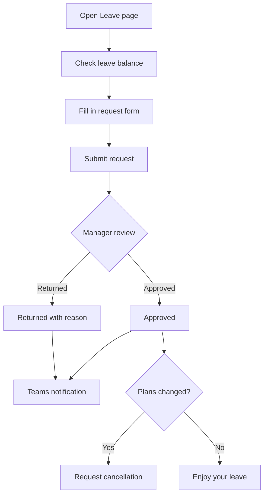
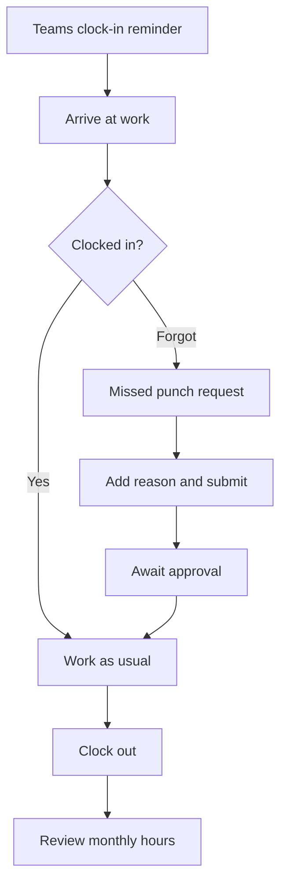
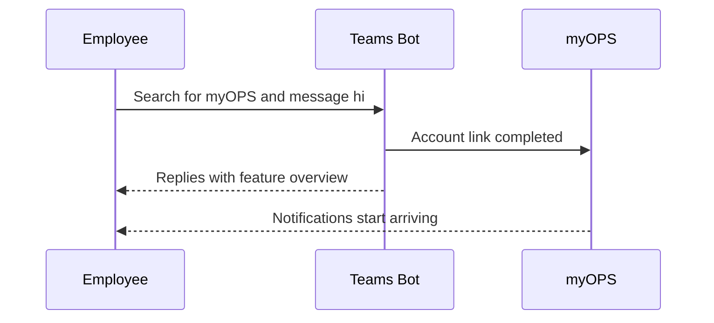

# myOPS — User Guide

Welcome to myOPS, the operations management system for CancerFree Biotech. This guide is written for everyday employees. It walks you through your first sign-in and the daily essentials: clocking in, requesting leave, logging overtime, and checking your payslip. The system lives at **https://ops.cancerfree.io**

## Getting Started

### What You Need

- **Computer**: Any recent version of Chrome, Edge, Safari, or Firefox. Nothing to install.
- **Phone / tablet**: Open ops.cancerfree.io in your browser. The layout adapts automatically — phones get a bottom navigation bar, tablets get a menu button in the top-left corner.
- **Authenticator app**: Your first sign-in requires setting up two-factor authentication (MFA). Install **Google Authenticator** or **Microsoft Authenticator** on your phone first (free on the App Store / Google Play).
- **Company account**: Sign in only with your company-issued **@cancerfree.io** Microsoft account. Personal email addresses won't work.
- The sign-in page has a "Quick Start Guide" link at the bottom with the same steps as this section — check it anytime you forget the flow.

### First Sign-In (Including MFA Setup)

1. Open your browser and go to **ops.cancerfree.io**.
2. Click "**Sign in with Microsoft**".
3. Enter your company email and password on the Microsoft sign-in page. If your company enforces conditional access policies, follow the on-screen prompts.
4. On your first sign-in, the system asks you to set up MFA:
   - Open your authenticator app and scan the **QR code** on screen (if scanning isn't possible, enter the setup key shown on screen manually instead).
   - Type in the **6-digit code** the app displays.
   - Click "Verify and Enable" to finish.
5. When you see the dashboard, you're in!

### Every Sign-In After That

- Click "Sign in with Microsoft" as usual.
- Enter the current 6-digit one-time code from your authenticator app (it refreshes every 30 seconds).
- Once verified, you're in the system.
- If you've switched phones or your codes keep failing, see the MFA reset instructions in the "FAQ" section.

## Dashboard and Announcements

### Dashboard (Your Home Page)

- **Today's To-Dos**: Gathers everything that needs your attention, such as unacknowledged announcements. If you have approval permissions, it also shows pending leave requests and contracts — click "Handle Now" to jump straight there.
- **Today's Clock-In**: Shows your clock-in and clock-out status for today, so you can spot a missed punch at a glance.
- **Latest Announcements**: Lists recent announcements. Click "View All Announcements" for the full list.
- **Quick Links**: Jump straight to clocking in, leave requests, and overtime requests from the dashboard.

### Reading and Acknowledging Announcements

- Open the "Announcements" page to browse everything, filtered by category: **HR / Administrative / Regulations & Policies / Urgent Notices**.
- Important announcements require you to click "**Acknowledge**". Some also ask you to re-enter your MFA code as a second check, confirming it's really you.
- Unacknowledged announcements keep appearing in your dashboard to-dos, so handle them promptly.
- Announcements support **AI translation** — switch between Chinese, English, and Japanese. If a translation isn't available yet, the original text is shown.
- When an announcement is published, colleagues linked to Teams notifications also get a Teams message (see "Personal Settings and Notifications").

## Attendance, Leave, and Overtime

### Clocking In and Out

- Open the "Attendance" page and click "**Clock In**" or "**Clock Out**" — once each per day.
- The system tries to capture your GPS location when you punch. If it can't, you can still clock in; the record just won't include coordinates.
- The "My Records" tab shows your daily clock-in/out times and **working hours summary** for the month, with a month switcher.
- **Forgot to punch?** Click "**Missed Punch Request**", choose the date, type (clock-in / clock-out), and time, add your reason, and submit. Once approved, the record is added retroactively.
- If you've linked Teams notifications, the bot sends clock-in reminders on weekday mornings and evenings.

### Requesting Leave

- The "Leave" page has three tabs: **Leave Balances**, **Request Leave**, and **My Records**.
- **Check your balance**: The "Leave Balances" tab shows your remaining days for each leave type (annual, sick, personal, special leave, and so on), plus whether each type is fully paid, half paid, or unpaid.
- **Submit a request**: Fill in the leave type, start and end dates (the system calculates the days automatically), and your reason. You can also name a **delegate** to cover your duties and attach files (such as a doctor's note).
- **Approval flow**: Your manager reviews the request and either approves it or returns it (a reason is always included when returned). You'll get the result via Teams notification.
- **Canceling leave**: If plans change after approval, you can request a cancellation from your records.
- **Team leave calendar**: A monthly calendar view of your own and your teammates' leave, handy for planning handovers.

### Overtime

- The "Overtime" page has two tabs: **My Requests** and **New Overtime**.
- When applying, fill in: the overtime date, **overtime type** (weekday / weekend / public holiday / project / on-call / emergency), start and end times (hours are calculated automatically), and your reason.
- You can optionally **link a project**, so project leads can track hours invested.
- Approval flow: submit → manager → HR → approved. If returned, the reason is included — fix it up and resubmit.
- **Approved overtime counts toward your pay.** Overtime pay follows company rate rules and appears on your payslip in the next pay cycle.

## Pay, Projects, and Documents

### Checking Your Pay

- On the "Payroll" page, "**My Payslips**" lists each month's details: **base salary, overtime pay, bonuses, deductions, gross total, and net pay**.
- Deductions include statutory items such as **labor insurance, health insurance, and voluntary pension contributions**, each listed line by line so you can verify them.
- You'll get a Teams notification when your payslip is issued. Only records marked "Paid" are official payslips.
- "**Annual Salary Summary**" gives you a full-year overview — useful for tax filing or personal budgeting.
- Your pay data is visible only to you. Colleagues cannot see your salary.

### Project Participation

- The "Projects" page shows the projects you're part of: name, owner, and status (active / closed).
- Any employee can **create a project** and assign an owner. Adding and managing members is up to the project owner.
- Each project page shows the overtime requests linked to it, giving a picture of the team's effort.
- When requesting overtime, remember to link the right project so the hours are tracked accurately.

### Documents and Read Confirmations

- The "Documents" page is the central home for company files: announcements, policies, NDAs, MOUs, contracts, internal documents, and more.
- Every employee can **upload documents** (PDF, Word, images, and other formats). Uploads go through an approval flow and take effect once an authorized manager or HR approves them.
- Filter by folder, type, or status, or search by name. Open a document to **download** its attachments.
- Important documents (such as new policies) require a "**Confirm Read**" click. Unconfirmed documents show up in your dashboard to-dos.
- Documents support **AI translation** — generate Chinese, English, and Japanese versions with one click, so cross-border teams can read without barriers.

## Personal Settings and Notifications

### Personal Settings

- Open "Personal Settings" to change your **display name** and view your role and identity.
- **Language**: The interface supports Traditional Chinese, English, and Japanese. Changes take effect immediately, and Teams notifications follow your chosen language too.
- **Theme**: Switch between **light and dark mode** to suit your preference and lighting.
- **MFA management**: You can **reset MFA** here. After a reset, you'll scan a new QR code to set up your authenticator at your next sign-in.

### Feedback (Anonymous)

- Open "Feedback" to submit the form, choosing a category: **Work Environment / Compensation & Benefits / Management & Policies / Other**.
- Write your details and submit. **Submissions are fully anonymous** — only the system administrator can see the content, so speak your mind freely.

### Teams Notifications

- myOPS sends notifications through the "**myOPS**" bot in Microsoft Teams, including:
  - **Daily to-do digest** (weekday mornings): a summary of your unacknowledged announcements and pending approvals.
  - **Clock-in reminders** (before work and at quitting time on weekdays).
  - **Instant notifications**: leave approval results, payslip issued, new announcements published.
- **Important:** The bot cannot message someone it has never talked to. Search for "**myOPS**" in Teams and **send it any message (like "hi")**. Once the bot replies, you're linked and notifications will start arriving.
- Notification language follows the language you chose in Personal Settings.

### Using Your Phone or Tablet

- **Phone**: A **bottom navigation bar** (Overview, Clock, Leave, Documents) sits at the bottom of the screen. Tap "More" to reach overtime, announcements, payroll, projects, feedback, settings, and the rest.
- **Tablet**: Tap the **menu button (hamburger icon)** in the top-left corner to slide out the full sidebar. Tap an item or anywhere else on screen to close it.
- Every feature works on mobile, with buttons optimized for touch — clock in or request leave on your commute, no problem.

## Workflow Diagrams

### Leave Request and Approval Flow

### Daily Clock-In Flow (Including Missed Punch)

### Linking Teams Notifications (First-Time Setup)

## FAQ

- **Q: Sign-in says my account isn't allowed?**
  A: myOPS only accepts **@cancerfree.io** company Microsoft accounts. Make sure you're not signed in with a personal account. If your company account still can't sign in, contact the system administrator.

- **Q: I switched phones and my MFA codes don't work. What now?**
  A: If you can still sign in, go to "Personal Settings → Two-Factor Authentication (MFA)" and click "Reset MFA" — at your next sign-in, scan the new QR code. If you're locked out, contact the system administrator for a reset.

- **Q: I forgot to clock in. How do I fix it?**
  A: On the "Attendance" page, click "Missed Punch Request", fill in the date, type (clock-in / clock-out), time, and reason, then submit. Once approved, the record is added.

- **Q: I'm not getting Teams notifications?**
  A: The most common cause is that you haven't messaged the bot yet. Search for "myOPS" in Teams and send it a message (like "hi"). Once the bot replies, you're linked.

- **Q: My leave request was returned. What should I do?**
  A: Managers must include a reason when returning a request — it appears in your leave records and arrives via Teams notification. Adjust the dates or add details based on the reason, then resubmit.

- **Q: When can I see my payslip?**
  A: Once payroll is internally confirmed and marked "Paid", you'll get a Teams notification and can view that month's details under "Payroll → My Payslips".

- **Q: Can I switch the interface to English or Japanese?**
  A: Yes. Go to "Personal Settings → Language" and choose English or Japanese. The interface switches immediately, and future Teams notifications use that language too.

- **Q: Is feedback really anonymous?**
  A: Yes. Submitted feedback never shows who sent it — only the system administrator can see the content itself.

## Version Information

- **Applies to**: myOPS v0.3.1
- **Last updated**: 2026-06-11
- **Highlights in this release (for employees)**:
  - Teams notifications are live: daily to-do digests, clock-in/out reminders, leave approval results, payslip issuance, and announcement publishing are all pushed to Teams, in your chosen language.
  - Tablets gain a slide-out sidebar menu, and the mobile touch experience is improved (larger buttons, horizontally scrollable tables).
  - Full three-language coverage (Traditional Chinese / English / Japanese) across the interface, including error messages.
- System URL: https://ops.cancerfree.io | For built-in help, see the "Help Docs" page in the sidebar.
