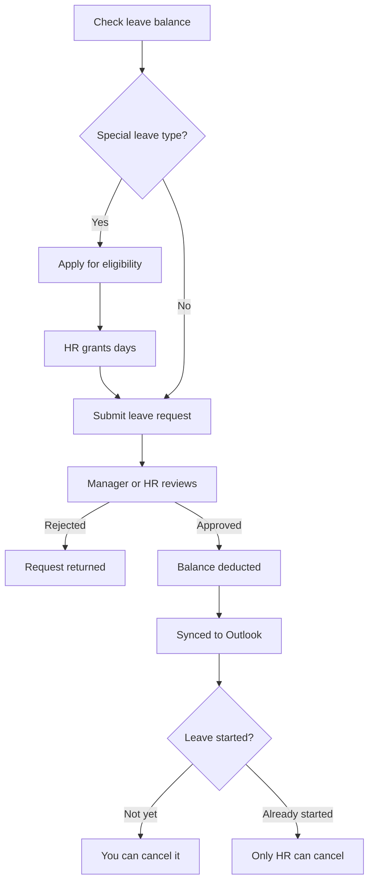
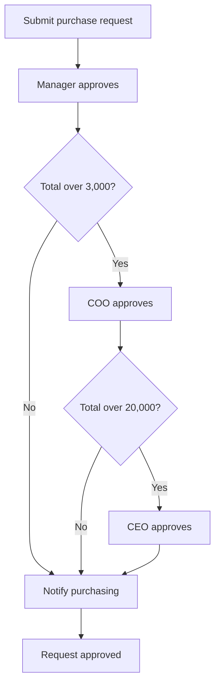
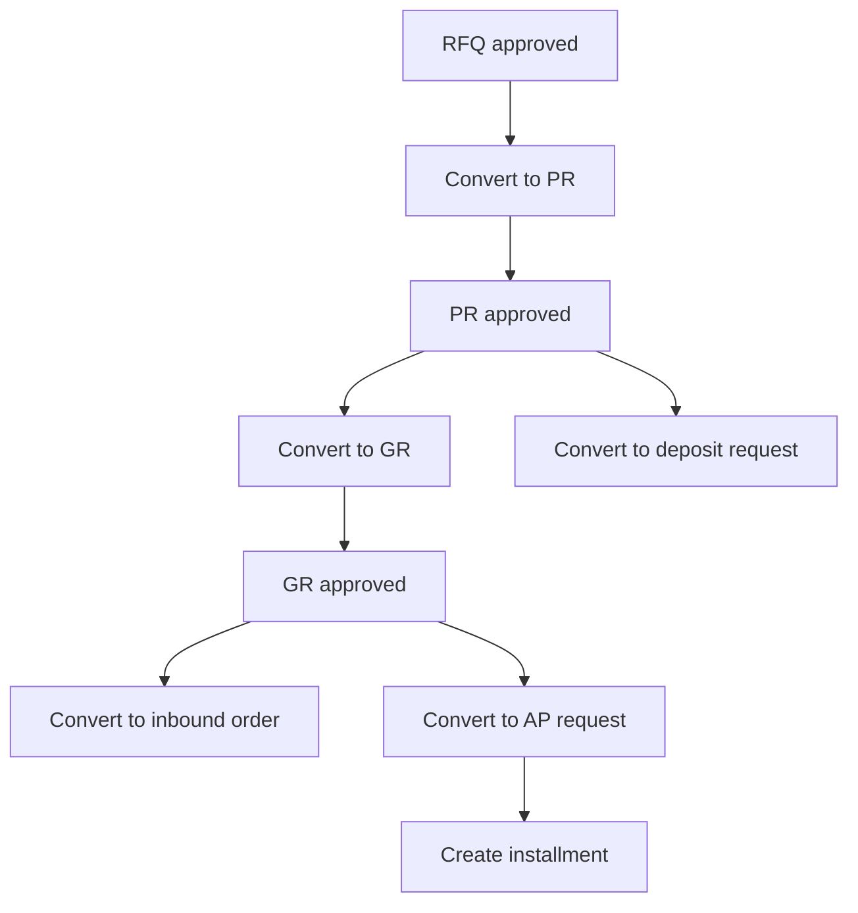

# myOPS User Guide

Welcome to myOPS, the internal operations system used across HR, purchasing, and finance. This guide covers everyday, day-to-day use — the tasks any employee performs, plus the extra tabs that appear for people who happen to hold an approval or management role (a manager, HR, purchasing, or finance permission). Sections that are mainly for managers or approvers are labeled "(Managers)" or "(Approvers)" in their heading; everything else applies to every employee. Steps for configuring the system itself (feature toggles, bot policies, geofences, user permissions) are outside the scope of this guide.

The system lives at **https://ops.cancerfree.io** — always use this address, not any other domain.

## Quick Start

### System Requirements

- Any recent version of Chrome, Edge, Safari, or Firefox on desktop, tablet, or phone. Nothing to install — the layout adjusts automatically to your screen size.
- Sign in with your company-issued Microsoft account (your `@cancerfree.io` email). Personal email addresses do not work.
- Install an authenticator app — **Microsoft Authenticator** or **Google Authenticator** — on your phone before your first sign-in. You'll need it to set up multi-factor authentication (MFA), which the system requires for sensitive actions like approvals.
- Some features (attendance geofencing, business trip Outlook sync) work best when you allow location and stay signed in to your Microsoft account in the browser.

### First Login and Initial Setup

1. Go to **ops.cancerfree.io** and click "**Sign in with Microsoft**".
2. Enter your company email and password on the Microsoft sign-in page.
3. On your first sign-in, set up MFA: open your authenticator app, scan the QR code (or enter the setup key manually), then type the 6-digit code shown and confirm.
4. From then on, every sign-in and every sensitive action (approvals, MFA-protected confirmations) asks for a fresh 6-digit code from your app.
5. Once signed in, you land on your dashboard, which surfaces things that need your attention — unread announcements, and, if you have approval permissions, pending items you can jump straight into.
6. Open **Personal Settings** any time to change your display name, switch between light and dark themes, switch your interface language (Chinese / English / Japanese), or reset MFA if you lose your phone (see the FAQ for details).

## Attendance, Leave & Payroll

### Clocking In and Out

Use the "Attendance" page to record your workday and review your own history.

- Click "**Clock In**" when you arrive and "**Clock Out**" when you leave. If your site has location fencing turned on, you need to be inside the approved area for the punch to succeed; the app tries to capture your GPS location automatically.
- The top of the page shows today's clock-in and clock-out times, and flags if a record was entered automatically rather than by you.
- Open the "**My Records**" tab and filter by year and month to review your punch history and hours worked for any period.
- Forgot to punch? Submit a "**Missed Punch**" request: choose the date, whether it was a clock-in or clock-out, the time, and your reason. It goes to your manager (or HR/admin) for approval, and once approved, the system fills in the record for you automatically.
- HR staff have a separate company-wide view on this same page for corrections across the organization — that part isn't covered here since it's an HR/admin task.

### Requesting Leave

- Check your available balance for each leave type on the "**Leave Balances**" tab before you apply. Annual/seniority leave (特休) is calculated from your work anniversary; every other leave type resets on the calendar year.
- Submit a request from "**Apply for Leave**": pick the leave type, start and end dates (you can select a half-day for a single day), your reason, and optionally a backup contact. The system calculates the number of days and checks it against your balance automatically.
- Some leave types — marriage, bereavement, maternity, prenatal checkup, paternity, paternity checkup, and parental leave, among others — require eligibility approval first. Go to the "**Special Leave Application**" tab, submit your reason and supporting documents, and wait for HR to grant you the approved number of days before you can file the actual leave request.
- Track your submissions on "**My Records**". You can cancel a request yourself while it's still pending review.
- Already-approved leave works differently depending on timing: if it **hasn't started yet**, you can cancel it yourself, and the system returns the days to your balance and removes the matching Outlook calendar event. If it has **already started**, only HR or an admin can cancel it for you — reach out to HR directly.
- Approval goes to your direct manager, or HR/admin. Once approved, your balance updates, and — if you've signed in to Microsoft and authorized calendar access — an all-day event appears automatically on your Outlook calendar; it's removed again if the request is later rejected or cancelled.

### Leave Calendar

A read-only monthly view for coordinating schedules with your team.

- Open "**Leave Calendar**" to see how many people are on leave each day — a green dot means approved, a yellow dot means still pending.
- Click any date to see the day's full list: name, leave type, dates, number of days, and status.
- Check "**My department only**" to narrow the view to your own team.
- Use the arrows to browse other months, past or future. By default you see your own department; HR and admins can switch departments to view the whole company.

### Overtime Requests

- Submit a request from the "**New Request**" tab: date, start and end time, an optional related project, and your reason. Picking a date automatically classifies the day type — regular workday, weekly rest day, or national holiday — which determines the pay multiplier.
- Track your submissions and their status on "**My Requests**".
- Overtime that crosses midnight is automatically counted as an extra day for calculation purposes.
- Approval comes from your direct manager, the project lead (if the overtime is tied to a project), or admin.
- Once approved, the hours are calculated at the legally required multiplier — 1.34x/1.67x for a regular workday, 1.34x/1.67x/2.67x for a rest day, and 2x for a national holiday — and flow automatically into that month's payroll draft.

### Business Trips

- Submit a request from "**New Request**": destination, reason, start and end dates, and an optional detailed itinerary.
- The system automatically routes it to whoever is your direct manager at the moment you submit.
- Track status on "**My Trips**", and cancel it yourself while it's still pending.
- Once approved, an all-day trip event is added to your Outlook calendar automatically (removed if the request is later rejected).
- After an approved trip, click "**Create Reimbursement**" right from the trip record to jump into the expense module with the destination and dates already filled in.

### Company Calendar

A company-wide monthly view combining events, leave, and travel.

- Open "**Company Calendar**" to see company events (green), colleagues on leave (blue — shown only as "on leave," never the specific leave type, to protect privacy), and colleagues traveling (purple).
- Click a date to see everything scheduled that day, including event descriptions.
- RSVP to any company event with **Attending / Not Attending / Undecided**, and expand the event to see who else has responded.
- Creating, editing, or deleting company events is limited to HR/admin; as an employee you browse and RSVP.

### Payroll — My Payslips

- Open "**Payroll**" and stay on the "**My Payslips**" tab to see your last 12 months of pay records — but only once a payslip has reached **HR-head-approved** or **paid** status. Earlier stages (draft, HR-reviewed, finance-confirmed) are not visible to you, even if you type the direct URL.
- Click any payslip to open its full breakdown (see "Payslip Detail" below).
- Payroll moves through several internal review stages before it reaches you — batch calculation, HR review, finance confirmation, and HR-head approval — each handled by HR and finance, not by you.
- The system does not currently send an automatic Teams message when a new payslip becomes visible, so check the "My Payslips" tab directly around payday rather than waiting for a notification.

### Payslip Detail

- Open any payslip from your list (or the company payroll table, if you have that access) to see the full breakdown: earnings (base pay, overtime, bonuses, other additions), deductions (unpaid-leave deductions, labor/health insurance premiums, voluntary pension contributions, other deductions), and your net pay.
- The page also shows the **employer's** contribution — labor insurance, health insurance, and the 6% pension contribution — not just what you take home.
- If the system's payroll anomaly check flagged anything unusual for that period (excess overtime, an unusual swing in amount, an unusually large unpaid-leave deduction), you'll see a note about it here.
- Click through to "**Annual Payroll Summary**" for the full-year picture.
- There are no approval buttons on this page — approval actions happen back on the main Payroll page, not here.

### Annual Payroll Summary

- Choose a year (the current year, plus two years back or forward) to see your pay laid out month by month, with three summary cards for total income, total deductions, and total net pay for the year.
- A month showing "**—**" simply means HR hasn't finalized that month's payroll yet — it's not an error on your end.
- HR and finance staff can switch this view to check any employee's annual summary; as a regular employee, you only see your own.

## Procurement, Inventory & Approvals

If your job involves purchasing, warehouse, or accounting work, you'll use one or more of these modules. Everyone can browse them once the purchasing feature is turned on for your account; creating, editing, and approving are limited to the people directly involved in each document.

### Requests for Quote (RFQs)

An RFQ lets a requester list what they want to buy and hand it to a designated buyer to collect quotes.

- Start a draft: fill in the request date, requesting department, requester, the person who will collect quotes (the "inquirer"), urgency, and expected delivery date.
- Add line items to the RFQ — item name, item code, spec, unit, quantity needed, purpose, and a suggested vendor picked from the vendor directory.
- The designated inquirer logs quotes from multiple vendors per item (vendor, unit price, quote date, notes) and checks "**Adopted**" on the one quote to use for each item — only one quote per item can be marked adopted.
- Attach vendor quote files (multiple files allowed); they're downloadable directly from the system, not an external link.
- Once submitted for approval, only the designated inquirer can still edit the header, items, quotes, or attachments — everyone else, including the original requester, sees a read-only, locked view until approval finishes.
- Track exactly where the document is in the approval timeline — who's up next and any comments left along the way.
- After approval, click "**Convert to Purchase Request**" to create a PR draft with all items and adopted prices carried over automatically. If every adopted quote came from the same vendor, that vendor's contact and payment details come over too.
- An approved or rejected RFQ can be "**Voided and Copied**" — enter a reason and the system creates a fresh draft with the same content so you can fix a mistake and resubmit.

### Purchase Requests (PRs)

A PR records what you're ordering from a vendor, the price, and payment terms, and routes it through an amount-based approval chain.

- Create a blank draft, which opens directly into the item editor.
- Fill in the header (date, requesting department, urgency); pick a vendor and its tax ID, contact, phone, email, billing address, payment method, payment terms, and trade terms fill in automatically.
- Add items by picking from the product catalog (which auto-fills the code, name, spec, and unit) or by typing a blank row manually. Enter the unit price and quantity, and the line amount calculates itself.
- Subtotal, tax, and total calculate automatically (tax = subtotal × tax rate, total = subtotal + tax + shipping). You can switch tax to a manual override if needed, or restore automatic calculation with one click.
- While still a draft, you can preview which approval stages the request will actually pass through, based on the current total.
- Submit for approval — the department manager reviews first; if the total exceeds **3,000**, it also goes to the COO; if it exceeds **20,000**, it goes to the CEO as well; a purchasing-team member acknowledges last. When it's your turn to review something, approving or rejecting requires MFA.
- Once approved, click "**Convert to Goods Receipt**" or "**Convert to Deposit Payment Request**" to move to the next step.
- Only the creator (or someone with purchasing-management permission) can edit a draft, and only before it's submitted — once submitted, it's locked. Approved or rejected PRs can be voided, or "voided and copied" into a fresh draft, by purchasing management.

### Goods Receipts (GRs)

A GR records what actually arrived from a vendor — the condition, amount, and invoice details — and is where a deposit already paid gets reconciled.

- Create a new receipt, optionally linked to a source PR number (this pulls in that PR's items for reference; leave it blank and fill items in yourself).
- Fill in receiving details (requesting department, arrival time, inspection time, confirmed stock-in time), vendor info, and amounts (subtotal, tax rate, tax, shipping, total — tax and total recalculate automatically once you enter a subtotal, or you can override the tax manually).
- Record invoice details (invoice number and date), and upload the invoice and shipping documents — viewable directly online. Attachments migrated from the old system that only kept a filename (no actual file) are labeled "**still in old system**" instead of a dead link.
- If a deposit was already paid, check "**Deposit Paid**" and enter the deposit request number and amount — if the GR was created by converting from a PR that already had an approved deposit request, this fills in automatically.
- View the source PR's item list (unit price, quantity, amount, quantity already received, quantity remaining) for reference.
- Submit for approval: whoever last edited the document confirms first, then any purchasing-team member confirms second.
- Once approved, click "**Convert to Inbound Order**" or "**Convert to Payment Request**." If you also have asset-management permission, you can convert it directly into a company asset instead.
- An approved or rejected GR can be voided (with a reason) — voiding is blocked if it already has an active downstream inbound order or payment request; the system tells you which document numbers are blocking it.

### Vendor Directory

- Search vendors by code, name, short name, category, contact person, or phone; sort and page through the list.
- Click any vendor to open its full record across four sections — basic info, contact, billing, and banking (37 fields in total, including attachments like signatures, passbook copies, and invoice stamps).
- When you pick a vendor on a PR, RFQ, or other document, its contact and payment details fill in automatically — you don't need to memorize or re-type them.
- Adding or editing vendors directly requires purchasing-management permission. As a regular purchasing user, you can also register a new vendor indirectly by filing a "**Vendor Evaluation**" (see below) — once the COO approves it, the vendor is created here automatically.

### Product Catalog

- Search the catalog by code, name, spec, category, brand, or part number; the list shows the dual-unit conversion (purchasing unit vs. stock unit) and current stock level for each item.
- Open any item's detail to see its spec, category, item type, brand, source, part number, default department, current stock, and the purchasing-to-stock unit conversion formula.
- The "**Vendor Quotes**" table inside the detail view lists every vendor's historical price for that product, with the quote date and source RFQ number, so you can compare pricing before choosing a vendor.
- Click a product's name to jump into its "**Stock Ledger**" (below) and see its inventory movement history.
- Adding, editing, or deleting products requires purchasing-management permission.

### Product Stock Ledger

A read-only inventory history for a single product — nothing here is editable directly; it's all generated automatically by inbound/outbound postings.

- Open it from the Product Catalog by clicking a product's name. You'll see the item's basic info and current total stock at the top.
- Review the "**Batches in Stock**" cards — batch number, storage location, warehouse, and expiry date. Batches expiring within 90 days, or already expired, are flagged in color.
- Pick a year to see that year's total quantity received, quantity issued, and ending balance.
- Expand the full movement log for line-by-line detail — date and time, movement type (in / out / adjustment / void), quantity, and running balance. Click any line's document number to jump straight to the source inbound or outbound order.

### Vendor and Product Evaluations

Two related approval forms, one for registering a new vendor and one for documenting a price comparison, switched between with tabs on the same page.

- Switch between the "**Vendor Evaluation**" and "**Product Evaluation**" tabs; each has its own searchable, sortable list.
- Vendor evaluation: start a draft and fill in the vendor's 22 fields (basic, contact, billing, address, payment, banking, and other), organized into sections that match the vendor directory, plus notes.
- Product evaluation: start a draft with the source RFQ number (the system looks up the matching RFQ) and your notes.
- Open any entry to review the fields you've filled in and track its position on the approval timeline; drafts remain editable until submitted.
- Submit for approval (draft → in review). Vendor evaluations always go to the COO; product evaluations go to your own direct manager (or, if you have no manager or you are the manager, back to yourself to confirm). Both require MFA.
- Once a vendor evaluation is approved, the vendor is written into the Vendor Directory automatically, with a new vendor code assigned.

### Inbound (Stock-In) Orders

Found under the "**Inbound**" tab of the Inventory page. This is where goods physically arrive into the warehouse and stock records get updated.

- Create a draft by hand, or scan an item code, stock code, or batch number with a barcode scanner or phone camera — scanning automatically detects whether it's an existing batch (and adds to its quantity) or a new one.
- Fill in the header (an optional source GR number, document date, notes) and line items (product, warehouse, optional batch number, optional expiry date, quantity in stock units).
- You can edit or delete your own draft as long as it hasn't been submitted or posted yet.
- Submit for approval — inbound orders have a single approval stage, and it's the creator confirming their own document (a self-check, not a manager review), which still requires MFA.
- Once approved, click "**Post**" to apply the order to warehouse stock (adding to an existing batch or creating a new one) and to the movement ledger; it also updates the "received / still pending" progress on the originating purchase request.
- If needed, you can reverse a posted order — this is blocked if that batch's stock has already been consumed by a later outbound order.

### Outbound (Stock-Out) Orders

Found under the "**Outbound**" tab of the Inventory page — the mirror image of Inbound, used for issuing, consuming, or disposing of stock, sharing the same interface and scanning tools.

- Create a draft by hand or by scanning; you pick an **existing stock batch** (not a product) and enter the outbound quantity.
- Scanning an item code, stock code, or batch number finds the matching batch automatically and adds to the quantity, preferring batches that still have stock available.
- Edit or delete your own drafts before submission.
- Submit for approval — like inbound orders, this is a single self-confirmation stage by the creator, and still requires MFA.
- Once approved, click "**Post**" to deduct the quantity from warehouse stock and record it in the ledger; the system blocks the post if there isn't enough stock available.
- You can view the "**warehouse quantity before**" and "**remaining quantity after**" for every line, and reverse a posted order if needed (adding the stock back).

### Stock Lookup and Barcode Scanning

Found under the "**Stock**" tab of the Inventory page — a mobile-friendly, read-only tool for checking what's on hand.

- Scan or type an item code, stock code, or batch number; the system checks each in turn and returns every batch currently on hand for that product.
- Results show the product's basic info and total stock, plus per-batch detail: stock code, batch number, expiry date, warehouse, and quantity.
- Below the scan result, a full stock list lets you search, sort, and page through every batch in the system by any field — stock code, product code, name, spec, batch, expiry, or warehouse. Handy for cycle counts or tracking down a specific batch.
- This page has no editing actions; it's purely for lookup.

### Deposit Payment Requests

Found under the "**Deposit**" tab of the Payments page — used to pay a vendor a deposit ahead of delivery.

- Usually created by converting an approved PR with "**Convert to Deposit Request**," which carries over the vendor and pulls in its banking details automatically; you can also start one from scratch.
- Fill in (or confirm) the deposit amount, total amount, the wire deadline (required before you can submit), the actual wire date, wire month, and settlement date, plus banking details (bank, branch, SWIFT code, account number, account name — pre-filled from the vendor but editable).
- Submit for approval — this goes through a single accounting-team review stage.
- Track its position on the approval timeline.
- The creator cannot approve their own request — accounting handles approval, keeping creation and approval separate. Once approved, the paid deposit shows up automatically on the matching Goods Receipt.

### Purchase Payment Requests (AP)

Found under the "**Purchase**" tab of the Payments page — the formal invoice-payment request, usually created from an approved Goods Receipt.

- Create by converting an approved GR with "**Convert to Payment Request**," which brings over the vendor, tax ID, amount, and source GR/PR references.
- Fill in the payment month, total amount, any amount adjustment (with a note explaining it), whether the payment is split into installments, payment method and terms, settlement date, wire deadline, and banking details.
- The system only allows **one active payment request per PR** — if you need to split a payment across multiple transfers, use "**Create Installment**" on this same document rather than creating a second payment request.
- Submit for approval (single accounting-team stage).
- If installments are marked, once approved you can click "**Create Installment**" to generate the next installment, with the installment number assigned automatically.
- As with deposit requests, the creator cannot approve their own request.

### Installment Payment Requests

Found under the "**Installment**" tab of the Payments page — one entry per scheduled installment when a purchase payment is split.

- Created only from the "**Create Installment**" button on an approved AP payment request — there's no standalone way to start one, and the installment number is assigned automatically (next number after any non-voided installments already on that AP).
- Fill in the payment month, amount, invoice number, invoice date, and upload the invoice file (image or PDF).
- Download previously uploaded invoice files through a temporary secure link.
- Submit for approval (single accounting-team stage; the creator still cannot approve their own).

### Turning One Document Into the Next

Six document types chain together so you never have to retype what's already been entered. Once a source document is approved, a "convert" button on its detail page builds the next document as a fresh draft using its content:

1. **RFQ → Purchase Request**: carries over every item, using the adopted quote's price to calculate the subtotal, tax, and total; if all adopted quotes came from one vendor, that vendor's details come too.
2. **Purchase Request → Goods Receipt**: carries over vendor, tax, and amount fields, and automatically checks whether the PR already has an approved deposit request, flagging it as "deposit paid" if so.
3. **Purchase Request → Deposit Payment Request**: carries over the vendor and fills in its banking details.
4. **Goods Receipt → Inbound Order**: calculates how much still needs to be received (based on the source PR's outstanding quantity and the product's unit conversion) and builds the item list for you. You can convert the same GR more than once if goods arrive in batches — the system only blocks over-receiving when you actually post the inbound order.
5. **Goods Receipt → Purchase Payment Request**: carries over vendor, tax ID, amount, and the PR reference (used to prevent duplicate payment requests for the same PR).
6. **Purchase Payment Request → Installment**: assigns the next installment number and fills in the payment month.

A source document must be **approved** before you can convert it. Converting itself doesn't require MFA — only the approval step that follows does.

### Voiding and Reissuing Documents

A shared "void" capability for fixing a mistake after a document has already been approved or rejected.

- Currently, the **void button only appears** on Requests for Quote, Purchase Requests, and Goods Receipts. Inbound orders, outbound orders, and all three payment-request types don't have a void button in the interface yet, even though the underlying system can technically process them.
- To void a document, open its detail page, click "**Void**," and enter a reason.
- Choose "**Void and Copy**" to also generate a fresh draft with the same content, so you can correct the mistake and resubmit without retyping everything.
- If a document already has an approved downstream document (for example, a GR with an active inbound order), voiding is blocked until those are dealt with; the system lists exactly which document numbers are in the way.
- Voiding requires purchasing-management permission and MFA. Anyone who can view a document can see its "**Voided**" status and reason once it happens, even without void access themselves.

### Approval Center

A single inbox that gathers everything currently waiting on your approval — across leave, overtime, missed punches, business trips, expenses, documents/contracts, payroll, and all ten purchasing document types — so you don't need to check every module separately.

- Open "**Approval Center**" to see every pending item across all categories in one place, with a running total at the top (or a "**you're all caught up**" message when there's nothing left).
- Approve or reject items right from the card — rejecting always prompts you to enter a reason first.
- For expense reimbursements, once you approve a request it flips to "**Mark as Paid**" instead of disappearing, so you can track payout separately from approval.
- For payroll, the button always says "**Approve**," but it automatically triggers whichever stage the payslip is actually waiting on (HR review, finance confirmation, HR-head approval, or marking as paid) — you don't need to figure out which stage it's in yourself.
- Click the external-link icon on any item to open its full detail page if you want more context before deciding.
- Click "**Refresh**" to manually reload the list. If an approval or rejection fails because you haven't completed MFA yet, the message tells you so directly.
- What you see here depends on your role — most employees only see items where they happen to be the approver (for example, as someone's manager), and may see nothing at all if nothing is currently routed to them.

### One-Tap Approval in Teams

For purchasing documents, most of your actual approving happens inside Microsoft Teams, not the website — through notification cards sent by **Dr.Ave**, the shared Teams bot.

- Whenever a purchasing document (RFQ, PR, GR, inbound/outbound order, any of the three payment requests, or a vendor/product evaluation) is submitted or advances to your approval stage, Dr.Ave sends you a card in Teams.
- If the document type and amount qualify for one-tap approval, the card has **Approve** and **Reject** buttons you can tap right there — no MFA, no browser needed.
- Otherwise, the card has a single "**Go to Approve**" button that opens the matching page on ops.cancerfree.io, where you complete the approval as usual (MFA required).
- Tapping Approve or Reject in Teams gives you an immediate success or failure reply. If the policy changed since the card was sent (for example, the amount threshold was lowered), you may be told to switch to the website instead — this is a safety check, not a bug.
- Rejecting always works from a Teams card regardless of policy, since rejecting doesn't carry the same risk as approving.
- If you've blocked Dr.Ave in Teams, you stop receiving these cards even if you're still the approver — you'll need to unblock it yourself to get them again; this isn't a system malfunction.

### Asking Dr.Ave Questions in Teams

You can also just message Dr.Ave directly in Teams instead of tapping a button.

- Type something containing "pending," "待簽," or "待審" to get a count of how many purchasing approval steps are currently waiting on you.
- Type something containing "leave," "請假," "休假," or "特休" to get your remaining balance for each leave type this year.
- Type something containing "payroll," "薪資," or "薪水" to get the current stage of this month's payslip.
- For anything else, if your organization has turned on the AI policy Q&A feature, Dr.Ave forwards your question to the same AI assistant used on the Help page and replies with an answer based on published company documents. If that feature isn't on, you'll get a "didn't understand that" reply instead.
- Replies come back in whatever interface language you've set in Personal Settings.

## Performance Reviews, Training, Documents & Contracts

### My Performance Review

- During an open review cycle, click "**Start Review**" to begin your own record for that period. Pick the cycle from the dropdown — only cycles marked "open" can be started.
- Set your goals: add a title, description, and weight (as a percentage) for each one. The weights must add up to exactly 100% before you can submit.
- Submit your goals for your manager to sign off on. If your manager sends them back, you'll see the reason — edit and resubmit.
- Once your goals are approved, self-rate each one from 1–5 with a written explanation. You need to rate every goal before you can submit your self-assessment.
- After your manager finishes scoring and locks the review, you'll see each goal's self-rating and manager rating, the weighted score, your final total, and your manager's overall comments — alongside a snapshot of your Daily Report KPI performance for that period, saved automatically when the review was completed.

### Team Performance Reviews (Managers)

- If you have direct reports (or are named as the reviewing manager on a review record), review each report's status — setting goals, awaiting your approval, awaiting self-assessment, awaiting your scoring, or complete.
- Open an employee's submitted goals and either approve them or send them back with a reason (MFA required).
- Once the employee self-rates, score each goal from 1–5 with your own comments, then enter an overall score (1–5, half points allowed) and overall comments, and complete the review to lock it (MFA required).
- You can see the employee's self-ratings, self-assessment notes, and their Daily Report KPI performance for that period alongside your own scoring.
- HR and admins can additionally view every review across the whole company and reopen a locked review if a correction is needed — that part isn't covered here.

### My Training

- Check "**My Training**" for the list of courses assigned to you, including whether each one is marked mandatory, its duration, and a link to the course material.
- After completing a course, click "**Mark Complete**," then upload your certificate of completion or another supporting file (image or PDF) and add a note.
- The page also shows your total completed training hours for the current year at a glance.
- Courses are assigned to you by whoever manages training for your team — you don't create your own assignments here.

### Certifications

- Register your own professional certifications (for example, GCP, biosafety, or radiation safety training) with the issuing organization, certificate number, issue date, expiry date, an attachment, and any notes.
- Edit your own certification records any time.
- Certifications expiring within 30 days are flagged "**expiring soon**"; anything past its expiry date is flagged "**expired**," so you can spot renewals you need to schedule.
- Whoever manages training for your team can view everyone's certifications and add or remove records on your behalf if needed.

### Documents

The central hub for browsing, uploading, and searching announcements, contracts, and internal documents.

- Browse by folder (**Shared** / **Contracts** / **Internal** / **Archived**), document type, status, or keyword, with search and pagination. What you can see depends on the folder: shared documents (announcements, regulations) are open to everyone; internal documents are limited to your own department; contract-type documents (NDA/MOU/CONTRACT/AMEND) are visible only to the person who uploaded them, the assigned owner, admins, or people with contract-approval permission — you generally can't see a contract a colleague uploaded.
- Upload a document: give it a title, pick a document type (which determines its folder automatically), and attach a file if applicable.
- Uploading a contract-type document (NDA, MOU, contract, or amendment) lets you link it to a company and set an expiry date; if that company already has other documents on file, you can associate them together.
- Uploading an **internal** document lets you pick a department, and it's approved automatically on submission — no review needed. Announcements and contracts, by contrast, go into a review queue before they're visible more broadly.

### Document Detail

- Open any document to see its full information — uploader, upload time, linked company or department, expiry date, and who approved it — and download its attachments.
- If a document is an announcement addressed to you and you haven't acknowledged it yet, complete MFA here and click "**Acknowledge**."
- Review the document's full audit trail: uploads, approvals, rejections, translations, acknowledgments, reminder pings, and text-extraction events.
- Approving, rejecting, publishing an announcement, or running AI translation are all limited to people with the matching permission (contract approval or announcement publishing) — as a regular employee, you mainly use this page to read, download, and acknowledge.

### Announcements

- Open "**Announcements**" and start on the "**Pending**" tab — everything addressed to you that you haven't acknowledged yet.
- Click a card to jump to its Document Detail page and acknowledge it there.
- Switch to the "**All**" tab to search by keyword or browse by category (HR / Administrative / Regulations / Urgent) across every published announcement.
- Announcements support AI translation between Chinese, English, and Japanese — you'll see whichever language you've set, with the original shown if a translation isn't ready yet.
- Anything still pending stays on your dashboard's to-do list, so it's worth clearing them promptly rather than letting them pile up.

### Announcement Detail (Direct Link Only)

- This is a separate, fuller-featured announcement page — but no button or link in the app currently points to it; the Announcements list always sends you to Document Detail instead. You'd only land here by typing or bookmarking the direct `/announcements/[id]` URL.
- If you do open it, it shows the announcement in your preferred language, with a language tab if multiple versions exist (falling back through Chinese → English → Japanese if your preferred one isn't ready, with a note that it did so).
- You can acknowledge the announcement here using the same MFA-protected confirmation as Document Detail — the two pages share the same acknowledgment status.
- For everyday use, just use the regular "**Announcements**" page — this one is a known gap, not a hidden feature you're missing out on.

### My Feedback

- Open "**Feedback**" to see everything you've personally submitted — feature suggestions and bug reports — along with its current status, submission time, and how many screenshots you attached.
- Expand any entry to read your full description and view attached screenshots at full size.
- Reply in the comment thread to add more detail or respond to an admin's reply.
- If an item has already been marked "**Done**" or "**Returned**" and you add a new comment, it automatically reopens as "**Pending**" — useful if you have a follow-up, but worth knowing so you don't reopen something by accident.
- You only see your own feedback here; status changes (moving something to in-progress, done, or returned) are handled by admins, not from this page.

### Submitting Feedback

- Click "**New Feedback**" from the Feedback list to open the submission form.
- Choose a type: **Feature Suggestion** or **Bug Report**.
- Fill in a title and description (both required), and optionally attach one screenshot.
- Submit — you're taken back to your list, where the new entry shows as "**Pending**." Feedback is one of the few features turned on by default across the system, so you should always be able to reach it.

### Contracts

A focused view of the same contract-type documents (NDA, MOU, contract, amendment) that live in the Documents module.

- Filter by contract type, status, linked company, or keyword.
- Expiry dates are color-coded: already expired or due within 30 days shows red, due within 31–90 days shows orange — an easy way to spot renewals coming up.
- As with the Documents module, you can only see contracts you uploaded, contracts where you're the assigned owner, or — if you hold contract-approval permission — the full company list.
- The system automatically pings people with contract-approval permission in Teams 90 and 30 days before a contract expires, as a renewal reminder.

### Contract Detail

- Open a contract to see its full record: linked company, uploader, upload date, file size, and an expiry countdown that turns red inside 30 days or orange inside 90.
- Download the attached contract file.
- See up to 10 other documents on file for the same company, and jump to any of them for comparison.
- Review the contract's audit trail — every approval and rejection, with who did it and when.
- If you have contract-approval permission and the contract is pending review, approve or reject it here (MFA required, and you can't approve a contract you uploaded yourself). Approvals and rejections notify the uploader in Teams, and — for contract-type documents specifically — the COO as well.

## Projects, Daily Reports, Assets, Expenses & Settings

### Project List

- Browse every project in the company as a card — name, description, lead, active/closed status, member count, and creation date. This list isn't limited to projects you're a member of; anyone with the Projects feature turned on can see all of them.
- Click "**Manage Members**" on any project to see its current roster and roles (lead / member).
- From that same dialog, add any employee to that project's member list.
- Creating a new project is limited to admins or people specifically granted project-management permission.
- You can open a project's full detail page only if you're the lead, a member, or an admin — otherwise you'll be redirected to a "no access" page even though the card is visible on this list.

### Project Detail

- Reach this page directly by URL — there's no link to it from the Project List card itself.
- Review the project's name, description, active/closed status, start and end dates, and lead.
- See the member roster (shown with avatar initials).
- Review the overtime requests linked to this project — date, requester, time range, hours, and approval status.
- If you're the lead or an admin, an "**Add Member**" button appears here as well.

### Daily Report

Used by roles like sales or case managers to log a working day across two tabs, replacing what used to be a separate daily-reporting site. (The separate **Completion Report** tab has been removed — checking a schedule item off as done *is* the completion report.)

- Switch dates with the date picker (yesterday / today / tomorrow), based on your local time zone.
- **Today's Schedule** tab: add, edit, or delete planned tasks for the day and check them off as done — once saved, your manager sees the completion progress in Team View. If you've saved a template before, "**Fill from Template**" lets you reuse it — the button only appears once you have at least one saved template.
- **KPI** tab: enter today's value for whatever indicators your manager or HR has set up for you (only active indicators show; if none exist yet, you'll see a note to contact your manager). Entries save automatically about 600ms after you stop typing, and if you switch dates before it finishes saving, it still saves to the date you were actually editing.

### My Tasks

- See tasks assigned to you — priority (high/medium/low), status (in progress / awaiting confirmation / done), and due date.
- Expand a task to see its subtasks (read-only for you).
- Click "**Mark Complete**" to flag a task as done from your side; it moves to "**awaiting confirmation**" until your manager or team viewer confirms it.
- Completed tasks collapse into a section below so your active list stays uncluttered.
- As a regular team member, you only see tasks assigned to you, and you mark the whole task complete rather than checking off individual subtasks — creating tasks and confirming completion is handled by your team's designated viewer or an admin.

### Team Overview (Managers)

- If you're the designated viewer for a team (or an admin), pick a group and a date to see everyone's daily schedule and completion status for that day; if you belong to more than one group, a dropdown lets you switch.
- Regular team members can also open this page read-only to see the same schedule and completion data for their teammates — but not any KPI numbers, which are visible only to the viewer and admins.
- As the viewer, click "**Manage KPI Indicators**" to add, edit, disable, or delete KPI indicators for a specific team member — name, target value, unit, and period.
- Once you add an indicator for someone, it appears on their own Daily Report KPI tab right away.
- If you don't belong to any group and aren't an admin, this page redirects you to a "no access" page.

### Lab Reagents and Supplies

- Search the "**Item List**" tab by name or catalog number, and filter by category (reagent / consumable / other).
- Each item shows its storage conditions, current total quantity (summed across all its batches), and a low-stock badge if the total drops below its safety threshold.
- Expand an item to see every batch underneath it: batch number, expiry date (with "expiring soon" or "expired" badges), quantity, received date, status (in stock / depleted / disposed), and whether it's been opened.
- Switch to the "**Expiry Alerts**" tab to see every batch expiring within 60 days (or already expired), sorted by expiry date.
- Everyone with this feature turned on can browse items, batches, and expiry alerts; adding items, receiving new batches, recording usage, marking a batch opened or disposed, and viewing detailed movement history are limited to people with lab-management permission.

### Asset List

- Search company assets (IT equipment, lab instruments, furniture, other) by name, asset number, or serial number, and filter by category and status.
- Expand any asset to see its full details — custodian, location, purchase info, and its maintenance/calibration cycle with the next due date.
- Review that asset's full history — maintenance, calibration, repair, checkout, and return records, including any attached files.
- Everyone can browse and search assets read-only. Editing, deleting, or adding new history records is limited to asset managers.

### Asset Maintenance Reminders

- Check this list for every calibration or maintenance item due within 60 days, or already overdue, sorted by due date with the number of days remaining (or overdue) shown.
- Disposed assets never appear on this list.
- This page itself is read-only — if something needs handling, find the asset in the Asset List and, if you're an asset manager, add a maintenance or calibration record there.
- The same reminder count also appears as a card on your dashboard.

### Expense Reimbursement

- Start a new claim: choose an accounting category (travel / entertainment / employee welfare / stationery & printing / miscellaneous / other), the expense date, the claim month (which can differ from the expense date — a receipt dated July 31 can still be claimed in August), an optional invoice number, your reason, and the amount (currently Taiwan dollars only).
- Attach photos or PDFs of your receipts (multiple files allowed); download them later through a temporary secure link.
- After an approved business trip, use "**Create from Trip**" to pre-fill the destination and dates automatically, with the two records linked to each other.
- Track every claim's status on "**My Expenses**" — pending, approved, rejected, paid, or cancelled — along with any reviewer notes.
- Cancel your own claim while it's still pending (a confirmation step protects against accidental cancellation; the record itself is kept, just marked cancelled).
- If you have expense-approval permission, pending claims from others show up on your dashboard and in the Approval Center — approving, rejecting, and marking as paid all require MFA, and you can't approve your own claim.

### Personal Settings

- Update your display name and save the change.
- Your email, role, and employment type are shown here for reference but can't be edited — those are set by HR or an admin.
- Switch between light and dark theme — it applies immediately and is remembered the next time you sign in, even on a different device.
- Switch your interface language between Traditional Chinese, English, and Japanese; the page reloads with your new choice applied everywhere.
- Reset your own MFA if you've switched phones or lost access to your authenticator app: this removes your current authenticator enrollment, and you'll be asked to scan a fresh QR code the next time you sign in.

### AI Policy Q&A

- On the "**Help**" page, type a question about company policy (up to 500 characters) and get an answer generated from published regulations, announcements, and internal documents, along with a note showing how many documents were referenced (the count only — no clickable list of sources).
- Answers come back in whichever interface language you've set.
- The same underlying logic powers Dr.Ave's Teams replies for anything that isn't a recognized "pending / leave / payroll" command.
- If your organization has turned this feature off, the question box disappears after your first attempt returns a decline — it doesn't hide itself before you've tried it once.

## Workflow Diagrams

### Leave Request and Approval

```mermaid
flowchart TD
    A[Check leave balance] --> B{Special leave type?}
    B -->|Yes| C[Apply for eligibility]
    C --> D[HR grants days]
    D --> E[Submit leave request]
    B -->|No| E
    E --> F[Manager or HR reviews]
    F -->|Rejected| G[Request returned]
    F -->|Approved| H[Balance deducted]
    H --> I[Synced to Outlook]
    I --> J{Leave started?}
    J -->|Not yet| K[You can cancel it]
    J -->|Already started| L[Only HR can cancel]
```

Special leave types (marriage, bereavement, maternity, and similar) need an eligibility grant from HR before you can file the actual request; ordinary leave types skip straight to submission. Once a leave request has started, cancelling it is no longer self-service — that step moves to HR.

### Purchase Request Approval by Amount

```mermaid
flowchart TD
    A[Submit purchase request] --> B[Manager approves]
    B --> C{Total over 3,000?}
    C -->|Yes| D[COO approves]
    C -->|No| F[Notify purchasing]
    D --> E{Total over 20,000?}
    E -->|Yes| G[CEO approves]
    E -->|No| F
    G --> F
    F --> H[Request approved]
```

The approval chain grows with the amount: every request goes to your department manager, requests over 3,000 also go to the COO, and requests over 20,000 go to the CEO as well. A purchasing-team acknowledgment always comes last, regardless of amount.

### Procurement Document Chain

```mermaid
flowchart TD
    A[RFQ approved] --> B[Convert to PR]
    B --> C[PR approved]
    C --> D[Convert to GR]
    C --> I[Convert to deposit request]
    D --> E[GR approved]
    E --> F[Convert to inbound order]
    E --> G[Convert to AP request]
    G --> H[Create installment]
```

Each arrow is a "convert" button on the source document's detail page, available only once that document is approved. A single GR can be converted into an inbound order more than once if goods arrive in batches — the system checks for over-receiving only when you actually post the inbound order.

## FAQ

**Can I cancel an approved leave request myself?**
Only if it hasn't started yet — cancelling it yourself returns the days to your balance and removes the Outlook event. Once the leave has started, you'll need to ask HR or an admin to cancel it for you; this is a deliberate rule, not a bug.

**I lost my phone (or my authenticator codes stopped working) — what do I do?**
Go to Personal Settings and reset your own MFA. This removes your current authenticator enrollment; the next time you sign in, you'll be prompted to scan a fresh QR code and set it up again.

**Why don't I see the "Fill from Template" button on my Daily Report?**
That button only appears once you've saved at least one template. If you haven't created one yet, fill in your schedule manually the first time, and the option will show up afterward.

**Why does an attachment say "still in old system" instead of opening?**
A batch of older records was migrated into myOPS with only the filename recorded, not the actual file. Those show a clear "still in old system" label rather than a broken link — the file itself wasn't carried over.

**Why is there no Void button on my inbound order or payment request?**
Voiding is currently only available on the interface for Requests for Quote, Purchase Requests, and Goods Receipts. Other document types don't have a void button yet — if you made a mistake on one of those, talk to purchasing management about the best way to correct it.

**I blocked Dr.Ave in Teams and stopped getting approval cards — is something broken?**
No — if you've blocked the bot, Teams won't deliver its messages to you even if you're still the correct approver. Unblock Dr.Ave in Teams to start receiving cards again.

**Why does my Annual Payroll Summary show "—" for some months?**
That means HR hasn't finalized payroll for that month yet — it's not an error, and it will fill in once that month's payroll is completed.

**A project shows up in the Project List, but I can't open its detail page — why?**
The list page shows every company project to anyone with the Projects feature enabled, but the detail page itself is limited to that project's lead, its members, or admins. Ask the project lead to add you as a member if you need full access.

## Version Information

This guide applies to **myOPS v1.0.5**.

It covers everyday, day-to-day use of the system for regular employees, including the extra tabs and approval steps that appear when you happen to hold a manager, HR, purchasing, or finance role. It does not cover system administration — feature toggles, bot policy configuration, geofence and shift setup, or user and permission management — which belongs in the administrator guide.
