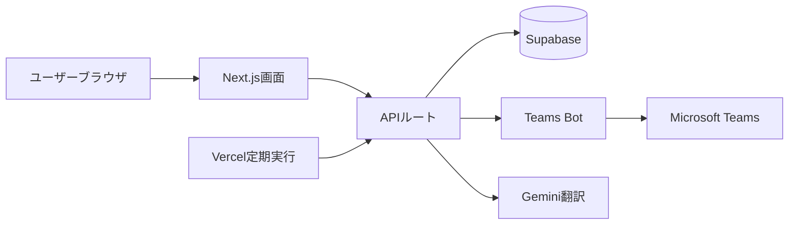
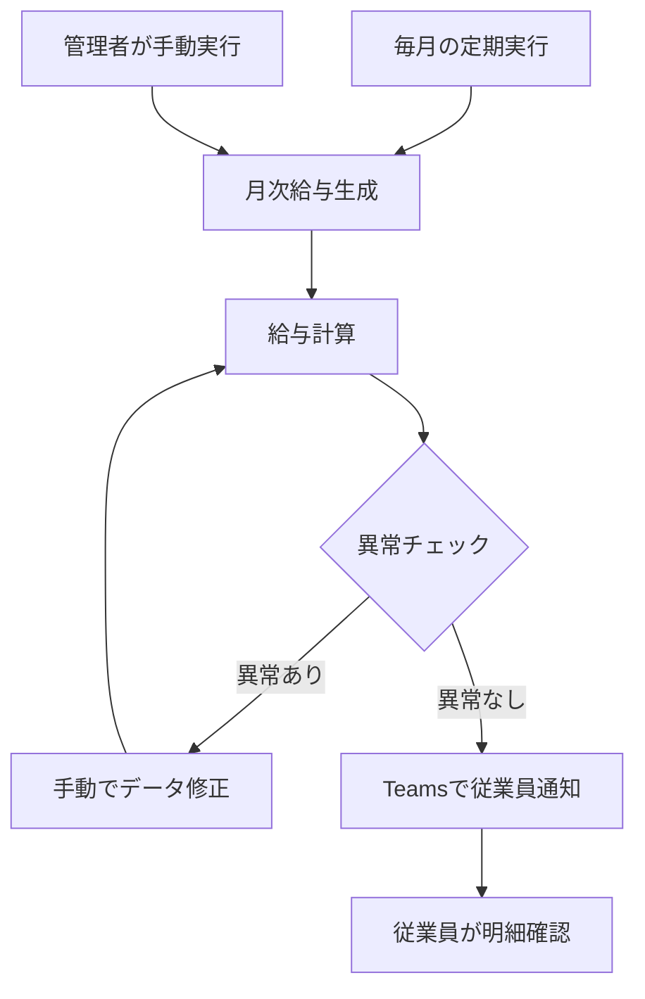
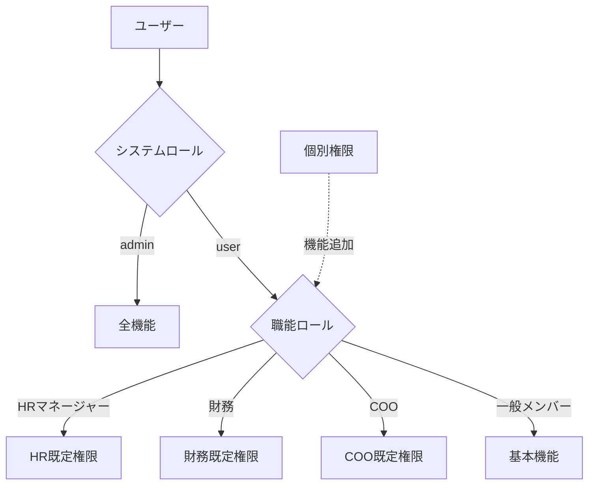

# myOPS — 管理者向け利用ガイド

本ガイドは、myOPS（精拓生技の業務管理システム、正式 URL `https://ops.cancerfree.io`）のシステム管理者（Admin）、および職能ロールまたは個別権限を持つ HR マネージャー、財務担当者、COO を対象としています。権限体系、ユーザーと組織の管理、HR・財務業務、お知らせ・文書のフロー、システム運用と Teams Bot 設定について説明します。

## クイックスタート

### システム要件

- 最新のモダンブラウザ（Chrome、Edge、Safari、Firefox の最新バージョン）で操作でき、ソフトウェアのインストールは不要です。
- デスクトップ、タブレット、スマートフォンのいずれにも対応しています。タブレットではトップバーとハンバーガーメニュー、スマートフォンでは下部ナビゲーションバーが表示されます。
- 会社支給の Microsoft アカウント（Microsoft Entra ID）が必要で、ログインはすべて Microsoft 経由で行います。
- インターフェースは繁体字中国語、英語、日本語の 3 言語に対応しており、個人設定で切り替えできます。システム通知（Teams メッセージを含む）は「受信者」の言語設定に応じて送信されます。

### 初回ログイン

1. `https://ops.cancerfree.io` を開き、「Microsoft でログイン」をクリックします。
2. 画面の指示に従って Microsoft アカウントの認証を完了します。初回ログイン時には、基本情報とカレンダーの権限（休暇のカレンダー同期に使用）が要求されます。
3. 初回ログインに成功すると、システムが自動的にアカウントを作成し、デフォルトで一般メンバーになります。
4. 既存の管理者に連絡し、「ユーザー管理」ページで正しいシステムロール、職能ロール、部門、上司を設定してもらってください。

### 管理権限の体系

myOPS の権限は 3 つの層に分かれており、重ね合わせて適用されます。

- **システムロール（admin / user）**：`admin` はシステム全体のすべての機能と設定の権限を持ち、他の制限を受けません。
- **職能ロール（job_role）**：一般ユーザーには `member`（一般メンバー）、`hr_manager`（HR マネージャー）、`finance`（財務）、`coo`（COO）のいずれか 1 つを割り当てることができ、各ロールには一連のデフォルト機能が付属します。
  - **HR マネージャー**：お知らせ公開、部門横断閲覧、勤怠管理、休暇・残業承認、賞与管理、レポート閲覧に加え、「HR 管理」ページとユーザー管理（部門、上司、代理承認者、アカウント停止などの許可された項目のみ変更可能）にアクセスできます。
  - **財務**：部門横断閲覧、給与閲覧、レポート閲覧に加え、「財務管理」ページで残業レートと労災・健康保険の等級区分を管理できます。
  - **COO**：お知らせ公開、契約承認、プロジェクト管理、残業承認、給与・レポート閲覧ができ、「COO 設定」を管理できます。
- **個別権限（granted_features）**：職能ロールに関係なく、誰にでも個別に割り当てられる機能スイッチです。例：お知らせ公開（publish_announcement）、契約承認（approve_contract）、署名エクスポート（export_signatures）、部門横断閲覧、プロジェクト管理、勤怠管理、休暇承認、残業承認、給与閲覧、賞与管理、レポート閲覧、フィードバック管理など 12 項目です。
- **COO の読み取り専用閲覧**：COO が HR 管理および財務管理ページにアクセスする場合は読み取り専用モードとなり、休暇種別、付与日数、レート、賞与、等級区分などの設定内容を閲覧できますが、変更はできません。
- 職能ロールと個別権限は Admin のみが変更できます。HR マネージャーは誰のシステムロールや権限も変更できません。

## ユーザーと組織の管理

### ユーザー管理

「管理 → ユーザー管理」から全社のアカウント一覧を閲覧でき、ユーザーをクリックすると編集できます。

- **基本設定**：システムロール（Admin のみ変更可）、職能ロール（Admin のみ変更可）、所属部門、雇用形態（正社員／アルバイトなど）、勤務地域。
- **上司と代理承認者**：各ユーザーに直属の上司（manager）と代理承認者（deputy approver）を指定します。上司が不在の場合、休暇・残業申請は代理承認者が処理します。
- **アカウントの有効状態**：アカウントを停止（is_active をオフ）できます。停止後、そのユーザーはログインできなくなり、給与生成の対象リストにも表示されません。
- **ユーザーの追加**：アカウントは従業員が初めて Microsoft アカウントでログインした時点で自動作成されるため、管理者が手動でアカウントを作成する必要はありません。ログイン後にロールと部門の設定を補完するだけで済みます。

### 人事情報（HR Profile）

各ユーザーには人事情報のページ（ユーザー管理 → 個人 → 人事情報）があり、Admin または HR マネージャーが管理します。

- **入社日／退職日**：入社日は勤続年数と休暇付与日数の計算に影響します。退職日を入力すると退職プロセスが開始されます。
- **労働者退職金の自己拠出率**：0〜6% の範囲で労働者退職金の任意拠出率を設定でき、毎月の給与計算に反映されます。
- **銀行情報**：銀行コードと口座番号は給与振込に使用されます。口座番号はデフォルトでマスク表示され、表示をクリックしないと完全な内容は見られません。

### 退職処理の推奨フロー

1. 人事情報に退職日（termination_date）を入力します。
2. 当月の給与と未消化休暇の精算が完了していることを確認します。
3. ユーザー編集ページに戻り、アカウントを停止に設定します。
4. 必要に応じて「監査ログ」でそのアカウントの直近の操作履歴を確認します。

### 会社と部門

- 「会社管理」では会社の追加・編集ができます（グループ複数法人構成）。ユーザーは異なる会社に所属できます。
- 「部門管理」では部門の作成と調整ができます。部門は部門横断閲覧の権限とレポート集計の範囲に影響します。
- 部門または会社の所属を変更すると、そのユーザーの閲覧可能なデータ範囲は直ちに更新されます。

## HR と勤怠管理

HR 関連機能は「HR 管理」ページに統合されています（Admin と HR マネージャーは編集可、COO は読み取り専用）。

### 休暇種別と付与日数

- **休暇種別管理**：休暇種別（年次有給休暇、病気休暇、私用休暇など）、有給かどうか、適用対象などのルールを定義します。
- **休暇付与日数**：従業員ごとに各休暇種別の年間付与日数を設定し、いつでも調整・残日数の照会ができます。
- 従業員が提出した休暇申請は上司または代理承認者が承認し、承認結果は Teams を通じて申請者にリアルタイムで通知されます。

### 勤怠と残業

- **勤怠管理**（管理 → 勤怠管理）：全従業員の出退勤打刻記録の閲覧と修正ができます。
- **勤怠異常チェック**：システムが異常打刻（打刻漏れ、異常時間帯など）を自動集計し、正社員の自動チェックとアルバイトの打刻漏れの 2 種類のリストに分けて、HR が 1 件ずつ確認・処理しやすくします。
- **残業レート管理**：時間帯別・種類別の残業レート倍率を設定し、給与計算の基準とします。残業申請の事前提出に必要な最少時間数はシステム設定で調整できます。

### 賞与管理

- 個別の従業員に賞与項目を追加でき、当月の給与計算に組み込まれます。
- 賞与管理の権限は、職能ロール（HR マネージャー）または個別権限（bonuses_manage）で取得できます。
- COO は賞与リストを読み取り専用で閲覧でき、確認に便利です。

## 財務と給与管理

財務関連機能は「財務管理」ページに統合されています（Admin と財務ロールは編集可、COO は読み取り専用）。

### 労災・健康保険の等級区分表

- Excel ファイルによる労災保険・健康保険の等級区分表のインポートに対応しています。アップロード欄をクリックしてファイルを選択すると、システムが最初のワークシートを読み取って解析結果をプレビューし、問題がなければ送信します。
- 等級区分表は年度ごとに管理され、毎年の公示改定後に再インポートするだけで済みます。
- インポートに成功すると件数の確認が表示されます。ファイル形式が誤っているか内容が空の場合は、画面にエラーの原因が表示されます。

### 月次給与の生成と計算

- システムは毎月スケジューラーで当月の全従業員の給与を自動生成できるほか、Admin または HR が管理ページで「月次給与を生成」を手動で実行することもできます。
- 給与計算では、基本給、勤怠・休暇記録、残業レート、賞与、労災・健康保険の等級区分、退職金の自己拠出率を統合します。
- 給与明細の生成後、システムは Teams Bot を通じて各従業員に給与明細が閲覧可能になったことを通知します（従業員の言語に応じて送信）。
- 自動生成日と給与支給日はシステム設定で調整できます。給与関連のエンドポイントは多要素認証（MFA）で保護されています。

### 給与異常チェックと年間給与

- **給与異常チェック**：当月の給与と過去のデータを自動比較し、異常項目（金額の急激な変動、データの欠落など）をリストアップします。支給前に 1 件ずつ確認してください。
- **年間給与**：Admin と HR は全従業員の年間各月の給与集計を閲覧できます。一般従業員は自分の年間記録のみ閲覧できます。
- 推奨フロー：月次給与を生成 → 異常チェックを実行 → データを修正して再計算 → 問題がないことを確認してから公開。

## お知らせ、文書、システム運用

### お知らせの公開と確認受領

- お知らせ公開の権限を持つ者（Admin、HR マネージャー、COO または個別権限の保有者）は、お知らせと文書を作成し、受信者リストを指定できます。
- 公開時に「確認受領が必要」（デフォルトでオン）を選択できます。受信者は既読確認をクリックする必要があり、システムは未確認者のリストを追跡します。
- リマインダー日数を設定でき、期限を過ぎても未確認の場合はリマインダーが届きます。お知らせの公開と同時に Teams 通知も送信されます。
- 署名エクスポートの権限を持つ者は、確認／署名リストをエクスポートして監査用に保管できます。

### 契約承認フロー

- 契約はアップロード後「承認待ち」の状態となり、契約承認の権限を持つ者（COO または個別権限 approve_contract）が承認または差し戻しを行います。
- 承認者は契約詳細ページで直接「承認」または「差し戻し」をクリックでき、状態は即時に更新されます。
- システム設定で契約承認リマインダーのスケジュール動作を調整でき、契約が長期間未承認のまま放置されるのを防げます。

### AI 翻訳

- お知らせと文書はワンクリックの AI 翻訳に対応しています。中国語の内容を元に、英語版と日本語版を自動生成し、異なる言語の同僚が読めるようにします。
- 翻訳機能は Google Gemini サービスを使用しており、先に「システム設定」で Gemini API Key を入力する必要があります。
- 翻訳結果は、公開前に固有名詞を人の目で確認することをお勧めします。

### 監査ログとフィードバック管理

- **監査ログ**（管理 → 監査ログ）：システム内の重要な操作を記録します。操作種別での絞り込み、キーワード検索、ページネーションによる閲覧ができ、データ変更の追跡に使用します。
- **フィードバック管理**（管理 → フィードバック管理）：従業員から報告された問題や提案（スクリーンショットを含む）を閲覧し、処理状態を更新して進捗を追跡できます。

### システム設定

「管理 → システム設定」でグローバルパラメータを一元管理します（Admin のみ）。主な設定の概念は以下のとおりです。

- **連携キー**：Gemini API Key（AI 翻訳）、Teams Bot シークレットなどのサービス認証情報。
- **給与パラメータ**：給与の自動生成日、給与支給日。
- **残業と承認**：残業申請の最少事前提出時間数、プロジェクト残業がしきい値に達した際に COO へ通知する時間数、MFA 承認セッションの有効時間（分）。
- **通知スケジュールのスイッチ**：毎日のタスクサマリー、出退勤打刻リマインダー（正社員自動／アルバイト打刻漏れ）、契約承認リマインダー。
- **メンテナンスモード**：オンにすると一般ユーザーの操作を一時停止し、システムメンテナンスを行えます。

### Teams Bot

- Bot は 6 種類のメッセージを能動的に配信します：毎日のタスクサマリー、出退勤打刻リマインダー、リアルタイム通知、休暇承認結果、給与明細発行通知、お知らせ公開通知。
- **スケジュール時刻（台北時間、月曜〜金曜）**：毎日のタスクサマリー 08:30、出勤打刻リマインダー 07:00、退勤打刻リマインダー 17:30。
- **Conversation reference の仕組み**：従業員が Teams で myOPS Bot をインストール（または追加）すると、システムはそのメンバーの Email を myOPS アカウントと照合し、会話参照を保存します。これにより、その従業員に能動的にメッセージを送信できるようになります。Bot を未インストールの従業員は静かにスキップされ、他の通知フローには影響しません。
- Bot メッセージは受信者の言語設定に応じて中国語／英語／日本語で送信されます。Bot の配信失敗はシステムのメインフローに影響しません（例えば給与は正常に生成されます）。
- Azure Bot の作成、Teams へのインストール、デプロイ設定の詳しい手順については、セットアップマニュアル `docs/teams-bot-setup.md` を参照してください。

## ワークフロー図

### システムアーキテクチャ

### 月次給与の締めフロー

### 権限階層の概要

## よくある質問 FAQ

- **Q：新しい同僚がログインしても管理機能が何も表示されません。**
  A：アカウントは初回ログイン時に自動作成され、デフォルトでは一般メンバーです。Admin が「ユーザー管理」で職能ロールまたは個別権限を設定し、部門と上司を指定してください。
- **Q：HR マネージャーはなぜ特定ユーザーのシステムロールを変更できないのですか？**
  A：システムロール、職能ロール、個別権限は Admin のみが変更できます。HR マネージャーは部門、上司、代理承認者、アカウントの有効状態など許可された項目のみ調整できます。
- **Q：従業員に Teams 通知が届かない場合はどうすればよいですか？**
  A：その従業員が Teams で myOPS Bot をインストール済みであること（これによりシステムが会話参照を取得します）、および Teams アカウントの Email が myOPS アカウントと一致していることを確認してください。Bot を未インストールの従業員はスキップされ、エラーにはなりません。
- **Q：AI 翻訳ボタンを押しても反応がない、またはエラーが表示されます。**
  A：まず「システム設定」に有効な Gemini API Key が入力されていること、およびその文書に中国語の内容があること（翻訳は中国語を元にします）を確認してください。
- **Q：労災・健康保険の等級区分の Excel アップロードに失敗します。**
  A：システムはファイルの最初のワークシートのみを読み取ります。列の形式がテンプレートと一致していること、内容が空白でないことを確認し、適用年度を正しく選択してから再アップロードしてください。
- **Q：給与生成後に金額の誤りが見つかりました。やり直せますか？**
  A：できます。まず元データ（勤怠、残業レート、賞与、人事情報）を修正し、財務管理で給与計算を再実行してから、「給与異常チェック」で再度確認してください。
- **Q：COO は HR 管理ページでなぜ編集できないのですか？**
  A：これは設計上の動作です。COO の HR・財務設定へのアクセスは読み取り専用であり、Admin と対応する職能ロールのみが編集できます。
- **Q：従業員が退職するとデータは消えますか？**
  A：消えません。アカウントの停止はログインを不可にして給与リストから除外するだけで、過去の勤怠、休暇、給与の記録はすべて保持され、照会と監査に利用できます。

## バージョン情報

- **対象バージョン**：v0.3.1
- **文書日付**：2026-06-11
- 本バージョンの主な更新：Teams Bot 連携の正式リリース（6 種類の能動的通知、受信者の言語に応じた 3 言語での送信、Azure セットアップマニュアル `docs/teams-bot-setup.md`）、Vercel スケジューラーの修正（打刻リマインダーと毎日のサマリーが正常に起動）。
- 直近の関連更新：HR／財務管理機能を設定ページに直接組み込み、COO の読み取り専用に対応（v0.2.47）、職能ロールシステム job_role のリリース（v0.2.44）、API エラーメッセージの多言語化（v0.2.49）。
- 本文書の内容がシステムの実際の画面と異なる場合は、システムの現状を優先してください。「フィードバック」機能からの報告も歓迎します。
