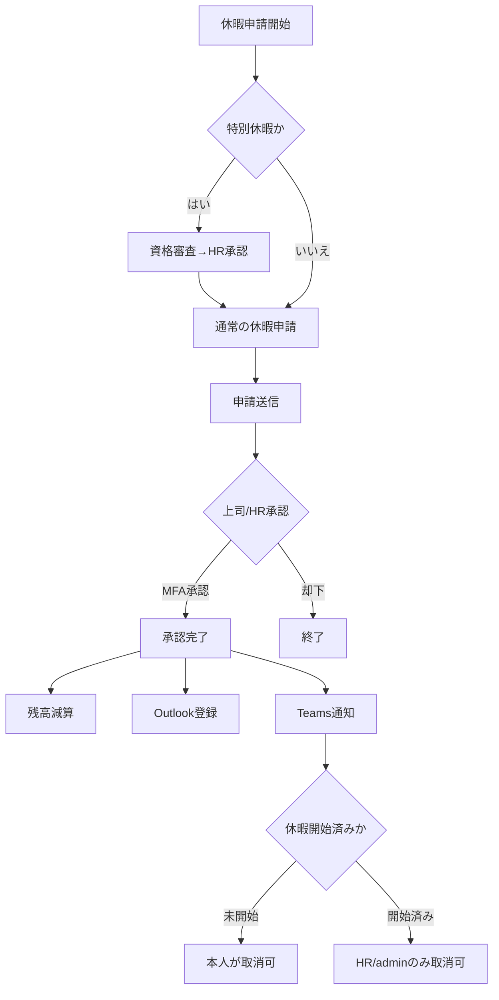
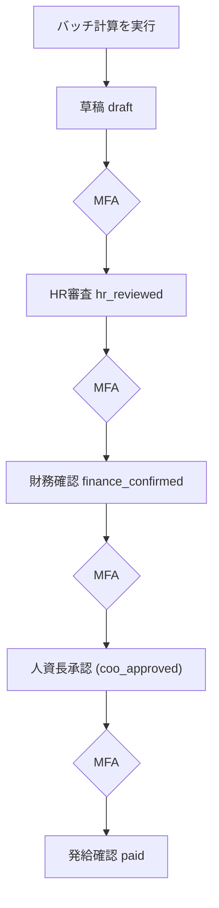
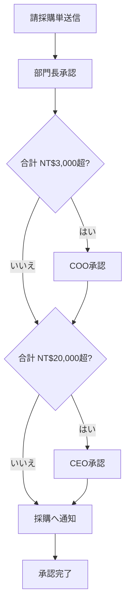

# myOPS 管理者・HR 利用ガイド

本ガイドは、myOPS の管理者（Admin）および HR 担当者を対象とした操作マニュアルです。一般社員が使う操作もすべて含んでおり、管理者・HR 専用の機能には見出しや本文中に【管理者/HR】【僅Admin】などの表記で範囲を明示しています。myOPS は勤怠・休暇・給与・採購（購買）・人事・プロジェクト・資産・文書管理までを一つに統合した社内オペレーション基盤で、Microsoft Entra ID（Azure AD）によるシングルサインオン、Microsoft Teams 連携（Dr.Ave ボット）、Outlook カレンダー同期などの機能を備えています。

---

## はじめに(クイックスタート)

### システム要件

- 対応ブラウザ：Chrome / Edge の最新版を推奨します。スマートフォンからのアクセス（打刻、在庫のバーコード照会など）にも対応しています。
- ログインには会社の Microsoft Entra ID（Azure AD）アカウントが必要です。myOPS 独自のパスワードは存在せず、Microsoft の認証画面を経由してログインします。
- 本システムの正式なドメインは `ops.cancerfree.io` です。ブックマークや社内共有の際はこのドメインをご利用ください。
- 一部の承認操作（休暇・加班・出差・報帳・採購文書などの承認、無効化操作など）は MFA（多要素認証、AAL2 レベル）の完了が必須です。未設定のユーザーが承認操作を行うと `403` エラーとなり `/mfa/verify` に誘導されます。事前に個人設定でスマートフォンの認証アプリ（TOTP）を登録しておくことを推奨します。

### 初回ログイン・初期設定

- 社員が初めて Entra ID でログインすると、myOPS 上にユーザーレコードが自動的に作成されます（初期値は一般社員扱い）。**管理者が事前に手動でアカウントを作成する機能はありません。**
- Admin または権限を持つ HR は「ユーザー管理」(`/admin/users`) で部門・雇用形態・勤務地・直属の上司・システム権限などを設定します。
- 個人設定 (`/settings`) では、表示名・テーマ（ライト/ダーク）・言語（繁体中文/English/日本語）・MFA のリセットなど、本人に関する設定のみを変更できます。これは全社員が使える「個人設定」であり、Admin 専用の「システム設定」(`/admin/settings`) とは全く別のページです。名前が似ているため混同されやすいので、案内する際はどちらのページかを明確に伝えてください。

### 権限判定の3つの仕組み（本書を読む前に）

myOPS の「HR かどうか」「管理者かどうか」の判定方法はページごとに異なり、同じ「HR」という言葉でも実際にチェックしている項目が違います。403 エラーに遭遇したときは、まずどの仕組みで判定されているページかを確認してください。

1. **`role='admin'`（システム権限）** — ユーザー管理で設定する最上位の権限です。`role='admin'` のユーザーはほぼ全ページにアクセスできます。
2. **`job_role`（職能ロール）** — `hr_manager` / `coo` / `finance` / `ceo` など、人事データ上の「役職」に相当する属性です。ページによっては `job_role` だけを見て、後述の個別授権機能を見ないものがあります（例：出勤異常、休暇種別管理、休暇種別額度、財務管理設定、營運長設定）。
3. **`granted_features`（個別授権機能）** — Admin がユーザーごとに個別に付与するチェックボックス形式の機能フラグです（`hr_manager` / `finance_payroll` / `approve_contract` / `expense_approve` / `asset_manage` / `training_manage` / `lab_manage` / `procurement_unit` / `procurement_manage` / `manage_projects` など計 15 種類）。多くのページはこちらだけを見ます（例：ユーザー管理、入職／離職流程、招募管理、シフト管理）。

このため、**`job_role='hr_manager'` を設定しただけではユーザー管理・入職離職・招募管理を開けません**（`granted_features` に `hr_manager` を追加授与する必要があります）。逆に `granted_features` の `hr_manager` だけでは出勤異常・休暇種別管理・休暇種別額度・HR 管理（`/admin/hr-settings`）は開けません（`job_role='hr_manager'` の設定が必要です）。どちらのページがどちらの仕組みを使っているかは、各モジュールの説明中に明記しています。

---

## 勤怠・休暇・給与・経費管理

### 出勤・休暇・勤怠関連の設定

#### 打刻 (`/attendance`)

社員が毎日の出勤・退勤を打刻し、自分の履歴を確認するページです。HR/管理者は同じページの「全員記録」タブで全社の打刻状況を確認・管理できます。旧ルート `/admin/attendance` は現在リダイレクト専用で、独立したページではありません。

権限：閲覧（打刻・自分の記録）は全社員。「全員記録」タブの操作は `role=admin`、または `job_role=hr_manager`、または `granted_features` に `hr_manager` を含む――**この3つのうちいずれか1つでも満たせば操作可能**です。このページは同グループの他ページより1つ多く `job_role` も認める点が特徴で、休暇／加班／出差／会社カレンダーの HR 判定とは異なります。

主な操作：
- 出勤・退勤の打刻を行います（GPS 情報を含み、管理者が「打刻範囲の強制チェック」を有効にしている場合は指定エリア内でのみ打刻が成功します）。
- 「自分の記録」で年・月を指定して過去の打刻履歴と勤務時間を確認します。
- 打刻を忘れた場合は打刻修正申請（日付・種別・時刻・理由）を送信します。承認者はデータベースのトリガーが自動で決定し、通常は直属の上司が指定されます（自分で承認者を選ぶことはできません）。
- 【管理者/HR】「全員記録」タブで月・社員・雇用形態を絞り込み、全社の打刻状況と統計カード（本日打刻済み人数・平均出勤日数・自動補登回数）を確認します。
- 【管理者/HR】異常な打刻記録を無効化（理由の入力が必須、監査ログに残ります）、または無効化の取消を行います。承認・無効化・無効化取消の操作はいずれも MFA(AAL2) が必須です。

連携：打刻修正申請の承認・却下は MFA(AAL2) が必要です。打刻の判定データは打刻範囲設定 (`/admin/geofences`) とシフト設定 (`/admin/shifts`) から供給されます。

#### 休暇 (`/leave`)

社員がオンラインで休暇を申請し、各休暇種別の残高を確認するページです。特別休暇（結婚・忌引・産休など）は先に資格審査の申請が必要です。上司/HR/管理者は承認待ちの申請を審査し、HR/管理者は全社の記録を閲覧し、承認済みの休暇を代理で取消すこともできます（開始済みの休暇は HR/管理者のみが取消可能）。

権限：閲覧は全社員。「承認待ち」の操作は申請者の直属の上司、`role=admin`、または `granted_features` に `hr_manager` を含む人。「全員記録」の閲覧と他人の承認済み休暇の代理取消は `role=admin` または `granted_features` に `hr_manager` を含む人のみ――**このページの HR 判定は `job_role` を見ません**。打刻ページとは判定基準が異なる点に注意してください。

主な操作：
- 各休暇種別の当期残高を確認します（特休は入社周年制、その他は暦年制で計算されます）。
- 休暇申請を送信します（種別・開始/終了日・半日単位・理由・任意で代理人を選択）。日数と残高チェックはシステムが自動で行います。
- 「自分の記録」で履歴と状態を確認し、承認待ちの申請は自分で取消せます。まだ開始していない承認済みの休暇も本人が自分で取消せます（取消すと残高が戻り、Outlook の予定も削除されます）。
- 特別休暇（結婚・忌引・産休など）は先に「特殊假申請」で資格審査を受け、HR が付与日数を承認した後でなければ正式な申請ができません。
- 【管理者/HR】承認待ちの休暇申請を審査します（承認には MFA が必須。承認すると自動で残高が減算され、Outlook に終日の予定が作成されます。却下や取消の場合は予定が削除されます）。
- 【管理者/HR】「全員記録」で全社の休暇記録を読み取り専用で確認します。
- 【管理者/HR】**すでに開始している承認済み休暇の代理取消は HR/管理者のみ**が行えます（直属の上司にはこの権限はありません）。取消操作は監査ログに残り、Teams で本人に通知されます。

連携：Outlook（承認後に終日の「予定あり」イベントを作成、却下/取消時は自動削除。一方向同期）、Teams（資格審査申請の HR 通知、承認/却下/代理取消結果の申請者通知）、会社カレンダー (`/calendar`、承認済み休暇を表示するが休暇種別は表示しない)、簽核中心 (`/approvals`、承認待ちの休暇を集約表示)。

#### 休暇カレンダー (`/leave/calendar`)

月間カレンダー形式で部門または全社の休暇分布（休暇種別・理由を含む）を確認し、上司のシフト調整に利用するページです。**注意：現在アプリ内にこのページへのリンクやボタンは一つもなく、URL を直接入力しないとアクセスできない「孤立ページ」です。**

権限：閲覧は全ログイン社員（一般社員は同部門のみ、`role=admin` または `granted_features` に `hr_manager` を含む人は全社を閲覧でき部門フィルターも使えます）。書き込み・管理機能は一切なく、完全に読み取り専用です。

主な操作：
- 月間カレンダーでその日の休暇人数を確認します（承認済みは緑点、承認待ちは黄点で表示）。
- 日付をクリックすると、その日の休暇者一覧（氏名・種別・期間・日数・状態）が絞り込まれます。
- 「自分の部門のみ表示」にチェックして素早く絞り込み、月を切り替えて過去/未来の履歴を確認します。
- 【管理者/HR】「部門」ドロップダウンで任意の部門または全社を切り替えて表示できます（一般社員は自分の部門に固定されます）。

連携：会社カレンダー (`/calendar`) とは役割が異なります。本ページは休暇種別と理由を表示します（同部門または HR のみ閲覧可、上司のシフト調整用途）。`/calendar` は v0.9.9 以降、健康個人情報保護の観点から意図的に「休暇中」としか表示せず休暇種別を出しません。この2つのルールは意図的に分離されているため、混同して説明しないでください。

#### 加班（残業） (`/overtime`)

社員がオンラインで残業を申請（労基法の日別区分に応じて時給計算）し、記録を確認するページです。上司／プロジェクト責任者／管理者が承認待ちの残業申請を審査し、HR/管理者は全社の記録を閲覧できます。**重要な仕様上の落差：画面上の「承認待ち」タブは、どの社員がログインしても全社の承認待ち残業申請（承認/却下ボタン付き）が表示されますが、実際にボタンを押した際にサーバー側で身分チェックが行われ、直属の上司／プロジェクト責任者／`admin`／`granted_features` の `coo_notify` 以外は必ず `403` エラーになります。`hr_manager` は残業を一切承認できません。**

権限：閲覧・自分の申請の操作は全社員。画面上「承認待ち」タブは `role=admin` または `granted_features` に `hr_manager` を含む人にも表示されますが、実際に承認/却下できるのは `role=admin`、`granted_features` の `coo_notify`、申請者の直属の上司、またはその残業に紐づくプロジェクトの責任者のみです（`hr_manager` はバックエンドの許可リストに含まれません）。「全員記録」の閲覧は `role=admin` または `granted_features` に `hr_manager` を含む人。

主な操作：
- 残業申請を送信します（日付から日別区分を自動判定、開始/終了時刻、任意でプロジェクトを関連付け、理由を入力）。時間は自動計算され、深夜0時をまたぐ場合は翌日分としてプラス1日扱いになります。
- 「自分の申請」で自分の履歴と状態を確認します。
- **「見える」ことと「承認できる」ことは別物です。** 他人の承認待ち残業申請が自分のログイン画面の「承認待ち」タブに表示されても、承認/却下ボタンを押した際に直属の上司/プロジェクト責任者/`admin`/`coo_notify` 以外は `403` エラーになります。これは正常な仕様で、権限漏洩ではありません。
- 【管理者/HR】「全員記録」で月・社員・状態を絞り込み、全社の残業記録を読み取り専用で確認します。
- 承認/却下操作には MFA が必須です。承認済みの残業は日別倍率（平日1.34/1.67倍、休日1.34/1.67/2.67倍、国定休日2倍）で給与草稿に自動反映されます。

連携：給与（承認済み残業は日別倍率に基づき給与草稿に計上）、簽核中心 (`/approvals` に承認待ちの残業を集約表示)。

#### 出差（出張） (`/business-trips`)

社員がオンラインで出張を申請するページです。申請時点の直属の上司が審査者として自動的に固定されます（後で上司が変わっても、その申請の審査者は変わりません）。承認後は報帳（経費精算）を直接作成でき、Outlook にも同期されます。

権限：閲覧は全社員。「承認待ち」の操作は申請時に指定された審査者（申請者の当時の直属の上司）、`role=admin`、または `granted_features` に `hr_manager` を含む人。「全員記録」の閲覧は `role=admin` または `granted_features` に `hr_manager` を含む人。

主な操作：
- 出張申請を送信します（目的地・理由・開始/終了日・任意で詳細な行程）。
- 「自分の出張記録」で履歴と状態を確認し、承認待ちの申請を取消せます。
- 承認済みの出張は「報帳作成」ボタンから直接、報帳モジュールへ内容を引き継いで申請できます。
- 【管理者/HR】承認待ちの出張申請を審査します（承認/却下には MFA が必須）。審査者は申請時に指定された直属の上司または HR/管理者です。
- 【管理者/HR】「全員記録」で全社の出張記録を読み取り専用で確認します。

連携：Outlook（承認時に終日の予定を作成、却下時は自動削除、一方向同期）、員工報帳 (`/expenses`、承認済み出張をワンクリックで報帳申請に引き継ぎ)、会社カレンダー (`/calendar`、承認済み出張を目的地とともに表示。目的地はプライバシー情報に該当しないため表示されます)、簽核中心 (`/approvals` に承認待ちの出張を集約表示)。

#### 会社カレンダー (`/calendar`)

全社の月間カレンダーで、会社行事・承認済み休暇（v0.9.9 以降、健康個人情報保護の観点から「休暇中」としか表示せず休暇種別は表示しません）・承認済み出張をまとめて確認します。社員は会社行事に RSVP でき、HR/管理者は行事の作成・編集・削除ができます。

権限：閲覧は全社員。会社行事の管理は `role=admin` または `granted_features` に `hr_manager` を含む人（`job_role` は見ません。判定方法は休暇ページと同じです）。RSVP は全社員が任意の行事に対して行えます。

主な操作：
- 月間カレンダーで会社行事（緑）、同僚の休暇中（青、休暇種別は非表示）、同僚の出張（紫）を確認します。
- 日付をクリックすると当日の詳細一覧を確認できます。会社行事には参加/不参加/未定で RSVP でき、展開すると各回答の人数と名前も見られます。
- 【管理者/HR】会社行事を新規作成・編集・削除します（タイトル・説明・開始/終了日）。

連携：Outlook（行事の追加/編集/削除を、連携済みの社員のカレンダーへ一方向でベストエフォート同期）。データは SECURITY DEFINER 関数経由で取得され、氏名と日付のみを返却し、休暇理由や休暇種別は含まれません。

#### 出勤異常 (`/admin/attendance-anomalies`)

過去30日間に3日以上連続して自動補登（打刻忘れ）した正社員、および今月3回を超えて打刻漏れがあったインターン生を一覧表示する読み取り専用レポートです。このコンポーネントは `/admin/hr-settings` にも読み取り専用として埋め込まれています。

権限：**閲覧＝操作（完全に読み取り専用で書き込み動作はありません）**。`role=admin`、または `job_role=hr_manager`、または `job_role=coo` のみアクセス可能です。**このページは `job_role` と `role=admin` のみを認識し、`granted_features` は見ません**――出勤／休暇／加班／出差／会社カレンダーの HR 判定とは異なるロジックです。`granted_features` にのみ `hr_manager` を付与されている人はこのページを開けず、`/no-permission` に転送されます。

主な操作：
- 【`job_role=hr_manager`/`coo` または `admin` のみ】「正職連続自動補登」一覧を確認します（連続5日以上は赤字で強調表示）。
- 【`job_role=hr_manager`/`coo` または `admin` のみ】「実習生打刻漏れ」一覧を確認します。
- 本ページには CSV 出力や「対応済み」マークなどの操作ボタンは一切なく、純粋にデータを表示するのみです。

連携：なし（単独の読み取り専用レポート）。

#### 休暇種別管理 (`/admin/leave-types`)

会社の休暇種別一覧（名称・対象者・給与区分・年間上限・事前申請必要日数・有効状態）を維持するページです。休暇申請ページのドロップダウンのデータ元になります。**このページには読み取り専用モードがなく、`job_role=coo` でも完全な編集が可能です**（`/admin/hr-settings` に埋め込まれたバージョンでは COO に読み取り専用表示される点と異なります）。

権限：**閲覧＝操作（読み取り専用モードなし）**。`role=admin`、または `job_role=hr_manager`、または `job_role=coo`（`granted_features` は見ません）。

主な操作：
- 【`job_role=hr_manager`/`coo` または `admin` のみ】新しい休暇種別を追加します（名称・対象者・給与区分・年間上限・事前申請日数・有効状態）。
- 【`job_role=hr_manager`/`coo` または `admin` のみ】既存の休暇種別の項目を編集します。
- 資格審査が必要かどうか（`requires_qualification`）に対応する UI コントロールは現在存在せず、設定はバックエンド／データベースから直接行う必要があります。

連携：なし。保存すると即時反映され、休暇申請ページのドロップダウンにも最新の一覧が表示されます。

#### 休暇種別額度 (`/admin/leave-balances`)

社員ごと・休暇種別ごとに当年度（または特休の入社周年制の当期）の付与日数を調整するページです。入社日に応じて年数に対応する特休日数を一括で反映できます。社員の休暇申請ページで見える残高のデータ元です。v0.9.7 以降、サイドバーからの唯一の管理入口となっています。こちらも読み取り専用モードはありません。

権限：**閲覧＝操作（読み取り専用モードなし）**。`role=admin`、または `job_role=hr_manager`、または `job_role=coo`（`granted_features` は見ません）。

主な操作：
- 【`job_role=hr_manager`/`coo` または `admin` のみ】社員・休暇種別ごとに当年度の付与日数を表形式で入力し、「保存」をクリックします。
- 【`job_role=hr_manager`/`coo` または `admin` のみ】「入社年数から特休を自動反映」で特休付与日数を一括生成・更新します（すでに手動調整済みのデータは上書きされません）。
- 社員ドロップダウンで単一の社員に絞り込み、各休暇種別の使用済み日数を確認できます。

連携：なし。

#### シフト管理 (`/admin/shifts`)

複数の勤務シフト（時間・勤務日・フレックス許容時間・休憩時間）を定義し、社員に割り当てるページです。打刻の遅刻判定は、その社員が当日属するシフトの開始時刻に基づいて計算されます。**`job_role=coo` はこのページに入れません**（休暇種別管理／休暇種別額度／出勤異常の3ページは COO でも入れる点と異なります）。

権限：**閲覧＝操作/管理**。`role=admin`、または `job_role=hr_manager`、または `granted_features` に `hr_manager` を含む人（`job_role` と `granted_features` の両方を認識しますが、`job_role=coo` は含みません）。

主な操作：
- 【管理者/HR】新しいシフトを追加・編集します（名称・出退勤時刻・勤務日・フレックス許容時間・休憩分数・有効状態）。
- 【管理者/HR】各社員に現在適用するシフトを割り当てます（有効なシフトのみ選択肢に表示されます）。

連携：打刻 (`/attendance`、出勤打刻時に当日適用中のシフトを読み取り遅刻判定に使用。非勤務日の打刻は遅刻判定の対象外)。

#### 打刻範囲 (`/admin/geofences`)

打刻を許可するオフィスの地理座標範囲（複数拠点可）を設定し、「強制範囲チェック」の ON/OFF を切り替えるページです。ON にすると、いずれのエリア内にも入っていない打刻は拒否されます。**出勤関連のページの中で唯一「`role=admin` のみ」に限定されたページで、HR はどのような身分（`job_role` でも `granted_features` でも）でも開けません。**

権限：**閲覧＝操作/管理は `role=admin` のみ**。HR（`job_role` または `granted_features` を問わず）と COO はいずれもアクセスできず、設定変更が必要な場合は IT/システム管理者に依頼する必要があります。

主な操作：
- 【Adminのみ】「強制打刻範囲チェック」を ON/OFF します（デフォルトは OFF で、座標を記録するだけで打刻を止めません）。
- 【Adminのみ】新しいエリアを追加します（名称・緯度経度・半径。「現在地を使用」ボタンで現在の位置を自動入力できます）。
- 【Adminのみ】エリアの有効化/無効化・削除を行います。複数のエリアを設定できて、いずれかのエリア内であれば打刻可能です。

連携：打刻 (`/attendance`、強制チェック ON の場合、Haversine 距離公式で GPS 座標を判定)。

### 給与管理

#### 給与 (`/payroll`)

給与のメインページで、権限に応じて表示が変わります。一般社員は「自分の給与単」（『人資長承認済み』または『発給済み』の状態のみ、直近12か月分）のみ表示され、HR/財務/閲覧権限保有者はさらに「給与表」タブが追加され、バッチ計算・手動作成・一括承認が可能です。**注意：「毎月自動的に給与草稿を生成する」という説明は誤りです。バッチ計算は人がボタンを押す必要があり、現時点でこの生成エンドポイントを呼び出す cron スケジュールは存在しません。**

権限：自分の給与単の閲覧は全社員。全員の給与表の閲覧は `role=admin/hr`、または `view_payroll` 権限保有者。バッチ計算は `admin` または `job_role=hr_manager` または `hr_manager` 権限保有者。手動作成は `role=admin/hr`。4段階承認は下記ワークフロー参照。xlsx 出力は `admin` または `hr_manager`/`finance_payroll` 権限保有者のみ（対応する UI ボタンはなく、年月パラメータを直接付けて URL を開いてダウンロードする必要があります）。

主な操作：
- 「自分の給与単」で直近12か月分の承認済み/発給済みの給与単の要約を確認し、クリックすると明細が見られます。
- 【管理者/HR】「給与表」タブで当月全社員の給与記録を閲覧します。
- 【管理者/HR】バッチ計算：台湾在職の正社員かつ月給が登録済みの社員を対象に、月給・承認済み残業・無給休暇の減額・ボーナス・労健保等級表に基づいて当月の給与草稿を生成します。**再計算はすでに承認フローに入っている給与単を上書きし、承認履歴を消去します**（実行前に影響件数を警告表示します）。
- 【管理者/HR】1件だけの手動作成（同月にすでに下書き以外の給与単が存在する場合はブロックされ、承認フローの回避を防ぎます）。
- 【管理者/HR】一括承認：同じ関門にあるすべての給与単を一度に次の段階へ進めます（HR審査/財務確認/人資長承認/発給確認の各ボタン）。内部的には1件ずつ元の API を呼び出し、MFA と状態機械のチェックはすべて維持されます（一部失敗時はどの給与単が失敗したかを明示します）。
- 【個別授権のみ】xlsx 出力（`/api/export/payroll`。`admin` または `hr_manager`/`finance_payroll` 権限。UI ボタンはありません）。

主な業務フロー：
- HR/`hr_manager` が「バッチ計算」を押し、当月の給与草稿を生成します。
- HR 審査（`draft` → `hr_reviewed`、`role=admin/hr`）。
- 財務確認（`hr_reviewed` → `finance_confirmed`、`confirm_payroll` 権限または `admin` が必要）。
- 人資長承認（`finance_confirmed` → `coo_approved`、`approve_payroll` 権限または `job_role=hr_manager` または `admin` が必要。**データベース上の状態コードは今も `coo_approved` のままです**。画面表示は「人資長承認」に変わっていますが、実際に承認する関門は COO ではないため、混同してCOOを探しに行かないよう注意してください）。
- 発給確認（`coo_approved` → `paid`、**`admin` のみ**）。
- 社員は「自分の給与単」で承認済み/発給済みの給与単を確認し、明細を見られます。

連携：Teams（給与単発給通知。`/api/payroll/generate-monthly` 経由ですが、現時点で呼び出す cron スケジュールはありません）、加班モジュール（承認済み残業を倍率に応じて計上）、休暇モジュール（無給休暇の比率に応じた減額）、ボーナス管理（同年月のボーナスを支給額に合算）、労健保/労退等級表（保険料・提繳の計算基礎）。

#### 給与明細 (`/payroll/{id}`)

単一月の給与の完全な構成（支給・控除・実支給・雇用主負担・承認履歴・異常の警告）を表示するページです。**「―」は未計算を意味し、「NT$0」は計算結果がゼロであることを意味します**（等級表が未アップロードの場合、実際に0円と計算されてしまうことがあります）。この2つは意味が異なるため、必ず分けて説明してください。

権限：閲覧は本人（『人資長承認済み』または『発給済み』の状態のみ）、または `role=admin/hr`、または `view_payroll` 権限保有者（状態を問わず閲覧可）。本ページには承認ボタンはなく、承認操作は給与表のメインページで行います。

主な操作：
- 本人は自分の承認済み/発給済みの給与単の完全な構成、および「給与異常検査」が検出した異常の警告を確認できます。
- 雇用主が負担する労保・健保・労退6%の提繳額も確認できます（自分が実際に受け取る分だけではありません）。
- 「年度給与彙総」へのリンクがあります。
- 【管理者/HR】`view_payroll` 権限保有者は、任意の人・任意の状態の給与明細と完全な承認履歴を確認できます。

連携：なし。

#### 年度給与彙総 (`/payroll/annual`)

年度単位で1～12月の給与を横に並べて集計するページです。**重要な仕様上の落差：自分自身の年度記録を照会する場合は状態でのフィルタが行われず、RLS だけで制御されます。RLS は本人に対してすべての状態（下書き/審査中を含む）の給与記録の閲覧を許可しているため、「自分の給与単」「給与明細」（承認済み/発給済みのみ表示）とは可視範囲が異なります。**文書化の際はこの相違をそのまま記述し、可視範囲が同じだと仮定しないでください。

権限：自分の年度記録の閲覧は全社員（未完了状態も含む）。他人の記録に切り替えて閲覧できるのは `role=admin`、`role=hr`、または `view_payroll` 権限保有者。

主な操作：
- 年度（当年±2年）を選択し、自分の1～12月の明細と年間合計を確認します（状態によるフィルタなし）。
- データがまだない月は「―」で表示されます（HR がまだ当月の給与を作成していないことを意味します）。
- 【管理者/HR】「社員」ドロップダウンで任意の在職社員の年度集計に切り替えられます。

連携：なし。

#### 給与異常検査 (`/admin/payroll/anomalies`)

指定した年月の給与記録をスキャンし、残業46時間超、実支給が前月と比べて20%以上変動、無給休暇の減額が基本給の半分を超える、当月の新入社員/退職者、正社員の基本給が0円、の5種類の異常をマーキングするページです。サイドメニューには独立した入口がなく、実際の主な入口は `/admin/finance-settings` の埋め込みセクション、または URL の直接入力です。

権限：閲覧/操作は `role=admin`、または `job_role=finance`/`coo`、または `granted_features` に `hr_manager`/`finance_payroll` を含む人。一般社員は完全にアクセスできません。**本ページから給与を修正することはできず、マーキングと確認のみが可能です。**

主な操作：
- 【管理者/財務】異常スキャンを実行します（該当月の古いマークを消去したうえで、5種類のルールを再スキャンして書き込みます）。
- 【管理者/財務】既にマークされた異常を確認します（データベースの既存マークを読み取るのみで、再スキャンは行いません）。
- スキャン結果には社員名・実支給額・検出理由（複数同時ヒットも可）が一覧表示されます。

連携：なし。結果の確認後は給与表/明細ページに戻って対応する必要があります。

#### 労健保等級表管理 (`/admin/insurance-brackets`)

年度別の労保/健保投保給与等級表をアップロード・確認するページです。当年度の表が未アップロードの場合、給与バッチ計算で算出される保険料は0円になります（画面上で注意表示されますが計算自体はブロックされません）。**ページのアクセス権限（admin/finance/coo）とアップロード API の権限（admin または finance_payroll）は別々のチェックであり、`job_role=finance`/`coo` を持っていても実際のアップロードが成功するとは限りません。**

権限：ページ閲覧は `role=admin`、または `job_role=finance`/`coo`。実際にアップロード/上書きが成功するのは `role=admin`、または `granted_features` に `finance_payroll` を含む人のみ――`job_role=finance`/`coo` は画面とフォームを見られるだけで、アップロードボタンを押すと `403` になります。

主な操作：
- 労保/健保等級表をアップロードします（xlsx/xls/csv、日本語/中国語の列名の別名を自動識別、プレビューとスキップされた行の理由を表示）。
- 空白のテンプレートをダウンロードします（列名のみでサンプル数値は含みません）。
- 年度単位の上書きアップロード（同じ年度への再アップロード＝古い表の削除＋新しい表の書き込みを、同一データベーストランザクション内で実行）。
- 年度を切り替えて既存の等級表を確認します。
- 【`finance_payroll` 権限または `admin` が必要】上記のアップロード/上書き操作が実際に成功するのはこの権限を持つ場合のみです。`job_role=finance`/`coo` はフォームを見られるだけです。

連携：給与バッチ計算はこの表に基づいて労健保費を算出します。

#### 労退月提繳工資分級表管理（労働者退職金 月額算定基礎給与 等級表管理） (`/admin/insurance-brackets`)

労健保等級表と同じ物理ページ（下部の3番目の独立セクション）にあり、独立した URL はありません。データテーブル・API・計算用途は完全に独立しています。2026年度の官公認62等級データが事前にロード済みです。個人の自願提繳率は人事資料ページで個別に設定し、本ページは月提繳工資と雇用主の6%のみを管理します。

権限：ページ閲覧は `role=admin`、または `job_role=finance`/`coo`（労健保等級表と同一ページ・同一の権限グループ）。実際にアップロードが成功するのは `role=admin`、または `granted_features` に `finance_payroll` を含む人のみ。

主な操作：
- 労退分級表をアップロードします（xlsx/xls/csv、中国語列名の別名対応、プレビュー/スキップ提示/空白テンプレートダウンロード）。
- 年度単位の上書きアップロード（同一データベーストランザクション内で実行）。
- 年度を切り替えて既存の分級表を確認し、月提繳工資から算出した雇用主提繳6%の金額を表示します。

連携：給与バッチ計算はこの表から月提繳工資を換算し、労退自提と雇用主提繳6%を算出します。

#### ボーナス管理 (`/admin/bonuses`)

社員のボーナス記録（年末/業績/プロジェクト/その他）を作成・確認・削除し、年度で絞り込むページです。給与バッチ計算は「年・月の両方が一致する」ボーナスのみを当月の支給額に合算します。**月が未入力のボーナスはどの月にも計上されません。** サイドメニューには独立した入口がなく、実際の入口は `/admin/hr-settings` の埋め込みセクション（読み取り専用が正しく表示されます）です。独立 URL 自体は `readOnly` を子コンポーネントに渡していないため、`job_role=hr_manager`/`coo` では完全な編集ボタンが表示されますが、押すと `403` になります。

権限：ページ閲覧は `role=admin`、または `job_role=hr_manager`/`coo`、または `granted_features` に `finance_payroll` を含む人。実際に追加/削除が成功するのは `role=admin`、または `finance_payroll` 権限保有者のみ――`job_role=hr_manager` はデフォルトで `bonuses_manage` タグが付き完全な編集ボタンが見えますが、バックエンドは実際には `finance_payroll` をチェックするため、追加授与がなければ `403` になります。

主な操作：
- 【`finance_payroll` 権限または `admin` が必要】新しいボーナス記録を追加します（社員・種類・金額・任意で月・説明）。**月を空欄にすると、給与バッチ計算はこのボーナスをどの月にも計上しません。必ず入力するよう案内してください。**
- 【`finance_payroll` 権限または `admin` が必要】ボーナス記録を削除します（二次確認あり、復元不可）。
- 年度を切り替えて確認し、その年度のボーナス合計額を表示します。

連携：なし。

### 経費・財務基本設定

#### 員工報帳（経費精算） (`/expenses`)

立替費用のオンライン申請・審査・支払いを行うページです。v0.10.2 以降、会計科目区分による分類に変更されています。**UI は TWD（台湾ドル）専用です**（金額欄には TWD と表示され、送信データに `currency` 欄は含まれません）。一覧のゴミ箱アイコンは `PATCH {action:'cancel'}` を呼び出す「取消」であり削除ではありません。DELETE エンドポイント自体は存在しますが、現在どの画面からも呼び出されていないため、「記録を削除できる」とは説明しないでください。

権限：閲覧は一般社員は自分の記録のみ。`granted_features` に `expense_approve` を含む人、または `role=admin` はさらに「承認待ち」タブが追加され、全員の記録閲覧と明細出力ができます。操作：どの社員も自分の承認待ちの申請を送信/取消できます。承認/却下/支払いマークは審査権限保有者のみが行え、**自分が送信した申請は自分で承認できません**（職責分離）。この3つの操作はいずれも MFA が必須ですが、取消操作には MFA は不要です。

主な操作：
- 新規申請：会計科目区分を選択し、費用発生日・申請月（費用発生日と異なる月でも可）・請求書番号・理由・金額を入力します。
- 請求書/レシートの写真または PDF をアップロードします（複数枚可、有効期限付きの署名付き URL でダウンロードします）。
- 承認済みの出張申請からワンクリックで内容（目的地・日付など）を報帳フォームに引き継げます。
- 「自分の経費精算」で自分のすべての記録の状態（承認待ち/承認済み/却下済み/支払済み/取消済み）を確認します。承認待ち中の申請は二次確認の上で自分で取消せます（状態が「取消済み」に変わるだけで、記録は削除されません）。
- 【`expense_approve` 権限または `admin`】「承認待ち」タブで送信済みの申請を承認・却下（審査コメントを入力）し、承認済みの申請を「支払済み」にマークします。3つの操作はいずれも MFA が必須で、自分が送信した申請は承認できません。
- 【`expense_approve` 権限または `admin`】経費明細を Excel に出力します。**画面のボタンは月パラメータを付けずに全件を出力します**（API 自体は `?month=` による絞り込みに対応していますが、現在の画面はまだ接続されていません）。

連携：Supabase Storage バケット `expense-receipts`（署名付きアップロード/ダウンロード）、business_trips（出差申請からのワンクリック引き継ぎ）、簽核中心 (`/approvals`) とダッシュボードの「承認待ち報帳」カードへの集約、xlsx 出力（SheetJS）。

#### 財務管理設定 (`/admin/finance-settings`)

給与関連のシステムパラメータ（発給日など）、労健保/労退等級表、給与異常検査の管理入口となるページです。この2つの機能（労健保等級表・給与異常検査）にはそれぞれ独立した URL もありますが、本ページはそれらのクライアントコンポーネントをそのまま埋め込んで表示しているだけです。

権限：閲覧（読み取り専用）は `role=admin` に加え `job_role=coo` も入室できますが、項目はテキスト表示＋鍵アイコンで変更できません。操作/編集は `role=admin` と `job_role=finance` のみが項目を変更・等級表のアップロード・異常スキャンの実行を行えます。**`job_role=hr_manager` にはこのページへのアクセス権限がありません。**

主な操作：
- 【`admin` または `job_role=coo` は読み取り専用】発給日・給与自動生成日などの財務設定値、現在有効な労健保/労退等級表の内容を確認します。
- 【`admin` または `job_role=finance` のみ】「発給日（毎月何日）」と「給与自動生成日」を編集します。
- 【`admin` または `job_role=finance` のみ】労保・健保・労退月提繳工資の3つの等級表を管理します（年度ごとに各等級の投保給与と負担額を追加・確認、または公式 Excel を一括アップロードして置き換え可能）。
- 【`admin` または `job_role=finance` のみ】給与異常検査を実行します（年月を指定してスキャンを開始し、警告ルールに該当した給与単の一覧を発給前の人的確認用に表示）。

連携：`labor_insurance_brackets`／`health_insurance_brackets`／`pension_wage_brackets` の3等級表、`/api/payroll/anomalies` スキャンエンドポイント、`system_settings`（`payroll_pay_day`、`payroll_auto_generate_day`）。

---

## 購買・在庫管理と承認センター

### 購買・調達・在庫管理

以下は採購（購買）モジュールで使われる文書名の対応です：詢價單＝見積依頼書(RFQ)、請採購單＝購買申請書(PR)、進貨驗收單＝入荷検収書(GR)、入庫單／出庫單＝入庫伝票／出庫伝票、訂金請款單＝前受金請求書、採購請款單＝購買請求書(AP)、分期請款單＝分割請求書。アクセスには `granted_features` の `procurement_unit`（利用者）または `procurement_manage`（管理者）が必要で、いずれも Admin が個別に付与します。一般社員・上司・HR という身分そのものではアクセスできません。

#### 詢價単（見積依頼書） (`/procurement/rfqs`)

請購者（依頼者）が品目を記入して見積担当者を指定し、見積担当者が品目ごとに複数社の見積を登録して「採用」にチェックした上で部門長の承認に送る文書です。承認後は購買申請書へワンクリックで転記でき、品目と採用単価も自動的に引き継がれます。**ダッシュボードの「承認待ち」欄はこの文書種別へのリンクが `null` のため、灰色の Phase B バッジが表示されクリックできません**。利用者は本ページの一覧から自分で開いて承認する必要があります。

権限：閲覧は `procurement_unit` または `procurement_manage`（`admin` は常に閲覧可）。下書きの作成/編集は作成者本人または `procurement_manage`。承認プロセス中は見積担当者本人のみ内容を編集でき、他の人は読み取り専用になります。承認：見積担当者本人の関門→部門長の関門（部門長がいない/自分が部門長の場合は `procurement_payment_approve` 権限保有者が代理承認可）で、いずれも MFA が必要です。無効化と複製は `procurement_manage` または `admin`（MFA 必要）。

主な操作：
- 見積依頼の下書きを作成し、品目を追加/削除します。品目ごとに複数社の見積を登録し、「採用」にチェックします（同一品目につき採用できるのは1件のみ）。
- 取引先の見積書の添付ファイルをアップロードします（複数可、専用ストレージバケットに保存）。
- 承認申請を送信します（**承認プロセス中も見積担当者は編集を続けられます**。これは制限ではなく意図的な例外です）。
- 承認後、「購買申請書に転記」ボタンで品目と採用単価を自動的に引き継ぎます（全品目が同一取引先の場合はその取引先情報も自動的に引き継がれます）。
- 【`procurement_manage`/`admin` + MFA】承認済み/却下済みの文書を「無効化して複製」し、同内容の新しい下書きを作成できます。
- 部門長が不在または自分自身が部門長の場合、`procurement_payment_approve` 権限保有者が代理承認して文書の停滞を防ぎます。

連携：Teams 通知（送信/承認/却下）、procurement ストレージバケット（見積添付）、MFA(AAL2)。

#### 請採購単（購買申請書） (`/procurement/purchase-requests`)

取引先への発注品目・金額・支払条件を記録する文書で、「部門長→COO（合計 NT$3,000 超）→CEO（合計 NT$20,000 超）→採購への通知」という承認チェーンを通ります。承認後は入荷検収書または前受金請求書に転記できます。金額（小計/税額/合計）は必ずサーバー側で再計算され、フロントエンドの入力値は上書きされます。**v1.0.4 以降、1枚の請採購単に対して有効な（無効化されていない）採購請款単は1枚しか作れません。**

権限：閲覧は `procurement_unit` または `procurement_manage`。下書き編集は `draft` 状態のみ、作成者本人または `procurement_manage`。承認：部門長（代理承認可）→COO（`job_role` で判定、合計 NT$3,000 超の場合のみ関門が作られる）→CEO（`job_role` で判定、合計 NT$20,000 超の場合のみ）→採購への通知（`procurement_unit` の誰か1人、常に保持される関門）で、いずれも MFA が必要です。無効化は `procurement_manage` または `admin`（MFA 必要）。

主な操作：
- 下書きを新規作成し、取引先を選ぶと統一番号/連絡先/支払情報が自動的に引き継がれます。品目エディタで商品を選択、または手動で追加できます。
- 小計/税額/合計は自動計算されます（税額は手動上書きに切り替え可能）。下書きの段階で、実際にどの関門を通過するかをプレビューできます。
- 承認申請を送信します（システムが先に自動保存してから送信します）。
- 承認後、「入荷検収書に転記」または「前受金請求書に転記」ボタンを使用します。
- 【`procurement_manage`/`admin` + MFA】「無効化のみ」または「無効化して複製」を行います。
- 【`admin` が `/admin/coo-settings` で調整可】COO/CEO の金額しきい値（デフォルト NT$3,000 / NT$20,000）を超えない場合はその関門自体が作られません。

連携：Teams 通知、MFA(AAL2)、商品/取引先マスターとの連動、入荷検収書/前受金請求書への転記。

#### 進貨驗収単（入荷検収書） (`/procurement/goods-receipts`)

取引先からの入荷検収結果・金額・請求書情報を記録し、任意で前受金の支払済み情報を入力できる文書です。「最終更新者→任意の採購担当者1名」の2段階確認を経ると入庫伝票/請款単に転記でき、（資産管理者に限り）直接資産へ転記することもできます。**この文書の金額欄はフォーム表示上の整合性のみを保つもので、API 自体は任意の数値を受け付けます（v1.0.4 で意図的に維持）。請採購単がサーバー側で強制的に再計算する仕組みとは異なるため、文書化の際は分けて説明してください。**

権限：閲覧は `procurement_unit` または `procurement_manage`。下書き編集は `procurement_unit` または `procurement_manage`（「取引先番号」欄は、この2つの権限のいずれかを持たない限り常に読み取り専用）。承認：最終更新者→`procurement_unit` を持つ任意の1人の確認で、いずれも MFA が必要です。資産への転記にはさらに `asset_manage` が必要です。無効化は `procurement_manage` または `admin`（MFA 必要）。

主な操作：
- 検収書を新規作成します（元になった請採購単番号を引き継げます）。取引先/金額/請求書情報を入力し、請求書と出荷証憑をアップロードします。
- 「前受金支払済み」にチェックし、前受金請求書番号と金額を入力します（前受金請求書側から回填される場合は自動的に入力されます）。
- 承認申請を送信します（最終更新者の確認→採購部門の任意の1人による再確認）。
- 承認後、「入庫伝票に転記」または「請款単に転記」ボタンを使用します。
- 【`asset_manage` 権限保有者】「資産に転記」で承認済みの検収書をワンクリックで資産モジュールに転記できます。
- 【`procurement_manage`/`admin` + MFA】「無効化して複製」。まだ無効化されていない下流文書がある場合はブロックされ、該当する文書番号が表示されます。

連携：Teams 通知、MFA(AAL2)、procurement ストレージバケット、資産モジュール、前受金請求書との連動。

#### 廠商主檔（取引先マスター） (`/procurement/vendors`)

取引先の基本/連絡先/決済/銀行情報など計37項目を管理し、見積依頼書/請採購単などへの自動入力の元データとなります。**現在の UI には削除機能がありません**（スキーマに `deleted_at` はありますが対応するボタンはありません）。

権限：閲覧は `procurement_unit` または `procurement_manage`。新規作成/編集は `procurement_manage` または `admin`。もう一つの間接的な作成経路として、`procurement_unit` の担当者が「廠商審核評估」を記入して COO の承認を得ると、自動的に本マスターに書き込まれます。

主な操作：
- 取引先一覧を閲覧します（検索/並び替え/ページ送り可能）。行をクリックすると詳細ダイアログで4分類・計37項目を確認できます。
- 【`procurement_manage`/`admin`】新規作成/編集を行います（一般の `procurement_unit` にはこのボタンは表示されません）。
- `procurement_manage` を持たない担当者も、「廠商審核評估」を記入して COO の承認を得る経路で取引先を新規作成できます（承認後、取引先番号 `V-YYMM-NNN` が自動発行されます）。

連携：廠商審核評估の承認後、本マスターへ自動的に書き込まれます。

#### 商品主檔（商品マスター） (`/procurement/products`)

購買商品データと「購買単位×換算率＝在庫単位」の二重単位換算設定を管理し、各取引先の過去の見積を比較できます。**「取引先見積」テーブルのデータ元は `vendor_products` テーブルで、主に見積依頼書の承認後に採用見積が自動的に書き込まれるものです。本ページで手動で維持するものではありません。**

権限：閲覧は `procurement_unit` または `procurement_manage`。新規作成/編集/削除は `procurement_manage` または `admin`。

主な操作：
- 商品一覧を閲覧します（検索可能）。表には二重単位換算と現在の在庫量が表示されます。
- 行をクリックすると詳細ダイアログで規格/分類/在庫量、二重単位換算式、「取引先見積」の過去の比較表を確認できます。
- 商品名をクリックすると「商品出入庫分類帳」に移動して在庫変動履歴を確認できます。
- 【`procurement_manage`/`admin`】新規作成/編集/削除（削除前に二次確認あり）。

連携：取引先見積（`vendor_products`）との連動表示。

#### 商品出入庫分類帳（商品入出庫元帳） (`/procurement/products/[id]`)

単一商品について現在の在庫ロット、各年度の入出庫総量、逐次の変動明細を確認するページです。データは入庫伝票/出庫伝票の記帳によって自動生成され、純粋な照会のみで編集はできません。

権限：閲覧は `procurement_unit` または `procurement_manage`。データの生成は `procurement_manage` が在庫モジュールで入庫/出庫の記帳操作を行った結果です（本ページ自体では操作できません）。

主な操作：
- 商品情報カードと「現在の在庫ロット」（有効期限90日以内または期限切れは色付きで警告表示）を確認します。
- 年度を選んで入庫量/出庫量/期末残高を確認し、逐次の変動明細を展開して該当する入庫/出庫伝票番号をクリックし詳細に移動できます。

連携：データ元は在庫分類帳 `stock_movements`。

#### 廠商/商品審核評估（取引先・商品審査評価） (`/procurement/evaluations`)

承認フローによって新規取引先データを登録する、または比価（相見積）の出典を記録するための2種類のフォーム（同一ページの2タブ）です。取引先評価の承認後は自動的に取引先マスターに書き込まれます。**重要な訂正：商品評估には現在「出典となる見積依頼書番号＋備考」の2項目のみがあり、品目ごとの比価エディタはありません。自動で比価結果が登録されることもありません。**実際に取引先商品の価格を書き込むのは見積依頼書承認後の仕組みです。文書化の際、商品評估が自動で比価を登録すると書かないでください。

権限：閲覧は `procurement_unit` または `procurement_manage`。下書きの作成/編集は `procurement_unit` または `procurement_manage`。承認：取引先評估は常に COO（`job_role`）が承認し、商品評估は送信者の直属の上司が承認します（上司がいない場合は作成者本人が自己承認）。いずれも MFA が必要です。

主な操作：
- タブで「廠商評估」/「商品評估」を切り替えます（検索/並び替え/ページ送り可能）。
- 廠商評估：取引先の22項目＋備考の下書きを記入し、承認申請を送信します。COO の承認後、自動的に取引先マスターに書き込まれ、番号が発行されます。
- 商品評估：出典となる見積依頼書番号＋備考のみを記入します（誰が比価の出典を確認するかの記録用であり、比価品目を自動登録するものではありません）。
- 詳細ダイアログで承認タイムラインを確認し、自分の番が来ていれば承認/却下できます（MFA 必要）。

連携：承認後に取引先マスターへ自動書き込み、Teams 通知、MFA(AAL2)。

#### 入庫伝票 (`/procurement/inventory?tab=inbound`)

入庫伝票の作成・編集・承認申請・記帳を行い、貨物を倉庫に受け入れてロット在庫と分類帳に書き込むページです。手動入力またはバーコードスキャンによる自動入力に対応しています。**承認関門は常に作成者本人が自分で確認する仕組み（自己承認、他者による審査ではありません）ですが、それでも MFA は必要です。承認済みの伝票は削除も無効化もできません**――これは現在の画面上の死角で、「入力を間違えた場合」の正しい対処は記帳を取消してから下書きに戻す、または Admin に依頼することです。

権限：閲覧/作成/下書き編集は `procurement_unit` または `procurement_manage`、および `admin`。他人の下書きの編集/削除、記帳後の取消は `procurement_manage` または `admin` のみ。

主な操作：
- 手動またはバーコードスキャンで下書きを作成します（出典の検収書番号は任意入力/伝票日付/備考＋品目。スキャンすると既存ロットへの加算か新規ロットかを自動判定します）。
- 自分が作成した下書きを編集/削除します（記帳前の下書きのみ）。
- 承認申請を送信します（単一関門、作成者本人が自分で確認すれば承認、MFA は必要）。
- `approved` になったら「入庫」ボタンで記帳します（`warehouse_stock` と分類帳に反映し、元となる請購単の入荷進度を回填します）。
- 記帳の取消：承認済み伝票を逆方向に取消します（該当ロットが後続の出庫で既に使用済みの場合はブロックされます）。
- 【`procurement_manage`/`admin`】他人の下書きを編集/削除でき、代理で記帳取消もできます。
- v0.9.9 以降の防呆機能：同一検収書に対する累計入庫量は検収数量を超えられません。

連携：なし。

#### 出庫伝票 (`/procurement/inventory?tab=outbound`)

入庫伝票と同じインターフェースとスキャン機構を共用し、商品ではなく既存の「在庫ロット」を選んで在庫を減らす（使用/消耗/廃棄）点が異なります。入庫伝票と完全には対称ではなく、「新規ロットかどうか」の項目がなく、記帳/取消はいずれの上流請購単の入荷進度も回填しません。同様に無効化ボタンもありません。

権限：閲覧/作成/下書き編集は `procurement_unit` または `procurement_manage`、および `admin`。他人の下書きの編集/削除、代理での記帳取消は `procurement_manage` または `admin` のみ。承認も同様に作成者本人による自己確認ですが、MFA は必要です。

主な操作：
- 既存の在庫ロットと出庫数量を選んで下書きを作成します（出荷伝票番号は任意入力/伝票日付/備考。スキャンで対応するロットを自動検出して加算できます）。
- 自分が作成した下書きを編集/削除します。
- 承認申請を送信します（単一関門、作成者本人が自分で確認）。承認後「出庫」ボタンで記帳します（在庫不足の場合はブロックされます）。記帳の取消で減算分を戻せます。
- 【`procurement_manage`/`admin`】他人の下書きを編集/削除でき、代理で記帳取消もできます。

連携：なし。

#### 在庫照会／スキャン照会 (`/procurement/inventory?tab=stock`)

スマートフォン優先の設計で、バーコードスキャナーやスマートフォンのカメラで品番/在庫番号/ロット番号をスキャンし、その商品のすべての在庫ロット・数量・倉庫・有効期限を即座に照会できます。下部には検索/並び替え可能な完全な在庫一覧もあり、書き込み動作は一切ありません。

権限：閲覧は `procurement_unit` または `procurement_manage`、および `admin`（入庫/出庫伝票と同一の権限グループを共用します）。書き込み動作はありません。

主な操作：
- 手動入力またはスキャンで品番/在庫番号/ロット番号を照会します（3種類の番号を順に照合して該当ロットをすべて検出します）。
- 照会結果には商品の基本情報と各ロットの明細（在庫番号/ロット番号/有効期限/倉庫/数量）が表示されます。
- 下部の完全な在庫一覧は任意の項目で検索/並び替え/ページ送りできます。

連携：入庫/出庫伝票の新規作成フォームにも埋め込まれています（スキャンで連続して品目を追加できます）。

#### 訂金請款単（前受金請求書） (`/procurement/payments?tab=deposit`)

取引先への前受金支払いを管理する請求書で、通常は請採購単の「前受金請款」ボタンから転記して下書きが作成され、銀行情報は取引先マスターから自動的に引き継がれます。承認後は対応する入荷検収書に「前受金支払済み」が自動的に表示されます。**この文書種別には DELETE API も無効化ボタンもありません。作成を誤った下書きは削除できず、内容を修正するか放置するしかありません。**

権限：閲覧/作成/下書き編集は `procurement_unit` または `procurement_manage`、および `admin`。他人の下書きの編集は `procurement_manage` または `admin` のみ。承認：`job_role=finance` または `admin`（MFA 必要）――**作成者本人は自分が送信した文書を承認できません**（職責分離）。

主な操作：
- 元となる請採購単から転記して下書きを作成するか、直接手動で作成します。
- 前受金額/合計/入金期限（必須項目、入力しないと承認申請を送信できません）/実際の入金日/銀行情報（取引先マスターの既定値を上書き可能）を編集します。
- 承認申請を送信します（単一の会計関門）。
- 【`job_role=finance` または `admin` + MFA】承認/却下します。承認後、対応する入荷検収書に前受金支払済み情報が自動的に反映されます。

連携：なし。

#### 採購請款単（購買請求書/AP） (`/procurement/payments?tab=ap`)

取引先への正式な貨款支払いを管理する請求書で、通常は承認済みの入荷検収書の「請款」ボタンから転記して作成されます。**v1.0.4 以降、1枚の請購単に対して有効な採購請款単は1枚しか作れません**（データベースの一意インデックス）。分割払いは「分期請款作成」を使用し、2枚目を別途作成しないでください。同様に削除/無効化ボタンはありません。

権限：閲覧/作成/下書き編集は `procurement_unit` または `procurement_manage`、および `admin`。他人の下書きの編集は `procurement_manage` または `admin` のみ。承認：`job_role=finance` または `admin`（MFA 必要）――作成者本人は自分が送信した文書を承認できません。

主な操作：
- 承認済みの入荷検収書から転記して下書きを作成します（取引先/統一番号/金額/元の GR/PR 番号が引き継がれます）。
- 請款月/総額/金額調整/支払方法/銀行情報を編集し、「分割払いかどうか」にチェックします。
- 承認申請を送信します（単一の会計関門）。
- `approved` になった後、「分割払い」が「はい」の場合は「分期請款作成」ボタンで次の期の下書きを作成できます（期数は自動的に振られます）。
- 【`job_role=finance` または `admin` + MFA】承認/却下します。

連携：なし。

#### 分期請款単（分割請求書） (`/procurement/payments?tab=installment`)

採購請款単を分割払いにする場合、各回ごとに作成する請求書です。期数はシステムが自動的に振り、AP 明細ページの「分期請款作成」ボタンからのみ作成できます（出典なしで単独に新規作成することはできません）。各回に請求書ファイルをアップロードできます。期数の重複防止は v0.8.5 で追加されたデータベースの一意インデックスによるもので、同一 AP に対して2人が同時に同じ期数を作成することはありません。

権限：閲覧は `procurement_unit` または `procurement_manage`、および `admin`。作成は AP 明細ページからの転記経由（`procurement_unit`/`manage`/`admin` の誰でもボタンを押せますが、元の AP は承認済みである必要があります）。下書きの編集は本人または `procurement_manage`/`admin`。承認：`job_role=finance` または `admin`（MFA 必要）。

主な操作：
- 対応する採購請款単の明細ページで「分期請款作成」を押し、次の期の下書きを開きます（期数は自動的に入力され手動で変更できません）。
- 請款月/金額/請求書番号/日付を編集し、請求書ファイルをアップロードします（procurement ストレージバケットに保存）。
- 承認申請を送信します（単一の会計関門）。
- 【`job_role=finance` または `admin` + MFA】承認/却下します。

連携：なし。

#### 転記（文書変換チェーン） （文書明細ページに埋め込まれたボタン。独立ページなし）

出典文書の明細ページに埋め込まれたボタンで、承認済み文書の内容を次の段階の文書の下書きにコピーします。全体で6本の変換チェーンがあります：見積依頼書→請採購単、請採購単→入荷検収書/前受金請求書、入荷検収書→入庫伝票/採購請款単、採購請款単→分期請款単。出典文書が「承認済み」状態でなければ転記できません。

権限：操作は `procurement_unit` または `procurement_manage`、および `admin`（一般の請購/在庫操作と同じ権限グループ）。転記自体には MFA は不要です（下書きを作成するだけで、実際に承認する動作にのみ MFA が必要です）。

主な操作：
- 見積依頼書の承認後、請採購単に転記：すべての品目を自動的に引き継ぎ、単価は「採用」した見積を採用して小計/税額/合計を算出済みで反映します。
- 請採購単の承認後、入荷検収書に転記：取引先/税務/金額を引き継ぎ、承認済みの前受金請求書が既にあれば自動的に前受金支払済みとマークします。
- 請採購単の承認後、前受金請求書に転記：取引先と銀行情報を引き継ぎます。
- 入荷検収書の承認後、入庫伝票に転記：上流の「未入荷数量」×換算率から自動的に入庫すべき数量を算出します（回数制限なく分割入庫可能、記帳時にのみ超過分がブロックされます）。
- 入荷検収書の承認後、採購請款単に転記：取引先/統一番号/金額と請購単 ID（重複防止照合用）を引き継ぎます。
- 採購請款単の承認後、「分期請款作成」：次の期数を自動的に振ります。
- 【`procurement_manage`/`admin`】重複防止ルールで転記がブロックされた場合、問題のある対象文書を先に無効化すれば再度転記できます。

連携：重複防止ルール：GR→INB は枚数制限なし、GR→AP と AP↔PR はそれぞれ有効な対象文書が1枚のみ（v1.0.4 以降 PR レベルでもブロックされます）。

#### 無効化／無効化して複製 （文書明細ページに埋め込まれたボタン。独立ページなし）

承認済みまたは却下済みの文書に「無効化済み」のマークと理由を記録する共用のバックエンド機能で、同時に新しい下書きを複製することも選べます。**重要：現時点で無効化ボタンがあるのは見積依頼書/請採購単/入荷検収書の3つの文書明細ページのみです。入庫伝票/出庫伝票/前受金・採購・分期の各請款単には無効化の入口がありません**（API 自体は理論上処理できても）。承認済みの入庫伝票や採購請款単は削除も無効化もできず、記帳の取消（入庫/出庫伝票のみ対応）または Admin への依頼のみが手段です。v0.6.4 以前は無効化に読み取り専用権限があれば実行でき在庫が回収されてしまう問題があり、セキュリティ修正済みの項目です。

権限：操作は `procurement_manage` または `admin` のみ（一般の `procurement_unit` には無効化権限がありません）。MFA(AAL2) が必要で、承認動作と同じ関門を通ります。無効化状態と理由の閲覧は、その文書を閲覧できる全員が可能です。

主な操作：
- 【`procurement_manage`/`admin` + MFA】RFQ/PR/GR の明細ページに限り、無効化理由を記入して実行します。
- 【`procurement_manage`/`admin` + MFA】「無効化して複製」：同時に同内容の新しい下書きを複製し、再度フローを回せます。
- GR の無効化前に、システムは下流に未無効化の入庫伝票/採購請款単がないかを先に確認し、あればブロックして該当文書番号を表示します。
- 無効化される入庫伝票/出庫伝票が既に記帳済みの場合、システムは先に自動的に記帳を取消してから無効化のマークを付けます。
- 一般の担当者は、自分が作成した文書であっても無効化できません。

連携：なし。

### 承認センターと Teams 一鍵承認

#### 簽核中心（承認センター） (`/approvals`)

「自分が審査すべき事項」をまとめた単一の受信箱で、休暇/加班/打刻修正/出差/報帳/文書契約/給与/採購の8大分類をカバーします。承認/却下ボタンは各モジュール本来の API を直接呼び出します（同じロジック・同じ MFA ゲートを共用しており、本ページは既存の承認動作を集約しているだけで、独立した別の承認システムではありません）。**給与表の一括承認機能は給与モジュール自身の機能であり、本ページには含まれません。**

権限：閲覧は任意のログインユーザーが可能ですが、表示される分類と件数は角色/機能授権によって異なります（一般社員は全カテゴリが空のこともあります）。操作は各分類の承認者（直属の上司、`admin`、`approve_contract`/`expense_approve`/`confirm_payroll`/`approve_payroll`/`procurement_unit`/`procurement_manage` などの権限保有者）。

主な操作：
- 単一ページで、休暇/加班/打刻修正/出差/報帳/文書契約/給与/採購の承認待ち事項をすべて確認できます（総件数が上部に表示されます）。
- 1件ずつ承認/却下します（却下は理由入力のダイアログが先に表示されます）。
- 報帳項目が `approved` 状態の場合、ボタンが「支払済みにマーク」に変わります。
- 給与の関門で「承認」を押すと、現在の関門に応じて自動的に次の動作（HR審査/財務確認/人資長承認/発給確認）に対応します。
- 外部リンクアイコンをクリックすると、その文書の完全な詳細ページに移動できます。
- 手動で再読み込みできます。MFA が未完了で失敗した場合は、先に MFA を完了するようメッセージで明示されます。
- 【角色/授権により異なる】表示される分類の範囲は角色/機能授権によって決まります（例：文書/契約欄を見るには `approve_contract` が必要、報帳欄を見るには `expense_approve` が必要）。
- 採購関連の権限がなく、かつ自分に指名された採購の承認待ちステップがない場合、採購分類は静かに空として表示されます（エラーではありません）。

連携：各モジュール本来の承認 API（休暇/加班/出差/文書/採購など）、Teams 一鍵承認通知モジュール（採購の10種類の文書のみ対象）。

#### Teams 一鍵承認ポリシー設定 (`/admin/bot-policy`)

管理者専用の設定ページで、採購関連の10種類の文書について Teams カード上で「ディープリンク」方式にするか「一鍵直接承認」方式にするかを1つずつ制御します。**デフォルトは全て OFF（ディープリンク＋MFA という最も安全なモード）**で、ON にすると Teams カードに承認/却下ボタンが直接表示され、MFA が不要になります。設定は即時保存され、保存後は次に送信される新しい通知から反映されますが、既に送信済みの古いカードは遡って無効化されません。

権限：閲覧/操作は `role=admin` のみ（ページ側で `currentUser.role !== 'admin'` の場合は即座に `/no-permission` にリダイレクトされます）。一般社員も HR/財務など他の管理職も入室できません。

主な操作：
- 【Adminのみ】採購の10種類の文書（見積依頼書/請購単/入荷検収書/入庫単/出庫単/前受金請款/採購請款/分期請款/取引先評估/商品評估）ごとに Teams 一鍵直接承認の ON/OFF を切り替えます（デフォルトは全て OFF）。
- 【Adminのみ】金額欄のある文書種別に対して、一鍵直接承認を許可する金額しきい値を設定します（しきい値以上の場合は強制的にディープリンク＋MFA になります）。
- 説明カードには、一鍵直接承認が MFA を省略するリスクとのトレードオフが記載されています。

主な業務フロー：
- 管理者が設定ページを開き、任意の文書種別のスイッチを「一鍵直接承認」に切り替えます。
- 金額欄のある種別ではしきい値を入力して保存します。
- 設定は `system_settings.bot_approval_policy` に書き込まれます。
- 以降、その種別の文書が送信/次の関門に進むたびに、システムは新しい設定と文書の当時点の金額に基づいてカードの様式を決定します。
- 承認時、`/api/bot/approve` が現在のポリシーと文書の当時点の金額を再度照合します。これにより、古いカードが後から厳格化されたポリシーを回避してしまうことを防ぎます。

連携：本ページが管理するのは採購の10種類の文書のみで、休暇/加班/報帳など他の承認は含まれません（それらは常にディープリンクまたは純粋なテキスト通知です）。

#### Teams 一鍵承認・承認通知カード (`/api/bot/approve`)

利用者向けのインターフェースはウェブページではなく、Microsoft Teams 上で Dr.Ave が代理配信する通知カードです（採購の10種類の文書のみが対象）。**この仕組みは休暇/加班/報帳/文書契約/給与などの他の承認を一切カバーしません。それらの Teams 通知はすべて純粋なテキストで、必ずリンクをクリックしてウェブページを開き MFA で承認する必要があります。**「すべての承認に使える」と誤解されやすいため、範囲を明確に伝える必要があります。v1.0.5 で Dr.Ave の転送フォーマット（ネスト形式 vs フラット形式）の互換性問題を修正しました。それ以前の7/29〜7/31の期間、ボタン付き通知は事実上機能していませんでした。

権限：閲覧（カード受信）はその文書の現在の承認関門にある承認者です。操作（ボタンをクリック）も同様で、身分認証は Dr.Ave 側に委ねられます（`actor.email` で認証）。管理は `admin` のみが `/admin/bot-policy` で対象範囲としきい値を決定できます。本エンドポイント自体には設定画面はなく、サーバー間の呼び出し（`Bearer BOT_GATEWAY_TOKEN`）のみを受け付けます。

主な操作：
- 自分が承認者であれば、Teams で通知カードを受け取ります（自分でウェブページを開く必要はありません）。
- 管理者がその文書種別で一鍵直接承認を ON にしており、かつ金額がしきい値以内であれば、カードに承認/却下ボタンが表示され、クリックするだけで MFA なしに承認が完了します。
- ディープリンク方式の場合、カードには「承認へ進む」ボタンのみがあり、クリックするとウェブページが開き承認します（この場合は MFA が必要です）。
- 成功/失敗の返信メッセージを受け取ります（例：ポリシーが変更されて一鍵承認できなくなった場合はウェブページへの切り替えを促されます）。
- **却下（reject）は一鍵直接承認ポリシーの影響を受けず、どのポリシーでも「却下」ボタンを押せば常に即時有効です**（却下には追加の権限保護がありません）。
- `audit_logs` には `via: teams_one_tap` のタグが付き、ウェブ承認か Teams 一鍵承認かを区別できます。

連携：`/admin/bot-policy` で対象範囲としきい値を制御、承認/却下エンジンはウェブ版 `/api/procurement/approvals/[docType]/[id]` と同じ関数を共用します。

#### Teams テキストコマンド照会 (`/api/bot/query`)

利用者が Dr.Ave にダイレクトメッセージでテキストを送って（ボタンではなく）照会する機能で、固定キーワードは「承認待ち件数」「休暇残高」「給与の進捗」の3種類です。それ以外の質問は `ask_ai` フラグが有効な場合に限り AI ポリシー問答に転送されます。**このエンドポイントは承認/却下の動作を一切処理せず、照会のみを行います。一鍵承認カードと混同しないでください。**

権限：閲覧/操作は有効な（`is_active`）アカウントを持つ全ユーザーで、回答内容は質問者自身のデータに限られます。管理は `admin` のみがシステム設定で `ask_ai` フラグの ON/OFF を切り替えられます。

主な操作：
- 「待簽/待審/pending」と入力すると、現在自分の番になっている採購の承認ステップの件数を確認できます。
- 「請假/休假/特休」と入力すると、当年度の各休暇種別の残り日数を確認できます。
- 「給与/薪水」と入力すると、当月の給与単が現在どの承認段階にあるかを確認できます。
- その他の質問は `ask_ai` フラグが ON の場合、AI が会社の文書に基づいて出典付きで回答します。OFF の場合はコマンドを認識できない旨が返信されます。
- 返信は各自のアカウント設定言語でローカライズされます。

連携：AI ポリシー問答のフォールバック（v0.5.8 リリース。`ask_ai` フラグが OFF の場合、この機能は存在しないものとして扱われます）。

---

## 人事・プロジェクト・資産・システム設定

### 人事組織・採用・人材育成

#### ユーザー管理 (`/admin/users`)

全社のアカウント一覧を管理し、部門/システム権限/職能ロール/雇用情報を調整し、退職者のアカウントを停止するページです。**アカウントはこのページから新規作成できません**――必ず本人が初めて Entra ID でログインした際に自動作成されます。git log で確認済み：HR 判定は `granted_features.includes('hr_manager')` を使用しており、これは全社共通の HR 判定と一致する意図的な仕組みで、古い残留項目ではありません。

権限：閲覧/操作は `role='admin'`、および `granted_features` に `hr_manager` を含む人。**重要：`job_role='hr_manager'`（職能ロール）を設定しただけでは不足しており**、「個別授権機能」で `hr_manager` を追加でチェックする必要があります。逆に `job_role='hr_manager'` の人はサイドバーに「ユーザー」リンクが表示されますが、クリックすると `/no-permission` に飛ばされることがあります（既知の仕様上の落差です）。Admin 以外の HR は部門/雇用形態/勤務地域/直属の上司/代理承認者/有効状態のみ変更でき、Admin アカウントの操作/停止や誰かを Admin に昇格させることはできず、システム権限/職能ロール/個別授権機能の欄も見えません。

主な操作：
- 全社のユーザー一覧を検索/参照します。
- 編集：部門/雇用形態/勤務地域/直属の上司/代理承認者/有効状態。
- 【Adminのみ】システム権限（`member`/`admin`）、職能ロール（`member`/`hr_manager`/`finance`/`coo`/`ceo`）、個別授権機能（`hr_manager`/`finance_payroll`/`asset_manage` など計15項目）を編集します。
- アカウント停止前の「離職引き継ぎチェック」ダイアログ（未完了の契約/進行中のプロジェクト/承認待ちの休暇・加班/未発給の給与）を表示します。**このプロンプトと背後の API は Admin のみが使用できます。**Admin 以外の HR がクリックすると空白のダイアログが表示され確認ボタンが見えません――HR がアカウントを停止する必要がある場合は「編集」ダイアログで状態を直接変更してください（引き継ぎリマインダーは表示されません）。
- 【Adminのみ】人事資料アイコンをクリックして `/admin/users/[id]/profile` に移動し、給与と個人資料を編集します（このアイコンは全行に表示されますが、HR がクリックすると `/no-permission` に飛ばされます）。

連携：なし。

#### ユーザー人事資料 (`/admin/users/[id]/profile`)

入社/退職日、生年月日、電話番号、住所、緊急連絡先、給与設定、銀行口座、身分証番号などの機密情報を管理するページです。銀行口座番号と身分証番号はデフォルトでマスク表示され、目のアイコンをクリックすると平文表示になります。**フロントエンドとバックエンド API の両方が `role === 'admin'` のみをチェックし、例外はありません**――このため「Adminのみ」と断定して記載できます。

権限：閲覧/操作は `role='admin'` のみで、HR/COO/財務のいずれも不可（`hr_manager` の授権を持っていても不可）――**全モジュール群の中で最も権限範囲が狭いページです**。本人であってもこのデータを閲覧できません。myOPS には現時点で社員本人が自分の入社日/住所/緊急連絡先/給与/銀行口座を確認できる「個人プロフィール」ページはありません。

主な操作：
- 【Adminのみ】基本資料：中国語氏名/入社日/退職日/生年月日/電話番号/連絡先住所/戸籍住所。
- 【Adminのみ】緊急連絡先と電話番号。
- 【Adminのみ】給与設定：形態（月給/時給）/金額/労退自願提繳率（0〜6%）。
- 【Adminのみ】銀行情報：銀行コード/口座番号（マスク/平文の切替可）。
- 【Adminのみ】身分情報：証件種別/証件番号（マスク/平文の切替可）。

連携：なし。

#### 部門管理 (`/admin/departments`)

部門一覧（コード＋名称）を維持し、ユーザー管理/招募/承認などのモジュールのドロップダウンで使用されます。追加と編集のみで削除機能はありません。フロントエンドと API は一致しており、`role === 'admin'` のみを認識し、HR の例外はありません。

権限：閲覧/操作は `role='admin'` のみ。HR（`job_role` または `granted_features` を問わず）や他の職能ロールは一切アクセスできません――ユーザー管理／入職離職／招募とはこの点が異なります。

主な操作：
- 【Adminのみ】部門を新規追加します（名称＋コード。コードは10文字以内で自動的に大文字に変換されます）。
- 【Adminのみ】既存の部門名/コードを編集します（削除機能はなく、廃止が必要な場合はエンジニアにデータベース層での対応を依頼してください）。

連携：なし。

#### 公司主檔（会社マスター） (`/admin/companies`)

「取引のある会社」のマスター（名称＋別名リスト）を維持し、契約管理/文書管理で所属会社を選択する際に使用されます。別名は同一会社の異なる表記を同じレコードに対応させるためのものです。ここでの「会社」は社外の取引先を指し、myOPS 自社の法人一覧ではありません。

権限：閲覧/操作は `role='admin'` のみ。部門管理と同様、HR や他の職能ロールはアクセスできません。

主な操作：
- 【Adminのみ】既存の会社を検索します（名称または別名で検索可能）。
- 【Adminのみ】会社を新規追加します（名称＋カンマ区切りの別名リスト）。
- 【Adminのみ】既存の会社名/別名を編集します（削除機能はありません）。

連携：なし。

#### 入職／離職流程（入社・退職プロセス） (`/admin/lifecycle`)

HR が新入社員/退職者ごとの引き継ぎチェックリスト（入社10項目/退職8項目の既定テンプレート）を追跡するページで、項目ごとにチェック・時刻記録・備考追加・独自項目の追加が可能です。**重要：現在サイドバーには Admin 以外の HR 向けのリンクがありません**――このリンクは Admin 専用管理メニューにのみあり、Admin 以外の HR のサイドバーには表示されないため、URL を知っている必要があります。`feature.lifecycle` 機能スイッチで保護されており、デフォルトは OFF で Admin が有効化する必要があります（Admin 本人はこの制限を受けません）。v0.8.5 以降、OFF の場合は API も同時にブロックされます。

権限：閲覧/操作は `role='admin'`、または `granted_features` に `hr_manager` を含む人（ユーザー管理と同一の判定方法）。ただし Admin 以外の HR にはサイドバーの入口がなく、直接 URL `/admin/lifecycle` を入力する必要があります。

主な操作：
- 【admin または `hr_manager` 授権。HR はサイドバー入口なし、URL を知る必要あり】対象者と種別（入社/退職）を選び、既定テンプレートが自動展開された引き継ぎチェックリストを作成します。
- 項目ごとにチェック（完了時刻を記録）、備考の記入、項目の削除、独自項目の追加と分類を行います。
- 全項目完了後にチェックリスト全体を「完了」にマークします。いずれかの項目のチェックを外すと自動的に「進行中」に戻ります。
- チェックリスト全体を削除します。

連携：なし。

#### 招募管理（採用管理） (`/admin/recruiting`)

職種と応募者（応募→書類選考→面接→オファー→採用/不採用）を管理し、履歴書の添付ファイルのアップロードと複数回の面接評価の記録ができるページです。v0.6.2 で「履歴書ファイルを誰でもログインしていればダウンロードできてしまう」という漏洩問題を修正し、HR/管理者のみアクセス可能に変更されました。同様に Admin 以外の HR 向けサイドバー入口がなく、`feature.recruiting` 機能スイッチで保護されデフォルト OFF です。

権限：閲覧/操作は `role='admin'`、または `granted_features` に `hr_manager` を含む人――ユーザー管理/入職離職流程と同一の判定方法ですが、Admin 以外の HR のサイドバーには表示されず、URL を知る必要があります。

主な操作：
- 【admin または `hr_manager` 授権。HR はサイドバー入口なし、URL を知る必要あり】職種を作成/編集/終了します（タイトル/所属部門/説明/必要条件/募集人数/状態）。
- 応募者を新規追加します（氏名/Email/電話/応募経路/履歴書 PDF・Word・画像のアップロード。ダウンロードは HR/管理者のみ可能）。
- 応募者の選考段階をドラッグまたは切り替えます（応募→書類選考→面接→オファー→採用/不採用）。
- 面接記録を追加します（日付/1〜5星評価/文章によるフィードバック、面接官の記録）。
- 職種または応募者を削除します。

連携：なし。

#### HR 管理 (`/admin/hr-settings`)

人事設定を統合したページで、打刻/加班のシステムパラメータ、休暇種別管理、休暇種別額度（`/admin/leave-balances` へのリンクに変更済み）、加班費レート管理、出勤異常一覧（`AnomaliesClient` コンポーネントを使った読み取り専用表示）、年度ボーナス記録管理の6つのセクションが埋め込まれています。**重要：本ページの HR 判定は `job_role` を使用します（`granted_features` は見ません）。これはユーザー管理/入職離職/招募の3ページが使う `granted_features` 判定とは別の仕組みです**――`granted_features` にのみ `hr_manager` を設定している人はこのページに入れず、逆に `job_role` にのみ `hr_manager` を設定している人はユーザー管理/入職離職/招募に入れません。

権限：閲覧は `role='admin'`、`job_role='hr_manager'`、`job_role='coo'` のいずれも可能。編集は Admin と `job_role='hr_manager'`（`editable = isAdmin || isHR`）のみで、COO は入室できても読み取り専用です（各セクションに鍵アイコンが表示されます）。

主な操作：
- 【admin または `job_role=hr_manager` は編集可、coo は読み取り専用】6項目の人事システムパラメータ（既定の出退勤時刻/自動打刻チェックの遅延/インターン打刻漏れ通知のしきい値/正社員の自動打刻通知日数/加班の最少事前申請時間）を編集します。
- 休暇種別管理セクション（休暇種別の追加/編集）――埋め込みコンポーネントは独立ページ `/admin/leave-types` と同じですが、こちらは COO に正しく読み取り専用が表示されます（独立ページとは異なります）。
- リンクをクリックして `/admin/leave-balances` に移動し、個別社員の休暇残高を管理します（本ページ自体には残高の表は含まれません）。
- 加班費レート管理セクション（各倍率の名称と倍率）。
- 出勤異常一覧を確認します（過去30日の自動補登異常、当月の打刻漏れインターン）。
- 年度ボーナス記録管理（当年度の各社員のボーナスを追加/確認）――こちらは `editable` に応じて正しく読み取り専用が表示されます（独立ページ `/admin/bonuses` とは異なります）。

連携：leave-types/overtime-rates/attendance-anomalies/bonuses/leave-balances の5つの子機能はそれぞれ独立したルートも持ちますが、本ページはそれらへの埋め込み型のクイックアクセス入口です（v0.2.47 の設計判断）。

#### 人事評価—自分の評価 (`/performance`)

社員が開放中の評価サイクルで自分の評価を開始し、目標（重み合計100%）を設定して提出し、上司の承認後に項目ごとに自己評価し、上司の採点が確定した後は最終結果を確認できるページです。タブの切り替えは同一 URL `/performance` 内で行われ、独立したパラメータはありません。

権限：閲覧/操作は本人のみ（自分の評価記録のみ閲覧可能）。**被評価者本人が HR/Admin であっても、自分自身の評価を承認・採点することはできません。**

主な操作：
- 評価サイクルをドロップダウンで切り替え、開放中のサイクルのみ新しい評価を開始できます。
- 目標を追加/編集/削除します（タイトル/説明/重み%）。重みの合計が100%でなければ送信できません。
- 目標設定を送信し上司の承認を待ちます。差し戻された場合は理由を確認して再編集・再送信できます。
- 承認後、項目ごとに1〜5点の自己評価と文章による説明を記入し、全項目完了後に送信します。
- 評価完了後は自己評価/上司評価/加重点数/最終合計点/上司の総合コメント、および当期の毎日報告 KPI との対照スナップショットを確認できます。

連携：毎日報告 KPI（評価完了時に目標期間の KPI 実績を自動的にスナップショット保存）、MFA（上司の承認/差し戻し/評価完了/HR の再開放にはいずれも二段階認証が必要）。

#### 人事評価—チーム評価 (`/performance`)

上司が配下の部下（または評価記録上で上司として指定された対象）の評価進捗を確認し、目標を承認/差し戻し、項目ごとに採点して確定するページです。HR にはさらに「全社」の閲覧範囲があります。「自分の評価」と同じページで、タブを「チーム評価」に切り替えます。

権限：閲覧/操作は直属の部下を持つ上司、または評価記録上で上司として指定された人。HR/admin はさらに「全社」に切り替えて閲覧できます。**HR/admin であっても自分自身の評価を採点することはできません。**

主な操作：
- 配下の各部下の当期評価状態（目標設定中/承認待ち/自己評価待ち/採点待ち/完了）を確認します。
- 部下が送信した目標を承認または差し戻します（差し戻しには理由の記入と MFA が必要）。
- 採点待ちの段階で項目ごとに1〜5点と評語を記入し、全体の総合点（0.5点単位で1〜5点）と総評を記入して MFA 後に確定します。
- 部下の自己評価の点数/説明と当期の毎日報告 KPI との対照を確認します。
- 【HR/admin】「全社」に切り替えて全社員の評価記録を確認します。
- 【HR/admin】完了済みの評価を「上司採点待ち」に再開放します（MFA 必要）。

連携：MFA（承認/差し戻し/評価完了/再開放）。

#### 人事評価—サイクル管理 (`/performance`)

HR/admin が評価サイクル（名称＋開始/終了日）を作成し、社員に開放し、終了後に閉鎖するページです。状態遷移は `draft→open→closed→open` の順序に限定され、途中を飛ばすことはできません。`draft` 状態のみ削除可能です。一般社員はこのタブを一切見られません。

権限：閲覧/操作は HR のみ（`role=admin` または `granted_features` に `hr_manager` を含む人）。

主な操作：
- 【HR/adminのみ】新しい評価サイクルを作成します（名称/開始日/終了日）。
- 【HR/adminのみ】サイクルを開放します（`draft`/`closed`→`open`。開放後、社員は評価を開始して目標を記入できます）。
- 【HR/adminのみ】サイクルを閉鎖します（`open`→`closed`）。
- 【HR/adminのみ】サイクルを削除します（`draft` 状態でまだ誰も使用していない場合のみ）。

連携：なし。

#### 教育訓練—我的訓練（研修：自分の研修） (`/training`)

社員が指定された研修コースの一覧と必修マークを確認し、完了後に修了証明をアップロードして完了マークを付けるページです。本人の今年の累計完了時間（台北時間で年度判定）も表示されます。タブの切り替えは同一 URL `/training` 内で行われます。

権限：閲覧/操作は本人のみ（自分が指定されたコース記録のみ）。**完了済みの記録は本人が自分で未完了に戻すことはできません**（研修管理者による操作が必要です）。

主な操作：
- 自分が指定されたコース一覧を確認します（必修マーク/時間数/教材リンクを含む）。
- 「完了マーク」をクリックして修了証明または添付ファイルをアップロードし備考を記入します。
- 当年度の累計研修完了時間の統計を確認します。
- 【研修管理者】任意の社員のコース記録を未完了に戻したり、時間数を調整したり、その指定自体を取り消せます。

連携：なし。

#### 教育訓練—課程管理（研修コース管理） (`/training`)

研修管理者が研修コース（分類/教材リンク/時間数/必修マーク）を作成/編集/削除し、指定した社員に割り当て、完了状況の名簿を確認するページです。一般社員はこのタブを一切見られません。

権限：閲覧/操作は研修管理者のみ（`role=admin` または `granted_features` に `training_manage` を含む人）。

主な操作：
- 【研修管理者のみ】研修コースを作成します（タイトル/分類/教材リンク/時間数/必修かどうか）。
- 【研修管理者のみ】既存のコースを編集または削除します。
- 【研修管理者のみ】コースを1人または複数の社員に割り当てます（まだ指定されていない人のみ選択可能）。
- 【研修管理者のみ】コースを展開して指定名簿と完了進捗を確認し、個別の指定を取り消せます。

連携：なし。

#### 教育訓練—証照管理（資格証明書管理） (`/training`)

社員が個人の資格証明書を登録し、発行機関/証明書番号/日付を記入して添付ファイルをアップロードするページです。有効期限が30日以内になると自動的に「期限間近」、期限切れは「期限切れ」と表示されます。研修管理者は「全員」の証明書に切り替えて確認できます。

権限：閲覧は本人の証明書、研修管理者は全員に切り替え可能。操作：本人は自分の証明書を新規追加/編集できます。削除および他人への代理新規追加は研修管理者のみです。`canEdit` は管理者または本人、削除は管理者のみ、新規追加時の「所有者」欄は管理者のみ表示されます。

主な操作：
- 自分の証明書を新規追加/編集します（名称/発行機関/証明書番号/発行日/有効期限/添付ファイル/備考）。
- 自分のすべての証明書と有効期限の状態表示を確認します。
- 【研修管理者】「全員」にチェックして全社員の証明書を確認します（所有者名を含む）。
- 【研修管理者】任意の社員に代わって証明書を新規追加（所有者を指定）、または任意の社員の証明書を編集/削除します。

連携：なし。

#### 教育訓練—到期提醒（期限リマインダー） (`/training`)

研修管理者専用のタブで、全社の60日以内に期限が来る（または既に期限切れの）証明書を、期限日順に並べ、残り/超過日数を表示して一覧化します。期限判定は台北時間で計算されます。一般社員はこのタブを見られません。

権限：閲覧/操作は研修管理者のみ。

主な操作：
- 【研修管理者のみ】全社の60日以内に期限が来る、または既に期限切れの証明書一覧を、期限日順に並べ、残り/超過日数を表示して確認します。

連携：ダッシュボードの「証明書期限間近」カード（研修管理者限定）。

### プロジェクト・日次報告・資産・試薬管理

#### 専案列表（プロジェクト一覧） (`/projects`)

会社の全プロジェクトカードを閲覧し、新規プロジェクトを作成し、誰でも任意のプロジェクトのメンバーリストに追加できるページです。**重要な仕様上の落差：本ページは全員に見えます（メンバー身分によるフィルタなし）が、詳細ページ `/projects/[id]` には厳格なアクセス制御があります。さらに一覧ページには詳細ページへのリンクが一つもなく、現時点では URL を直接入力する以外に入る方法がありません**――「プロジェクト名をクリックして詳細に入る」とは書かないでください。

権限：閲覧は「プロジェクト」機能が有効な全社員が、全社のすべてのプロジェクトカードを閲覧できます（サービスクライアントで照会しており、メンバー身分によるフィルタは行われません）。プロジェクト作成は `admin` または `granted_features` に `manage_projects` を含む人のみ。メンバー追加：本ページのメンバー管理ダイアログの背後の API には角色チェックが一切なく、理論上は本ページに入れる人なら誰でも任意のプロジェクトにメンバーを追加できます。

主な操作：
- すべてのプロジェクトカード（名称/説明/責任者/状態/メンバー数/作成日）を閲覧します。
- 「メンバー管理」をクリックしてダイアログを開き、現在のメンバーと角色を確認し、ユーザーを選んでメンバーに追加します。
- 【admin または `manage_projects` 授権】「プロジェクト作成」で名称/説明を記入します。Admin はドロップダウンで任意のユーザーを責任者に指定できますが、一般の授権者は自分自身のみを責任者に設定できます（作成時、システムが自動的に責任者を最初のメンバーとして追加します）。
- 【Admin】設定→機能スイッチで「プロジェクト」モジュールを有効化/無効化し、ユーザー管理ページで `manage_projects` 授権を割り当てられます。

主な業務フロー：
- 【権限保有者】「プロジェクト作成」で名称/説明を記入します（Admin はさらに責任者を指定できます）。
- システムが自動的に責任者を最初のメンバーとして追加します。
- 任意のユーザーが「メンバー管理」を開いて人を選び、プロジェクトに追加できます。
- 権限のある人（責任者/メンバー/admin）は URL を直接入力して詳細ページに入り、加班記録を確認できます。

連携：加班/overtime（加班申請はプロジェクトに関連付け可能）、ユーザー管理（`manage_projects` 授権の割り当て）、機能スイッチ。

#### 専案詳情頁（プロジェクト詳細） (`/projects/[id]`)

単一プロジェクトの基本情報・メンバーリスト・関連する加班申請記録を確認するページです。アクセスできるのは `admin`、そのプロジェクトの責任者、またはそのプロジェクトのメンバーのみで、他の人は無権限ページに転送されます。**重要：`project_members` を照会する際に `role` 列を選択していないため、全メンバー（責任者を含む）が画面上では灰色の「メンバー」バッジしか表示されず、橙色の「責任者」バッジは実際には本ページに表示されません**――「責任者はメンバー一覧で特別な表示がある」とは書かないでください（一覧ページのメンバーダイアログは別のロジックで `project_lead_id` を照合しており、正常に機能しています）。

権限：閲覧は `admin`、そのプロジェクトの責任者、またはそのプロジェクトのメンバー。それ以外の人はアクセス時に無権限ページに転送されます。メンバー追加：画面上の表示条件は `admin` またはそのプロジェクトの責任者ですが、バックエンド API は実際にはこの権限を制限していません（一覧ページと同様）。

主な操作：
- プロジェクト名/説明/状態/開始・終了日/責任者を確認します。
- メンバーリストを確認します（全員が灰色の「メンバー」バッジで表示され、責任者の特別表示は仕様上の落差により表示されません）。
- 本プロジェクトに関連付けられた加班申請記録（日付/申請者/時間帯/時間数/承認状態）を確認します。
- 【画面表示は admin または責任者だが API に実際の角色制限はない】「メンバー追加」で未加入の人を選んで追加します。

連携：加班/overtime（`overtime_requests.project_id` の関連付け）。

#### 每日填報（毎日報告） (`/daily-report`)

営業/ケースマネージャーなどの社員が毎日「今日の予定」「完了報告」「KPI 数値」の3タブを記入するページで、旧来の独立した記入用サイトを置き換えるものです。**「テンプレートから記入」「業務項目から記入」ボタンは、データベースに既にテンプレート行がある場合のみ表示されます。現時点でユーザーが自分でテンプレートを新規作成/削除できる画面はどこにもないため、「予定テンプレートの作成方法」を文書に書かないでください。**

権限：閲覧/記入は「毎日報告」機能が有効な全社員が、自分の毎日報告のみを記入/確認できます。本ページに管理機能は一切含まれません。KPI 指標の新規追加/停止は上司が「チーム概要」ページで設定します。

主な操作：
- 日付選択で日を切り替えます（台北時間で「今日」を判定）。
- 「今日の予定」で予定項目を追加/編集/削除し、完了状態にチェックできます。チェックすると自動的に「完了報告」の対応項目にも反映されます。
- 「完了報告」で手動項目を追加/編集/削除します。完了チェックは「今日の予定」の対応項目にも書き戻され、2つのタブは相互に同期します。
- 「KPI」タブでは上司/HR が事前に設定した指標（有効なもののみ表示）に当日の数値を入力します。入力後600ミリ秒以内に自動的にデバウンス保存され、日付を切り替えても未保存の数値は元の入力日に自動的に保存され失われません。
- 【Admin が設定→機能スイッチで有効化/無効化可能】KPI 指標の作成/編集/停止は本ページでは行えず、「チーム概要」ページで viewer/admin が操作します。

連携：毎日報告グループ管理（ユーザーがどのグループに属し誰が viewer かを決定）、チーム概要（上司の集約入口）、人事評価（評価完了時に目標 vs 実績を KPI スナップショットとして保存）。

#### 自分のタスク (`/daily-report/tasks`)

上司/viewer が割り当てたタスクとサブタスクを確認し、完了後に「確認待ち」にマークするページです。上司/viewer はタスクの作成、メンバーへの割り当て、完了確認ができます。**タスク作成フォームには現時点で「サブタスク追加」の入力欄がありません――新規タスクには必ずサブタスクが付きません。「タスク作成時に同時にサブタスクを追加できる」とは書かないでください。**

権限：閲覧/報告は一般メンバーは自分に割り当てられたタスクのみ見え、タスク全体を「完了」にマークできるだけで、サブタスクへのチェック・削除・作成はできません。管理/割り当て：そのタスクが属するグループの viewer または admin はタスクを作成し、サブタスクにチェックし、完了を確認し、削除でき、全タスクを閲覧できます。

主な操作：
- 自分に割り当てられたタスク一覧（優先度/状態/期限）を確認します。
- サブタスク一覧を展開して確認します（読み取り専用で、チェックは viewer/admin のみ操作可能）。
- 「完了マーク」をクリックしてタスクを「確認待ち」状態にします。
- 【viewer/admin】上部フォームでタスクを新規作成します（タイトル/優先度/期限/複数人への割り当て）――新規タスクにはサブタスクが付きません。
- 【viewer/admin】タスクを展開してサブタスクの完了チェックを操作し、「確認待ち」のタスクを「完了確認」で正式に終了し、タスクを削除できます（確認ダイアログあり）。

連携：毎日報告グループ管理（誰がタスクを割り当てられる viewer かを決定）。

#### チーム概要 (`/daily-report/team`)

上司（viewer）または admin が日付を指定して所属グループのメンバーの当日の予定/完了報告/KPI を集約して確認するページです。一般メンバーも同じグループの仲間の予定/完了報告を読み取り専用で確認できます（KPI は含みません。これはプログラムのコメントによれば、メンバー同士が進捗を把握し合えるようにする意図的な設計です）。本ページでメンバーの KPI 指標を管理することもできます。

権限：閲覧は admin は任意のグループに切り替えて閲覧可能。そのグループの viewer または一般メンバーも閲覧可能（メンバーは KPI が見えません。これはバックエンド API がそもそも照会しない仕様で、フロントエンドで隠しているわけではありません）。KPI 指標の管理は admin またはそのグループの viewer のみ。どのグループにも属さない（かつ admin でもない）人は無権限ページに転送されます。

主な操作：
- グループ（複数のグループに属する場合はドロップダウン表示）と日付を選び、各メンバーの当日の予定と完了報告のチェック状況を確認します。
- 一般メンバーは同じグループの仲間の予定/完了報告を確認できますが KPI データは見えません。
- 【viewer/admin】各メンバーの KPI 指標の数値（目標/単位/実際の記入値）も追加で確認できます。
- 【viewer/admin】KPI 指標管理ダイアログ：指定したメンバーに新しい指標を追加します（名称/量的・質的区分/目標値/単位/周期）。編集、停止/有効化（データは保持され復元可能）、完全削除（過去データは保持されるが表示されない）ができます。

連携：毎日填報（KPI タブがここで設定された指標を読み取ります）、毎日報告グループ管理、人事評価（評価結果を KPI スナップショットとして保存）。

#### 每日報告群組管理（毎日報告グループ管理） (`/admin/daily-report/groups`)

管理者専用ページで、毎日報告グループ（部門/チームに対応）を作成し、メンバーと viewer（上司）を指定して、誰が記入でき誰が集約閲覧・KPI 管理できるかを決定します。本ページは毎日報告機能の全体の連鎖を有効化する最初のステップです：まず機能スイッチを ON にし、次にグループを作成してメンバーを指定すると、メンバーは `/daily-report` に記入できる内容が表示されるようになります。

権限：閲覧/操作は admin のみ。一般社員や上司（あるグループの viewer であっても）はこのページに入れず、「チーム概要」で既に指定済みのグループを使用するのみです。

主な操作：
- 【Adminのみ】グループを新規追加します（名称/説明）。
- 【Adminのみ】作成/編集フォームでメンバーを追加し、角色タグをクリックして member（記入者）と viewer（観察者/上司）の間で切り替えます。
- 【Adminのみ】既存のグループの名称/説明/メンバーと角色設定を編集します。
- 【Adminのみ】グループを削除します（メンバー設定も一緒に削除されるため確認が必要です）。

連携：毎日報告、チーム概要、自分のタスク（viewer のみタスクを作成して割り当てられます）。

#### 営運儀表板（経営ダッシュボード） (`/insights`)

管理者専用の会社経営データ総覧ページで、当月の出勤・加班要約、年度の休暇・報帳合計、直近6か月のトレンドと分布の横棒グラフを表示します。**純粋な読み取り専用レポートで、絞り込み・期間選択・出力機能は一切ありません**――これらの機能を文書上で約束する前に、必ずエンジニアに実装計画を確認してください。

権限：閲覧は admin のみ（本ページは機能スイッチのチェックに加え、プログラム内で `role !== 'admin'` の場合は無権限ページに転送するよう明示的にコードが書かれており、機能スイッチを他の角色に開放しても入れません）。操作：編集可能な項目はありません。

主な操作：
- 【Adminのみ】4つの要約カード：当月の出勤人日/当月の加班時間/当年度の休暇合計日数/当年度の報帳合計金額。
- 【Adminのみ】直近6か月の加班時間/出勤人日/請購金額の3つのトレンド横棒グラフ。
- 【Adminのみ】当年度の休暇（種別別）と報帳（会計科目別）の分布横棒グラフ。
- 【Adminのみ】直近6か月の各プロジェクトの加班時間分布横棒グラフ。

連携：打刻、加班申請、休暇申請、採購請購単、員工報帳。

#### 試劑耗材管理（試薬・消耗品管理） (`/lab`)

試薬・消耗品の品目とロット（ロット番号＋有効期限）を管理し、使用/開封/廃棄の変動を記録し、低在庫/期限のリマインダーを提供するページです。全社員が在庫と期限状況を確認でき、管理権限保有者は品目/ロットの新規追加・編集と変動操作を行えます。**「全社員が確認できる」のは品目/ロット/期限リマインダーのみで、「異動記錄」（履歴ボタン）は完全に `isManager` 判定の中にあり一般社員は開けません。この2つは分けて説明してください。**

権限：閲覧は「試薬・消耗品」機能が有効な全社員が、品目一覧/ロット/期限リマインダーを確認できますが、異動記録の明細は見えません。操作/管理は `admin` または `granted_features` に `lab_manage` を含む人が、品目の新規追加/編集/削除、新規ロットの入庫、使用/開封/廃棄の実行、異動記録の確認ができます。

主な操作：
- 「品目一覧」でキーワード/分類による検索・絞り込みを行い、保存条件/現在の総量/低在庫バッジを確認します。
- 品目を展開してすべてのロット（ロット番号/有効期限/数量/入庫日/状態）を確認します。
- 「期限リマインダー」に切り替えて今後60日以内に期限が来る（または既に期限切れの）ロットを確認します。
- 【`lab_manage` 授権または admin】品目を新規追加/編集/削除し、「新規ロット入庫」（ロット番号/有効期限/数量/入庫日）を行います。
- 【`lab_manage` 授権または admin】在庫中のロットに対して「使用」（在庫減算）/「開封」/「廃棄」（確認要）を実行します。
- 【`lab_manage` 授権または admin。一般社員は見えません】「異動記録」をクリックしてそのロットの完全な履歴（入庫/使用/開封/廃棄/調整、操作者と時刻を含む）を確認します。

連携：機能スイッチ、ユーザー管理（`lab_manage` 授権の割り当て）。

#### 資産設備—資産清單（資産一覧） (`/assets`)

会社の資産台帳（IT機器/実験機器/家具/その他）を表示し、検索/絞り込みができるページです。1件の資産を展開すると詳細情報とすべての保守/校正/修理/貸出/返却記録を確認できます。タブ（資産一覧/資産新規追加/期限リマインダー）は同一 URL `/assets` 内にあります。

権限：閲覧は全社員（読み取り専用）。編集/削除/記録の新規追加は資産管理者のみ（`role=admin` または `granted_features` に `asset_manage` を含む人）。一般社員は一覧が見えますが編集/削除/記録新規追加ボタンは見えません。

主な操作：
- 資産を検索します（番号/名称/シリアル番号）。分類と状態で絞り込みます。
- 1件の資産を展開して完全な情報と履歴記録（保守/校正/修理/貸出/返却/備考、添付ファイルのダウンロードリンクを含む）を確認します。
- 【`asset_manage` 授権または admin】資産の基本情報（管理者/状態/校正保守の周期と日付）を編集します。資産を削除します。
- 【`asset_manage` 授権または admin】資産記録（保守/校正/修理/貸出/返却/備考）を新規追加します。貸出/返却時は管理者を指定でき自動的に更新されます。添付ファイルをアップロードできます。

連携：なし。

#### 資産設備—新增資産（資産新規追加） (`/assets`)

資産管理者が新しい資産を登録するタブで、承認済みの採購「入荷検収書」から取引先/金額/日付をワンクリックで引き継いで資産を作成することもできます（v0.6.7 以降統合）。一般社員はこのタブを見られません。

権限：閲覧/操作は資産管理者のみ（`role=admin` または `granted_features` に `asset_manage` を含む人）。

主な操作：
- 【資産管理者のみ】フォームに記入して資産を新規追加します（資産番号/名称/分類は必須、その他は任意）。
- 【資産管理者のみ】ドロップダウンで承認済みの入荷検収書を1件選ぶと、取引先名/金額/購入日が自動的に引き継がれます（項目は上書き可能）。
- 採購モジュールの入荷検収書詳細ページから「資産に転記」をクリックすると `?gr=<id>` 付きで本ページに移動し、その検収書が事前選択されます。同一の検収書は1回しか転記できず、台帳への金額の重複計上を防ぎます。

連携：採購モジュールの入荷検収書からのワンクリック資産転記（v0.6.7）。

#### 資産設備—到期提醒（期限リマインダー） (`/assets`)

60日以内に期限が来る（または既に期限切れの）校正/保守項目を、期限日順に並べて一覧表示するタブです。既に廃棄済みの資産はこの一覧に表示されません。研修モジュールの期限リマインダーとは異なり、このタブには `isManager` 制限がなく、全社員が確認できます（API はモジュールが有効かどうかのみをチェックし、`asset_manage` はチェックしません）。

権限：閲覧は全社員。操作：なし（純粋な確認のみで、実際の対応は資産一覧を展開して管理者が保守/校正記録を新規追加する必要があります）。

主な操作：
- 全社の60日以内に期限が来る、または既に期限切れの校正/保守リマインダー一覧を確認します（全社員が閲覧可能で、資産管理者限定ではありません）。

連携：ダッシュボードの「校正/保守期限間近」カード（30日以内）。

### 文書・お知らせ・契約・意見箱管理

#### 文件管理（文書管理） (`/documents`)

文書の総覧一覧：お知らせ/法規、契約/NDA/MOU、社内文書などの各種文書を閲覧/検索/絞り込み/アップロードできるページです。**絞り込みの「期限切れ (expired)」は死んだ選択肢です**――`status` には実際には `pending`/`approved`/`rejected`/`archived` の4種類しかなく、期限切れは別途 `expires_at` から算出された視覚的な警告表示であり、正式な状態として記載しないでください。

権限：閲覧は RLS に基づきます――`folder='shared'`（お知らせ/法規）は全社員が閲覧可能、`folder='internal'` は同部門限定、`folder='contracts'` はアップロード者本人/owner/admin/`approve_contract` 権限保有者に限定されます。操作：ログイン済みの誰でもアップロード可能。承認/差し戻しは `admin` または `approve_contract`（+MFA）が必要です。お知らせの発行は `admin` または `publish_announcement` が必要です。

主な操作：
- フォルダ/種類/状態/キーワードで検索し、自分が閲覧権限を持つ文書をページ送りで参照します。
- 文書をアップロードします（タイトルを記入/種類を選択（自動的にフォルダが決まります）/任意でファイルをアップロード）。
- 契約類（NDA/MOU/CONTRACT/AMEND）をアップロードする場合、関連会社を指定し期限日を記入できます。
- INTERNAL（社内文書）をアップロードすると送信と同時に自動承認され、審査を待つ必要がありません。
- 【`publish_announcement` 権限または admin】アップロードフォームに「お知らせ」「法規」という追加の種類が表示され、お知らせの分類と中国語の本文を記入できます。
- 【`approve_contract` 権限または admin】文書詳細ページで承認待ちの文書を承認/差し戻しします（MFA が必要で、自分がアップロードした文書は承認できません）。
- 【`approve_contract`/`publish_announcement` 権限または admin】添付ファイル付きの文書に対して AI による OCR 全文抽出を実行し、全文検索と AI ポリシー問答の出典として利用できるようにします。

連携：Teams（承認/差し戻し結果をアップロード者に通知。契約類は追加で COO にも通知）、AI（OCR 全文抽出、中国語→英語/日本語翻訳、ポリシー問答のベクトル索引）。

#### 文件詳情（文書詳細） (`/documents/[id]`)

単一文書の詳細ページで、一般文書の審査とお知らせの発行/既読確認の両方の用途を兼ねます。**重要：お知らせ一覧（`/announcements` の3タブ）のカードはすべて本ページに移動します（`/announcements/[id]` ではありません）。**承認/差し戻しが MFA 未完了で失敗した場合、フロントエンドはテキストの toast のみを表示し `/mfa/verify` へ自動的に誘導しません（「既読確認」ボタンはこの遷移処理があり、それとは異なります）。

権限：閲覧は文書一覧と同じ RLS ルール。操作：承認/差し戻し/OCR は `admin` または `approve_contract` が必要。お知らせの発行/AI 翻訳は `admin` または `publish_announcement` が必要。既読確認はそのお知らせの指定受信者本人に限られます。

主な操作：
- 文書の完全な情報を確認し、添付ファイルをダウンロードし、監査履歴（アップロード/承認/差し戻し/翻訳/確認/催促/OCR など）を確認します。
- お知らせ類で自分が受信者の場合、MFA を完了した後に本ページで「既読確認」を行います。
- 【承認権限保有者】承認待ちの文書を承認/差し戻しします（MFA が必要、自分がアップロードした文書は承認できません）。承認済みの契約/社内文書（お知らせ以外）はワンクリックで封存できます。
- 【発行権限保有者】お知らせが承認待ちの場合、受信者にチェックを入れ、既読確認が必要かどうかとリマインダー間隔日数を設定して「発行」を実行します（承認＋受信者リスト作成＋Teams 通知を同時に行います）。
- 【承認または発行権限保有者】添付ファイル付き文書に AI OCR 全文抽出を実行できます。発行権限保有者はお知らせ本文に AI 翻訳（中国語→英語/日本語、AI 翻訳である旨を明示）を実行できます。

連携：Teams（承認/差し戻し/発行通知。契約類は追加で COO にも通知）、AI（OCR、翻訳、ベクトル索引）。

#### 公告（お知らせ） (`/announcements`)

お知らせの総覧で「未読」「すべて」「発行レポート」（発行権限保有者限定）の3タブがあります。**3つのタブのカードはすべて `/documents/{id}` に移動します（`/announcements/{id}` ではありません）**――操作先の URL を記載する際は実際の遷移先を基準にしてください。

権限：閲覧は全社員（`folder='shared'` は全ログインユーザーに開放）。「発行レポート」タブは `admin` または `publish_announcement` 権限保有者に限られます。操作：催促/出力は発行権限保有者のみ。既読確認はそのお知らせの指定受信者本人。

主な操作：
- 「未読」で自分が未読のお知らせを確認し、カードをクリックして文書詳細ページで既読確認を完了します。
- 「すべて」でキーワード検索と分類（HR/総務/法規/緊急）による絞り込みで過去のお知らせを閲覧します。
- 【`publish_announcement` 権限または admin】「発行レポート」タブで各発行済みお知らせの受信・確認状況の一覧を確認します。
- 【`publish_announcement` 権限または admin】未確認者に Teams の催促リマインダーを送信します（4時間のクールダウンあり）。
- 【`publish_announcement` 権限または admin】あるお知らせの既読確認一覧を Excel に出力します（氏名/Email/部門/確認状態/確認時刻）。

連携：Teams（催促リマインダー、発行通知）、Excel 出力（xlsx）。

#### 公告詳情（お知らせ詳細、独立ページ・現在入口なし） (`/announcements/[id]`)

お知らせの独立した詳細ページで、言語設定に応じて中/英/日のいずれかの内容（AI 翻訳のフォールバック表示を含む）を表示し、既読確認を提供します。**現在アプリ内にこのページへ導くボタンやリンクは一つもありません**――お知らせ一覧はすべて `/documents/[id]` に移動するため、本ページは URL を直接入力してのみアクセスできる孤立ルートです。保持するか他ページに統合するかは Po の判断待ちです。

権限：閲覧は `doc_type` が ANN/REG かつ未削除であれば、ログイン済みの誰でもこの URL を開けば閲覧できます（本ページ自体には追加の可視性チェックはありません）。操作：既読確認はそのお知らせの指定受信者本人に限られます。管理：なし――本ページには審査/発行/催促/出力のいずれの機能も提供されません。

主な操作：
- 言語設定に応じて対応する内容を自動的に表示します。複数言語版があれば手動で切り替えられ、AI 翻訳かどうかも表示されます。
- 自分が指定受信者かつ未確認の場合、本ページで MFA を完了して既読確認できます（文書詳細ページと同じ API を共用し状態が連動します）。
- このお知らせの監査履歴を確認します。
- 本ページ自体には審査/発行/催促/出力の機能は一切なく、管理操作はすべて `/documents/[id]` と `/announcements` で行います。

連携：なし。

#### 意見回饋（フィードバック：自分の投稿） (`/feedback`)

個人のフィードバック履歴一覧：自分が送信した意見・提案とその処理状態を確認し、展開して添付画像と管理者の返信を確認し、コメント欄で追記できます。**旧文書には「匿名」と書かれていましたが、v0.8.4 で「実名、Admin のみ閲覧可能」に明確に訂正されています。新しい文書で匿名という説明を再利用しないでください。**

権限：閲覧は本人のみ（RLS で `submitted_by=自分` に限定）。操作：本人は誰でもコメントできます。状態変更（処理中/完了/差し戻し）は admin のみが `/admin/feedback` で行います。

主な操作：
- 自分が送信したすべてのフィードバック（種類/状態/送信時刻/添付画像枚数）を確認します。
- 展開して完全な説明と添付画像（クリックで元画像を表示）を確認します。
- コメント欄で管理者に返信します。既に「完了」または「差し戻し」の状態であっても、本人が追記すると自動的に「処理待ち」に再オープンされます。
- 本ページには自分のフィードバックのみが表示されます。admin は `/admin/feedback` に行かなければ全社員分のフィードバックを見たり処理状態を変更したりできません。

連携：なし。

#### 送出意見回饋（フィードバック送信） (`/feedback/new`)

新しい意見・提案を送信するフォームです。種類（機能提案/不具合報告）を選び、タイトルと説明を記入し、任意で1枚のスクリーンショットを添付します。**意見回饋は9つの機能スイッチの中で唯一デフォルトが「開放」になっている機能で**、残り8つ（出勤/休暇/加班/給与/文書/お知らせ/契約/プロジェクト）は Admin が有効化するまでデフォルト OFF です。

権限：閲覧/操作はログイン済みかつ「意見回饋」機能スイッチが ON の全ユーザー。

主な操作：
- 種類を選択します：機能提案または不具合報告。
- タイトルと説明を記入します（いずれも必須）。任意で1枚のスクリーンショットをアップロードします。
- 送信後は「自分のフィードバック」一覧に戻り、状態は「処理待ち」で表示されます。
- 本フォームには管理機能はなく、分類と状態はデータベースの CHECK 制約によって固定されており、状態変更は `/admin/feedback` でのみ行えます。

連携：なし。

#### 意見回饋管理（Admin）（フィードバック管理） (`/admin/feedback`)

全社の意見・提案管理一覧：admin が全員から送信されたフィードバックを確認し、絞り込み、詳細ダイアログを開いて添付画像を確認し、処理状態を変更し、コメント欄で送信者に返信できるページです。「確認」ボタンで開くダイアログは `/feedback` ページの展開表示と同じ `FeedbackComments` コンポーネントを共用しており、動作は完全に一致します。

権限：閲覧/操作は admin のみ。一般社員や他の角色（HR を含む）はいずれもアクセスできません。

主な操作：
- 【Adminのみ】全社のすべての意見・提案を、状態（処理待ち/処理中/完了/差し戻し）と種類（機能提案/不具合報告）で絞り込んで確認します。
- 【Adminのみ】ドロップダウンで1件ずつ処理状態を直接切り替えます。
- 【Adminのみ】詳細ダイアログを開いて完全な説明と添付画像を確認し、コメント欄で送信者に返信します。
- 送信者が `rejected`/`done` の投稿に追記すると、状態は自動的に `open` に再オープンされます。

連携：なし。

#### 稽核記録（Admin/HR）（監査ログ） (`/admin/audit`)

全社の監査ログ照会ページ：文書関連のすべての監査イベント（アップロード/承認/差し戻し/既読確認/封存/復元/ダウンロード/AI 翻訳/催促/OCR）を検索/絞り込み/ページ送りで閲覧します。一覧の「関連文書」欄は純粋なテキスト（タイトルまたは文書 ID の先頭8文字）であり、リンクではないためクリックでの遷移はできません。該当文書を確認するには文書/契約モジュールで別途検索する必要があります。

権限：閲覧/操作は admin と hr の角色。一般社員や他の角色はアクセスできません。一般社員が確認できる監査記録は、自分が閲覧権限を持つ文書の「この文書の監査履歴」というサイドパネルのみで、範囲は単一文書に限られます。

主な操作：
- 【Admin/HRのみ】キーワードで動作種別を検索し、ドロップダウンで単一の動作種別に絞り込みます。
- 【Admin/HRのみ】1ページ50件でページ送りしながらすべての監査ログ（時刻/操作者/動作/関連文書タイトル/備考）を閲覧します。

連携：なし。

#### 合約管理（契約管理） (`/contracts`)

契約の総覧一覧：NDA/MOU/契約/増補文書（`folder='contracts'` のサブセットで `documents` テーブルを共用）を閲覧/検索/絞り込みします。期限日は色で強調表示されます。契約のアップロードは `/documents` のアップロードフォームで行う必要があり、本ページには独立したアップロードボタンはありません。

権限：閲覧は admin と `approve_contract` 権限保有者は全契約を閲覧可能。それ以外のユーザーは自分がアップロードした、または owner として名前が入っている契約のみ閲覧可能（一般の同僚はお互いの契約を見られません）。操作：承認/差し戻しは `admin` または `approve_contract`（+MFA）が必要です。

主な操作：
- 契約の種類/状態/関連会社/キーワードで検索し、自分が閲覧権限を持つ契約をページ送りで参照します。
- 期限日欄は色/アイコンで表示されます（期限切れは赤、30日以内は赤、31〜90日は橙）。
- 【`approve_contract` 権限または admin】全社のすべての契約を閲覧できます。
- 期限90日前と30日前に、システムが自動的に審査権限保有者へ Teams 通知を送信します（ボタン操作ではなくバックグラウンドのスケジュール処理です）。

連携：Teams（期限90/30日前の自動リマインダー、承認/差し戻し通知はアップロード者と COO に送信）。

#### 合約詳情（契約詳細） (`/contracts/[id]`)

単一の契約/NDA/MOU の詳細ページです。**本ページには「封存」と「OCR」ボタンがありません**（この2つの機能は `/documents/[id]` のみに提供されています）。契約に OCR や事後の封存を行いたい場合は `/documents/{id}` で同じ文書を開いて操作する必要があります。承認/差し戻しが MFA 未完了で失敗した場合、フロントエンドはテキストの toast のみを表示し `/mfa/verify` へ自動的に誘導しません（お知らせの「既読確認」とは異なります）。

権限：閲覧は契約一覧と同じ可視性ルール（admin/`approve_contract`/アップロード者本人/owner）。操作：承認/差し戻しは admin または `approve_contract` に限られ、MFA が必要で、自分がアップロードした契約は承認できません。

主な操作：
- 契約情報（関連会社/アップロード者/アップロード時刻/ファイルサイズ/期限日と残り日数の警告）を確認し、添付ファイルをダウンロードします。
- 同一会社の他の関連文書（最大10件、クリックで比較確認可能）と監査履歴を確認します。
- 【`approve_contract` 権限または admin】承認待ちの場合、承認（確認ダイアログ＋MFA）または差し戻し（理由記入＋MFA）を行います。自分がアップロードした契約は承認できません。

連携：Teams（承認/差し戻し通知。契約類は追加で COO にも通知）。

### 経営ポリシー・システム設定・個人設定

#### 營運長設定（COO 設定） (`/admin/coo-settings`)

プロジェクト加班の Teams 通知しきい値、契約期限リマインダー日数、および請採購単の金額別承認しきい値などの経営ポリシーパラメータを設定するページです。v0.10.2 以降、請採購単の承認金額しきい値設定が追加されています。

権限：閲覧（読み取り専用）は `role=admin` に加え `job_role=hr_manager` も入室できますが、項目は変更できません。操作/編集は `role=admin` と `job_role=coo` のみが変更できます。**`job_role=finance` にはこのページへのアクセス権限がありません。**

主な操作：
- 【admin または `job_role=hr_manager` は読み取り専用】現在の加班通知しきい値/契約リマインダー日数/請採購単承認しきい値の設定値を確認します。
- 【admin または `job_role=coo` のみ】「プロジェクト加班 COO 審査しきい値（時間）」を設定します：1件のプロジェクト加班がこのしきい値を超えると、在職中の全 COO に Teams 通知が送られます（純粋な通知目的で、追加の承認関門にはなりません）。
- 【admin または `job_role=coo` のみ】契約期限の1回目/2回目のリマインダー日数を設定します。
- 【admin または `job_role=coo` のみ】請採購単の金額別承認しきい値を設定します（あるしきい値を超えると会計/COO の関門が追加され、別のしきい値を超えるとさらに CEO の関門が追加されます）――v0.10.2 で新設された機能で、デプロイ不要で自由に調整でき、下書きページでは現在の金額に基づいてどの関門を通過するかがリアルタイムでプレビューされます。

連携：`overtime-coo-notify.ts`（Teams 通知）、`/api/teams/contract-expiry-reminder`（契約期限リマインダーのスケジュール処理）、請採購単の承認チェーン。

#### 系統設定（システム設定） (`/admin/settings`)

機能モジュールのスイッチ、AI 連携（プロバイダー/API Key/モデル/Embedding）、打刻/通知/システムパラメータなど全社的な設定を管理するページで、システム管理者のみが使用できます。`/admin/finance-settings`／`/admin/coo-settings` とは異なり、**本ページには他の `job_role` に対する読み取り専用表示がありません**――`hr_manager`/`finance`/`coo` はいずれも入室できず、`role=admin` のみです。

権限：閲覧と操作は `role=admin` のみです。`/api/admin/settings` を直接呼び出して自分の `job_role` に属さない項目キーを書き込もうとしても、サーバー側で `KEY_OWNER` 対応表と照合されブロックされます（`403`）。

主な操作：
- 【Adminのみ】機能スイッチ：モジュールごと（出勤/休暇/加班/給与/文書/お知らせ/契約/プロジェクト/意見回饋/採購/毎日報告/報帳/簽核中心/資産/教育訓練/出差/カレンダー/経営ダッシュボード/AI 問答/離職流程/招募/試薬耗材/績效など）にワンクリックで ON/OFF を切り替えます（デプロイ不要）――OFF にすると一般社員はそのモジュールを一切見られず使用できず、URL 直接入力や API 呼び出しもブロックされます。
- 【Adminのみ】AI 連携設定：プロバイダー（OpenAI/Anthropic/Google Gemini/カスタムエンドポイント）を選択し、API Key とモデルを入力します。「接続テスト」ボタンでリアルタイムに検証し所要時間を表示します。同じ接続を AI 翻訳/ポリシー問答/文書 OCR で共用します。
- 【Adminのみ】Embedding（ベクトル検索）設定：Embedding モデルを入力してポリシー問答のベクトル検索を有効化します。モデル変更後は「文書索引を再構築」を実行する必要があります。
- 【Adminのみ】文書索引の再構築：すべての承認済みかつ内容のある文書を再分割し Embedding し直します。
- 【Adminのみ】その他のシステムパラメータ：既定の出退勤時刻/自動打刻チェックの遅延/インターン打刻漏れのしきい値/正社員自動打刻警告日数/加班の最少事前提出時間/毎日のダイジェスト送信時刻/Teams Webhook 設定/メンテナンスモードの ON/OFF/MFA 承認セッションの有効期限。
- 機密情報（AI API Key、Embedding API Key、Teams Bot シークレット）はフロントエンドに一切返却されず、画面には「設定済み/未設定」のみが表示されます。

連携：`match_doc_chunks`（pgvector）、`documents` テーブル（`status=approved` のみ索引化）、Teams webhook/bot、`canAccessFeature`（各モジュールの画面アクセスと API アクセス制御が共用する同一の機能スイッチ）。

#### 個人設定 (`/settings`)

各ユーザー自身の基本情報/テーマ/言語と MFA のリセットを行うページで、全員が使用できます。**システム設定 (`/admin/settings`) とは全く異なるページです**――前者は誰でも使えて自分のことしか管理できず、後者は admin のみが全社を管理します。名前が似ているため旧文書ではよく混同されており、案内する際は明確に区別してください。

権限：閲覧と操作は、ログイン済みの各ユーザーが自分の設定のみを閲覧/変更できます。管理者としての視点はありません。`role` と身分（雇用形態）は本ページでは読み取り専用表示で、実際の指定はユーザー管理ページで行います。

主な操作：
- 表示名を変更して保存します。
- 自分の Email（読み取り専用）、角色と身分（読み取り専用、HR/admin が指定）を確認します。
- ライト/ダークのテーマを切り替えます（即時反映されアカウントに保存されます）。
- インターフェース言語（繁体中文/English/日本語）を切り替えます。
- 自分で MFA をリセットします（現在の Authenticator TOTP ファクターを解除します）。次回ログイン時には再度 QR コードをスキャンして設定する必要があります。

連携：Supabase Auth MFA（TOTP unenroll）、`/api/locale`（言語 Cookie）。

#### AI ポリシー問答 (`/help`)

説明ページで自然言語により会社の規定を質問すると、AI が既に発行済みの規則/お知らせ/社内文書に基づいて出典付きで回答します。Teams ボットも同じロジックを共用します。**参照される文書の範囲はセキュリティ境界の一つです：CONTRACT/NDA/MOU/AMEND の4種類の機密文書は、意図的に索引と全文フォールバックの対象から除外されています**。これは本問答機能が全社員に開放されており、個別のアクセス権によるフィルタリングを行わないためです。

権限：閲覧と使用はログイン済みの全社員が使用できますが、機能スイッチ `ask_ai` が OFF の場合、最初の質問で拒否が返され、問答欄自体が自動的に非表示になります（完全に見えないわけではなく、一度質問して初めて消える仕組みです）。管理：admin のみが AI 連携/Embedding 設定と `ask_ai` スイッチを調整できます。

主な操作：
- `/help` ページの AI ポリシー問答欄に質問を入力します（最大500文字）。既に発行済みの文書に基づいて生成された回答が返されます。
- 回答は自分のアカウント設定言語で返信され、下部に「N件の社内文書を参照しました」と表示されます（件数のみでクリック可能な一覧はありません）。
- Teams でボットに文字で質問すると、既存のコマンドに一致しない場合は自動的に同じポリシー問答ロジックにフォールバックします。
- 【Adminのみ】システム設定の AI 連携カードでプロバイダー/Key/モデルを設定します（翻訳/OCR と接続を共用）。
- 【Adminのみ】Embedding モデルを設定してベクトル検索を有効化します。未設定の場合は自動的に全文モードにフォールバックします（60,000文字の切り取り保護付き）。モデル変更後は手動で索引を再構築する必要があります。
- 【Adminのみ】`ask_ai` 機能スイッチで本機能全体を ON/OFF します。

連携：pgvector `match_doc_chunks` RPC、`documents` テーブル（`approved` のみ、`doc_type` が REG/ANN/INTERNAL のもの）、Teams bot（`/api/bot/query` のフォールバック分岐）、システム設定の AI 連携/Embedding 設定。

---

## 業務フロー図

### 休暇申請から承認まで（特別休暇の前置関門・Outlook/Teams 同期・取消の分岐を含む）

特別休暇（結婚/忌引/産休など）は先に資格審査を通過する必要があり、通常の休暇とは異なる分岐から始まります。承認後は Outlook と Teams に自動連携し、取消できるかどうかは「休暇が既に開始しているか」で処理者が分かれます。

```mermaid
flowchart TD
    A[休暇申請開始] --> B{特別休暇か}
    B -->|はい| C[資格審査→HR承認]
    C --> D[通常の休暇申請]
    B -->|いいえ| D
    D --> E[申請送信]
    E --> F{上司/HR承認}
    F -->|MFA承認| G[承認完了]
    F -->|却下| H[終了]
    G --> I[残高減算]
    G --> J[Outlook登録]
    G --> K[Teams通知]
    K --> L{休暇開始済みか}
    L -->|未開始| M[本人が取消可]
    L -->|開始済み| N["HR/adminのみ取消可"]
```

### 給与4段階承認（バッチ計算は手動実行、状態コード `coo_approved` は表示名と異なる）

給与のバッチ計算は人がボタンを押して実行するものであり、自動的なスケジュール処理はありません。4つの承認関門はいずれも MFA が必要で、3番目の関門は画面上「人資長承認」と表示されますが、データベースの状態コードは今も `coo_approved` のままです。

```mermaid
flowchart TD
    A[バッチ計算を実行] --> B["草稿 draft"]
    B --> C{MFA}
    C --> D["HR審査 hr_reviewed"]
    D --> E{MFA}
    E --> F["財務確認 finance_confirmed"]
    F --> G{MFA}
    G --> H["人資長承認 (coo_approved)"]
    H --> I{MFA}
    I --> J["発給確認 paid"]
```

### 請採購単の金額別承認（しきい値は `/admin/coo-settings` で調整可能）

請採購単は部門長の承認後、合計金額に応じて COO・CEO の関門が追加され、最後に必ず採購への通知関門を通ります。しきい値（デフォルト NT$3,000 / NT$20,000）は Admin または `job_role=coo` が調整でき、デプロイは不要です。

```mermaid
flowchart TD
    A[請採購単送信] --> B[部門長承認]
    B --> C{"合計 NT$3,000超?"}
    C -->|はい| D[COO承認]
    C -->|いいえ| E{"合計 NT$20,000超?"}
    D --> E
    E -->|はい| F[CEO承認]
    E -->|いいえ| G[採購へ通知]
    F --> G
    G --> H[承認完了]
```

---

## 権限マトリクス

以下は代表的な4つの角色（一般社員／上司／HR／Admin）を基準にした早見表です。実際の判定は `role`／`job_role`／`granted_features` の3系統が絡み合っており、表中の「HR」は多くの場合「`role=admin` または `granted_features` に `hr_manager` を含む」を指しますが、ページによっては `job_role` 判定に変わる点に注意してください（詳細は備考、および各モジュールの本文を参照）。✅=利用可、⚠️=条件付き、❌=不可、—=対象外。

### 出勤・休暇管理

| 機能 | 一般社員 | 上司 | HR | Admin | 備考 |
|---|---|---|---|---|---|
| 打刻／打刻修正申請 | ✅ 打刻・修正申請送信 | ✅ 部下の修正申請承認（MFA） | ✅ 全員記録の閲覧/無効化 | ✅ 全機能 | HR判定＝`role=admin` OR `job_role='hr_manager'` OR `granted_features`に`hr_manager`（いずれか1つで可）。本ページは同グループの他ページより1つ多く`job_role`も認める点が特徴で、休暇/加班/出差/会社カレンダーとは判定基準が異なります。 |
| 休暇申請／残高 | ✅ 申請・残高確認・未開始の休暇は自分で取消可 | ✅ 部下の休暇承認（MFA） | ✅ 承認/全員記録/開始済み休暇の代理取消 | ✅ 全機能 | 本ページのHR判定は`granted_features`に`hr_manager`を含むか`role=admin`のみ（`job_role`は見ません）――打刻ページと異なります。開始済みの休暇はHR/adminのみ取消可能で、上司は取消できません。 |
| 休暇カレンダー `/leave/calendar` | ✅ 読み取り専用、同部門のみ | ✅ 読み取り専用、同部門のみ | ✅ 読み取り専用、全社＋部門フィルタ | ✅ 読み取り専用、全社 | 孤立ページ：リンク入口が一つもなく、URL直接入力のみ。HR＝`role=admin`または`granted_features`に`hr_manager`。 |
| 加班申請 | ✅ 申請・自分の記録確認 | ✅ 部下の加班承認（MFA） | ❌ 「承認待ち」タブは見えるが承認できない | ✅ 全員記録を含む | 重要な落差：バックエンドは全社の承認待ち加班単を誰にでも表示するため、承認/却下ボタンが「見える」ことはあっても、押すと直属上司/プロジェクト責任者/`admin`/`coo_notify`以外は必ず403。`hr_manager`は加班を一切承認できません（`job_role`でも`granted_features`でも）。 |
| 出差申請 | ✅ 申請・自分の記録確認 | ✅ 承認（送信時点の直属上司に固定、MFA） | ✅ 承認/全員記録 | ✅ 全機能 | 審査者は送信時点の直属上司で固定され、その後上司が変わっても更新されません。HR＝`role=admin`または`granted_features`に`hr_manager`。 |
| 会社カレンダー `/calendar` | ✅ 読み取り専用＋RSVP | ✅ 読み取り専用＋RSVP | ✅ 読み取り専用＋RSVP＋行事管理 | ✅ 全機能 | 休暇は「休暇中」としか表示せず種別は表示しません（v0.9.9以降、健康個人情報保護）。`/leave/calendar`が種別を表示するのとは意図的に分離された2つのルールです。HR判定は休暇ページと同じで`job_role`は見ません。 |
| 出勤異常 `/admin/attendance-anomalies` | ❌ | ❌ | ⚠️ `job_role=hr_manager`/`coo`のみ | ✅ | 本ページは`job_role`と`role=admin`のみを認識し、`granted_features`は見ません――`granted_features`だけで`hr_manager`を付与された人は開けず`/no-permission`に転送されます。純粋な読み取り専用で書込み動作はありません。 |
| 休暇種別管理 `/admin/leave-types` | ❌ | ❌ | ⚠️ `job_role=hr_manager`/`coo`のみ | ✅ | `granted_features`は見ません。読み取り専用モードがなく、COOも完全に編集可能です（`/admin/hr-settings`の埋め込み版はCOOに読み取り専用表示される点と異なりますが、本ページ自体の挙動として記載しています）。 |
| 休暇種別額度 `/admin/leave-balances` | ❌ | ❌ | ⚠️ `job_role=hr_manager`/`coo`のみ | ✅ | `granted_features`は見ません。読み取り専用モードがなく、COOも完全に編集可能です。特休週年制で8〜12月入社者の年度表示が前年になるのは意図的な仕様でバグではありません。 |
| シフト管理 `/admin/shifts` | ❌ | ❌ | ⚠️ `job_role=hr_manager`または`granted_features`に`hr_manager` | ✅ | 本ページは`job_role`と`granted_features`の両方を認識しますが`job_role=coo`は含みません――COOはこのページに入れず、休暇種別管理/休暇種別額度/出勤異常（COOは入れる）とは異なるため混同しないでください。 |
| 打刻範圍 `/admin/geofences` | ❌ | ❌ | ❌ 完全に不可 | ✅ 唯一の角色 | 出勤グループの中で唯一`role=admin`のみに限定されたページです。HRはどのような身分（`job_role`でも`granted_features`でも）でも、COOでも開けません。強制チェックはデフォルトOFFで、追加で手動有効化しないと実際には打刻を止めません。 |

### 給与管理

| 機能 | 一般社員 | 上司 | HR | Admin | 備考 |
|---|---|---|---|---|---|
| 自分の給与単 | ✅ 「人資長承認済み」または「発給済み」のみ | ✅ 一般社員と同様 | ✅ 全員の給与表を閲覧可 | ✅ 全機能 | 「毎月自動的に給与草稿を生成する」とは書かないでください――バッチ計算は人がボタンを押す必要があり、cronスケジュールはありません。 |
| バッチ計算給与草稿 | ❌ | ❌ | ⚠️ `job_role=hr_manager`または`granted_features`に`hr_manager` | ✅ | 再計算は既に承認フローに入っている給与単を上書きし承認履歴を消去します。実行前に影響件数が画面で警告されます。 |
| 給与明細（他人／状態を問わず） | ⚠️ 自分の承認済み/発給済みのみ | ❌ | ✅ `view_payroll`権限保有者 | ✅ | 年度給与彙総ページで「自分」を照会する際は状態フィルタがありません（RLSがすべての状態の閲覧を許可）。本ページ/自分の給与単が承認済み/発給済みのみを表示するのとは可視範囲が異なるため、そのまま記述してください。 |
| 給与4段階承認：HR審査 | ❌ | ❌ | ✅ `role=admin/hr` | ✅ | `draft→hr_reviewed`。 |
| 給与4段階承認：財務確認 | ❌ | ❌ | ❌ 財務身分を同時に持たない限り不可 | ✅ または`confirm_payroll`権限保有者 | `hr_reviewed→finance_confirmed`。`confirm_payroll`権限またはadminが必要で、一般のHRはこの権限を持ちません。 |
| 給与4段階承認：人資長承認 | ❌ | ❌ | ✅ `job_role=hr_manager` | ✅ または`approve_payroll`権限保有者 | `finance_confirmed→coo_approved`。表示ラベルは「人資長承認」に変わっていますが、データベースの状態コードは今も`coo_approved`のままです。「表示ラベル」と「実際に承認する関門」は分けて説明し、読者がCOOを探しに行かないよう注意してください。 |
| 給与4段階承認：発給確認 | ❌ | ❌ | ❌ | ✅ 唯一の角色 | `coo_approved→paid`。admin以外の例外はありません。v0.9.9で実際の発給書き込み項目が追加されました。 |
| 給与異常検査 `/admin/payroll/anomalies` | ❌ | ❌ | ⚠️ `granted_features`に`hr_manager`/`finance_payroll` | ✅ または`job_role=finance`/`coo` | サイドメニューに独立入口はなく、実際の主要入口は`/admin/finance-settings`の埋め込みセクションです。 |
| 労健保／労退等級表アップロード | ❌ | ❌ | ❌ 別途`finance_payroll`を持たない限り不可 | ✅ または`finance_payroll`授権保有者 | ページアクセス（admin/finance/cooが閲覧可）とアップロードAPI権限（adminまたは`finance_payroll`）は別々のチェックです――`job_role=finance`/`coo`はフォームを見られるだけでアップロードは403になる可能性があり、両者ともアップロード可能とは書かないでください。 |
| ボーナス管理 `/admin/bonuses` | ❌ | ❌ | ⚠️ ボタンは見えるが403の可能性 | ✅ または`finance_payroll`授権保有者 | `job_role=hr_manager`は独立ページで完全な新規追加/削除ボタンが見えますが、バックエンドは実際には`bonuses_manage`ではなく`finance_payroll`をチェックするため、追加授与がなければ403になります。ボーナスの「月」を空欄にすると、バッチ計算はそのボーナスをどの月にも計上しません。 |

### 採購・在庫管理

| 機能 | 一般社員 | 上司 | HR | Admin | 備考 |
|---|---|---|---|---|---|
| 見積依頼書／請採購単／入荷検収書（一般アクセス） | ❌ 授権が必要 | ❌ 授権が必要 | ❌ 授権が必要 | ✅ 常に閲覧可 | アクセスの門は`granted_features`の`procurement_unit`または`procurement_manage`で、Adminが個別に付与する必要があり、社員/上司/HRという身分自体は見ません。 |
| 請採購単承認（部門長→COO→CEO） | — | ✅ 部門長の関門（代理承認可） | — | ✅ COO/CEOの関門（`job_role`判定、HRではない） | COOの関門（合計NT$3,000超）、CEOの関門（合計NT$20,000超）のしきい値は`/admin/coo-settings`で調整可能で、達しない場合はその関門自体が作られません。「採購への通知」関門はしきい値の影響を受けず常に保持されます。 |
| 訂金／採購／分期請款単の承認 | — | — | — | ✅ `job_role=finance`またはadmin | 職責分立：作成者本人は自分が送信した文書を承認できません。3種類の請款単には削除/無効化ボタンがなく、作成を誤った場合は修正するか放置するしかありません。 |
| 入庫単／出庫単の承認 | ⚠️ 作成者本人（`procurement_unit`/`manage`） | — | — | ✅ | 承認は作成者本人による自己確認（他者審査ではありません）ですが、MFAは必要です。承認済みの伝票は削除/無効化できず、記帳の取消またはAdminへの依頼のみが手段です。 |
| 無効化／無効化して複製 | ❌ | ❌ | ❌ | ✅ または`procurement_manage`授権保有者 | 現在無効化ボタンがあるのはRFQ/PR/GRの3種類の文書明細ページのみです。入庫単/出庫単/3種類の請款単には無効化の入口がありません。一般の`procurement_unit`は自分が作成した文書であっても無効化できません。 |
| 廠商／商品マスターの新規追加編集 | ❌ | ❌ | ❌ | ✅ または`procurement_manage`授権保有者 | 一般の`procurement_unit`には新規追加/編集/削除ボタンが表示されません。取引先は「廠商審核評估」でCOOの承認を得る経路でも新規作成でき、`procurement_manage`権限は不要です。 |
| 資産への転記（GR→資産） | ❌ | ❌ | ❌ | ✅ または`asset_manage`授権保有者 | 承認済みの検収書のみ転記可能で、同一の検収書は1回しか転記できず台帳への金額の重複計上を防ぎます。 |

### 簽核中心と Teams 一鍵承認

| 機能 | 一般社員 | 上司 | HR | Admin | 備考 |
|---|---|---|---|---|---|
| 簽核中心 `/approvals`（閲覧） | ⚠️ 角色に応じて表示分類が変わり、全て空の場合もある | ✅ 部下関連の項目が見える | ✅ `hr_manager`など授権対応の分類が見える | ✅ 全分類が見える | 承認/却下は実際には各モジュール本来のAPIを呼び出し、MFAルールは元のモジュールをそのまま継承します。本ページは既存の承認を集約する窓口であり、独立した承認システムではありません。 |
| Teams一鍵承認ポリシー設定 `/admin/bot-policy` | ❌ | ❌ | ❌ | ✅ 唯一の角色 | `role=admin`のみで、HR/財務/COOはいずれもアクセスできません。デフォルトは全てOFF（ディープリンク＋MFA）という意図的な安全な既定値で、一鍵直接承認をONにするとMFA保護を犠牲にします。 |
| Teams一鍵承認／却下カード | ⚠️ 採購の10種類の文書の承認者のみ対象 | ⚠️ 同左 | ⚠️ 同左 | ⚠️ 同左 | この仕組みは採購の10種類の文書のみをカバーします。休暇/加班/報帳/文書契約/給与などの他の承認のTeams通知はすべて純粋なテキストで、必ずリンクをクリックしウェブでMFA承認が必要です。「全ての承認に使える」とは書かないでください。却下はポリシーの影響を受けず、どのポリシーでも常に即時有効です。 |
| Teamsテキストコマンド照会 | ✅ 自分の承認待ち/休暇残高/給与段階を照会 | ✅ 同左 | ✅ 同左 | ✅ 同左＋`ask_ai`スイッチを設定可能 | 回答内容は質問者自身のデータに限られます。`ask_ai`スイッチ（3組のキーワード以外のAI問答フォールバック）はadminのみが設定できます。 |

### 人事組織・招募・人材育成

| 機能 | 一般社員 | 上司 | HR | Admin | 備考 |
|---|---|---|---|---|---|
| ユーザー管理 `/admin/users` | ❌ | ❌ | ⚠️ `granted_features`に`hr_manager`が必要 | ✅ 全項目 | `job_role='hr_manager'`を設定しただけでは不足で、「個別授権機能」の`hr_manager`を追加でチェックする必要があります。逆に`job_role=hr_manager`の人はサイドバーにリンクが見えても`/no-permission`に飛ばされることがあります（既知の落差）。Admin以外のHRはシステム権限/職能ロール/個別授権機能を変更できず、Adminの停止/昇格もできません。 |
| ユーザー人事資料 `/admin/users/[id]/profile` | ❌ | ❌ | ❌ 完全に不可 | ✅ 唯一の角色 | 全モジュール群の中で最も権限範囲が狭いページで、フロントエンド・バックエンドの両方が`role==='admin'`のみを認識します。`hr_manager`授権があってもHRは不可です。本人もこのデータを閲覧できません。 |
| 部門管理／公司主檔 | ❌ | ❌ | ❌ | ✅ 唯一の角色 | `role=admin`のみで、HR（いずれの身分でも）はアクセスできません。ユーザー管理/入職離職/招募とは異なります。 |
| 入職／離職流程 `/admin/lifecycle` | ❌ | ❌ | ⚠️ `granted_features`に`hr_manager`が必要、かつサイドバー入口なし | ✅ | Admin以外のHRのサイドバーメニューにはこのページへのリンクがなく、URLを知っている必要があります。`feature.lifecycle`スイッチで保護されデフォルトOFFです。 |
| 招募管理 `/admin/recruiting` | ❌ | ❌ | ⚠️ `granted_features`に`hr_manager`が必要、かつサイドバー入口なし | ✅ | 同上で、サイドバー入口がなくURLを知る必要があります。`feature.recruiting`スイッチで保護されデフォルトOFFです。履歴書はHR/adminのみダウンロード可能です（v0.6.2で漏洩問題を修正）。 |
| HR管理 `/admin/hr-settings` | ❌ | ❌ | ⚠️ `job_role=hr_manager`のみ編集可 | ✅ 編集可 | 本ページのHR判定は`job_role`を使用します（`granted_features`は見ません）――ユーザー管理/入職離職/招募の3ページが使う`granted_features`判定とは異なる仕組みです。`job_role=coo`は入室できますが読み取り専用（鍵アイコン）です。 |
| 人事評価—自分の評価 | ✅ 自分のみ | — | — | — | 被評価者本人がHR/admin身分であっても、自分自身の評価を承認・採点することはできません。 |
| 人事評価—チーム評価 | ❌ | ✅ 配下の部下 | ✅ 全社に切替可 | ✅ 全社に切替可 | HR/adminであっても自分自身の評価を採点することはできません。完了済みの評価を上司採点待ちに再開放できます。 |
| 人事評価—サイクル管理 | ❌ | ❌ | ✅ `role=admin`または`granted_features`に`hr_manager` | ✅ | 状態遷移は`draft→open→closed→open`の順序に限定され、途中を飛ばせません。 |
| 教育訓練—課程管理／到期提醒 | ❌ | ❌ | ⚠️ `granted_features`に`training_manage`が必要 | ✅ | `training_manage`は`hr_manager`とは独立した授権フラグです。一般社員はこのタブを一切見られません。 |
| 教育訓練—証照管理 | ✅ 自分の証明書のみ | ✅ 自分の証明書のみ | ⚠️ `training_manage`があれば全員分を閲覧可 | ✅ 全員分を閲覧可 | `canEdit`＝管理者または本人。削除および他人への代理新規追加は研修管理者（`training_manage`授権）のみです。 |

### 文書・お知らせ・契約・意見箱管理

| 機能 | 一般社員 | 上司 | HR | Admin | 備考 |
|---|---|---|---|---|---|
| 文件管理 `/documents`（一般文書のアップロード/閲覧） | ✅ RLSに基づく可視範囲 | ✅ 一般社員と同様 | ✅ 一般社員と同様＋`approve_contract`を持つ場合あり | ✅ 全て | `folder='contracts'`はアップロード者本人/owner/admin/`approve_contract`保有者に限定され、一般の同僚はお互いの契約を見られません。 |
| 文書承認／お知らせ発行 | ❌ | ❌ | ⚠️ `granted_features`に`approve_contract`または`publish_announcement`が必要 | ✅ | 承認にはMFAが必要で、自分がアップロードした文書は承認できません（職責分離）。`approve_contract`と`publish_announcement`はそれぞれ独立した授権フラグで、統一された`hr_manager`ではありません。 |
| お知らせの既読確認 | ✅ そのお知らせの指定受信者本人 | ✅ 同左 | ✅ 同左 | ✅ 同左 | お知らせカードのクリック先はすべて`/documents/[id]`で、`/announcements/[id]`ではありません。操作経路を記載する際は実際の遷移先を基準にしてください。 |
| お知らせ発行レポート／催促／出力 | ❌ | ❌ | ⚠️ `granted_features`に`publish_announcement`が必要 | ✅ | 催促には4時間のクールダウンがあり、過度な連絡を防ぎます。 |
| 意見回饋（送信/自分の確認） | ✅ | ✅ | ✅ | ✅ | v0.8.4で「実名、Adminのみ閲覧可能」に訂正済みで、匿名ではありません。 |
| 意見回饋管理 `/admin/feedback` | ❌ | ❌ | ❌ 完全に不可 | ✅ 唯一の角色 | adminのみで、一般社員や他の角色（HRを含む）はいずれもアクセスできません。 |
| 稽核記録 `/admin/audit` | ❌ 単一文書のサイドパネルのみ | ❌ 同左 | ✅ | ✅ | admin と hr の角色は全社の監査ログにアクセスできます。一般社員は自分が権限を持つ文書のサイドパネルの監査履歴のみです。 |
| 合約管理 `/contracts` の承認 | ❌ | ❌ | ⚠️ `granted_features`に`approve_contract`が必要 | ✅ | 承認/差し戻しにはMFAが必要で、自分がアップロードした契約は承認できません。結果は追加でCOOにも通知されます。本ページには封存/OCRボタンがなく`/documents/[id]`を使う必要があります。 |

### プロジェクト協作・毎日填報・資産設備

| 機能 | 一般社員 | 上司 | HR | Admin | 備考 |
|---|---|---|---|---|---|
| プロジェクト一覧 `/projects`（閲覧） | ✅ 全社のプロジェクトカードが見える | ✅ 同左 | ✅ 同左 | ✅ 同左 | 全員に見えます（メンバー身分によるフィルタなし）が、詳細ページへのリンクは一つもなくURL直接入力のみです。 |
| プロジェクト作成／責任者指定 | ❌ `manage_projects`が必要 | ❌ 同左 | ❌ 同左 | ✅ 任意の人を責任者に指定可 | 一般の`manage_projects`授権保有者は自分自身のみを責任者に設定できます。 |
| プロジェクト詳細ページ `/projects/[id]`（閲覧） | ⚠️ そのプロジェクトの責任者またはメンバーのみ | ⚠️ 同左 | ⚠️ 同左 | ✅ 常に閲覧可 | 他の人がアクセスすると無権限ページに転送されます。メンバー一覧は全員が灰色の「メンバー」バッジで表示され、責任者の特別表示は仕様上の落差により出ません。 |
| プロジェクトメンバー追加 | ⚠️ `/projects`に入れる人なら誰でも操作可 | ⚠️ 同左 | ⚠️ 同左 | ⚠️ 同左 | 背後のAPIには角色チェックが一切なく、ログインのみを確認しています――責任者専用機能だと暗示して書かないでください。 |
| 毎日填報 `/daily-report` | ✅ 自分のみ | ✅ 自分のみ | ✅ 自分のみ | ✅ 自分のみ | 本ページに管理機能は含まれません。KPI指標は「チーム概要」のviewer/adminが設定します。 |
| 自分のタスク（一般メンバー） | ⚠️ 全体を完了マークするだけで、サブタスクのチェック/削除/作成は不可 | — | — | — | タスク作成フォームには「サブタスク追加」欄がなく、新規タスクにはサブタスクが付きません。 |
| 自分のタスク（viewer/admin管理） | — | ⚠️ そのグループのviewerである必要 | ⚠️ 同左 | ✅ | viewer/adminはタスク作成、サブタスクのチェック、完了確認、削除ができ、そのグループの全タスクを閲覧できます。 |
| チーム概要（予定/完了報告の閲覧） | ✅ 同グループの仲間は全員閲覧可（KPIを除く） | ✅ 一般社員と同様＋KPI | ✅ 一般社員と同様＋KPI | ✅ 任意のグループに切替可＋KPI | 一般メンバーがKPIを見られないのはバックエンドAPIがそもそも照会しない仕様で、フロントエンドで隠しているわけではありません。仲間同士が進捗を把握し合う意図的な設計です。 |
| KPI指標管理 | ❌ | ⚠️ そのグループのviewerである必要 | ⚠️ 同左 | ✅ | 新規追加/編集/停止（データ保持で復元可）/完全削除（過去データは保持されるが表示されない）ができます。 |
| 毎日報告グループ管理 `/admin/daily-report/groups` | ❌ | ❌ あるグループのviewerであっても不可 | ❌ | ✅ 唯一の角色 | 毎日報告機能の連鎖を有効化する最初のステップ：まず機能スイッチをON、次にグループを作成してメンバーを指定します。 |
| 営運儀表板 `/insights` | ❌ | ❌ | ❌ | ✅ 唯一の角色 | プログラムに`role!=='admin'`なら即座に無権限ページへ転送するコードが書かれており、機能スイッチを他の角色に開放しても入れません。純粋な読み取り専用で出力/絞り込みはありません。 |
| 試薬耗材—在庫/期限リマインダーの閲覧 | ✅ | ✅ | ✅ | ✅ | 全社員が閲覧できるのは品目/ロット/期限リマインダーのみを指します。 |
| 試薬耗材—異動記録／管理操作 | ❌ | ❌ `lab_manage`が必要 | ❌ 同左 | ✅ または`lab_manage`授権保有者 | 「異動記録」は完全に`isManager`判定の中にあり一般社員は開けません。「在庫の閲覧」とは分けて説明してください。 |
| 資産—一覧/期限リマインダーの閲覧 | ✅ | ✅ | ✅ | ✅ | 期限リマインダータブは全社員が閲覧可能で、APIはモジュール有効かどうかのみをチェックし`asset_manage`はチェックしません。 |
| 資産—新規追加/編集/削除/記録新規追加 | ❌ | ❌ `asset_manage`が必要 | ❌ 同左 | ✅ または`asset_manage`授権保有者 | 一般社員は一覧が見えますが編集/削除/記録新規追加ボタンは見えません。 |

### 財務報帳・システム設定

| 機能 | 一般社員 | 上司 | HR | Admin | 備考 |
|---|---|---|---|---|---|
| 員工報帳（申請/取消） | ✅ 自分の記録のみ | ✅ 同左 | ✅ 同左 | ✅ 同左 | UIはTWDのみ対応。取消は`PATCH cancel`であり削除ではありません。 |
| 員工報帳（承認/撥付/全員記録） | ❌ | ❌ | ⚠️ `granted_features`に`expense_approve`が必要 | ✅ | 承認/差し戻し/撥付の3動作にはいずれもMFAが必要で、自分が送信した申請は承認できません。`expense_approve`は`hr_manager`とは独立した授権フラグです。 |
| 財務管理設定 `/admin/finance-settings`（読み取り専用） | ❌ | ❌ | ❌ `job_role=hr_manager`にはこのページへのアクセス権限がない | ✅ 編集可 | `job_role=coo`は読み取り専用で閲覧可能（鍵アイコン）。`job_role=finance`は編集可能です。HRはどのような身分（`hr_manager`であっても）このページへのアクセス権限がありません。 |
| 營運長設定 `/admin/coo-settings`（読み取り専用） | ❌ | ❌ | ⚠️ `job_role=hr_manager`は読み取り専用で閲覧可 | ✅ 編集可 | `job_role=coo`は編集可能です。`job_role=finance`にはこのページへのアクセス権限がありません。 |
| 系統設定 `/admin/settings` | ❌ | ❌ | ❌ 完全にアクセス権限なし（読み取り専用も含む） | ✅ 唯一の角色 | `/admin/finance-settings`／`/admin/coo-settings`とは異なり、本ページには他の`job_role`に対する読み取り専用表示がありません。`hr_manager`/`finance`/`coo`はいずれもアクセスできません。 |
| 個人設定 `/settings` | ✅ 自分のみ | ✅ 自分のみ | ✅ 自分のみ | ✅ 自分のみ | `/admin/settings`とは全く異なるページです。名前が似ているため混同されやすく、案内する際は必ず区別してください。 |
| AI政策問答 `/help` | ✅ `ask_ai`スイッチに依存 | ✅ 同左 | ✅ 同左 | ✅ 同左＋AI連携/`ask_ai`スイッチを管理可能 | 参照される語料は意図的に契約/NDA/MOU/増補の4種類の機密文書を除外しています。本機能は全社員に開放されており個別授権によるフィルタリングを行わないためです。 |

---

## よくある質問(FAQ)

- **Q：加班の「承認待ち」タブに他人の申請と承認/却下ボタンが見えるのに、押すと403エラーになります。バグですか。**
  A：仕様上の正常な動作です。バックエンドは全社の承認待ち加班単をどの社員のログイン画面にも表示しますが、実際にボタンを押した際にサーバー側で身分を再チェックし、直属の上司/プロジェクト責任者/`admin`/`granted_features`の`coo_notify`保有者以外は必ず403になります。`hr_manager`は加班を一切承認できません（`job_role`でも`granted_features`でも）。これは権限漏洩ではなく、承認できる人だけが実際に承認できる正しい制御です。

- **Q：給与の承認フローで「人資長承認」という関門がありますが、COOに聞いても分からないと言われました。**
  A：画面表示のラベルは「人資長承認」に変わっていますが、データベース上の状態コードは今も`coo_approved`のままです。実際にこの関門を承認するのは`approve_payroll`権限保有者または`job_role=hr_manager`（またはadmin）であり、COOではありません。ラベル名と実際の承認権限者が一致しない歴史的経緯によるもので、混同しないよう注意してください。

- **Q：ある社員に`job_role=hr_manager`を設定したのに、ユーザー管理や招募管理を開けないと言われました。なぜですか。**
  A：myOPSのHR判定には`job_role`と`granted_features`という2つの独立した仕組みがあり、ページごとにどちらを見るかが異なります。ユーザー管理/入職離職流程/招募管理/教育訓練の一部などは`granted_features`に`hr_manager`（または各専用フラグ）が必要で、`job_role`だけでは不足です。逆に出勤異常/休暇種別管理/休暇種別額度/HR管理（`/admin/hr-settings`）は`job_role`だけを見て`granted_features`は見ません。どちらの仕組みを使うページかは、本書の各モジュールの「権限」欄に明記していますので確認してください。

- **Q：`/admin/geofences`（打刻範囲）にHRやCOOがアクセスできません。権限の設定を間違えたのでしょうか。**
  A：間違いではありません。このページは出勤関連のページの中で唯一「`role=admin`のみ」に限定された設計で、HR（`job_role`でも`granted_features`でも）やCOOには一切開放されていません。設定変更が必要な場合はIT/システム管理者に依頼してください。

- **Q：給与明細に「―」と表示される月と「NT$0」と表示される月があります。何が違いますか。**
  A：「―」はまだ計算されていないことを意味し、「NT$0」は計算した結果が0円だったことを意味します。特に労健保等級表が当年度分アップロードされていない場合、保険料が実際に0円と計算されてしまうことがあるため、「NT$0」だからといって正常だと判断せず、等級表のアップロード状況を確認してください。

- **Q：Teamsで届いた承認カードにボタンがなく、リンクをクリックしてウェブで承認する必要がありました。他のカードにはボタンがあるのに、なぜ一致しないのですか。**
  A：Teamsの一鍵承認カード（ボタン付き）は採購の10種類の文書のみが対象で、`/admin/bot-policy`でAdminが個別にON/OFFとしきい値を設定します。休暇/加班/報帳/文書契約/給与などの他の承認は必ず純粋なテキスト通知＋ウェブでのMFA承認になり、ボタンは表示されません。「Teamsで全部ワンクリック承認できる」わけではないので、案内する際は範囲を明確に伝えてください。

- **Q：入力を間違えた入庫単／採購請款単を削除したいのですが、削除ボタンが見つかりません。**
  A：現時点でこれらの文書種別には削除/無効化の入口がありません（無効化ボタンがあるのは見積依頼書/請採購単/入荷検収書の3種類のみです）。入庫単/出庫単はまだ記帳前の下書きであれば削除できますが、記帳済みで承認済みの場合は「記帳の取消」（該当ロットが後続の出庫で未使用の場合のみ）を使うか、Adminに対応を依頼してください。

- **Q：意見回饋（フィードバック）は匿名で送信されると聞きましたが、本当ですか。**
  A：いいえ、これは古い情報です。v0.8.4以降、意見回饋は「実名（送信者が特定される）、内容はAdminのみが閲覧可能」という仕様に明確化されています。匿名ではありませんので、この点は最新の説明に更新してください。

- **Q：`/settings`と`/admin/settings`はどう違いますか。同じ「設定」という名前でよく混乱します。**
  A：`/settings`（個人設定）は全社員が使える自分専用の設定ページで、表示名・テーマ・言語・MFAリセットのみを扱います。`/admin/settings`（システム設定）はAdminのみが使える全社的な設定ページで、機能スイッチ・AI連携・打刻や通知のシステムパラメータなどを管理します。名前が似ているため、社員から「設定を見て」と言われたときは、どちらのページを指しているかを必ず確認してください。

---

## バージョン情報

- **文書適用版本：myOPS v1.0.5**
- v1.0.5（2026-07-31）：Teams 一鍵承認カードの「承認/却下」ボタンを修正しました。Dr.Ave 側の転送フォーマット（ネスト形式／フラット形式）の互換性問題により、この修正以前の7/29〜7/31の期間はボタン付き通知が事実上機能していませんでした。承認者の身分認証は常に Dr.Ave が認証した `actor.email` のみを信頼します。
- v1.0.4（2026-07-31）：請採購単・進貨検収書の税額を自動計算に加えて手動で上書き可能に変更しました（一度手動入力した値は税率変更で上書きされません）。**1枚の請採購単に対して有効な採購請款単は1枚のみに制限**し、同一請購単への二重請款（全額の重複支払い）を防止するデータベース制約を追加しました。毎日回饋彙整メールが既存の投稿への追記コメントを見落としていた問題も修正しました。
- v1.0.3（2026-07-30）：給与明細ページ、労退分級表管理、給与の一括承認機能を追加しました。
- v0.9.9（2026-07-29）：セキュリティ強化、会社カレンダーでの休暇プライバシー対応（休暇種別を表示しない仕様に変更）、在庫と給与関連の修正を行いました。
- v0.9.8（2026-07-28）：既に開始している承認済み休暇の代理取消をHR/管理者のみに制限しました。
- v0.9.7（2026-07-28）：承認済み休暇の代理取消機能、および各モジュールの「全員記録」タブの表示を統一しました。
- 本ガイドの内容と実際の画面表示が異なる場合は、常にシステムの現状を優先してください。落差や不具合を見つけた場合は「意見回饋」機能からご報告ください。
