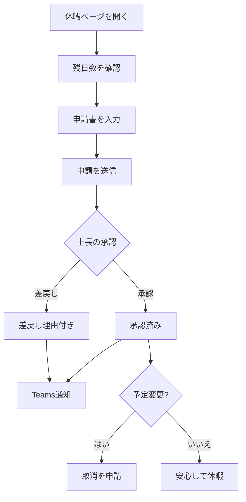
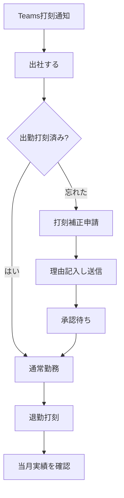
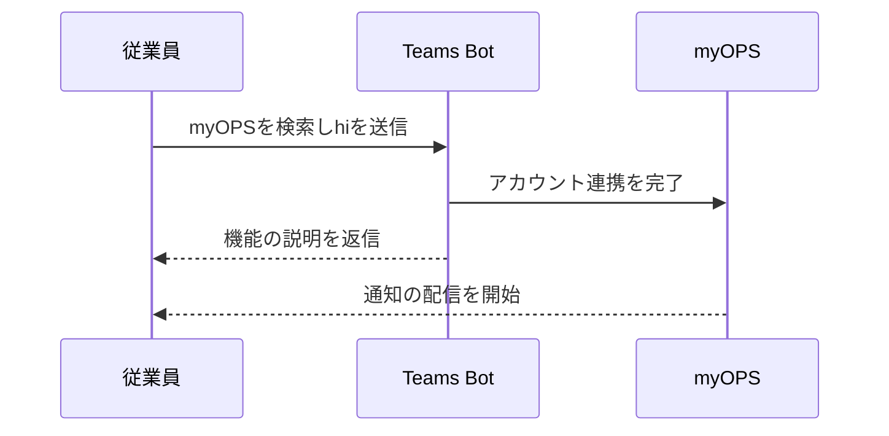

# myOPS — ユーザー向け利用ガイド

myOPS（CancerFree Biotech 業務管理システム）へようこそ！本ガイドは一般従業員の皆さま向けに、初回ログインから打刻・休暇申請・残業申請・給与確認まで、日常業務で使う機能をステップごとにご案内します。システムURL：**https://ops.cancerfree.io**

## クイックスタート

### 動作環境

- **パソコン**：最新版の Chrome、Edge、Safari、Firefox のいずれかのブラウザがあれば利用できます。ソフトのインストールは不要です。
- **スマートフォン / タブレット**：ブラウザで ops.cancerfree.io を開くだけで、画面が自動的にモバイル版に切り替わります（スマートフォンは画面下部のナビゲーションバー、タブレットは左上のメニューボタン）。
- **認証アプリ**：初回ログイン時に二要素認証（MFA）の設定が必要です。事前にスマートフォンへ **Google Authenticator** または **Microsoft Authenticator** をインストールしてください（App Store / Google Play で無料）。
- **会社アカウント**：ログインには会社支給の **@cancerfree.io** Microsoft アカウントのみ使用できます。個人メールアドレスは利用できません。
- ログインページ下部に「クイックスタートガイド」のリンクがあり、本章と同じ内容をいつでも確認できます。

### 初回ログイン（MFA 設定を含む）

1. ブラウザで **ops.cancerfree.io** にアクセスします。
2. 「**Microsoft アカウントでログイン**」ボタンをクリックします。
3. Microsoft のログインページで会社の Email とパスワードを入力します。会社の条件付きアクセスポリシーがある場合は、画面の指示に従って完了してください。
4. 初回ログイン時、システムから MFA の設定を求められます：
   - スマートフォンの認証アプリを開き、画面に表示される **QRコード** をスキャンします（スキャンできない場合は、画面に表示されるキーを手動入力できます）。
   - アプリに表示される **6桁の認証コード** を入力します。
   - 「認証して有効化」をクリックして設定完了です。
5. ダッシュボードが表示されればログイン成功です。さっそく使い始めましょう！

### 2回目以降のログイン

- 同じく「Microsoft アカウントでログイン」をクリックします。
- 続いて、認証アプリにその時点で表示されている 6桁のワンタイムコードを入力します（30秒ごとに更新されます）。
- 認証に成功するとシステムに入れます。
- スマートフォンを買い替えた場合や認証コードのエラーが続く場合は、「よくある質問 FAQ」の MFA リセットの説明をご覧ください。

## ダッシュボードとお知らせ

### ダッシュボード（ログイン後のトップページ）

- **本日のタスク**：未確認のお知らせなど、対応が必要な事項をまとめて表示します。承認権限をお持ちの方には、承認待ちの休暇申請や契約書の件数も表示され、「今すぐ対応」から直接移動できます。
- **本日の打刻**：今日の出勤・退勤の打刻状況を表示し、打刻漏れがないかひと目で確認できます。
- **最新のお知らせ**：直近のお知らせを一覧表示します。「すべてのお知らせを見る」からお知らせ一覧に移動できます。
- **クイックアクセス**：打刻、休暇申請、残業申請にダッシュボードからすぐにアクセスできます。

### お知らせの閲覧と確認

- 「お知らせ」ページではすべてのお知らせを閲覧でき、カテゴリで絞り込めます：**人事のお知らせ / 総務のお知らせ / 法令・規程 / 緊急通知**。
- 重要なお知らせは「**既読確認**」のクリックが必要です。一部のお知らせでは、確認時に MFA 認証コードの再入力（二重認証）を求められ、本人による確認であることを担保します。
- 未確認のお知らせはダッシュボードの本日のタスクに表示され続けますので、早めにご対応ください。
- お知らせは **AI 翻訳** に対応しており、中国語 / English / 日本語を切り替えられます。選択中の言語の訳文がまだない場合は原文が表示されます。
- お知らせの公開時、Teams 通知を連携済みの方には Teams メッセージでもお知らせが届きます（「個人設定と通知」をご覧ください）。

## 勤怠・休暇・残業

### 出退勤の打刻

- 「打刻」ページで「**出勤打刻**」または「**退勤打刻**」をクリックするだけです。1日それぞれ1回です。
- 打刻時にシステムが GPS 位置情報の取得を試みます。取得できない場合でも打刻は可能で、記録に座標が含まれないだけです。
- 「マイ記録」タブでは、当月の毎日の出退勤時刻と**勤務時間の集計**を確認でき、月の切り替えもできます。
- **打刻を忘れたら？**「**打刻補正申請**」をクリックし、補正する日付・種類（出勤 / 退勤）・時刻を選び、理由を記入して送信してください。承認されると記録が追加されます。
- Teams 通知を連携済みの方には、平日の朝と夕方に Bot から打刻リマインドのメッセージが届きます。

### 休暇申請

- 「休暇」ページには3つのタブがあります：**休暇残日数**、**休暇申請**、**マイ記録**。
- **残日数の確認**：「休暇残日数」では、各休暇種別（年次休暇、病気休暇、私用休暇、特別休暇など）の残日数と、その休暇が有給・半給・無給のいずれかを確認できます。
- **申請の送信**：休暇種別、開始日 / 終了日（日数は自動計算）、理由を入力します。**職務代理人**の指定や、添付ファイル（診断書など）のアップロードも可能です。
- **承認フロー**：送信後、上長が承認または差戻し（差戻し時は必ず理由が付きます）を行い、結果は Teams 通知でお知らせします。
- **休暇の取消**：承認済みの休暇でも、予定が変わった場合は記録から取消を申請できます。
- **チーム休暇カレンダー**：月カレンダーで自分とチームメンバーの休暇予定を確認でき、業務の引き継ぎ計画に便利です。

### 残業申請

- 「残業」ページは**マイ申請**と**残業を追加**のタブに分かれています。
- 申請時の入力項目：残業日、**残業種別**（平日 / 休日 / 祝日 / プロジェクト / 当直 / 緊急）、開始・終了時刻（時間数は自動計算）、残業理由。
- **関連プロジェクト**の選択（任意）も可能で、プロジェクト責任者が投入工数を把握しやすくなります。
- 承認フロー：送信 → 上長 → HR → 承認。差戻し時は理由が付きますので、修正して再申請できます。
- **承認された残業は給与に反映されます**。残業代は会社の割増率ルールに基づいて計算され、次の給与サイクルの給与明細で確認できます。

## 給与・プロジェクト・文書

### 給与の確認

- 「給与」ページの「**マイ給与明細**」に毎月の給与内訳が表示されます：**基本給、残業代、賞与、控除項目、支給合計、差引支給額**。
- 控除項目には**労工保険、健康保険、労退自己拠出**などの法定項目が含まれ、項目ごとに明細が表示されるため照合しやすくなっています。
- 給与明細の発行時には Teams 通知が届きます。ステータスが「支給済み」の記録のみが正式な給与明細です。
- 「**年間給与サマリー**」では年間の給与概要を確認でき、確定申告や個人の家計管理に便利です。
- 給与データは本人のみ閲覧でき、他の同僚があなたの給与を見ることはできません。

### プロジェクトへの参加

- 「プロジェクト」ページでは、自分が参加しているプロジェクトを閲覧し、プロジェクト名、責任者、ステータス（進行中 / 完了）を確認できます。
- 従業員は誰でも**プロジェクトを作成**して責任者を指定できます。メンバーの追加・管理はプロジェクト責任者が行います。
- プロジェクトページでは、そのプロジェクトに関連付けられた残業申請を確認でき、チームの投入状況を把握できます。
- 残業申請の際は、対応するプロジェクトへの関連付けをお忘れなく。工数集計が正確になります。

### 文書と確認サイン

- 「文書」ページには会社の各種文書が集約されています：お知らせ、規程、秘密保持契約（NDA）、覚書（MOU）、契約書、社内文書など。
- すべての従業員が**文書をアップロード**できます（PDF、Word、画像などの形式に対応）。アップロード後は承認フローに入り、権限を持つ上長 / HR の承認後に有効になります。
- フォルダ、種類、ステータスで絞り込んだり、名前で検索したりできます。文書を開くと添付ファイルを**ダウンロード**できます。
- 重要な文書（新しい規程など）は「**閲覧確認**」が求められます。確認のクリックをお願いします。未確認の場合はダッシュボードのタスクに表示されます。
- 文書は **AI 翻訳** に対応しており、ワンクリックで中国語 / 英語 / 日本語版を生成できるため、多国籍チームでもスムーズに読めます。

## 個人設定と通知

### 個人設定

- 「個人設定」では**表示名**を変更でき、自分のロールと所属を確認できます。
- **言語**：画面は繁体字中国語 / English / 日本語に対応しており、切り替えは即時反映されます。Teams 通知も選択した言語で届きます。
- **テーマ**：**ライト / ダークモード**を切り替えられます。お好みや周囲の明るさに合わせてお選びください。
- **MFA 管理**：ここで **MFA をリセット**できます。リセット後は、次回ログイン時に QRコードを再スキャンして認証アプリを設定し直します。

### ご意見・フィードバック（匿名）

- 「フィードバック」からフォームに進み、カテゴリを選択します：**職場環境 / 給与・福利厚生 / 管理制度 / その他**。
- 詳細を記入して送信してください。**送信は完全に匿名**で、内容を見られるのはシステム管理者のみです。安心して率直なご意見をお寄せください。

### Teams 通知

- myOPS は Microsoft Teams の「**myOPS**」Bot を通じて通知を送ります。内容は次のとおりです：
  - **毎日のタスクサマリー**（平日の朝）：未確認のお知らせと承認待ち事項をまとめてお届けします。
  - **打刻リマインド**（平日の始業前と終業時刻）。
  - **リアルタイム通知**：休暇申請の承認結果、給与明細の発行、新しいお知らせの公開。
- **重要：** Bot は一度もやり取りしたことのない相手に自分からメッセージを送れません。まず Teams で「**myOPS**」を検索し、**任意のメッセージ（例：「hi」）を送信**してください。Bot から返信が来れば連携完了で、以降は通知が届くようになります。
- 通知の言語は、個人設定で選択した言語に従います。

### スマートフォン・タブレットでの操作

- **スマートフォン**：画面下部に**ナビゲーションバー**（ホーム、打刻、休暇、文書）があり、「その他」をタップすると残業、お知らせ、給与、プロジェクト、フィードバック、設定などの機能が展開されます。
- **タブレット**：左上の**メニューボタン（ハンバーガーアイコン）**をタップすると完全なサイドバーがスライド表示され、項目の選択または画面の他の場所をタップすると閉じます。
- すべての機能がモバイル端末で利用でき、ボタンはタッチ操作向けに最適化されています。通勤中でもサッと打刻や休暇申請ができます。

## ワークフロー図

### 休暇申請と承認のフロー

### 打刻の日常フロー（補正の分岐を含む）

### Teams 通知の連携（初回設定）

## よくある質問 FAQ

- **Q：ログイン時に「このアカウントは許可されていません」と表示されます。**
  A：myOPS は **@cancerfree.io** の会社 Microsoft アカウントのみ受け付けます。誤って個人アカウントでログインしていないかご確認ください。会社アカウントでもログインできない場合は、システム管理者にご連絡ください。

- **Q：スマートフォンを買い替えて MFA の認証コードで入れません。どうすればいいですか？**
  A：まだログインできる場合は、「個人設定 → 二要素認証 (MFA)」で「MFA をリセット」をクリックし、次回ログイン時に QRコードを再スキャンしてください。すでにログインできない場合は、システム管理者にリセットを依頼してください。

- **Q：打刻を忘れました。どうすれば補正できますか？**
  A：「打刻」ページで「打刻補正申請」をクリックし、日付・種類（出勤 / 退勤）・時刻と理由を記入して送信してください。承認されると記録が追加されます。

- **Q：Teams 通知が届きません。**
  A：最も多い原因は、まだ Bot とやり取りしていないことです。Teams で「myOPS」を検索してメッセージ（例：「hi」）を1件送信し、Bot から返信が来れば連携完了です。

- **Q：休暇申請が差し戻されました。どうすればいいですか？**
  A：差戻し時には上長が必ず理由を記入し、休暇記録への表示と Teams 通知でお知らせします。理由に応じて日付の調整や説明の補足を行い、再度申請を送信してください。

- **Q：給与明細はいつ見られますか？**
  A：給与の社内確認と「支給」が完了すると Teams 通知が届き、「給与 → マイ給与明細」で当月の明細を確認できます。

- **Q：画面を英語や中国語に変更できますか？**
  A：できます。「個人設定 → 言語」で English または中国語を選択すると画面が即時に切り替わり、以降の Teams 通知もその言語で届きます。

- **Q：フィードバックは本当に匿名ですか？**
  A：はい。送信後に提出者の身元が表示されることはなく、内容そのものを見られるのはシステム管理者のみです。

## バージョン情報

- **本ガイドの対象バージョン**：myOPS v0.3.1
- **ドキュメント更新日**：2026-06-11
- **本バージョンのポイント（従業員向け）**：
  - Teams 通知が正式リリース：毎日のタスクサマリー、出退勤の打刻リマインド、休暇承認結果、給与明細の発行、お知らせの公開を Teams に配信し、個人の言語設定に合わせてお届けします。
  - タブレットにスライド式サイドバーメニューを追加し、モバイル端末のタッチ操作を改善（ボタンの拡大、テーブルの横スクロール対応）。
  - 画面の3言語対応（繁体字中国語 / 英語 / 日本語）をエラーメッセージを含めて完備。
- システムURL：https://ops.cancerfree.io ｜ システム内のヘルプはサイドバーの「ドキュメント」ページをご覧ください。
