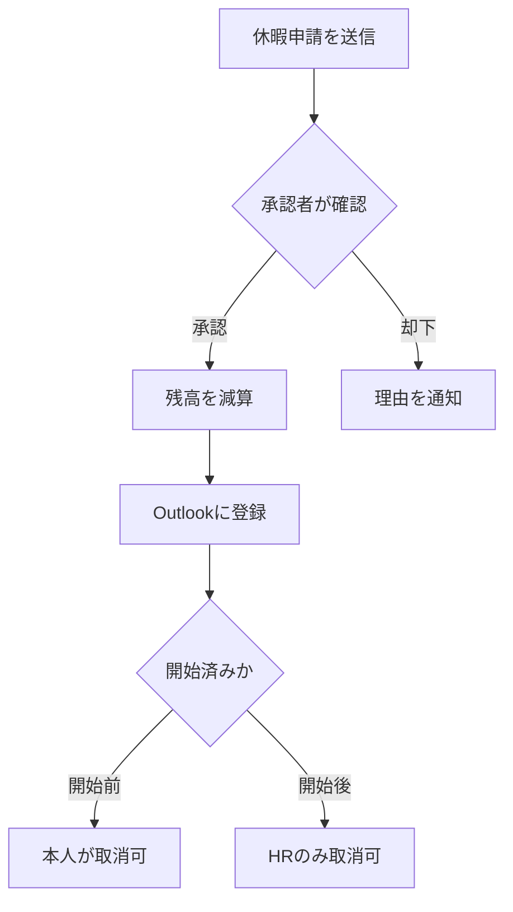
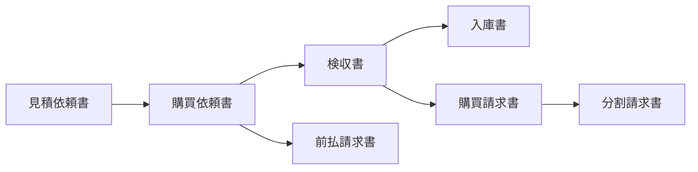

# myOPS — 一般ユーザー利用ガイド

myOPS（CancerFree Biotech 業務管理システム）へようこそ。本ガイドは、日常業務でmyOPSを利用するすべての一般ユーザー（出勤・休暇・残業・出張の申請、給与確認はもちろん、購買・在庫、文書・契約、プロジェクト・日報、資産管理、経費精算などの担当業務をお持ちの方を含みます）を対象に、各機能の使い方をわかりやすくご案内します。システムURL：**https://ops.cancerfree.io**

本書は特定の業務権限（購買担当、人事担当、会計担当など）をお持ちの方が行う業務操作も含みますが、システム全体の設定やユーザー管理、機能のオン・オフ切り替えといった管理者（admin）専用の操作は対象としていません。それらは管理者向けガイドをご参照ください。

## クイックスタート

### システム要件

- **パソコン**：最新版のChrome、Edge、Safariなど主要ブラウザで利用できます。専用ソフトのインストールは不要です。
- **スマートフォン・タブレット**：ブラウザで ops.cancerfree.io を開くとレスポンシブ表示に切り替わり、外出先でも打刻や申請ができます。
- **位置情報**：管理者が出勤の「打刻許可エリア（ジオフェンス）」機能を有効にしている場合、打刻時にブラウザの位置情報アクセスを許可する必要があります。
- **カメラ・バーコードスキャナー**：購買業務で在庫のバーコード照会や入出庫登録を行う場合、スマートフォンのカメラまたは専用スキャナーが利用できると効率的です（必須ではありません）。
- **Microsoftアカウント連携**：休暇や出張の承認結果をOutlookの予定表に自動反映させたい場合は、事前にMicrosoftアカウントでログインし、カレンダーへのアクセスを一度許可しておく必要があります。

### 初回ログインと初期設定

- ログイン後は「個人設定」（/settings）で表示名、インターフェース言語（繁体字中国語／English／日本語）、ライト・ダークテーマを自分の好みに合わせて設定できます。言語を切り替えると、Web画面だけでなくTeamsボットの返信もその言語で表示されます。
- 承認や無効化（作廢）など重要な操作の多くは二段階認証（MFA／AAL2）が必須です。「個人設定」から認証アプリ（TOTP対応のAuthenticatorアプリ）でQRコードを読み取り、事前に設定しておくとスムーズです。MFAは自分でいつでもリセットできますが、リセット後は次回ログイン時に再設定が必要になります。
- Microsoft Teamsでは「Dr.Ave」というボットが各種通知（承認依頼、承認結果、リマインドなど）を代行して送信します。myOPSからの通知を受け取るには、事前にTeamsでDr.Aveとの会話を一度開いておく必要があります（一度も会話したことがない相手には送信できない仕様のためです）。
- 各機能は会社が「機能フラグ」で有効化しているものだけが画面に表示されます。メニューに見えたい機能がない場合は、管理者に有効化を依頼してください。

## 勤怠・休暇・出張・給与と承認センター

出退勤の打刻から、休暇・残業・出張の申請、会社カレンダーでの共有、給与の確認、そしてこれらの承認をまとめて処理する承認センターとTeams連携までをまとめてご紹介します。

### 出勤（打刻）

毎日の出退勤打刻と自分の出勤履歴の確認を行うページです。以前独立していた「打刻記録管理」（/admin/attendance）はv0.9.7で本ページに統合され、旧URLへアクセスすると自動的に本ページに転送されます。

- 「出勤打刻」「退勤打刻」ボタンで打刻します。管理者が打刻許可エリア（ジオフェンス）を有効にしている場合は、位置情報がそのエリア内にあると確認できたときのみ打刻が成立します。
- 本日の出退勤時刻と、システムが自動で補完した記録かどうかをその場で確認できます。
- 「私の記録」タブでは年・月を指定して過去の打刻履歴と勤務時間を検索できます。
- 打刻を忘れた場合は「打刻修正申請」で日付・区分（出勤／退勤）・時刻・理由を入力して申請します。承認者（通常は直属の上長）またはadminの承認を経て、正式な出勤記録として反映されます。
- HR担当者や管理者は「全社員記録」タブで全社の打刻を横断的に確認・絞り込み、必要に応じて記録を無効化・無効化取消できます。

### 休暇申請

休暇の申請、各休暇種別の残日数確認、そして特別休暇（結婚・弔事・産前産後・育児休業など）の資格審査申請までを行うページです。

- 「休暇残日数」タブで各休暇種別の当期残日数（使用済み／残り日数）を確認できます。年次有給休暇は入社日基準、その他の休暇は暦年基準で計算されます。
- 「休暇申請」タブから、休暇種別・開始／終了日（単日の場合は午前／午後半休も選択可）・理由・代理担当者（任意）を入力して申請します。日数と残高は自動計算・自動チェックされます。
- 「私の記録」タブで自分の過去の申請履歴とステータスを確認できます。承認待ちの申請はいつでも取消可能です。
- 承認済みでまだ開始していない休暇は本人が自分で取消できます（消化した日数が戻り、Outlookに登録済みの予定も削除されます）。すでに開始した休暇は本人による取消ができず、HRまたは管理者への依頼が必要です。
- 資格審査が必要な特別休暇（結婚休暇、弔事休暇、産前休暇、産前検診休暇、配偶者出産検診休暇、配偶者出産休暇、妊娠安定休暇、育児休業など）は、まず「特別休暇申請」タブで種別・理由・証明書類（複数可）を提出し、HRが付与日数を確定した後に正式な休暇申請ができるようになります。

承認は直属の上長、admin、またはHR権限（`hr_manager`）保持者が行い、承認後は本人のOutlook予定表に休暇予定が自動登録されます（退回・取消時は自動削除）。承認・退回・HRによる代理取消の結果はTeamsで通知されます。会社カレンダー（/calendar）にも「休暇中」として表示されますが、休暇種別は表示されません。

### 休暇カレンダー

部署または全社の休暇状況を月カレンダーで確認し、上長のシフト調整に活用できるページです。

- 月カレンダーで各日の休暇人数を確認できます（承認済みは緑、承認待ちは黄色の印）。
- 日付をクリックすると、その日に休暇を取っている人の氏名・休暇種別・期間・日数・ステータスの一覧が表示されます。
- 「自分の部署のみ表示」にチェックを入れると絞り込めます。
- 前後の月に切り替えて過去・未来の休暇状況を確認できます。

一般社員には同じ部署の休暇のみ表示されますが、HR権限保持者やadminは全社の休暇を部署別に切り替えて確認できます。本ページは閲覧専用です。

### 残業申請

残業の申請と自分の残業履歴の確認を行うページです（労働基準法の日別区分に基づく加給算定の根拠になります）。

- 「新規申請」から、残業日・開始／終了時刻・日別区分（平日／休日／祝日。日付を選ぶと土日は自動的に休日と判定されます）・関連プロジェクト（任意）・理由を入力します。残業時間は自動計算され、日をまたぐ場合は自動的に翌日+1日分として扱われます。
- 「私の申請」タブで自分の過去の残業申請とステータスを確認できます。送信後はまず「承認待ち」の状態になります。
- 承認画面には人事担当者向けの「承認待ち」タブも表示されますが、実際に承認・却下できるのは直属の上長、関連プロジェクトの責任者、admin、または`coo_notify`権限保持者のみです。
- 承認済みの残業は、労働基準法の日別加給率（平日1.34／1.67倍、休日1.34／1.67／2.67倍、祝日2倍）に基づいて次回の給与計算に自動反映されます。
- 全社の残業記録はHR権限保持者・adminが「全社員記録」で確認できます。

### 出張管理

出張の申請から承認、そして承認後の報帳（経費精算）作成までをまとめて行うページです。

- 「新規申請」から目的地・理由・開始／終了日・詳細な行程（任意）を入力します。送信すると、その時点の直属の上長が審査担当者として自動指定されます。
- 「私の出張」タブで過去の申請とステータスを確認できます。
- 承認待ちの申請はいつでも取消できます。
- 承認済みの出張は「報帳を作成」ボタンから直接、報帳（経費精算）モジュールに情報を引き継いで申請を作成できます。

承認は指定された上長、admin、またはHR権限保持者が行い、承認されると本人のOutlook予定表に終日の予定が自動登録されます（退回時は自動削除）。会社カレンダーには目的地とともに表示されます（機密情報ではないため）。全社の出張記録はHR権限保持者・adminが確認できます。

### 会社カレンダー

会社全体の行事、承認済みの休暇（「休暇中」とのみ表示、種別は非表示）、承認済みの出張を月カレンダーで一覧できるページです。

- 月カレンダーで会社行事（緑）、同僚の休暇中（青、種別非表示）、同僚の出張（紫）を確認できます。
- 日付をクリックすると、その日の行事・休暇・出張の詳細一覧（行事の説明を含む）を確認できます。
- 会社行事には「参加／不参加／未定」でRSVP回答ができ、現在の回答状況や回答者名も展開して確認できます。

会社行事の新規作成・編集・削除はadminまたはHR権限保持者が行います。行事の追加・編集・削除は、Outlook連携済みの全社員のカレンダーにベストエフォートで同期されます（同期に失敗しても行事自体には影響しません）。RSVP回答は全社員が自由に行えます。

### 給与

給与のメインページです。権限によって表示内容が異なり、一般社員は「私の給与単」タブのみ表示され、直近12か月分のうち「人事長承認済み」または「支給済み」状態の給与単のみ一覧されます。

- 「私の給与単」で自分の直近12か月分の給与単（承認済み・支給済みのみ）の概要（基本給、残業代、控除項目、実支給額）を確認できます。
- 給与単をクリックすると「給与明細」ページで完全な内訳が確認できます。
- HR・会計担当者や閲覧権限保持者には、当月の全社員給与を一覧できる「給与表」タブが追加され、一括計算・単票の手動作成・複数給与単の一括承認も行えます。
- 給与は4段階の承認フローで進みます：一括計算による草稿作成 → HR審査（`draft`→`hr_reviewed`）→ 会計担当者による確認（`confirm_payroll`権限またはadmin）→ 人事長承認（`approve_payroll`権限、`hr_manager`権限、またはadmin）→ 支給確定（adminのみ）。いずれの段階もMFAが必要です。
- 権限保持者は全社員分の給与表をxlsx形式でエクスポートできます（adminまたは`hr_manager`／`finance_payroll`権限保持者）。

承認・支給が完了した給与単のみ、本人が「私の給与単」で確認できるようになります。給与発行時のTeams通知は別のAPIエンドポイント経由で送信される仕様ですが、現時点でこれを自動的に呼び出す定期実行は設定されていない点にご留意ください。

### 給与明細

給与表または「私の給与単」から給与単をクリックすると開く、単一月分の給与の完全な内訳ページです。

- 応支給項目（本給、残業代、賞与、その他加算）、控除項目（無給休暇による差引、労働保険料、健康保険料、退職金自己拠出、その他控除）、実支給額を確認できます。
- 雇用主が負担する労働保険料・健康保険料・退職金6%相当額も、自分が実際に受け取る金額とは別に確認できます。
- 「給与異常チェック」で検出された異常（残業の過多、金額の急変、無給休暇の差引が大きすぎる等）の警告があれば表示されます。
- 承認履歴（誰がいつ審査・確認・承認・支給・却下したか）を確認できます。
- 「年間給与サマリー」へのリンクからその年度の全体像に移動できます。

閲覧できるのは本人（承認済み・支給済みのみ）、またはHR・admin・`view_payroll`権限保持者（状態を問わず）です。URLを直接入力しても未完成の給与単は表示されません。本ページに承認ボタンはなく、承認操作は給与表のメインページで行います。

### 年間給与サマリー

1年分（1〜12月）の給与を横に並べて確認できるページです。総収入・総控除・実支給合計の3枚のカードと、月別の内訳表・年間合計行が表示されます。

- 年度を選択（当年の前後2年まで）して自分の1〜12月の給与内訳を確認できます。
- 総収入・総控除・実支給合計の3枚のサマリーカードを確認できます。
- 月別の内訳表と、その下の年間合計行を確認できます。
- まだHRが作成していない月は「―」と表示されます。これはエラーではなく、単にその月の給与データがまだ存在しないことを示しています。
- admin、HR権限保持者、または`view_payroll`権限保持者は、対象社員を自分以外に切り替えて閲覧できます。

### 承認センター

自分が承認すべき事項を一つの受信箱にまとめて表示するページです。休暇、残業、打刻修正、出張、報帳、文書・契約、給与、購買の8種類をカバーしており、各モジュールの一覧ページを個別に巡回する必要がありません。

- 現在、承認待ちのすべての件数がページ上部に表示されます（0件のときは「すべて完了しました」の案内が表示されます）。
- 休暇・残業・打刻修正・出張・文書契約・購買の各申請に対して、その場で「承認」または「却下」を選択できます。却下を選ぶと、必ず理由の入力を求められます。
- 報帳（経費精算）は状態が「承認待ち」の間は承認／却下、「承認済み」になると同じ場所のボタンが「支払済みにする」に変わります。
- 給与の承認ボタンを押すと、その給与単が現在どの段階にあるか（HR審査／会計確認／人事長承認／支給確定）をシステムが自動判定し、対応する処理を実行します。給与ページで自分の順番を確認する必要はありません。
- 各項目の外部リンクアイコンから、該当する申請の詳細ページに直接移動して内容を確認できます。
- 「再読み込み」ボタンで最新の一覧を手動更新できます。MFA未完了が原因で承認・却下に失敗した場合は、その旨が明示されます。

表示される件数・分類は自分の役割や権限によって異なり、承認権限を持たない人にはその分類自体が表示されないか、件数がゼロになります。

### Teamsでのワンタップ承認と通知カード

購買関連の文書（見積依頼書、購買依頼書、検収書、入庫書、出庫書、前払請求書、購買請求書、分割請求書、取引先・商品評価）が送信または次の承認段階に進むたびに、Microsoft Teams上のボット「Dr.Ave」経由で承認依頼カードが届きます。

- 承認権限を持つ方は、Webページを開かなくてもTeams上でカードを受け取れます。
- 会社の「Teamsワンタップ承認ポリシー」で該当する文書種別・金額がワンタップ承認の対象になっている場合、カードには「承認」「却下」ボタンが表示され、Teams上でタップするだけで承認が完了します（MFAは不要です）。
- ワンタップ承認の対象外の場合は「承認画面を開く」ボタンのみが表示され、タップするとops.cancerfree.ioの該当ページが開き、通常通りMFAを完了させてWeb上で承認します。
- 承認・却下の結果は、Teams上での返信メッセージで通知されます（ポリシーが変更されて一鍵承認できなくなった場合は、Web上での承認を案内するメッセージが表示されます）。
- Teamsでボット「Dr.Ave」をブロックしている場合、承認権限があってもカード自体が届きません（システムの不具合ではなく、Teams側の設定によるものです）。

v1.0.5では、Dr.Ave経由で転送されるメッセージ形式との不整合により、Teamsのボタンを押しても承認処理が失敗する不具合を修正しました。ワンタップ承認ポリシーの設定自体はadminのみが行えます。

### Teamsでのテキストコマンド照会

ボタンを押す代わりに、Teams上でDr.Aveに直接文字を送って照会できる機能です。以下のキーワードは日本語表記では認識されないため、示されている中国語または英語の表記どおりに入力する必要があります。

- 「待簽」または「pending」と入力すると、現在自分の承認待ちになっている購買文書の件数が返信されます。
- 「請假」「休假」「特休」または「leave」と入力すると、今年度の各休暇種別の残日数が返信されます。
- 「薪資」「薪水」または「payroll」と入力すると、当月の給与単が現在どの承認段階にあるかが返信されます。
- 上記のいずれにも当たらない質問（会社の規定に関する質問など）は、AIポリシーQ&A機能が有効な場合、その回答ロジックにそのまま引き継がれて自動回答されます（無効な場合は「コマンドを理解できません」という返信になります）。
- 返信は自分が個人設定で選んでいる言語（中国語／英語／日本語）で自動的にローカライズされます。

myOPSに有効なアカウントを持つ全ユーザーが利用できますが、回答内容は常に問い合わせた本人自身のデータ（自分の承認待ち件数、自分の休暇残高、自分の給与単の状況）に限定されます。

## 購買・在庫管理

見積から発注、検収、入出庫、請求・支払まで、購買業務全体を担当する方向けの機能群です。以下の各ページは、購買担当権限（`procurement_unit`または`procurement_manage`）をお持ちの方、およびadminが利用できます。

### 見積依頼書（RFQ）

購買したい品目をリストアップし、見積担当者を指定するところから始まる文書です。見積担当者が品目ごとに複数社の見積を登録して「採用」をマークし、部門長の承認を経ると、購買依頼書（PR）へワンクリックで転記できます。

- 表頭情報（依頼日、依頼部門、依頼者、見積担当者、緊急度、希望納期など）を入力して草稿を作成します。
- 「本見積依頼書に紐づく品目」の表で、品目名・品目コード・仕様・単位・必要数量・用途・推奨取引先（取引先マスタから選択）を行単位で追加・削除できます。
- 品目ごとに複数の取引先の見積（取引先・単価・見積日・備考）を登録し、最終的に採用する1件だけ「採用」にチェックします（同一品目で採用は1件のみ、データベース側で保証されます）。
- 取引先から受け取った見積書のファイルを複数枚アップロードできます（システムの購買用ストレージに保存され、直接ダウンロード可能）。
- 送信後（審査中の間）は指定された見積担当者本人のみが表頭・品目・見積・添付を編集でき、依頼者を含む他の人には読み取り専用の画面が表示されます。
- 承認履歴タイムラインで現在どの段階か、誰が承認したか、コメント内容を確認できます。
- 承認後は「購買依頼書へ転記」ボタンで、すべての品目と採用単価を引き継いだ購買依頼書の草稿を自動作成できます（採用した取引先が全品目で同一の場合は取引先情報も自動で引き継がれます）。
- 承認済み・却下済みの文書は「無効化して複製」で、無効化の理由を記入した上で同内容の新しい草稿を作成できます。

承認は見積担当者本人（自分の段階）→部門長（`procurement_payment_approve`権限保持者による代理承認も可能）の順に行われ、いずれもMFAが必須です。

### 購買依頼書（PR）

取引先への実際の発注内容・金額・支払条件を記録する文書です。「部門長→COO→CEO（合計金額のしきい値により必要な場合のみ）→購買部門への通知」という承認チェーンをたどり、承認後は検収書または前払請求書へ転記できます。

- 空の草稿を作成すると、そのまま明細編集画面に進みます。
- 表頭（日付、依頼部門、緊急度）を入力し、取引先を選ぶと統一番号・連絡先・電話・FAX・Email・請求書送付先・支払方法・支払条件・貿易条件が自動的に反映されます。
- 品目は商品マスタから選択（品目コード・名称・仕様・単位が自動入力）するか、空欄行を手動で追加します。単価と数量を入力すると金額が自動計算されます。
- 小計・税額・合計は自動計算されます（小計＝金額の合計、税額＝小計×税率、合計＝小計＋税額＋運賃）。税額は手動上書きに切り替えることも、自動計算に戻すこともできます。
- 草稿の段階から、現在の合計金額でCOO・CEOの承認が必要になるかどうかを事前にプレビューできます。
- 送信（システムが自動的に一度保存してから送信します）後は、承認履歴タイムラインで進行状況を確認し、自分の段階が来たら承認・却下（MFA必須）します。
- 承認後は「検収書へ転記」または「前払請求書へ転記」ボタンで次の文書を作成できます。
- 承認済み・却下済みの文書は「無効化のみ」または「無効化して複製」（理由の記入が必要）ができます。
- 現在までの検収済み数量・未検収の残数量、関連する検収書・前払請求書の件数を確認できます。

承認は部門長（`procurement_payment_approve`権限保持者による代理可）→COO（合計3,000元を超える場合のみこの段階が発生）→CEO（合計20,000元を超える場合のみ）→購買部門の通知確認（`procurement_unit`保持者のいずれか1名、この段階は必ず発生）の順で進み、いずれもMFAが必要です。

### 検収書（GR）

取引先から届いた品物の検収結果・金額・請求書情報を記録する文書です。前払い済みの金額も記録でき、「最終更新者→購買部門の誰か1名」の2段階確認を経て、入庫書・請求書への転記や、資産管理権限保持者による資産への直接転記ができます。

- 検収書を新規作成する際、元となる購買依頼書番号を指定できます（指定すると該当品目が参照用に表示されます。指定しない場合は品目欄は空です）。
- ソース情報（依頼部門、到着日時、検収日時、入庫確認日時）、取引先情報、金額（小計・税率・税額・運賃・合計。小計を入力すると税額・合計が自動連動し、必要なら税額を手動上書き可能）、請求書情報（請求書番号・日付）を入力します。
- 請求書と出荷書類のファイルをアップロードして直接オンラインで確認できます（旧システムからファイル名だけ移行された添付は「添付は旧システムに残っています」という案内が表示され、無効なリンクにはなりません）。
- 「前払済み」にチェックを入れ、前払請求書番号と前払済み金額を記録できます（前払請求書から本検収書に転記して戻した場合は自動で反映されます）。
- 元の購買依頼書の品目明細（単価・数量・金額・検収済み量・残数量）を読み取り専用で確認できます。
- 送信すると、まず最終更新者が確認し、続いて購買部門の誰か1名が確認します。
- 承認後は「入庫書へ転記」または「請求書へ転記」ができます。
- 承認済み・却下済みの文書は「無効化して複製」ができます（理由の記入、新しい草稿を同時に作成するかどうかの選択が可能。ただし未無効化の下流の入庫書・請求書が既に存在する場合はブロックされ、該当の文書番号が案内されます）。

資産への転記には別途`asset_manage`権限が必要です。

### 取引先マスタ

購買取引先の基本・連絡・帳務・銀行情報など、合計37項目のデータを管理します。見積依頼書や購買依頼書で取引先を選ぶと、連絡先・支払情報が自動的に反映されます。

- 取引先コード・名称・略称・分類・担当者・電話などのキーワードで検索・並び替え・ページ送りができます。
- 行や名称をクリックすると詳細ダイアログが開き、「基本／連絡先／帳務／銀行」の4区分で37項目すべて（担当者の署名・預金通帳の写し・印鑑の添付ファイルへのリンクを含む）を確認できます。
- 購買依頼書などの文書で取引先を選ぶ際、統一番号・連絡先・電話・FAX・Email・請求書送付先・支払方法・支払条件・貿易条件が自動で反映されます。

新規登録・編集は`procurement_manage`権限保持者またはadminのみです。ただし、`procurement_unit`権限保持者が「取引先・商品審査評価」でCOOの承認を得た場合も、承認後に本マスタへ自動登録される間接的な経路があります。

### 商品マスタ

購買する商品の基本情報と、「購買単位×換算率＝在庫単位」の単位換算設定を管理し、各取引先からの過去の見積を比較参照できます。

- 商品コード・名称・仕様・分類・ブランド・品番などのキーワードで検索でき、一覧表には単位換算と現在の在庫量が直接表示されます。
- 行をクリックすると詳細ダイアログで仕様・分類・品目・ブランド・出所・品番・既定部門・現在庫量・単位換算式を確認できます。
- 詳細ダイアログ内の「取引先見積」表では、各取引先がこの商品にこれまで提示した見積（単価・単位・見積日・出典となった見積依頼書番号）を比較参照できます。
- 商品名をクリックすると「商品出入庫元帳」ページに移動し、その商品の在庫変動履歴を確認できます。

新規登録・編集・削除は`procurement_manage`権限保持者またはadminのみです。

### 商品出入庫分類帳

1つの商品について、現在庫のあるロット、年度別の入出庫総量、そして1件ごとの変動明細を確認できるページです。データは入庫書・出庫書の記帳処理から自動的に生成され、本ページ自体は閲覧専用です。

- 商品マスタから商品名をクリックして入ると、商品情報カード（仕様・ブランド・分類・品番・単位換算）と現在の在庫総量を確認できます。
- 「現在庫ロット」カード群では、ロット番号・保管場所・倉庫・有効期限を確認できます。有効期限が90日以内、または期限切れの場合は色付きで警告表示されます。
- 年度を選択すると、その年度の入庫量・出庫量・期末残高の小計を確認できます。
- 1件ごとの変動明細（日時、種別：入庫／出庫／調整／無効化、変動数量、残高）を展開して確認できます。種別は色とアイコンで区別されます。
- 明細行の文書番号をクリックすると、対応する入庫書・出庫書の詳細ページに移動できます。

### 取引先・商品審査評価

新しい取引先の情報を登録するための審査、または比価の出典を記録するための審査を承認フローで行う画面です（1つのページ内で「取引先評価」「商品評価」の2つのタブを切り替えます）。取引先評価が承認されると、その内容は自動的に取引先マスタへ登録され、取引先コードが発行されます。

- タブを切り替えて「取引先評価」「商品評価」それぞれの一覧を検索・並び替え・ページ送りできます。
- 取引先評価：登録したい取引先の22項目（基本／連絡先／帳務／地址／支払／銀行／その他の区分。取引先マスタの項目と一致）と備考を入力して草稿を作成します。
- 商品評価：出典となる見積依頼書番号（入力すると対応する見積依頼書が検索されます）と備考を入力して草稿を作成します。
- 詳細ダイアログで入力済みの内容と承認履歴タイムラインを確認できます。草稿の間は編集や送信ができます。
- 送信後、承認履歴タイムラインで自分の段階が来たら承認・却下（MFA必須）できます。

取引先評価は必ずCOOが承認し、商品評価は送信者の直属の上長が承認します（上長がいない場合や本人が上長を兼ねる場合は、退回されて登録者自身が確認します）。

### 入庫書

品物を実際に倉庫へ収納し、ロットの在庫と分類帳に記帳するための文書です（在庫作業ページの「入庫書」タブ）。手動での作成に加え、バーコード（品番／在庫コード／ロット番号）をスキャンして品目と数量を自動的に読み込むこともできます。検収書から「入庫書へ転記」した草稿として始めることも、単独で新規作成することもできます。

- 草稿を新規作成：表頭（元となる検収書番号は任意、文書日付、備考）と品目（商品、倉庫、ロット番号は任意、有効期限は任意、数量＝在庫単位）を入力します。
- スキャナーやスマートフォンのカメラで品番・在庫コード・ロット番号を読み取ると、既存ロットへの加算か新規ロットの登録かを自動判定して品目に追加できます。
- 自分が作成した草稿は、送信・記帳される前であれば編集・削除できます。
- 送信（`draft`→`in_approval`）：入庫書は承認段階が1つだけで、作成者本人が確認すれば承認となります（MFAは必要です）。
- 承認後、まだ記帳されていない状態で「入庫」を実行すると、倉庫在庫（既存ロットへの加算、または新規ロットの作成）と分類帳への記帳が行われ、元となる購買依頼書の「検収済み／未検収」の進捗も自動的に更新されます。
- 記帳済みの入庫を取り消したい場合は「記帳の取消（入庫の取消）」を実行できます。数量が戻され、無効化の記録が分類帳に残ります。すでに後続の出庫で使用済みのロットは取消がブロックされます。
- 承認履歴タイムラインと記帳・取消のタイムスタンプを確認できます。

他人の草稿の編集・削除、記帳後の取消は`procurement_manage`権限保持者またはadminのみ行えます（`procurement_unit`権限保持者は自分が作成した草稿のみ操作可能）。承認段階は作成者本人による自己確認（自分が自分の承認者になる特殊なパターン）であり、他の人による審査ではありませんが、それでもMFAは必須です。

### 出庫書

倉庫の在庫を実際に取り出す（使用、消耗、廃棄など）ための文書です（在庫作業ページの「出庫書」タブ）。入庫書と同じ画面構成とバーコードスキャン機能を使いますが、選ぶ対象が「商品」ではなく既存の「在庫ロット」である点が異なります。

- 草稿を新規作成：表頭（出荷書番号は任意、文書日付、備考）と品目（既存の在庫ロットを選択、出庫数量）を入力します。
- 品番・在庫コード・ロット番号をスキャンすると対応するロットを自動的に見つけ、現存量のあるロットを優先して数量を加算できます。
- 自分が作成した草稿は編集・削除できます。
- 送信（承認段階は1つ、作成者本人が確認）。
- 承認後「出庫」を実行すると、対象ロットの倉庫在庫が減算され、分類帳に記帳されます。在庫が不足している場合はシステムがブロックします。
- 記帳を取り消す場合は「記帳の取消」で減算分を在庫に戻せます。
- 明細では、減算前の「倉庫在庫量」と減算後の「残量」、承認履歴タイムラインを確認できます。

権限体系は入庫書と同じです。他人の草稿の編集・削除、代理での記帳取消は`procurement_manage`権限保持者またはadminのみです。

### 在庫照会・バーコード照会

在庫作業ページの「在庫照会」タブです。スマートフォン優先のデザインで、バーコードスキャナーやスマートフォンのカメラで品番・在庫コード・ロット番号を読み取り、その商品の現在庫ロット・数量・倉庫・有効期限を素早く確認できます。棚卸しや荷物の特定、在庫の突合に便利です。

- 手入力またはスキャンで品番／在庫コード／ロット番号を照会：システムが商品の品番→在庫コード→ロット番号の順に照合し、該当商品の現存するすべてのロットを一覧表示します。
- 照会結果には商品の基本情報（コード・名称・仕様・現在庫総量）と、ロットごとの明細（在庫コード、ロット番号、有効期限、所在倉庫、数量）が表示されます。
- 下部の「在庫一覧」では全ロットの在庫を、在庫コード・商品コード・商品名・仕様・ロット番号・有効期限・倉庫など任意の項目でキーワード検索・並び替え・ページ送りできます。

本ページには書き込み操作はなく、閲覧・照会専用です。入庫書・出庫書と同じ権限（`procurement_unit`／`procurement_manage`／admin）で1回のログインのまま3つのタブを切り替えて利用できます。

### 前払請求書

取引先へ前払金（頭金）を支払うための請求書を管理します（請求ページの「前払」タブ）。通常は購買依頼書から「前払請求」で転記して草稿を作成し、銀行の振込情報は取引先マスタから自動的に反映されます。送信後は会計担当者が承認し、処理が完了すると対応する検収書に「前払済み」と自動表示されます。

- 前払請求書の一覧を取引先・番号・金額・状態で検索・並び替えできます。
- 元となる購買依頼書から転記して草稿を作成、または直接手動で新規作成します。
- 草稿を編集：前払金額、合計金額、振込期限（送信するには必須）、実際の振込日、振込月、決済日、そして銀行の振込情報（銀行・支店・SWIFT・口座番号・口座名義。取引先マスタから自動入力されますが上書き可能）。
- 送信（`draft`→`in_approval`、会計担当者の承認段階のみ）。
- 承認履歴タイムラインと現在の状態を確認できます。

承認は`job_role`が「会計(finance)」の方、またはadminが行い、MFAが必要です。作成者本人は自分が送信した請求書を承認できません（職務分離のルールが働きます）。

### 購買請求書

取引先への正式な請求書（貨款の支払い）を管理します（請求ページの「購買」タブ）。通常は承認済みの検収書から「請求」で転記して作成します。1つの購買依頼書に対して有効な購買請求書は1枚のみで、分割払いが必要な場合は同一の請求書上で「分割請求の作成」を行います（新たに2枚目の購買請求書を作らないよう、システムが重複を防止します）。

- 購買請求書の一覧を確認できます。
- 承認済みの検収書から転記して草稿を作成します（取引先、統一番号、金額、元の検収書・購買依頼書番号が自動反映されます）。
- 草稿を編集：請求月、購買請求総額、金額調整とその備考、合計金額、分割払いの有無、支払方法・条件、決済日、振込期限、銀行情報。
- 送信（会計担当者の承認段階のみ）。
- 「分割払い」がありの場合、すでに作成済みの各期の分割請求書一覧と、未無効化分の合計額を確認できます。
- 承認後、分割払いがありの場合は「分割請求の作成」から次の期の分割請求書の草稿を作成できます（期数は自動で採番されます）。

承認は`job_role`が「会計」の方、またはadminが行い、MFAが必要です。作成者本人は自分の請求書を承認できません。

### 分割請求書

購買請求書を複数回に分けて支払う場合、各回ごとに作成する請求書です（請求ページの「分割」タブ）。期数はシステムが自動採番（該当する購買請求書の下で無効化されていない件数＋1）し、購買請求書の詳細ページの「分割請求の作成」ボタンからのみ作成できます（単独で新規作成することはできません）。各期ごとに請求書ファイルをアップロードできます。

- 分割請求書の一覧を、所属する購買請求書・期数・金額・状態で確認できます。
- 対応する購買請求書の詳細ページで「分割請求の作成」をクリックすると次の期の草稿が開かれます（期数は自動入力され、手動で変更できません）。
- 草稿を編集：請求月、金額、請求書番号、請求書日付。請求書ファイル（画像またはPDF）をアップロードできます。
- アップロード済みの請求書ファイルは、有効期限付きの署名済みリンクで確認・ダウンロードできます。
- 送信（会計担当者の承認段階のみ）。

承認は`job_role`が「会計」の方、またはadminが行い、MFAが必要です。

### 文書変換チェーン（転記）

「転記」は独立したページではなく、元になる文書の詳細ページに配置されたボタンです（例：承認済みの検収書の詳細ページにある「請求」ボタン）。ボタンを押すと、承認済みの内容を次の段階の文書の草稿にそのままコピーし、入力の手間を省きます。全社で6本の変換チェーンがあります：見積依頼書→購買依頼書、購買依頼書→検収書、購買依頼書→前払請求書、検収書→入庫書、検収書→購買請求書、購買請求書→分割請求書。転記できるのは元の文書が「承認済み（approved）」の場合のみです。

- 見積依頼書が承認されると「購買依頼書へ転記」：すべての依頼品目を引き継ぎ、単価は各品目で「採用」にチェックした見積を採用して小計・税額・合計を計算します。採用した見積がすべて同一取引先であれば、その取引先の連絡先・支払情報も自動で引き継がれます。
- 購買依頼書が承認されると「検収書へ転記」：取引先・税務・金額などの項目を引き継ぎ、その購買依頼書にすでに承認済みの前払請求書があれば「前払済み」とその金額を自動でマークします。
- 購買依頼書が承認されると「前払請求書へ転記」：取引先と金額を引き継ぎ、取引先の銀行情報も補完します。
- 検収書が承認されると「入庫書へ転記」：上流の購買依頼書の「未検収数量」×商品の換算率から、入庫すべき在庫単位の数量を自動計算し、品目ごとの草稿明細を作成します（この転記自体には回数制限がなく、分割入庫は正常な運用として許可されています。数量超過は記帳時にチェックされます）。
- 検収書が承認されると「購買請求書へ転記」：取引先・統一番号・金額と、重複防止のための購買依頼書IDを引き継ぎます。
- 購買請求書が承認されると、その画面上で「分割請求の作成」：次の期の期数を自動採番し、請求月を引き継ぎます。

操作できるのは`procurement_unit`または`procurement_manage`権限保持者、およびadmin（通常の購買・在庫操作と同じ権限）です。転記自体は新しい草稿を作るだけの操作なのでMFAは不要ですが、その後の実際の承認操作には別途MFAが必要です。

### 無効化・無効化して複製

「無効化」は共通のバックエンド機能で、承認済みまたは却下済みの文書を「無効化済み」としてマークし、理由を記録します。「無効化して複製」を選ぶと、同時に内容をコピーした新しい草稿を作成し、再度申請し直せます。これは「承認まで済んだ後に入力ミスに気づいたが、旧システムでは修正できない」という課題を解決するための機能です。ただし現時点では、見積依頼書・購買依頼書・検収書の3種類の文書の詳細ページにのみ無効化ボタンが用意されており、入庫書・出庫書・前払／購買／分割の各請求書には（バックエンドの機能自体は対応していても）無効化ボタンがまだ画面上にありません。

- （見積依頼書・購買依頼書・検収書のみ）承認済みまたは却下済みの文書の詳細ページで「無効化」をクリックし、理由を記入して送信します。
- 「無効化して複製」：無効化と同時に、状態・承認履歴・記帳・無効化などの進捗項目がすべてリセットされた新しい草稿を複製します。ミスを修正した上で最初から申請し直せます。
- 無効化ボタンがまだない文書種別（入庫書・出庫書・各種請求書）でも、すでに無効化されている文書の詳細ページには「無効化済み」の表示と理由が表示されます。

操作できるのは`procurement_manage`権限保持者またはadminのみ（一般の`procurement_unit`権限保持者には無効化の権限がありません）で、操作時にはMFAの完了が必要です（承認操作と同じ関門です）。「無効化済み」の表示と理由は、その文書を閲覧できる全員が確認できます。

## 人事評価・研修・文書と契約管理

年に数回の人事評価、研修と資格・証明書の管理、そして社内文書・お知らせ・契約書の確認とフィードバック送信をまとめてご紹介します。

### 人事評価 — 私の評価

評価期間が「オープン中」の間に自分で評価を開始し、目標を設定（重み付けの合計は100%）して提出し、上長の承認を受けたあとに自己評価（各目標を1〜5点＋コメント）を行うページです。上長の採点が完了しロックされると、加重点数、上長の採点、当時の日報KPIとの対照スナップショットを含む最終結果を確認できます。

- ドロップダウンで評価期間を切り替えます。「開始」できるのは、その時点で「オープン中」の期間のみです。
- 「評価を開始」をクリックすると本期の評価レコードが作成されます。
- 目標の追加・編集・削除（タイトル・説明・重み%）。重みの合計が100%にならないと提出できません。
- 目標設定を提出（状態が「提出済み」になり、上長の承認を待ちます）。
- 上長に退回された場合は退回理由が表示され、目標を再編集して再提出できます。
- 承認後は、目標ごとに1〜5点の自己評価とコメントを入力します。すべての目標を評価し終えると自己評価を提出できます。
- 評価完了・ロック後は、各目標の自己評価／上長評価、加重点数、最終総合点、上長の総評を確認できます。
- 評価期間中の日報KPI（目標値と実績値の対照表）も確認できます。完了・ロック後は当時保存されたスナップショットを表示します。

上長による承認・退回・採点確定・HRによる再オープンには、いずれもMFAが必要です。

### 人事評価 — チーム評価

自分の直属の部下（または評価レコード上で上長として指定された対象）の評価進捗を確認し、提出された目標を承認・退回し、目標ごとの採点と総評・総合点を記入して評価を確定するページです。HRは別途「全社」表示に切り替えてすべての人の評価を確認できます。

- 部下1人ずつ、本期の評価状態（目標設定中／承認待ち／自己評価待ち／採点待ち／完了）を確認できます。
- 個々の評価を展開し、提出された目標を承認、または退回（理由の入力とMFAが必要）します。
- 採点待ちの段階では、目標ごとに1〜5点の採点とコメントを入力し、さらに全体の総合点（1〜5点、0.5点単位も可）と総評コメントを入力し、MFAを完了させてロックします。
- 部下の自己評価点・自己評価コメント、および当期の日報KPI対照を確認できます。

対象は直属の部下を持つ上長、または評価レコード上で上長として指定された方です。HR・adminは追加で「全社」表示に切り替えられます。

### 研修 — 私の研修

自分に割り当てられた研修コースの一覧と必修マークを確認し、完了後は修了証や関連ファイルをアップロードして完了マークを付けるページです。ページ上部には、今年（台北時間基準で年度判定）に自分が累計した研修時間が表示されます。

- 自分に割り当てられた研修コースの一覧（必修マーク、コース時間、教材リンクを含む）を確認できます。
- 「完了マーク」をクリックし、修了証や関連ファイル（画像／PDF）をアップロードし、備考を記入して完了させます。
- 本年度の累計研修時間の統計を確認できます。

自分に割り当てられたコースのみ閲覧・操作できます。コースの作成・割り当ては研修管理者が行います。

### 研修 — 資格・証明書管理

個人の資格・証明書（GCP、生物安全、放射線安全など）を登録するページです。発行機関、証書番号、発行日・有効期限を入力し、添付ファイルをアップロードします。有効期限が30日以内になると「もうすぐ期限切れ」、期限を過ぎると「期限切れ」と自動表示されます。研修管理者は「全社員」表示に切り替えて全員の証明書を確認できます。

- 自分の証明書を新規登録（名称・発行機関・証書番号・発行日・有効期限・添付ファイル・備考）できます。
- 自分が登録済みの証明書を編集できます。
- 自分のすべての証明書と、期限状態（もうすぐ期限切れ／期限切れ／期限なし）の表示を確認できます。

削除や「本人に代わって登録」できるのは研修管理者のみです。

### 文書管理

文書の一覧ページです。閲覧・検索・絞り込み・アップロードができ、各種文書（お知らせ・法規、契約・NDA・MOU、社内文書）を管理します。行をクリックすると単一の文書詳細ページに進み、審査を行います。

- フォルダ（共有／契約／社内／アーカイブ済み）、文書種別、状態、キーワードで検索・絞り込み・ページ送りしながら、自分が閲覧権限を持つ文書を一覧できます。
- 文書のアップロード：タイトルを入力し、文書種別を選択（自動的に対応フォルダが決まります）、任意でファイルを添付します。
- 契約系の文書（NDA／MOU／CONTRACT／AMEND）をアップロードする際は、関連する会社を指定し、有効期限を入力できます。同じ会社の他の文書がすでにあれば、関連付けの候補として一覧表示されます。
- 社内文書（INTERNAL）をアップロードする際は部署を選択できます。送信すると自動承認され、審査待ちにはなりません。

閲覧範囲はRLSで制御され、「共有」フォルダ（お知らせ・法規）は全社員が閲覧可能、「社内」フォルダは同じ部署のみ、「契約」フォルダ（契約／NDA／MOU／増補）はアップロード者本人、`owner`、admin、または`approve_contract`権限保持者に限られます（一般社員は他人がアップロードした契約書を見ることができません）。アップロードは誰でも可能ですが、承認・退回にはadminまたは`approve_contract`権限とMFAが必要です。お知らせの発行にはadminまたは`publish_announcement`権限が必要です。

### 文書詳細

単一の文書の詳細ページです。文書情報、添付ファイルのダウンロード、OCRで抽出したテキスト、監査履歴を確認できます。文書の種別・状態に応じて、承認・退回、お知らせの発行、アーカイブ、既読確認といった操作が表示されます。一般文書の審査と、お知らせの発行・既読確認の両方の用途を1つのページでカバーしています。

- 文書の完全な情報（アップロード者、アップロード時刻、関連する会社・部署、有効期限、承認者）と添付ファイルのダウンロードができます。
- お知らせ文書で自分が受信対象者になっている場合は、このページでMFAを完了させて「既読確認」ができます。
- この文書に関するすべての監査履歴（アップロード／承認／退回／翻訳／確認／催促／OCRなど）を確認できます。

承認・退回・OCRの実行にはadminまたは`approve_contract`権限、お知らせの発行・AI翻訳にはadminまたは`publish_announcement`権限が必要です。既読確認はそのお知らせの指定受信者本人のみ行えます。

### お知らせ

お知らせの一覧ページです。「未確認」（自分がまだ読み終えていないお知らせ）、「すべて」（検索・分類で全お知らせを閲覧）、「発行レポート」（発行権限保持者専用）の3つのタブに分かれています。

- 「未確認」タブ：自分がまだ既読確認していないお知らせを一覧し、カードをクリックすると文書詳細ページで既読確認できます。
- 「すべて」タブ：キーワード検索と分類（人事／総務／法規／緊急）による絞り込みで、発行済みの全お知らせを閲覧できます。
- 「発行レポート」タブ（発行権限保持者専用）：各お知らせの受信者ごとの確認状況を確認できます。
- 未確認者が多いお知らせに対して「催促」を送ると、Teamsでリマインドが送信されます（同じお知らせへの催促には4時間のクールダウンがあります）。
- いつでも確認済み名簿をExcel形式でエクスポートし、保存や監査に使えます。

「発行レポート」タブ、催促、エクスポートはadminまたは`publish_announcement`権限保持者のみ行えます。既読確認はそのお知らせの指定受信者本人のみです。

### お知らせ詳細（独立ページ・現時点で導線なし）

お知らせの独立した詳細ページです。自分の言語設定に応じて中／英／日の内容を表示し（言語タブでの切り替えとAI翻訳のフォールバック案内あり）、既読確認もできます。ただし現時点では、アプリ内のどこにもこのページへ導くボタンやリンクは配置されておらず、お知らせの一覧はすべて文書詳細ページ（/documents/[id]）へ遷移する仕様です。このページはURLを直接入力した場合にのみアクセスできる、いわば孤立したページです。

- 言語設定に応じて自動的に対応言語の内容が表示されます。複数言語版があれば言語タブで手動切り替えができ、AI翻訳かどうかも表示されます。
- そのお知らせの指定受信者で、まだ未確認の場合は、このページでMFAを完了させて既読確認できます（文書詳細ページの既読確認と同じAPIを使用し、状態は共通です）。
- このお知らせの監査履歴を確認できます。

閲覧自体には特別な制限はありません（お知らせはもともと共有フォルダに属するため）。既読確認はそのお知らせの指定受信者本人のみです。審査・発行・催促などの管理機能はこのページには一切ありません。

### 意見回饋（マイフィードバック）

自分が送信した意見・不具合報告の履歴一覧ページです。処理状況を確認し、展開すると添付画像と管理者からの返信を確認でき、コメント欄で追加のやり取りもできます。

- 自分が送信したすべてのフィードバック（種別バッジ、状態、送信時刻、添付画像の枚数）を確認できます。
- フィードバックを展開すると、詳細な説明文と添付画像（クリックで元画像を拡大表示）を確認できます。
- コメント欄で管理者とやり取りできます。すでに「完了」または「却下」になっている案件に本人が追加コメントを送ると、自動的に「対応中」として再オープンされます。

閲覧できるのは本人のみです（送信者＝自分自身のデータのみ）。状態の変更（対応中／完了／却下）はadminのみが管理画面で行います。

### 意見回饋の送信

新しい意見・不具合報告を送信するフォームです。種別（機能提案／不具合報告）を選び、タイトルと説明を入力し、任意で画面のスクリーンショットを1枚添付できます。

- 種別を選択：機能提案 または 不具合報告。
- タイトルと説明を入力します（両方必須）。
- スクリーンショットを1枚、任意で添付できます。
- 送信すると「マイフィードバック」の一覧に戻り、状態は「対応待ち」として表示されます。

フィードバック機能が有効化されているログイン済みユーザーであれば誰でも利用できます（この機能フラグは、システムに存在する9個の機能フラグの中で唯一、初期状態が「有効」になっているものです。ほかの機能フラグは初期状態では無効になっています）。

### 契約管理

会社のNDA・MOU・契約書・増補文書（文書管理モジュールの`folder='contracts'`に該当するもの）の一覧ページです。有効期限が近い、または過ぎている契約は色で強調表示されます。

- 契約種別（NDA／MOU／CONTRACT／AMEND）、状態、関連する会社、キーワードで検索・絞り込み・ページ送りしながら、自分が閲覧権限を持つ契約を一覧できます。
- 有効期限は色・アイコンで強調表示されます：期限切れ（赤）、30日以内に期限切れ（赤）、31〜90日以内に期限切れ（オレンジ）。
- 一覧から契約をクリックすると詳細ページに進み、承認待ちであればそこで承認・退回ができます（権限保持者のみ）。
- 契約の期限が近づくと、期限の90日前と30日前にTeamsで審査権限保持者へ自動的にリマインドが送信されます。

閲覧できるのはadmin、`approve_contract`権限保持者（全ての契約を閲覧可能）、および自分がアップロードした、または`owner`として登録されている契約のみです（`folder='contracts'`は共有・社内フォルダに属さないため、一般の同僚は互いの契約を見ることができません）。承認・退回にはadminまたは`approve_contract`権限とMFAが必要です。

### 契約詳細

単一の契約・NDA・MOUの詳細ページです。契約情報、期限までの残日数のカウントダウン表示、添付ファイルのダウンロード、同じ会社に関連する他の文書一覧、監査履歴を確認できます。審査待ちの間は、権限を持つ方がこのページで承認・退回できます。

- 契約の詳細情報（関連する会社、アップロード者、アップロード日、ファイルサイズ、有効期限と残日数の案内）を確認できます。
- 契約の添付ファイルをダウンロードできます。
- 同じ会社に紐づく他の関連文書（最大10件）を確認し、クリックしてすぐに比較できます。
- この契約の監査履歴（承認・退回の時刻と操作者を含む）を確認できます。

承認・退回はadminまたは`approve_contract`権限保持者のみ、MFAが必要で、自分がアップロードした契約は自分では承認できません。承認・退回の結果はTeamsでアップロード者に通知され、契約系の文書は営業COOにも追加で通知されます。

## プロジェクト・日報・資産・経費精算・個人設定

プロジェクトへの参加、日々の業務報告（日報）とタスク管理、試薬・消耗品や資産設備の在庫確認、経費精算、そして個人設定とAIポリシーQ&Aをまとめてご紹介します。

### プロジェクト一覧

会社のすべてのプロジェクトカード（状態、責任者、メンバー数）を確認できるページです。新規プロジェクトの作成や、任意のプロジェクトへメンバーを追加することもできます。

- すべてのプロジェクトカード（名称、説明、責任者、進行中／終了の状態、メンバー数、作成日）を一覧できます。
- 「メンバー管理」を開くと、そのプロジェクトの現在のメンバーと役割（責任者／メンバー）を確認できます。
- メンバー管理の画面から、ユーザーを選んでそのプロジェクトのメンバーに追加できます。

「プロジェクト」機能が有効な社員は全員、全社のプロジェクトカードを閲覧できます。プロジェクトの作成はadmin、または`manage_projects`権限を付与された方のみです。

### プロジェクト詳細

単一プロジェクトの基本情報、期間、メンバー一覧、そのプロジェクトに関連する残業申請の記録を確認できるページです。閲覧できるのはadmin、そのプロジェクトの責任者、またはそのプロジェクトのメンバーに限られます。

- プロジェクトの名称、説明、進行中／終了の状態、開始・終了日、責任者を確認できます。
- メンバー一覧（アバターの頭文字付き）を確認できます。
- このプロジェクトに関連する残業申請の記録（日付、申請者、時間帯、時間数、承認状況）を一覧で確認できます。

権限を持たない方がアクセスすると、権限不足のページに転送されます。このページへの導線はプロジェクト一覧にはなく、URLを直接入力してアクセスします。

### 日報（デイリーレポート）入力

営業やケースマネージャーなどの担当者が毎日「本日の予定」「KPI数値」の2つのタブに入力するページで、以前独立していた日報専用サイトに代わるものです。（独立した「完了報告」タブは予定の完了チェックと重複していたため廃止されました——予定項目の完了チェックがそのまま完了報告になります。）

- 日付選択（前日／翌日／今日に戻る）で日付を切り替えられます。「今日」は台北時間基準で判定されます。
- 「本日の予定」タブ：予定項目と備考の追加・編集・削除、完了状態のチェックができます。保存すると上長がチームサマリーで完了状況を確認できます。「テンプレートから入力」で以前作成した定型スケジュールを一括反映できます（まだテンプレートを作成していない場合はこのボタン自体が表示されません）。
- 「KPI」タブ：上長・HRが事前に設定した指標（有効なものだけが表示されます。まだ指標がない場合はその旨と上長への相談を促す案内が表示されます）に当日の数値を入力します。入力後600ミリ秒以内に自動保存（デバウンス処理）され、日付を切り替えても保存し忘れた数値は入力していた元の日付に自動的に補完保存されます。

「日報」機能が有効な社員は、自分自身の日報のみ閲覧・入力できます。管理機能（KPI指標の追加・停止など）はこのページには含まれません。上長が「チームサマリー」ページで設定します。

### マイタスク

上長または閲覧担当者から割り当てられたタスクとサブタスクを確認し、完了したら「確認待ち」にマークするページです。上長・閲覧担当者はここでタスクの作成、メンバーへの割り当て、完了確認ができます。

- 自分に割り当てられたタスク一覧（優先度：高／中／低、状態：進行中／確認待ち／完了、期限）を確認できます。
- タスクを展開してサブタスク一覧を確認できます（一般メンバーは読み取り専用で、サブタスクへのチェックは閲覧担当者・adminのみ可能です）。
- 「完了マーク」をクリックすると、タスクが「メンバー完了・確認待ち」の状態になります。
- 完了済みのタスクは下部に折りたたんで表示されます。

一般メンバーは自分に割り当てられたタスクのみ閲覧でき、タスク全体を「完了」にマークすることしかできません（サブタスクへのチェック、削除、新規作成は不可）。そのタスクが属するグループの閲覧担当者・adminは、新規作成、サブタスクへのチェック、完了確認、削除ができ、割り当て先を問わずすべてのタスクを閲覧できます。

### チームサマリー

上長（閲覧担当者）またはadminが、日付を指定して自分の担当グループ全員のその日の予定（完了チェック状況を含む）・KPI数値をまとめて確認できるページです。一般メンバーは同じグループの仲間の予定と完了状況のみ閲覧できます（KPIは含まれません）。このページではメンバーのKPI指標の管理も行います。

- グループ（複数のグループに所属している場合はドロップダウンで選択）と日付を選んで、その日のチームサマリーを確認できます。
- 各メンバーのその日の「本日の予定」一覧と完了チェック状況（完了数／総数のバッジ付き）を確認できます。
- 一般メンバーは予定と完了状況のみ閲覧でき、KPIの数値は表示されません。

KPI指標の管理（追加・編集・停止・削除）はadminまたはそのグループの閲覧担当者のみ行えます。自分がどのグループにも属していない場合（adminを除く）、権限不足のページに転送されます。

### 試薬・消耗品管理

試薬・消耗品の品目とそのロット（ロット番号＋有効期限）を管理し、使用・開封・廃棄の記録を残し、低在庫・有効期限切れのアラートを提供します。全社員が在庫と期限状況を確認でき、管理権限保持者は品目・ロットの新規登録・編集や在庫変動操作を行えます。

- 「品目一覧」タブで品名・カタログ番号や分類（試薬／消耗品／その他）による検索・絞り込みができます。
- 品目ごとの保存条件、現在の在庫総量（各ロットの在庫の合計）、低在庫バッジ（安全在庫を下回った際に表示）を確認できます。
- 品目を展開すると、その品目に紐づくすべてのロット（ロット番号、有効期限：「もうすぐ期限切れ」「期限切れ」バッジ付き、数量、入庫日、状態：在庫中／使い切り／廃棄済み、開封済みかどうか）を確認できます。
- 「期限アラート」タブに切り替えると、今後60日以内に期限が来る（またはすでに期限切れの）すべてのロットを期限日順に確認できます。

閲覧は「試薬・消耗品」機能が有効な全社員が可能ですが、各ロットの変動記録の詳細までは見えません。新規登録・編集・削除、入庫・使用・開封・廃棄の操作、変動記録の閲覧はadminまたは`lab_manage`権限保持者のみです。

### 資産設備 — 資産一覧

会社の資産台帳（IT機器／実験機器／家具／その他）を表示するページです。名称・資産番号・シリアル番号で検索、分類・状態で絞り込みできます。行を展開すると詳細情報とすべての保守・校正・修理・貸出・返却の記録を確認できます。資産管理権限保持者は展開後に編集・削除・記録の追加も行えます。

- 資産の検索（番号／名称／シリアル番号）、分類・状態による絞り込みができます。
- 資産を展開すると、完全な情報（管理者、設置場所、購入情報、校正・保守の周期と次回期限）を確認できます。
- その資産の履歴記録（保守／校正／修理／貸出／返却／備考。添付ファイルのダウンロードリンク付き）を確認できます。

閲覧は全社員（読み取り専用）が可能です。編集・削除・記録の追加はadminまたは`asset_manage`権限保持者のみです。

### 資産設備 — 期限アラート

60日以内に期限が来る（またはすでに期限を過ぎている）校正・保守項目を、期限日順に一覧し、残り日数・超過日数を表示するページです。廃棄済みの資産はこの一覧に表示されません。

- 全社で60日以内に期限が来る、またはすでに期限切れの校正・保守アラート一覧を確認できます。
- 各資産の次回校正・保守日から自動的に集計されるため、資産一覧で個別に確認する手間がありません。
- 廃棄済みとしてマークされた資産は、この一覧には表示されません。
- 実際の対応（校正・保守記録の追加）は、資産一覧ページから該当資産を展開し、資産管理権限保持者が記録を追加して行います。

閲覧は全社員が可能です。本ページ自体に操作はなく、閲覧専用です。

### 経費精算

立て替えた経費のオンライン申請・審査・支払いを管理するページです。会計科目による分類に対応し、Excel形式で明細をエクスポートできます。

- 新規申請：会計科目（旅費交通費／接待費／福利厚生費／文具印刷費／雑費／その他費用）を選択し、費用発生日、申請月（費用発生日と異なる月でも可。例：7月31日発生の受領書を8月分として申請するなど）、請求書番号（任意）と用途、金額（現時点では台湾ドルのみ対応。金額欄には常にTWDと表示され、送信データに通貨欄はありません）を入力します。
- 発票（インボイス）・レシートの画像またはPDFを添付できます（複数枚可。ダウンロードは有効期限付きの署名リンク経由）。
- 承認済みの出張申請から一クリックで経費申請フォームに情報を引き継げます（目的地・日付が自動入力され、経費記録にも関連する出張が表示されます）。
- 「私の経費」タブで、自分のすべての経費申請の状態（審査待ち／承認済み／却下／支払済み／取消済み）、審査コメント、審査者を確認できます。
- 審査待ちの自分の申請は取消できます（確認ダイアログを経て取消済みになり、記録自体は削除されません）。
- 審査権限をお持ちの場合は、ダッシュボードの「本日の待ち事項」や承認センター（/approvals）に自分が審査すべき経費申請が表示され、その場で処理できます。

一般社員は自分の経費記録のみ閲覧できます。「経費審査・支払」権限（`expense_approve`）保持者またはadminのみ、「審査待ち」タブと全員分の記録、明細エクスポートが可能です。誰でも自分の申請の送信・（審査待ちの）取消はできますが、承認・却下・支払完了マークは審査権限保持者のみで、自分が送信した申請を自分で審査することはできません（職務分離）。承認・却下・支払完了にはMFAが必要ですが、取消には不要です。

### 個人設定

自分自身の基本情報、テーマ、言語、MFAリセットを管理するページです。全社員が利用できます。

- 表示名を変更して保存できます。
- 自分のEmail（読み取り専用）、役割・身分（読み取り専用。HR・adminが指定）を確認できます。
- ライト／ダークテーマを切り替えられます。即時反映され、次に別の端末でログインしたときも同じテーマが使われます。
- インターフェース言語（繁体字中国語／English／日本語）を切り替えられます。切り替えるとCookieが設定され、本ページに戻ります。
- 自分でMFAをリセットできます（現在設定中のAuthenticator TOTP要素を解除）。次回ログイン時にはQRコードの再スキャンによる再設定が必要になります。

役割や身分はこのページ上では読み取り専用の表示であり、実際の指定は本モジュールに含まれないユーザー管理ページで行われます。

### AIポリシーQ&A

ヘルプページで自然言語で会社の規定を質問すると、AIが発行済みの規程・お知らせ・社内文書に基づいて回答し、出典を示す機能です。Teamsボットも同じロジックを共有しています。

- /helpページのAIポリシーQ&A入力欄に質問（最大500文字）を入力すると、発行済みの規程・お知らせ・社内文書に基づいた回答が得られます。
- 回答は自分の個人設定で選んでいる言語（繁体字中国語／英語／日本語）で表示されます。
- 回答の下部に「N件の社内文書を参照しました」と表示されます（件数のみで、クリック可能な文書一覧やリンクはありません）。
- Teamsでボットに文字で質問した場合、既存の「承認待ち／休暇／給与」の照会コマンドに当たらない質問であれば、自動的に同じ政策問答のロジックで回答されます。

ログイン済みの全社員が利用できますが、機能フラグ`ask_ai`が無効な場合は、最初の1回の質問時にのみ利用不可の案内が表示され、その後入力欄自体が自動的に隠れます（最初から完全に見えないわけではなく、一度質問して初めて消える動作です）。AI接続・Embedding設定と`ask_ai`のオン・オフはadminのみが調整できます。

## ワークフロー図

代表的な3つの業務フローを図示します。実際の画面上のボタン名や項目名については、各モジュールの説明をご参照ください。

- 休暇：申請の送信から承認、Outlook予定表への同期、そして「開始前は本人が取消可・開始後はHRのみ取消可」という分岐までの流れです。
- 給与：一括計算による草稿作成から、HR審査・会計確認・人事長承認を経て支給が確定するまでの4段階です。
- 購買：見積依頼書から購買依頼書、検収書を経て、入庫書・購買請求書・分割請求書・前払請求書へと分岐していく文書の流れです。

### 休暇申請から承認までの流れ

```mermaid
flowchart TD
    A[休暇申請を送信] --> B{承認者が確認}
    B -->|承認| C[残高を減算]
    C --> D[Outlookに登録]
    D --> E{開始済みか}
    E -->|開始前| F[本人が取消可]
    E -->|開始後| G[HRのみ取消可]
    B -->|却下| H[理由を通知]
```

### 給与の4段階承認フロー

```mermaid
flowchart LR
    A[一括計算で草稿作成] --> B[HR審査]
    B --> C[会計確認]
    C --> D[人事長承認]
    D --> E[支給確定]
    E --> F[本人が給与単を確認]
```

### 購買文書の変換チェーン

```mermaid
flowchart LR
    A[見積依頼書] --> B[購買依頼書]
    B --> C[検収書]
    C --> D[入庫書]
    C --> E[購買請求書]
    E --> F[分割請求書]
    B --> G[前払請求書]
```

## よくある質問 FAQ

- **Q：以前の「打刻記録管理」ページ（/admin/attendance）はどこに行きましたか？**
  A：v0.9.7で「打刻」ページ（/attendance）の「全社員記録」タブに統合されました。旧URLへアクセスすると自動的に新しいページへ転送されますので、ブックマークはそのままお使いいただけます。

- **Q：承認済みの休暇を自分で取り消せますか？**
  A：まだ開始していない休暇であれば、「私の記録」から本人が取り消せます。取り消すと消化した日数が戻り、Outlookに登録されていた予定も削除されます。すでに開始した休暇は本人による取消ができず、HRまたは管理者に依頼して取り消してもらう必要があります。

- **Q：残業申請の「承認待ち」タブがHR向けにも表示されているのに、なぜ承認できないと言われるのですか？**
  A：残業を最終的に承認・却下できるのは、直属の上長、関連プロジェクトの責任者、admin、または`coo_notify`権限保持者のみです。画面上は人事担当者にも「承認待ち」タブが表示されますが、実際の承認権限はこの範囲に限られています。

- **Q：給与が確定してもTeams通知が来ません。**
  A：給与発行の通知は専用のAPIエンドポイントを通じて送信される仕様ですが、現時点ではこの通知を自動的に呼び出す定期実行（バッチ）は設定されていません。通知が来なくても給与そのものの処理は正常に進んでいますので、「給与→私の給与単」で最新状況をご確認ください。

- **Q：年間給与サマリーで一部の月が「―」と表示されるのはなぜですか？**
  A：エラーではありません。その月の給与データがまだHRによって作成されていないことを示す表示です。給与が確定すると自動的に数値が表示されます。

- **Q：承認や無効化のような操作をしようとすると二段階認証（MFA）を求められます。なぜですか？**
  A：休暇・残業・出張・報帳・文書・契約・給与・購買など、承認や無効化といった重要な操作の多くは、なりすましを防ぐために二段階認証（MFA／AAL2）の完了が必須になっています。「個人設定」で事前にMFAを設定しておくとスムーズです。

- **Q：Teamsの承認通知カードが届きません。**
  A：通知はTeamsボット「Dr.Ave」経由で送られます。Dr.Aveを一度もダイレクトメッセージで開いていない、またはブロックしている場合は通知が届きません（システムの不具合ではなく、Teams側の設定によるものです）。Teamsで一度Dr.Aveとの会話を開始してください。

- **Q：完了・却下になっていたフィードバックにコメントを追加すると何が起きますか？**
  A：完了または却下となっていた自分のフィードバックに追加コメントを送ると、状態は自動的に「対応中」として再オープンされます。追加のご意見があれば、いつでもそのままコメントしてください。

## バージョン情報

- **本ガイドの対象バージョン**：myOPS v1.0.5
- **対象読者**：一般ユーザー（日常業務の操作。購買・人事・会計・資産管理などの担当業務権限をお持ちの方の操作を含みます。システム全体の設定やユーザー管理などの管理者専用機能は対象外です）
- **本バージョンのポイント**：v1.0.5では、Microsoft Teamsの承認ボタン（Dr.Ave経由のワンタップ承認カード）でメッセージ形式の不整合により承認処理が失敗していた不具合を修正しました。これにより、Teams上での購買承認がふたたび正常に動作するようになっています。
- システムURL：https://ops.cancerfree.io
