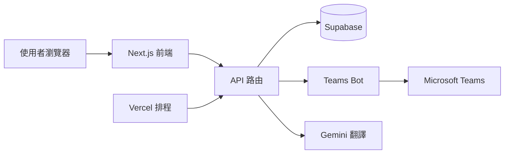
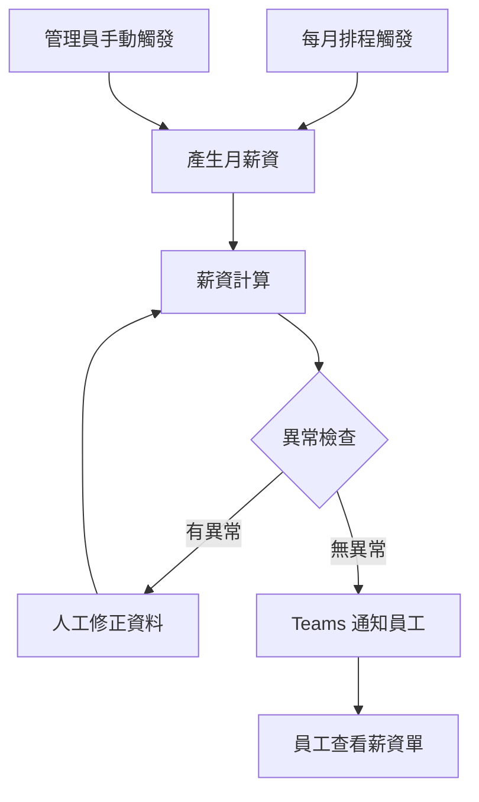
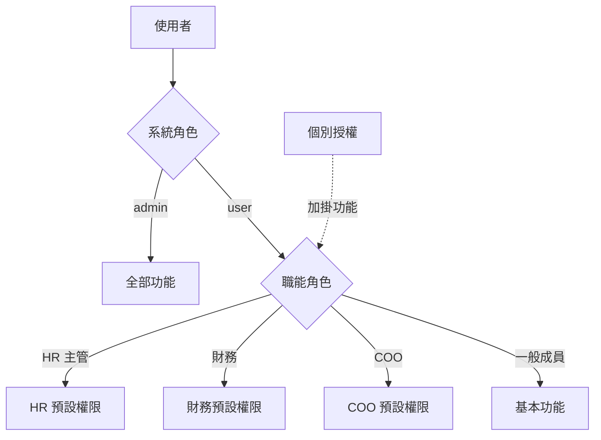

# myOPS — 系統管理員使用說明

本說明書適用於 myOPS（精拓生技營運管理系統，正式網址 `https://ops.cancerfree.io`）的系統管理員（Admin），以及持有職能角色或個別授權的 HR 主管、財務人員與 COO。內容涵蓋權限體系、使用者與組織管理、HR 與財務作業、公告文件流程，以及系統維運與 Teams Bot 設定。

## 快速開始

### 系統需求

- 使用現代瀏覽器（Chrome、Edge、Safari、Firefox 最新版本）即可操作，無需安裝任何軟體。
- 桌機、平板、手機皆支援：平板會顯示頂部列加漢堡選單，手機提供底部導覽列。
- 需有公司核發的 Microsoft 帳號（Microsoft Entra ID），系統一律透過 Microsoft 登入。
- 介面支援繁體中文、英文、日文三種語言，可在個人設定中切換；系統通知（含 Teams 訊息）會依「收件人」的語言設定發送。

### 首次登入

1. 開啟 `https://ops.cancerfree.io`，點擊「使用 Microsoft 登入」。
2. 依畫面指示完成 Microsoft 帳號驗證；首次登入時會請求基本資料與行事曆權限（用於請假同步行事曆）。
3. 首次登入成功後，系統會自動建立帳號，預設為一般成員。
4. 請聯絡現有管理員，到「使用者管理」頁面為你設定正確的系統角色、職能角色、部門與主管。

### 管理權限體系

myOPS 的權限分為三層，疊加生效：

- **系統角色（admin / user）**：`admin` 擁有全系統所有功能與設定權限，不受其他限制。
- **職能角色（job_role）**：一般使用者可被指派 `member`（一般成員）、`hr_manager`（HR 主管）、`finance`（財務）、`coo`（營運長）其中一種，每種角色自帶一組預設功能：
  - **HR 主管**：公告發布、跨部門檢視、出勤管理、請假與加班審核、獎金管理、報表檢視，並可進入「HR 管理」頁與使用者管理（僅能修改部門、主管、代理審核人、停用帳號等允許欄位）。
  - **財務**：跨部門檢視、薪資檢視、報表檢視，並可進入「財務管理」頁管理加班費率與勞健保級距。
  - **COO**：公告發布、合約審核、專案管理、加班審核、薪資與報表檢視，可管理「COO 設定」。
- **個別授權（granted_features）**：不分職能角色，可單獨指派給任何人的功能開關，例如：公告發布（publish_announcement）、合約審核（approve_contract）、簽名匯出（export_signatures）、跨部門檢視、專案管理、出勤管理、請假審核、加班審核、薪資檢視、獎金管理、報表檢視、回饋管理等 12 項。
- **COO 唯讀檢視**：COO 進入 HR 管理與財務管理頁時為唯讀模式，可以看到假別、額度、費率、獎金、級距等設定內容，但不能修改。
- 職能角色與個別授權只有 Admin 能修改；HR 主管無法變更任何人的系統角色或授權。

## 使用者與組織管理

### 使用者管理

進入「管理 → 使用者管理」可檢視全公司帳號清單，點擊使用者可進行編輯：

- **基本設定**：系統角色（僅 Admin 可改）、職能角色（僅 Admin 可改）、部門歸屬、僱用類型（正職／工讀等）、工作地區。
- **主管與代理審核人**：為每位使用者指定直屬主管（manager）與代理審核人（deputy approver）；主管不在時，請假與加班單會由代理審核人處理。
- **帳號啟用狀態**：可停用帳號（is_active 關閉），停用後該使用者無法登入，也不會出現在薪資產生名單中。
- **新增使用者**：帳號於員工首次以 Microsoft 帳號登入時自動建立，管理員不需手動建帳號，只需在登入後補齊角色與部門設定。

### 人事資料（HR Profile）

每位使用者另有一頁人事資料（使用者管理 → 個人 → 人事資料），由 Admin 或 HR 主管維護：

- **到職日／離職日**：到職日影響年資與假別額度計算；填寫離職日即代表啟動離職流程。
- **勞退自提比例**：可設定 0–6% 的勞工退休金自願提繳比例，會反映在每月薪資計算。
- **銀行資料**：銀行代碼與帳號用於薪資轉帳；帳號預設遮罩顯示，需點擊顯示才能看到完整內容。

### 離職處理建議流程

1. 在人事資料填入離職日（termination_date）。
2. 確認當月薪資與未休假別結算完成。
3. 回到使用者編輯頁，將帳號設為停用。
4. 必要時到「審計日誌」確認該帳號近期操作紀錄。

### 公司與部門

- 「公司管理」可新增、編輯公司（集團多法人架構），使用者可歸屬於不同公司。
- 「部門管理」可建立與調整部門，部門影響跨部門檢視權限與報表彙整範圍。
- 調整部門或公司歸屬後，該使用者的可見資料範圍會立即更新。

## HR 與出勤管理

HR 相關功能已整合在「HR 管理」頁（Admin 與 HR 主管可編輯，COO 唯讀）：

### 假別與額度

- **假別管理**：定義假別（特休、病假、事假等）、是否給薪、適用對象等規則。
- **假別額度**：為每位員工設定各假別的年度額度，並可隨時調整與查詢剩餘額度。
- 員工送出的請假單由主管或代理審核人審核，審核結果會透過 Teams 即時通知申請人。

### 出勤與加班

- **出勤管理**（管理 → 出勤管理）：檢視與修正全員上下班打卡紀錄。
- **出勤異常檢查**：系統自動彙整異常打卡（如缺卡、異常時段），分為正職自動檢查與工讀生缺卡兩類清單，方便 HR 逐筆確認與處理。
- **加班費率管理**：設定各時段、各類型的加班費率倍數，作為薪資計算依據；加班申請需提前送出的最少小時數可在系統設定中調整。

### 獎金管理

- 可為個別員工新增獎金項目，併入當月薪資計算。
- 獎金管理權限可透過職能角色（HR 主管）或個別授權（bonuses_manage）取得。
- COO 可唯讀檢視獎金清單，便於核閱。

## 財務與薪資管理

財務相關功能整合在「財務管理」頁（Admin 與財務角色可編輯，COO 唯讀）：

### 勞健保級距表

- 支援以 Excel 檔案匯入勞保、健保級距表：點擊上傳區選擇檔案，系統會讀取第一個工作表並預覽解析結果，確認無誤後送出。
- 級距表依年度管理，每年公告調整後重新匯入即可。
- 匯入成功會顯示筆數確認；若檔案格式錯誤或內容為空，畫面會提示錯誤原因。

### 月薪資產生與計算

- 系統每月可由排程自動產生當月全員薪資，也可由 Admin 或 HR 在管理頁手動觸發「產生月薪資」。
- 薪資計算會整合：底薪、出勤與請假紀錄、加班費率、獎金、勞健保級距、勞退自提比例。
- 薪資單產生後，系統會透過 Teams Bot 通知每位員工薪資單已可查看（依員工語言發送）。
- 自動產生日與發薪日可在系統設定中調整；薪資相關端點受多因素驗證（MFA）保護。

### 薪資異常檢查與年度薪資

- **薪資異常檢查**：自動比對當月薪資與歷史資料，列出異常項目（如金額劇烈變動、缺漏資料），請在發薪前逐筆確認。
- **年度薪資**：Admin 與 HR 可檢視全員整年度各月薪資彙總，一般員工只能看到自己的年度紀錄。
- 建議流程：產生月薪資 → 跑異常檢查 → 修正資料後重新計算 → 確認無誤再對外發布。

## 公告、文件與系統維運

### 公告發布與確認回條

- 持有公告發布權限（Admin、HR 主管、COO 或個別授權者）可建立公告與文件，並指定收件人名單。
- 發布時可選擇「需確認回條」（預設開啟）：收件人必須點擊確認已讀，系統會追蹤未確認名單。
- 可設定提醒天數，逾期未確認者會收到提醒；公告發布同時會推送 Teams 通知。
- 持有簽名匯出權限者可匯出確認／簽名名單，作為稽核留存。

### 合約審核流程

- 合約上傳後狀態為「待審核」，由持有合約審核權限者（COO 或個別授權 approve_contract）進行核准或退回。
- 審核人可在合約詳細頁直接點擊「核准」或「退回」，狀態即時更新。
- 系統設定中可調整合約審核提醒的排程行為，避免合約久懸未審。

### AI 翻譯

- 公告與文件支援一鍵 AI 翻譯：以中文內容為來源，自動產生英文與日文版本，供不同語言的同仁閱讀。
- 翻譯功能使用 Google Gemini 服務，需先在「系統設定」中填入 Gemini API Key 才能使用。
- 翻譯結果仍建議人工檢查專有名詞後再發布。

### 審計日誌與回饋管理

- **審計日誌**（管理 → 審計日誌）：記錄系統內的重要操作，可依動作類型篩選、關鍵字搜尋、分頁瀏覽，用於追查資料異動。
- **回饋管理**（管理 → 回饋管理）：檢視員工回報的問題與建議（含截圖），可更新處理狀態追蹤進度。

### 系統設定

「管理 → 系統設定」集中管理全域參數（僅 Admin），主要設定概念包括：

- **整合金鑰**：Gemini API Key（AI 翻譯）、Teams Bot 密鑰等服務憑證。
- **薪資參數**：薪資自動產生日、發薪日。
- **加班與審核**：加班申請最少提前小時數、專案加班達門檻時通知 COO 的小時數、MFA 審核 session 有效分鐘數。
- **通知排程開關**：每日待辦摘要、上下班打卡提醒（正職自動／工讀生缺卡）、合約審核提醒。
- **維護模式**：開啟後可暫停一般使用者操作，進行系統維護。

### Teams Bot

- Bot 會主動推送六類訊息：每日待辦摘要、上下班打卡提醒、即時通知、請假審核結果、薪資單發出通知、公告發布通知。
- **排程時間（台北時間，週一至週五）**：每日待辦摘要 08:30、上班打卡提醒 07:00、下班打卡提醒 17:30。
- **Conversation reference 機制**：員工在 Teams 安裝（或被加入）myOPS Bot 後，系統會以該成員的 Email 對應 myOPS 帳號並儲存對話參照；之後才能對該員工主動發訊。尚未安裝 Bot 的員工會被安靜略過，不影響其他通知流程。
- Bot 訊息依收件人的語言設定以中／英／日發送；Bot 推送失敗不會影響系統主流程（例如薪資仍會正常產生）。
- 完整的 Azure Bot 建立、Teams 安裝與部署設定步驟，請參考設定手冊：`docs/teams-bot-setup.md`。

## 工作流程圖

### 系統架構

### 月薪資結算流程

### 權限層級示意

## 常見問題 FAQ

- **Q：新同事登入後看不到任何管理功能？**
  A：帳號是首次登入自動建立的，預設為一般成員。請 Admin 到「使用者管理」設定職能角色或個別授權，並指定部門與主管。
- **Q：HR 主管為什麼不能修改某位使用者的系統角色？**
  A：系統角色、職能角色與個別授權僅 Admin 可修改；HR 主管只能調整部門、主管、代理審核人與帳號啟用狀態等允許欄位。
- **Q：員工沒收到 Teams 通知怎麼辦？**
  A：請確認該員工已在 Teams 安裝 myOPS Bot（系統才會取得對話參照），且其 Teams 帳號 Email 與 myOPS 帳號一致。尚未安裝 Bot 的員工會被略過，不會報錯。
- **Q：AI 翻譯按鈕按了沒反應或顯示錯誤？**
  A：請先確認「系統設定」中已填入有效的 Gemini API Key，且該文件已有中文內容（翻譯以中文為來源）。
- **Q：勞健保級距 Excel 上傳失敗？**
  A：系統只會讀取檔案的第一個工作表，請確認欄位格式與範本一致、內容非空白，並選對適用年度後重新上傳。
- **Q：薪資產生後發現金額有誤，可以重跑嗎？**
  A：可以。請先修正來源資料（出勤、加班費率、獎金、人事資料），再到財務管理重新觸發薪資計算，並用「薪資異常檢查」再次確認。
- **Q：COO 在 HR 管理頁為什麼不能編輯？**
  A：這是設計行為。COO 對 HR 與財務設定為唯讀檢視，僅 Admin 與對應職能角色可編輯。
- **Q：員工離職後資料會消失嗎？**
  A：不會。停用帳號只是讓對方無法登入並排除於薪資名單，歷史出勤、請假與薪資紀錄都會保留，可供查詢與稽核。

## 版本資訊

- **適用版本**：v0.3.1
- **文件日期**：2026-06-11
- 本版主要更新：Teams Bot 整合正式上線（六類主動通知、依收件人語言三語發送、Azure 設定手冊 `docs/teams-bot-setup.md`）、Vercel 排程修正（打卡提醒與每日摘要正常觸發）。
- 近期相關更新：HR／財務管理功能直接嵌入設定頁並支援 COO 唯讀（v0.2.47）、職能角色系統 job_role 上線（v0.2.44）、API 錯誤訊息多語化（v0.2.49）。
- 文件內容若與系統實際畫面不符，以系統現況為準，並歡迎透過「回饋」功能回報。
