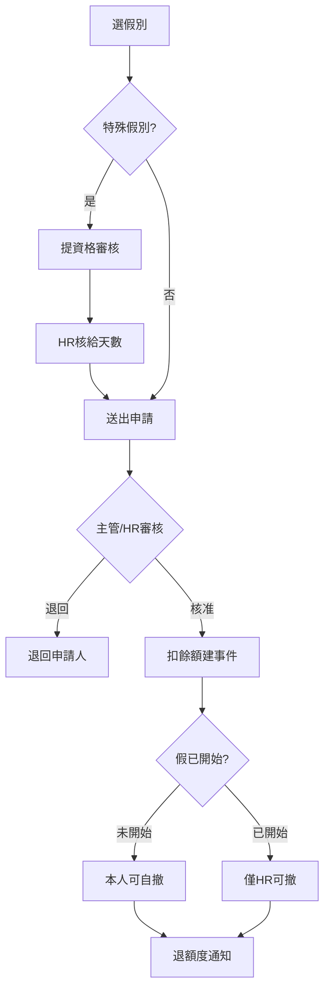
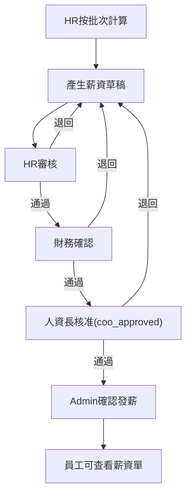
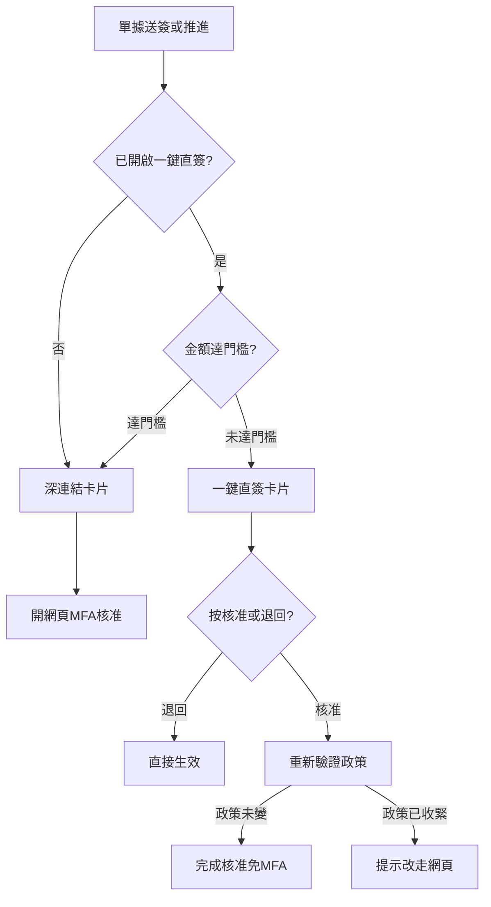

# myOPS — 管理員／HR 使用說明

本說明書提供給 myOPS 系統管理員（Admin），以及具備 HR、財務、COO 等職能角色或個別授權功能的使用者。內容除了涵蓋系統設定、權限管理與各項進階功能外，也包含一般使用者可執行的操作，方便管理員在協助同仁排除問題時對照。myOPS 正式環境網址為 `https://ops.cancerfree.io`。

## 快速開始

### 系統需求

- 使用現代瀏覽器（Chrome、Edge、Safari、Firefox 最新版本）即可操作，免安裝任何軟體。
- 桌機、平板、手機皆支援，畫面會依裝置自動切換導覽方式。
- 需持有公司核發的 Microsoft（Entra ID）帳號，系統一律透過 Microsoft 登入，不提供帳號密碼註冊。
- 正式環境網址為 `https://ops.cancerfree.io`。
- 介面可切換繁體中文／英文／日文；系統通知（Teams 訊息、Email）會依「收件人」個人設定的語言發送。

### 首次登入

1. 開啟 `https://ops.cancerfree.io`，點擊「使用 Microsoft 登入」。
2. 依畫面指示完成 Microsoft 帳號驗證。
3. 系統會自動建立帳號，預設為一般成員（member），沒有管理員需要手動新增帳號這一步。
4. 請聯絡現有管理員，於「使用者管理」頁補齊部門、系統角色、職能角色與主管等設定，才能使用對應功能。
5. 多項核准動作（打卡核准、請假核准、薪資簽核、採購簽核等）都需要完成兩階段驗證（MFA／AAL2），建議登入後即到「個人設定」啟用 Authenticator 掃碼設定，避免要核准時才卡關。

### 三層權限模型總覽

myOPS 的權限判斷疊加三個層次，且各模組實際採用的「HR 身分判定邏輯」並不完全一致，管理員在開權限前務必先確認要開的是哪一種：

- **系統角色 role**：只有 `member`（一般使用者）與 `admin`（系統管理員）兩種，`admin` 幾乎不受任何頁面限制。
- **職能角色 job_role**：一般使用者可被指派 `member`、`hr_manager`（HR 主管）、`finance`（財務）、`coo`（營運長）、`ceo` 其中一種，用於出勤異常、假別管理、假別額度、HR 管理（可編輯）、班別管理（部分）、財務管理設定（唯讀）、營運長設定（部分）等頁面的身分判定。
- **個別授權 granted_features**：與職能角色分開、可單獨勾選給任何人的功能旗標（目前約 15 項），例如 `hr_manager`、`finance_payroll`、`approve_contract`、`publish_announcement`、`expense_approve`、`procurement_unit`、`procurement_manage`、`asset_manage`、`lab_manage`、`training_manage`、`manage_projects` 等，用於使用者管理、入職離職流程、招募管理、請假／出差／公司行事曆的 HR 判定、報帳核准、採購／庫存／資產／試劑耗材等模組。

不同模組使用「job_role」或「granted_features」或「兩者皆可」來判斷是不是 HR，是全系統最容易混淆的地方，整理如下：

| HR 判定方式 | 代表頁面 |
|---|---|
| 只認 job_role（不看 granted_features） | 出勤異常、假別管理、假別額度、班別管理（不含 coo）、HR 管理（可編輯者限 job_role=hr_manager） |
| 只認 granted_features（不看 job_role） | 請假、公司行事曆、使用者管理、入職／離職流程、招募管理、績效考核週期管理 |
| 兩者皆可（其一即可） | 打卡（額外多認 job_role 一種身分，是本群組唯一如此設計的頁面） |
| 僅 role=admin，HR 完全進不去 | 打卡範圍設定、使用者人事資料、部門管理、公司主檔、意見回饋管理、系統設定、營運儀表板、每日報告群組管理、Teams 一鍵簽核政策設定 |

由於「job_role=hr_manager」與「granted_features 含 hr_manager」是兩件要分開設定的事，只設定其中一項可能會出現「側邊欄看得到連結、點進去卻被導向無權限頁」的情形；若同仁反映某頁打不開，第一步請先確認兩種設定是否都補齊。另外要留意 COO（job_role=coo）的特殊之處：可以進入假別管理、假別額度、出勤異常、HR 管理（唯讀），但不能進入班別管理。

### 簽核與 MFA（兩階段驗證）

- 幾乎所有具影響力的操作（核准、退回、作廢等）都需要完成 MFA（AAL2 等級）驗證，未設定的使用者操作時會被導向 `/mfa/verify` 完成掃碼驗證。
- 「退回」與「取消自己的申請」通常不需要 MFA；只有正式核准、作廢類動作才強制要求。
- 全站共用一個原則：「建立者本人不可核准自己送出的單」（職責分立），採購請款單、報帳、文件／合約審核皆採此原則。

## 出勤、假勤與人事組織

### 出勤與假勤管理

#### 打卡（/attendance）

員工於此頁進行每日上下班打卡與查詢個人紀錄；HR／管理員在同一頁的「全員紀錄」分頁檢視全公司紀錄並可作廢／取消作廢異常紀錄。舊路由 `/admin/attendance` 目前僅會轉址到本頁，並非另一個獨立頁面。查看：所有已開通帳號的員工皆可。操作「全員紀錄」：role=admin，或 job_role=hr_manager，或 granted_features 含 hr_manager，三者符合其一即可——這是全出勤群組中唯一額外認 job_role 的頁面。

- 上／下班各打卡一次；管理員若開啟「強制打卡範圍」，打卡當下需落在任一圍欄座標內才會成功，否則會被拒絕。
- 首頁即時顯示今日上下班打卡時間，並標示是否為系統自動補登（忘刷卡）。
- 「我的紀錄」可依年、月查詢個人歷史打卡與工時。
- 忘記打卡時可送出補打卡申請（填日期、類型、時間與原因），核准人由系統依規則自動指定（通常是直屬主管），申請人無法自行指定核准人。
- 【管理員／HR】「全員紀錄」分頁可依月份、員工、僱用類型篩選全公司打卡紀錄，並顯示統計卡（今日已打卡人數、平均出勤天數、自動補登次數）。
- 【管理員／HR】對異常打卡紀錄執行作廢（須填寫原因，留下稽核軌跡）或取消作廢；核准／退回補打卡、作廢／取消作廢皆需完成 MFA。

打卡是否遲到、是否需落在圍欄內，分別由「班別管理」與「打卡範圍」兩頁的設定決定。

#### 請假（/leave）

員工可線上請假、查詢假別餘額，特殊假別需先送資格審核；主管／HR／管理員審核待審假單，HR／管理員可查全員紀錄並代為撤銷他人已核准的假（已開始的假僅限 HR／管理員撤銷）。查看：全體皆可。操作待審核：申請人直屬主管、role=admin、或 granted_features 含 hr_manager。操作全員紀錄與代撤已核准假：role=admin 或 granted_features 含 hr_manager——本頁 HR 判定不看 job_role，與打卡頁不同，請留意。

- 查看各假別當期餘額：特休採週年制計算，其餘假別採曆年制。
- 送出請假申請時選擇假別、起訖日、是否半天、事由，並可選填代理人；系統自動計算天數並檢查餘額是否足夠。
- 在「我的紀錄」查看歷史與目前狀態；尚待審核的申請可自行取消；尚未開始的已核准假可自行撤銷（撤銷後會退回額度、移除對應的 Outlook 事件）。
- 婚假、喪假、產假等特殊假別，需先在「特殊假申請」提出資格審核，待 HR 核給天數後才能正式送出該假別的申請。
- 【管理員／HR】審核待審假單：核准需完成 MFA，核准後系統會自動扣除餘額並在申請人 Outlook 建立整天事件；退回或撤銷則會移除該事件。
- 【管理員／HR】「全員紀錄」可唯讀查看全公司請假紀錄；也可代為撤銷他人已核准的假——但已經開始的假僅 HR／管理員能撤銷，主管無法代撤，撤銷會留下稽核紀錄並以 Teams 通知當事人。
- 【管理員／HR】審核特殊假別資格申請，核給天數後該員工才能正式申請該假別。

Outlook 為單向同步（核准建立、退回或撤銷移除）；公司行事曆只顯示「請假中」不顯示假別；簽核中心會彙總待審假單。

#### 請假行事曆（/leave/calendar）

以月曆檢視部門或全公司請假分布（含假別與事由），供主管排班協調使用。目前系統內沒有任何連結或按鈕會導向本頁，只能直接輸入網址進入，屬於「孤兒頁面」。查看：一般員工僅能看到同部門；role=admin 或 granted_features 含 hr_manager 可看到全公司並用部門下拉篩選；本頁純唯讀，沒有任何管理功能。

- 月曆上以顏色標示每天請假人數（綠點＝已核准、黃點＝待審核）。
- 點選某一天可在下方篩出當天的請假清單（姓名、假別、期間、天數、狀態）。
- 勾選「只看我的部門」可快速篩選；可切換月份查看過去或未來排休狀況。
- 【管理員／HR】多一個「部門」下拉選單，可切換查看任一部門或全公司；一般員工固定只能看自己部門。

本頁刻意會顯示假別與事由，與「公司行事曆」自 v0.9.9 起只顯示「請假中」不顯示假別（考量健康個資）分工不同，兩套規則是刻意分開設計，請勿混用說明。

#### 加班（/overtime）

員工線上申請加班（依勞基法日別分段計薪）並查詢紀錄；主管、專案負責人或管理員審核待審加班單，HR／管理員可查全員紀錄。這裡有一個容易造成誤會的介面落差：「待審核」分頁對任何員工都會顯示全公司待審加班單（含核准／退回按鈕），但按下核准後，後端才真正檢查身分——非直屬主管、專案負責人、管理員或持有 coo_notify 授權者一律會收到 403 拒絕，屬正常現象，並非權限外洩。申請與查詢：所有員工皆可。畫面上「待審核」分頁會顯示給 role=admin 或 granted_features 含 hr_manager 者，但實際能核准／退回的身分只有：role=admin、granted_features 含 coo_notify、申請人當時的直屬主管、或該加班單關聯專案的負責人——HR（hr_manager）完全無法核准加班，不論是 job_role 或 granted_features 身分。操作全員紀錄：role=admin 或 granted_features 含 hr_manager。

- 送出加班申請時填日期（系統自動判斷日別）、起訖時間、可選填關聯專案與事由；系統自動計算時數，跨午夜的加班會自動算為隔日再加 1 天。
- 在「我的申請」查看歷史紀錄與目前狀態。
- 任何員工登入後，若公司有其他人的加班單待審，都會在「待審核」分頁看到申請人、時數、事由與核准／退回按鈕；但實際按下核准，只有直屬主管、專案負責人、管理員或 coo_notify 持有者才會成功，其餘一律 403——看得到不代表核准得到。
- 【管理員／HR】「全員紀錄」可唯讀查看全公司加班紀錄，並依月份、員工、狀態篩選。
- 核准／退回皆需完成 MFA；已核准的加班會依日別倍率（工作日 1.34／1.67、休息日 1.34／1.67／2.67、國定假日 2 倍）計入薪資草稿。

#### 出差管理（/business-trips）

員工線上申請出差，送單時系統會自動指定當時的直屬主管為審批人（之後即使更換主管，該單的審批人也不會變動）；核准後可直接建立報帳單並同步 Outlook。查看：所有員工皆可。操作待審核：送單時指定的審批人（申請人當時的直屬主管）、role=admin、或 granted_features 含 hr_manager。操作全員紀錄：role=admin 或 granted_features 含 hr_manager。

- 送出出差申請時填目的地、事由、起訖日，可選填詳細行程。
- 在「我的出差」查看歷史與狀態；尚待審核的申請可自行取消。
- 已核准的出差可直接點「建立報帳」，一鍵帶入報帳模組並預填目的地與日期。
- 【管理員／HR】審核待審出差單，核准／退回皆需完成 MFA；審批人固定為送單時指定的直屬主管或 HR／管理員。
- 【管理員／HR】「全員紀錄」可唯讀查看全公司出差紀錄。

核准後於申請人 Outlook 建立整天事件（單向同步），退回自動清除；公司行事曆會顯示已核准出差的目的地（非隱私項目，因此不遮蔽）。

#### 公司行事曆（/calendar）

全公司月曆彙總公司活動、已核准請假（僅顯示「請假中」，自 v0.9.9 起因健康個資考量不再顯示假別）與已核准出差；員工可對公司活動 RSVP，HR／管理員可建立、編輯、刪除活動。查看：所有員工皆可。管理公司活動：role=admin 或 granted_features 含 hr_manager（判定不看 job_role，與請假頁一致）。RSVP：所有員工皆可對任一活動操作。

- 月曆以顏色區分公司活動（綠）、同事請假中（藍，不顯示假別）、同事出差（紫）。
- 點選某一天可查看當天完整清單；對公司活動可回覆「參加／不參加／未定」，並可展開查看各狀態人數與名單。
- 【管理員／HR】新增、編輯、刪除公司活動（標題、說明、起訖日）。

活動異動會單向同步推送到已連結員工的 Outlook 日曆（best-effort）；行事曆資料透過 SECURITY DEFINER 函式讀取，只回傳姓名與日期，不含事由或假別內容。

#### 出勤異常（/admin/attendance-anomalies）

唯讀報表，列出近 30 天內連續 3 天以上自動補登（忘刷卡）的正職員工，以及本月缺打卡超過 3 次的實習生名單。此元件也內嵌於「HR 管理」頁作唯讀展示。查看＝操作（純唯讀，沒有任何寫入動作）：role=admin，或 job_role=hr_manager，或 job_role=coo。本頁只認 job_role 與 admin，不認 granted_features——僅靠個別授權被授予 hr_manager 的人打不開這頁，會被導向「無權限」頁。

- 【job_role=hr_manager／coo 或 admin】查看「正職連續自動補登」名單，天數達 5 天以上會以紅色標示。
- 【job_role=hr_manager／coo 或 admin】查看「實習生缺打卡」名單。
- 本頁沒有匯出、標記已處理等任何操作按鈕，純資料呈現，發現異常需自行聯繫相關員工或轉交主管處理。

#### 假別管理（/admin/leave-types）

維護公司假別清單（名稱、適用對象、給薪方式、年度上限、需提前申請天數、啟用狀態），是「請假」頁申請下拉選單的資料來源。本頁沒有唯讀模式，COO 也可以完全編輯（與「HR 管理」頁內嵌版本會對 COO 顯示唯讀不同）。查看＝操作：role=admin，或 job_role=hr_manager，或 job_role=coo（不認 granted_features）。

- 【job_role=hr_manager／coo 或 admin】新增假別，填寫名稱、適用對象、給薪方式、年度上限、提前申請天數與啟用狀態。
- 【job_role=hr_manager／coo 或 admin】編輯既有假別的任何欄位。
- 存檔後立即生效，「請假」頁下拉選單會立刻反映最新清單。
- 「是否需 HR 先審核資格」目前沒有對應的畫面控制項，只能請工程人員直接在資料庫調整。

#### 假別額度（/admin/leave-balances）

逐員工、逐假別調整當年度（或特休週年制當期）核給天數，是員工在「請假」頁看到餘額的資料來源；可依到職日一次帶入年資對應的特休天數。自 v0.9.7 起，本頁是側邊欄唯一的維護入口，同樣沒有唯讀模式。查看＝操作：role=admin，或 job_role=hr_manager，或 job_role=coo（不認 granted_features）。

- 【job_role=hr_manager／coo 或 admin】用員工下拉篩選單一員工，或直接在表格輸入新的核給天數後按「儲存」。
- 【job_role=hr_manager／coo 或 admin】「依年資自動帶入特休」可批次產生／更新特休額度，不會覆蓋已手動調整過的資料。
- 可同時查看各假別已使用天數，方便核對餘額是否合理。

#### 班別管理（/admin/shifts）

定義多種上下班班別（時間、工作日、彈性寬限、休息時數）並指派給員工；打卡遲到的判定依員工當日所屬班別的上班時間計算。COO（job_role=coo）不能進入此頁，與假別管理、假別額度、出勤異常三頁（COO 可進）不同，設定授權時要特別留意這個差異。查看＝操作／管理：role=admin，或 job_role=hr_manager，或 granted_features 含 hr_manager（本頁同時認 job_role 與 granted_features 兩種身分，但不包含 job_role=coo）。

- 【管理員／HR】新增或編輯班別，設定名稱、上下班時間、工作日、彈性寬限、休息分鐘數與啟用狀態。
- 【管理員／HR】在「員工指派」區塊逐位員工選擇目前適用的班別，選單僅列出啟用中的班別。
- 打卡頁上班打卡時會讀取當日適用班別來判斷是否遲到；非工作日打卡不會被判定遲到。

#### 打卡範圍（/admin/geofences）

設定允許打卡的辦公室地理座標範圍（可設定多個地點），並可開關「強制範圍檢查」；開啟後，員工打卡若不在任一圍欄內就會被拒絕。這是全出勤群組唯一「只認 role=admin」的頁面，HR 無論用哪一種身分都打不開，需要調整時請找系統管理員處理。查看＝操作／管理：僅 role=admin。

- 【僅管理員】開關「強制打卡範圍檢查」，預設關閉，關閉時系統僅記錄座標不會擋人。
- 【僅管理員】新增圍欄，填寫名稱、經緯度（可用「使用我的目前位置」快速帶入）與半徑。
- 【僅管理員】啟用／停用或刪除圍欄；可設定多個圍欄，打卡只要落在任一圍欄內即算合格。

### 人事組織、招募與人才發展

#### 使用者管理（/admin/users）

全公司帳號清單，可調整部門、系統角色、職能角色、僱用資訊，並可對離職同仁停用帳號。帳號無法在此新增——一律由同仁本人首次以 Microsoft 登入時自動建立。查看／操作：role=admin，以及 granted_features 含 hr_manager 的使用者。只設定 job_role=hr_manager（職能角色）並不夠，本頁仍會擋下，必須額外在「個別授權功能」勾選 hr_manager；反過來，job_role=hr_manager 的人側邊欄會看到「使用者」連結，點進去卻可能被導向「無權限」頁，是已知的落差，建議兩者一起設定。非 Admin 的 HR 只能改部門、僱用類型、工作地區、主管、代理審核人、啟用狀態，不能操作或停用 Admin 帳號、不能升任何人為 Admin，也看不到系統角色、職能角色、個別授權功能欄位。

- 搜尋、瀏覽全公司使用者清單。
- 編輯部門、僱用類型、工作地區、直屬主管、代理審核人與啟用狀態。
- 【僅 Admin】編輯系統角色（member／admin）、職能角色（member／hr_manager／finance／coo／ceo）與個別授權功能（目前約 15 項功能旗標，如 hr_manager、finance_payroll、asset_manage 等）。
- 停用使用者前會跳出「離職交接檢查」對話框，列出未結案合約、進行中專案、待審請假加班、未發放薪資；此提示與背後 API 僅 Admin 可用，非 Admin 的 HR 點擊會看到空白對話框、看不到確認鈕——HR 要停用帳號需改用「編輯」對話框直接把狀態改為停用，不會看到交接提醒。
- 【僅 Admin】點「人事資料」圖示可進入使用者人事資料頁編輯薪資與個人資料；該圖示每一列都會顯示，但非 Admin 的 HR 點了會被導向「無權限」頁。

#### 使用者人事資料（/admin/users/[id]/profile）

記錄到職／離職日期、生日、電話、地址、緊急聯絡人、薪資設定、銀行帳號、身分證號等敏感資料。銀行帳號與身分證號預設遮罩顯示，需點擊眼睛圖示才會顯示明碼。查看／操作：僅 role=admin，HR、COO、財務皆不行，即使具備 hr_manager 授權也一樣——這是全模組群裡權限最窄的一頁。員工本人也看不到自己這份資料，目前系統沒有任何「個人設定」頁可讓員工自行查看自己的到職日、地址、緊急聯絡人、薪資或銀行帳號。

- 【僅 Admin】基本資料：中文姓名、到職日、離職日、生日、電話、通訊地址、戶籍地址。
- 【僅 Admin】緊急聯絡人與聯絡電話。
- 【僅 Admin】薪資設定：型態（月薪／時薪）、金額、勞退自提比例（0–6%）。
- 【僅 Admin】銀行資訊：銀行代碼、帳號（可切換遮罩／明碼顯示）。
- 【僅 Admin】身分資訊：證件類型、證號（可切換遮罩／明碼顯示）。

#### 部門管理（/admin/departments）

維護部門清單（代碼＋名稱），供使用者管理、招募、簽核等模組下拉選單使用；只能新增與編輯，沒有刪除功能。查看／操作：僅 role=admin。HR（不論是 job_role 或 granted_features 身分）與其他職能角色一律無法進入，這點與使用者管理、入職離職流程、招募管理不同。

- 【僅 Admin】新增部門，填寫名稱與代碼（代碼限 10 字以內，系統會自動轉為大寫）。
- 【僅 Admin】編輯既有部門的名稱或代碼；沒有刪除功能，若需要下架某部門須聯繫工程處理資料庫層。
- 儲存後立即可在使用者管理、招募等模組的下拉選單選用。

#### 公司主檔（/admin/companies）

維護「合作公司」主檔（名稱＋別名清單），供合約管理、文件管理選擇所屬公司使用；別名可把同一公司的不同寫法對應到同一筆記錄。這裡的「公司」指外部往來公司，不是 myOPS 自家法人清單。查看／操作：僅 role=admin，與部門管理相同，HR 或其他職能角色都無法進入。

- 【僅 Admin】依名稱或別名搜尋既有公司。
- 【僅 Admin】新增公司，填寫名稱與以逗號分隔的別名清單。
- 【僅 Admin】編輯既有公司的名稱或別名；沒有刪除功能。

#### 入職／離職流程（/admin/lifecycle）

HR 追蹤每位新進／離職員工的交接清單（入職 10 項、離職 8 項預設範本），可逐項打勾、記錄完成時間、加備註、新增自訂項目。要留意的是，側邊欄目前沒有給非 Admin 的 HR 顯示此頁連結——連結只出現在 Admin 專屬的管理選單，非 Admin 的 HR 需要知道網址才能直接進入。本模組受功能開關保護，預設關閉，需 Admin 先啟用（Admin 本人操作不受此限制），自 v0.8.5 起關閉時連 API 也會一併擋下。查看／操作：role=admin，或 granted_features 含 hr_manager（與使用者管理同一套判定）。

- 【管理員或具 hr_manager 授權的 HR；HR 側邊欄無連結，需直接輸入網址】選擇同仁與類型（入職／離職），系統會自動展開對應的預設交接檢查項目。
- 逐項打勾完成（會記錄完成時間）、寫備註、刪除項目，或新增自訂項目並分類。
- 全部項目完成後可將整張清單標記「已完成」；若之後反勾任一項目，清單會自動退回「進行中」。
- 可整張刪除清單。

#### 招募管理（/admin/recruiting）

管理職缺與應徵者，流程涵蓋投遞、書審、面試、Offer、錄取／未錄取，可上傳履歷附件並記錄多次面試評分。系統已於 v0.6.2 修復履歷檔案原本任何登入者皆可下載的外洩問題，改為僅 HR／管理員可下載。與入職離職流程一樣，本頁沒有側邊欄入口給非 Admin 的 HR，且受功能開關保護預設關閉。查看／操作：role=admin，或 granted_features 含 hr_manager（與使用者管理、入職離職流程同一套判定，但非 Admin 的 HR 側邊欄未列出，須知道網址才能進入）。

- 建立、編輯、關閉職缺（標題、所屬部門、說明、需求條件、招募人數、狀態）。
- 新增應徵者（姓名、Email、電話、來源、上傳履歷 PDF／Word／圖片檔），履歷僅 HR／管理員可下載。
- 拖曳或切換應徵者所在階段：投遞→書審→面試→Offer→錄取／未錄取。
- 新增面試記錄（日期、1–5 星評分、文字回饋，並記錄面試官）。
- 刪除職缺或應徵者。

#### HR 管理（/admin/hr-settings）

人資設定彙整頁，內嵌六大區塊：打卡／加班系統參數、假別管理、假別額度（已改為連結導至「假別額度」獨立頁）、加班費率管理、出勤異常清單（唯讀展示）、年度獎金記錄管理。要特別留意：本頁的 HR 判定用 job_role（不看 granted_features），與使用者管理、入職離職流程、招募管理三頁用 granted_features 判定不是同一套機制——只設定 granted_features 的 hr_manager、沒設定 job_role 的人進不了這頁；反過來只設定 job_role、沒勾 granted_features 的人進不了使用者管理、入職離職流程、招募管理。查看：role=admin、job_role=hr_manager、job_role=coo 三者皆可進入。編輯：僅 Admin 與 job_role=hr_manager；COO 進入後為唯讀模式（各區塊會顯示鎖頭圖示）。

- 【Admin 或 job_role=hr_manager 可編輯，COO 僅唯讀】編輯六項人資系統參數：預設上下班時間、自動打卡檢查延遲、實習生漏打卡提醒門檻、正職自動打卡提醒天數、加班最少提前申請時數。
- 假別管理區塊（新增／編輯假別）：內嵌元件內容與獨立頁「假別管理」相同，但此處對 COO 會正確顯示唯讀（與獨立頁不同，獨立頁 COO 可完全編輯）。
- 點連結可前往「假別額度」頁管理個別員工的假別額度（本頁本身已不放額度表格）。
- 維護加班費率管理區塊（各倍率名稱與倍率）。
- 檢視出勤異常清單（近 30 天自動補卡異常、本月漏打卡實習生）。
- 年度獎金記錄管理（新增／檢視當年度各員工獎金），此處會正確依編輯權限顯示唯讀（與獨立頁「獎金管理」不同）。

#### 績效考核—我的考核（/performance）

員工在開放中的考核週期自行啟動考核、設定目標（權重合計需等於 100%）並提交，主管核定後逐項自評，主管評分鎖定後可查看最終結果。「我的考核」與「團隊考核」「週期管理」共用同一網址，以分頁切換。查看／操作：僅本人（只能看到自己的考核記錄）。受評人本人即使具 HR／Admin 身分，也不得核准或評分自己的考核。

- 下拉切換考核週期，僅開放中的週期可啟動新考核。
- 新增、編輯、刪除目標（標題、說明、權重百分比），權重總和必須等於 100% 才能送出。
- 送出目標設定後等待主管核定；被退回時可看到退回原因並重新編輯送出。
- 核定通過後逐項自評 1–5 分並填寫文字說明，全部評完才能送出。
- 考核完成鎖定後，可檢視自評、主管評分、加權分數、最終總分、主管總評，以及當期每日報告 KPI 對照快照。

#### 績效考核—團隊考核（/performance）

主管在「團隊考核」分頁檢視轄下部屬（或考核記錄上被指定為主管者）的考核進度，核定或退回目標，逐項評分並鎖定；HR 另外可切換「全公司」檢視範圍。查看／操作：有直屬部屬的主管，或考核記錄上被指定為主管者；HR／Admin 額外可切換看「全公司」。即使是 HR／Admin，也不能評自己的考核。

- 檢視轄下每位部屬本期考核狀態（設定目標中／待核定／待自評／待評分／已完成）。
- 核准或退回員工送出的目標，退回需填寫原因並完成 MFA。
- 待評分階段逐項給 1–5 分並填評語，最後填整體總評分（1–5 可到半分）與總評語，完成 MFA 後才會鎖定。
- 查看員工自評分數、說明與當期每日報告 KPI 對照。
- 【HR／Admin】切換至「全公司」檢視範圍，查看所有員工的考核記錄；也可將已完成的考核重新開回「待主管評分」（需 MFA）。

#### 績效考核—週期管理（/performance）

HR／Admin 建立考核週期（名稱＋起訖日）、開啟供員工填寫、結束後關閉；狀態只能依 draft→open→closed→open 的順序轉換，不可跳轉，draft 狀態才能刪除。一般員工完全看不到此分頁。查看／操作：僅 HR（role=admin 或 granted_features 含 hr_manager）。

- 【僅 HR／Admin】建立新考核週期，填寫名稱、起始日、結束日。
- 【僅 HR／Admin】開啟週期（draft／closed→open），開啟後員工才能啟動考核填寫目標。
- 【僅 HR／Admin】關閉週期（open→closed）。
- 【僅 HR／Admin】刪除週期，僅限草稿狀態且尚無人使用時才能刪除。

#### 教育訓練—我的訓練（/training）

員工檢視被指派的訓練課程清單與必修標記，完成後上傳結業證明並填寫備註標記完成；頁面同時顯示本人今年累計完成訓練時數（依台北時區判定年度）。「我的訓練」「課程管理」「證照管理」「到期提醒」共用同一網址，以分頁切換。查看／操作：僅本人（只看自己被指派的課程記錄）。已完成的記錄不能由本人自行改回未完成，需訓練管理者操作。

- 檢視本人被指派的課程列表（含必修標記、時數、教材連結）。
- 點「標記完成」上傳結業證明或附件並填寫備註。
- 檢視本年度累計完成訓練時數統計。
- 【訓練管理者】可將任一員工的課程記錄改回未完成、調整時數，或取消該筆指派。

#### 教育訓練—課程管理（/training）

訓練管理者建立、編輯、刪除訓練課程（分類、教材連結、時數、必修標記），指派給指定員工並查看完成進度名冊。一般員工完全看不到此分頁。查看／操作：僅訓練管理者（role=admin 或 granted_features 含 training_manage）。

- 【僅訓練管理者】建立訓練課程（標題、分類、教材連結、時數、是否必修）。
- 【僅訓練管理者】編輯或刪除既有課程。
- 【僅訓練管理者】指派課程給一位或多位員工（僅可選尚未被指派者）。
- 【僅訓練管理者】展開課程查看指派名冊與完成進度，可取消個別指派。

#### 教育訓練—證照管理（/training）

員工可登錄個人證照，填寫發證機構、證號、日期並上傳附件；到期日 30 天內自動標示「即將到期」，已過期則標示「逾期」。訓練管理者可切換檢視「全部人員」的證照。查看：本人的證照；訓練管理者可切換看全部人員。操作：本人可新增／編輯自己的證照；刪除與代他人新增僅訓練管理者可做，新增時「持有人」欄位也僅管理者可見。

- 新增／編輯自己的證照（名稱、發證機構、證號、發證日、到期日、附件、備註）。
- 檢視自己所有證照，含到期狀態標示。
- 【訓練管理者】勾選「全部人員」可檢視所有員工的證照（含持有人姓名）。
- 【訓練管理者】可代任一員工新增證照（指定持有人）；編輯或刪除任一員工的證照。

#### 教育訓練—到期提醒（/training）

訓練管理者專用分頁，列出全公司 60 天內到期（或已逾期）的證照，依到期日排序並標示剩餘或逾期天數；到期判定以台北時區計算。一般員工看不到此分頁。查看／操作：僅訓練管理者。

- 【僅訓練管理者】檢視全公司 60 天內到期或已逾期的證照清單，依到期日排序並顯示剩餘／逾期天數，方便提醒相關同仁補辦或更新證照。
- 儀表板的「證照將到期」卡片（訓練管理者限定）會同步顯示提醒。

## 薪資、報帳與財務設定

### 薪資管理

#### 薪資（/payroll）

薪資主頁會依權限顯示不同畫面：一般員工只看到「我的薪資單」（僅顯示「人資長已核准」或「已發放」狀態，近 12 個月）；HR、財務或具檢視權限者會多一個「薪資表」分頁，可執行批次計算、手動建立與整批簽核。要特別澄清：薪資草稿不是每月自動產生的，批次計算需要人工按下按鈕觸發，目前沒有任何排程（cron）會自動呼叫產生端點。查看自己薪資單：全體員工皆可。查看全員薪資表：role=admin／hr，或具 view_payroll 權限者。批次計算：admin 或 job_role=hr_manager 或具 hr_manager 授權者。手動建立：role=admin／hr。四關簽核詳見「工作流程圖」與「權限對照表」。xlsx 匯出：admin 或具 hr_manager／finance_payroll 權限者，目前沒有對應的畫面按鈕，需直接帶年月參數開啟網址下載。

- 「我的薪資單」可查看近 12 個月已核准／已發放的薪資單摘要，點入可看完整明細。
- 【管理員／HR】「薪資表」分頁可檢視當月全員薪資紀錄。
- 【管理員／HR】按「批次計算」，系統會對在職台灣全職且已填月薪的員工，依月薪、已核准加班、無薪假扣款、獎金與勞健保級距表產生當月薪資草稿；重新計算會覆寫已進入簽核流程的薪資單並清空簽核軌跡，執行前系統會先警告受影響的筆數。
- 【管理員／HR】手動建立單筆薪資；若當月已存在非草稿狀態的薪資單會被擋下，避免繞過簽核流程。
- 【管理員／HR】「整批簽核」可對同一關的所有薪資單一次推進到下一關（HR 審核／財務確認／人資長核准／確認發薪各有一顆按鈕），底層仍逐筆呼叫原本的 API，MFA 與狀態機檢查完全保留，若部分失敗會列出哪幾筆沒有成功。
- 【需額外授權】xlsx 匯出功能目前只能直接呼叫匯出端點使用，尚無對應的畫面按鈕。

#### 薪資明細（/payroll/{id}）

呈現單一月份薪資的完整組成：應發、應扣、實發、雇主負擔、簽核軌跡與異常提示。畫面上「—」代表尚未計算，「NT$0」代表算出來的結果就是零（例如級距表未上傳時保費真的會算成 0），兩者意義不同，務必分開理解。查看：本人（僅「人資長已核准」或「已發放」狀態），或 role=admin／hr，或具 view_payroll 權限者（不限狀態）。本頁沒有任何簽核按鈕，簽核動作要在「薪資表」主頁執行。

- 本人可查看自己已核准／已發放薪資單的完整組成，以及「薪資異常檢查」掃描出的異常提示。
- 可看到雇主負擔的勞保、健保、勞退 6% 提繳金額，不只自己實際拿到的部分。
- 可連結到「年度薪資彙總」查看全年趨勢。
- 【管理員／HR】具 view_payroll 權限者可看任何人、任何狀態的薪資明細與完整簽核軌跡。

#### 年度薪資彙總（/payroll/annual）

以年度橫向彙總 1–12 月薪資。這裡有一個容易造成困惑的落差需要如實說明：查詢「自己」的年度紀錄時並沒有加狀態過濾，只靠資料庫層級的權限（RLS）把關，而目前的規則允許本人看到自己所有狀態的薪資紀錄（包含草稿與審核中），這與「我的薪資單」「薪資明細」只顯示已核准／已發放的規則不一致，說明時請照實描述，不要假設可見範圍相同。查看自己：全體員工（含未完成狀態）。切換查看他人：role=admin，或 role=hr，或具 view_payroll 權限者。

- 選擇年度（當年前後 2 年）查看自己 1–12 月逐月明細與全年合計；由於未加狀態過濾，草稿與審核中的月份也會顯示出來。
- 尚無資料的月份會顯示「—」，代表 HR 尚未建立當月薪資。
- 【管理員／HR】切換「員工」下拉選單，可查看任何在職員工的年度彙總。

#### 薪資異常檢查（/admin/payroll/anomalies）

掃描指定年月的薪資紀錄，標記加班超過 46 小時、實發較上月相差逾 20%、無薪假扣款超過底薪一半、當月新進／離職員工、正職底薪為 0 等五種異常。側邊選單沒有獨立入口，實際主要入口是「財務管理設定」頁的內嵌區塊，也可以直接輸入網址進入。查看／操作：role=admin，或 job_role=finance／coo，或具 granted_features hr_manager／finance_payroll 者。一般員工完全無法進入。本頁不能修改薪資，只能標記與檢視。

- 【管理員／財務】執行異常掃描：會先清空該月舊的標記，再重新依五種規則掃描並寫回。
- 【管理員／財務】查看已標記異常：只讀取資料庫既有標記，不會觸發重新掃描。
- 掃描結果會列出員工、實發金額與命中原因（同一人可能同時命中多項規則）。
- 發現異常後需回到「薪資表」或「薪資明細」頁確認並處理，本頁本身無法修改薪資內容。

#### 勞健保級距表管理（/admin/insurance-brackets）

上傳並檢視年度勞保／健保投保薪資級距表；若當年度尚未上傳，薪資批次計算算出的保費會直接變成 0（畫面會提醒但不會擋下計算）。要留意的是，頁面存取權限（admin／finance／coo）與上傳 API 的權限（admin 或 finance_payroll）是兩組不同的檢查，job_role=finance／coo 只保證看得到頁面與表單，若沒有額外被授予 finance_payroll，按下上傳仍會被拒絕（403）。查看頁面：role=admin，或 job_role=finance／coo。實際能成功上傳／覆蓋：role=admin，或具 granted_features finance_payroll 者。

- 上傳勞保／健保級距表（支援 xlsx／xls／csv，系統會自動辨識中英欄名的常見別名，並顯示預覽與被略過列的原因）。
- 下載空白範本（僅含欄名，不含示範數字）。
- 整年度覆蓋式上傳：同年度重新上傳等於「刪除舊表＋寫入新表」，在同一筆資料庫交易內完成，不會出現半套資料。
- 依年度切換檢視現有的級距表內容。
- 【需 finance_payroll 授權或 admin】才能實際成功執行上述上傳／覆蓋動作，僅 job_role=finance／coo 的人看得到表單，但按下上傳會收到 403。

#### 勞退月提繳工資分級表管理（/admin/insurance-brackets）

與勞健保級距表在同一實體頁面（下方第三個獨立區塊），並非另一個網址；資料表、API 與計算用途完全獨立。系統已預先載入 2026 年度共 62 級的官方資料。員工個人的自願提繳率是在「使用者人事資料」頁個別設定的，本頁只管月提繳工資與雇主 6% 的部分。查看頁面：role=admin，或 job_role=finance／coo（與勞健保級距表同頁、同一組頁面權限）。實際能成功上傳：role=admin，或具 granted_features finance_payroll 者。

- 上傳勞退分級表（支援 xlsx／xls／csv 及中文欄名別名，含預覽、略過提示與空白範本下載）。
- 整年度覆蓋式上傳，同樣在同一筆資料庫交易內完成。
- 依年度切換檢視現有分級表，並顯示依月提繳工資換算出的雇主提繳 6% 金額。

#### 獎金管理（/admin/bonuses）

建立、檢視、刪除員工獎金紀錄（年終、績效、專案、其他），依年度篩選；薪資批次計算會把「年、月都相符」的獎金併入該員工當月的應發金額——月份留空的獎金永遠不會被算進任何月份的薪資，登錄時務必提醒填寫月份。側邊選單沒有獨立入口，實際入口是「HR 管理」頁的內嵌區塊（該處會正確顯示唯讀）；獨立網址本身沒有把唯讀狀態往下傳，job_role=hr_manager／coo 在此會看到完整的編輯按鈕，但按下去才會被 403 拒絕。查看頁面：role=admin，或 job_role=hr_manager／coo，或具 granted_features finance_payroll 者。實際能成功新增／刪除：role=admin，或具 granted_features finance_payroll 者。

- 【需 finance_payroll 授權或 admin】新增獎金紀錄（員工、類型、金額、選填月份、說明）——月份留空則批次計算永遠不會把這筆算進任何月份，登錄時請務必填寫。
- 【需 finance_payroll 授權或 admin】刪除獎金紀錄，刪除前會二次確認，且無法復原。
- 依年度切換檢視，畫面會顯示該年度獎金總額。

### 財務報帳與系統設定

#### 員工報帳（/expenses）

代墊費用線上申請、審核與撥付；自 v0.10.2 起改為以會計科目分類。目前介面僅支援台幣（TWD），金額欄會標示 TWD，送出時不會帶入 currency 欄位。列表上的垃圾桶圖示執行的是「標記取消」，不是真的刪除；系統雖存在刪除端點，但目前沒有任何畫面呼叫它，請不要寫成「可刪除記錄」。查看：一般員工只看得到自己的報帳記錄；具「報帳審批與撥付」權限（granted_features 含 expense_approve）或 role=admin 者，會多出「待審核」分頁、可看全員記錄並匯出明細。操作：任何員工可送出或取消自己待審中的申請；核准、退回、撥付僅限審批者，且不可審批自己送出的單，三個動作皆需完成 MFA；取消則不需要 MFA。

- 新增報帳：選擇會計科目類別，填寫費用日期、申請月份（可與費用日期不同月）、發票號碼、事由與金額。
- 上傳發票或收據照片、PDF，可上傳多張，下載時使用短效期的簽章連結。
- 從已核准的出差單一鍵帶入報帳表單，自動預填目的地與日期。
- 在「我的報帳」查看自己所有記錄的狀態（待審核／已核准／已退回／已撥付／已取消）。
- 待審核狀態的申請可自行取消（需二次確認），取消後記錄不會被刪除，只是狀態變為「已取消」。
- 【具 expense_approve 授權或 admin】在「待審核」分頁核准、退回（需填寫審核備註）已送出的單，或把已核准的單標記「已撥付」，三個動作皆需完成 MFA 且不能審批自己送出的單。
- 【具 expense_approve 授權或 admin】匯出報帳明細 Excel；目前畫面按鈕不帶月份參數會匯出全部記錄，雖然 API 本身支援月份篩選，但介面尚未接上。

#### 財務管理設定（/admin/finance-settings）

薪資相關系統參數（發薪日等）、勞健保／勞退級距表與薪資異常掃描的管理入口；勞健保級距表與薪資異常掃描這兩塊各自也有獨立網址，本頁只是把對應的畫面元件直接嵌入渲染。查看（唯讀）：role=admin 之外，job_role=coo 也能進入頁面，但欄位僅顯示文字加鎖頭圖示，無法修改。操作／編輯：僅 role=admin 與 job_role=finance 能修改欄位、上傳級距表、執行異常掃描。job_role=hr_manager 沒有這頁的存取權。

- 【admin 或 job_role=coo 可唯讀】檢視發薪日、薪資自動產出日等財務設定值，以及目前生效的勞健保／勞退級距表內容。
- 【僅 admin 或 job_role=finance】編輯「發薪日（每月幾號）」與「薪資自動產出日」。
- 【僅 admin 或 job_role=finance】管理勞保、健保、勞退月提繳工資三張級距表，可依年度新增／檢視每一級的投保薪資與負擔金額，也可上傳官方 Excel 一次匯入取代。
- 【僅 admin 或 job_role=finance】執行薪資異常掃描：指定年月啟動掃描，列出觸發告警規則的薪資單，供發薪前人工複核。

#### 營運長設定（/admin/coo-settings）

管理專案加班 Teams 通知門檻、合約到期提醒天數，以及請採購單依金額分級的簽核門檻等營運政策參數。v0.10.2 起新增了請採購單簽核金額門檻設定。查看（唯讀）：role=admin 之外，job_role=hr_manager 也能進入頁面，但欄位為唯讀不可修改。操作／編輯：僅 role=admin 與 job_role=coo 能修改。job_role=finance 沒有這頁的存取權。

- 【admin 或 job_role=hr_manager 可唯讀】檢視目前的加班通知門檻、合約提醒天數、請採購單簽核門檻設定值。
- 【僅 admin 或 job_role=coo】設定「專案加班 COO 審批門檻（小時）」：單筆專案加班超過此門檻，會以 Teams 通知所有在職的 COO，屬於純提醒性質，並不會多加一道正式簽核關卡。
- 【僅 admin 或 job_role=coo】設定合約到期第一次／第二次提醒天數。
- 【僅 admin 或 job_role=coo】設定請採購單依金額分級的簽核門檻（超過某門檻加會計／COO 一關，超過另一門檻再加 CEO 一關）；此設定可自行調整不需要重新部署，草稿頁會依目前金額即時預覽會經過哪些關卡。

#### 系統設定（/admin/settings）

功能模組開關、AI 連線（供應商、API Key、模型、Embedding）與打卡、通知、系統參數等全站設定，僅系統管理員可用。與「財務管理設定」「營運長設定」不同，本頁沒有提供給其他職能角色的唯讀檢視——hr_manager、finance、coo 全部都進不去，只有 role=admin 可以。查看與操作：僅 role=admin。即使直接呼叫設定 API 想用自己的職能角色寫入不屬於自己的設定項目，伺服器端也會依對照表擋下（403）。

- 【僅 Admin】功能開關：逐模組（出勤、請假、加班、薪資、文件、公告、合約、專案、意見回饋、採購、每日報告、報帳、簽核中心、資產、教育訓練、出差、行事曆、營運儀表板、AI 問答、離職流程、招募、試劑耗材、績效等）一鍵開啟或關閉，不需重新部署——關閉後一般員工完全看不到也用不到該模組，直接輸入網址或呼叫 API 同樣會被擋下。
- 【僅 Admin】AI 連線設定：選擇供應商（OpenAI／Anthropic／Google Gemini／自訂端點）、填入 API Key 與模型；「測試連線」按鈕可即時驗證並顯示耗時，同一組連線設定會供 AI 翻譯、政策問答、文件 OCR 共用。
- 【僅 Admin】Embedding（向量檢索）設定：填入 Embedding 模型才會啟用政策問答的向量檢索；更換模型後需按「重建文件索引」全量重跑。
- 【僅 Admin】重建文件索引：對所有已核准且有內容的文件重新切段並產生 Embedding。
- 【僅 Admin】其他系統參數：預設上下班時間、自動打卡檢查延遲、實習生漏打卡門檻、正職自動打卡警告天數、加班最少提前小時數、Daily Digest 發送時間、Teams Webhook 設定、維護模式開關、MFA 審批 Session 有效期。
- 敏感值（AI API Key、Embedding API Key、Teams Bot Secret）永遠不會回傳前端，畫面只會顯示「已設定／未設定」。

#### 個人設定（/settings）

每位使用者管理自己的基本資料、主題、語言與 MFA 重置，人人皆可使用。這是與「系統設定」（/admin/settings）完全不同的兩個頁面——前者人人可用、只管自己；後者僅 Admin 可用、管理全站——容易被混用同一個名稱，說明時務必明確區分。查看與操作：每位登入使用者都只能查看／修改自己的設定，沒有管理員視角；角色與身份（僱用類型）在頁面上是唯讀展示，實際指派要到「使用者管理」頁。

- 修改顯示名稱並儲存。
- 查看自己的 Email（唯讀）、角色與身份（唯讀，由 HR／Admin 指派）。
- 切換淺色／深色主題，即時生效並寫回帳號設定。
- 切換介面語言（繁體中文／English／日本語）。
- 自行重置 MFA（解除目前 Authenticator TOTP 因子），下次登入需重新掃碼設定。

#### AI 政策問答（/help）

在說明頁用自然語言詢問公司規定，AI 會根據已發布的規章、公告、內部文件回答並附出處；Teams 機器人共用同一套邏輯。語料範圍設有安全邊界：合約、NDA、MOU、增補文件四類機密文件刻意排除在索引與全文備援之外，因為問答功能對全體員工開放、不做逐人授權過濾。查看與使用：所有登入員工皆可使用，但功能開關 ask_ai 關閉時，第一次提問就會收到拒絕、問答框才會自動隱藏（並非完全看不到，而是問過一次才消失）。管理：僅 Admin 能調整 AI 連線／Embedding 設定與 ask_ai 開關。

- 在「/help」頁的 AI 政策問答框輸入問題（最多 500 字），取得根據已發布文件生成的回答。
- 回答會用自己帳號設定的語言回覆，下方會顯示「參考了 N 份公司文件」（僅顯示篇數，沒有可點清單）。
- 在 Teams 跟機器人直接打字問問題，非既有指令時會自動落到同一套政策問答邏輯。
- 【僅 Admin】在系統設定的 AI 連線卡片設定供應商、Key、模型（與翻譯、OCR 共用同一組連線）。
- 【僅 Admin】設定 Embedding 模型以啟用向量檢索；未設定則自動退回全文模式（有 60000 字元截斷保護）；更換模型後需手動重建索引。
- 【僅 Admin】用 ask_ai 功能開關整體開啟或關閉此功能。

## 採購、庫存、簽核與文件協作

### 採購與庫存管理

#### 詢價單（/procurement/rfqs）

請購人填列品項並指定詢價人員；詢價人員逐品項登錄多家廠商報價、勾選「採用」後送部門主管簽核，核准後可一鍵轉為請採購單並自動帶入品項與採用單價。要留意的是，首頁「我的待簽」對這類文件的連結目前是空的（顯示灰底的 Phase B 徽章、不可點擊），使用者需要從本頁列表自行點入簽核，不要寫成可以從首頁直接點進去簽核。查看：具 procurement_unit 或 procurement_manage 授權者（admin 一律可看）。建立／編輯草稿：建檔人本人或具 procurement_manage 授權者。簽核期間僅詢價人員本人可編輯內容，其他人唯讀。簽核：詢價人員本關→部門主管關（部門主管無主管或自己就是主管時，可由持有 procurement_payment_approve 授權者代簽避免卡單），皆需 MFA。作廢並複製：procurement_manage 或 admin（需 MFA）。

- 建立詢價單草稿並新增／刪除品項；逐品項登錄多家廠商報價、勾選「採用」（同一品項僅可採用一筆）。
- 上傳廠商報價單附件，可上傳多份，存放在採購專用儲存桶。
- 送簽後，詢價人員仍可繼續編輯內容——這是刻意的豁免設計，並非權限漏洞。
- 核准後按「轉採購單」自動帶入品項與採用單價；若全部品項同一廠商，會自動帶入該廠商資料。
- 【procurement_manage／admin＋MFA】「作廢並複製」已核准或已駁回的單，建立一張內容相同的新草稿重新走流程。

#### 請採購單（/procurement/purchase-requests）

記錄向廠商下單的品項、金額、付款條件，走「部門主管→COO（合計超過門檻）→CEO（合計超過另一門檻）→通知採購」簽核鏈，核准後可轉進貨驗收單或訂金請款單。金額（小計、稅額、合計）一律由伺服器重新計算並覆蓋前端送出的值，避免被竄改。自 v1.0.4 起，同一張請採購單只能有一張未作廢的採購請款單。查看：具 procurement_unit 或 procurement_manage 授權者。編輯草稿：僅 draft 狀態，建檔人或具 procurement_manage 授權者。簽核：部門主管（可代簽）→COO（job_role 判定，合計超過門檻才建立）→CEO（job_role 判定，合計超過另一門檻才建立）→通知採購（procurement_unit 任一人，一律保留），皆需 MFA。作廢：procurement_manage 或 admin＋MFA。

- 新增草稿，選擇廠商後自動帶入統編、聯絡人、付款資訊；品項編輯器可挑選既有商品或手動新增。
- 小計、稅額、合計自動計算（稅額可切換為手動覆寫）；草稿階段可先預覽送簽後實際會經過哪些關卡。
- 送簽時系統會先自動存檔再送出。
- 核准後可按「轉進貨驗收單」或「轉訂金請款單」。
- 【admin 於「營運長設定」可調整】COO／CEO 金額門檻（預設 3,000／20,000 元），未超過門檻的關卡不會建立。
- 【procurement_manage／admin＋MFA】可「僅作廢」或「作廢並複製」。

#### 進貨驗收單（/procurement/goods-receipts）

記錄廠商到貨驗收結果、金額、發票資訊，可選填已付訂金；經「最後修改人員→任一採購人員」兩段確認後可轉入庫單、請款單，或（限資產管理者）直接轉資產。有一點要與請採購單分開說明：本單的金額欄位只在畫面顯示上保持一致，API 本身仍接受任意數字（v1.0.4 刻意保留這個彈性），與請採購單由伺服器強制重算不同。查看：具 procurement_unit 或 procurement_manage 授權者。編輯草稿：procurement_unit 或 procurement_manage（「廠商編號」欄位一律唯讀，除非本身持有此二權限之一）。簽核：最後修改人員→任一持有 procurement_unit 者確認，皆需 MFA。轉資產：另需 asset_manage 授權。作廢：procurement_manage 或 admin＋MFA。

- 新增驗收單，可帶入來源請採購單號；填寫廠商、金額、發票資訊，上傳發票與出貨單據。
- 勾選「已付訂金」並填寫訂金請款單號與金額（由訂金請款單核准後自動回填）。
- 送簽：最後修改人員先確認，再由任一採購單位人員確認。
- 核准後可按「轉入庫單」或「轉請款單」。
- 【具 asset_manage 授權者】可一鍵「轉為資產」，將已核准驗收單直接轉入資產模組。
- 【procurement_manage／admin＋MFA】「作廢並複製」，若已有未作廢的下游單據會被擋下並列出擋單單號。

#### 廠商主檔（/procurement/vendors）

維護採購廠商基本、聯絡、帳務、銀行等共 37 個欄位，供詢價單、請採購單等自動帶入。目前畫面沒有刪除功能（資料表雖有刪除標記欄位，但沒有對應按鈕）。查看：具 procurement_unit 或 procurement_manage 授權者。新增／編輯：procurement_manage 或 admin。另有一條間接建立管道：procurement_unit 人員填寫「廠商審核評估」送 COO 簽核，核准後會自動寫入本主檔。

- 瀏覽廠商清冊（可搜尋、排序、分頁），點列可開啟詳情彈窗查看四大分區共 37 個欄位。
- 【procurement_manage／admin】新增／編輯廠商，一般 procurement_unit 看不到此按鈕。
- 不需 procurement_manage 授權的建立管道：填寫「廠商審核評估」送 COO 簽核，核准後自動寫入並產生廠商編號（格式 V-YYMM-NNN）。

#### 商品主檔（/procurement/products）

維護採購商品資料與「採購單位×換算率＝庫存單位」的雙單位換算設定，可查看各廠商歷史報價供比價。要說明清楚：「廠商報價」表格的資料來源是詢價單核准後被採用的報價自動寫入，並不是在本頁手動維護。查看：具 procurement_unit 或 procurement_manage 授權者。新增／編輯／刪除：procurement_manage 或 admin。

- 瀏覽商品清冊（可搜尋），表格會顯示雙單位換算與目前庫存量。
- 點列開啟詳情彈窗：規格、類別、庫存量、雙單位換算公式，以及「廠商報價」歷次比價表。
- 點商品名稱可進入「商品出入庫分類帳」查詢庫存異動歷史。
- 【procurement_manage／admin】新增／編輯／刪除商品，刪除前會二次確認。

#### 商品出入庫分類帳（/procurement/products/[id]）

依單一商品查看目前在庫批號、各年度進出總量與逐筆異動明細；資料由入庫單／出庫單過帳後自動產生，本頁純查詢、不可編輯。查看：具 procurement_unit 或 procurement_manage 授權者。資料產生：由 procurement_manage 於庫存模組執行入庫／出庫過帳，並非在本頁操作。

- 查看商品資訊卡與「目前在庫批號」，效期 90 天內或已過期的批號會以顏色警示。
- 選擇年度查看進貨量、出貨量、期末結餘。
- 展開逐筆異動明細，可點單號連回對應的入庫單或出庫單。

#### 廠商／商品審核評估（/procurement/evaluations）

以簽核流程登記新廠商資料，或記錄比價來源的兩張表單（同頁兩個頁籤）；廠商評估核准後會自動寫入廠商主檔。這裡需要更正一個常見誤解：商品評估目前的畫面只有「來源詢價單號＋備註」兩個欄位，沒有品項比價編輯器，並不會自動登錄比價結果——真正把比價結果寫入商品報價的機制是詢價單核准後的流程，不要寫成「商品評估會自動登錄比價」。查看：具 procurement_unit 或 procurement_manage 授權者。建立／編輯草稿：procurement_unit 或 procurement_manage。簽核：廠商評估固定由 COO（job_role）簽核；商品評估由送簽者的直屬主管簽核（無主管則建檔人自簽），皆需 MFA。

- 頁籤切換「廠商評估」／「商品評估」，可搜尋、排序、分頁。
- 廠商評估：填寫 22 個廠商欄位加備註草稿，送簽由 COO 核准後自動寫入廠商主檔並產生編號。
- 商品評估：填寫來源詢價單號與備註，僅用於登記由誰核備、記錄比價來源，不會自動登錄比價品項。
- 詳情彈窗可查看簽核時間軸，輪到自己時可核准或駁回（需 MFA）。

#### 入庫單（/procurement/inventory?tab=inbound）

建立、編輯、送簽與過帳入庫單，把貨物收進倉庫、寫入批號庫存與分類帳；可手動填單或掃碼自動帶入。核准關卡固定由建檔人本人自行確認（屬於自審機制，非他人審核），但仍需完成 MFA。要提醒的是：已核准的單無法刪除也無法作廢，這是目前介面的一個死角——如果打錯了，正確的處理方式是先沖銷過帳、改回草稿，或洽 Admin 處理，不要期待有作廢按鈕。查看／建立／編輯草稿：procurement_unit 或 procurement_manage 及 admin。編輯／刪除他人草稿、過帳後沖銷：僅 procurement_manage 或 admin。

- 新增入庫單草稿（來源驗收單號選填、單據日期、備註加品項），掃碼會自動判斷是既有批號累加還是新批號。
- 編輯或刪除自己建立的草稿（僅未過帳的草稿可以）。
- 送簽：單一關卡，由建檔人自己確認即完成核准，仍需完成 MFA。
- 「過帳」入庫：套用到倉庫庫存與分類帳，並回填來源請購單的進貨進度。
- 「沖銷過帳」：反向沖銷已過帳的單據，若批號已被後續出庫用掉會被擋下。
- 【procurement_manage／admin】可編輯或刪除任何人的草稿，並代為沖銷。
- 自 v0.9.9 起有防呆機制：同一張驗收單累計入庫量不得超過驗收數量。

#### 出庫單（/procurement/inventory?tab=outbound）

與入庫單共用同一套介面與掃碼機制，差別是選擇既有「庫存批號」而不是商品，把庫存扣出倉庫（領用、消耗、報廢）。與入庫單並不完全對稱：沒有「是否新批號」欄位，過帳或沖銷也不會回寫任何上游請購單的進貨進度，同樣沒有作廢按鈕。查看／建立／編輯草稿：procurement_unit 或 procurement_manage 及 admin。編輯／刪除他人草稿、代為沖銷：僅 procurement_manage 或 admin。核准同樣是建檔人本人自行確認，仍需 MFA。

- 新增出庫單草稿（出貨單號選填、單據日期、備註加選既有庫存批號與出庫數量），掃碼會自動找到對應批號累加。
- 編輯或刪除自己建立的草稿。
- 送簽：單一關卡，由建檔人自己確認。
- 「過帳」扣減庫存：庫存不足會被擋下；「沖銷過帳」可把扣減的數量退回。
- 【procurement_manage／admin】可編輯或刪除任何人的草稿，並代為沖銷。

#### 庫存查詢／掃碼查詢（/procurement/inventory?tab=stock）

手機優先設計，用掃碼槍或手機相機掃描貨號、庫存編號或批號，快速查出商品所有在庫批號、數量、倉庫與效期；下方另有完整庫存清單可搜尋排序，純查詢、沒有任何寫入動作。查看：procurement_unit 或 procurement_manage 及 admin（與入庫、出庫單同一組權限，三個分頁共用登入）。無寫入動作。

- 手動輸入或掃描貨號、庫存編號、批號進行查詢，系統依序比對三種編號類型找出所有現存批號。
- 查詢結果會顯示商品基本資料與各批號明細（庫存編號、批號、效期、倉庫、數量）。
- 下方完整庫存清單可用任意欄位搜尋、排序、分頁。
- 也內嵌在入庫單／出庫單的新增表單裡，可連續掃碼加項。

#### 訂金請款單（/procurement/payments?tab=deposit）

管理向廠商支付訂金的請款單，通常由請採購單按「訂金請款」轉單產生草稿，銀行資訊會自動從廠商主檔帶入；核准後對應的進貨驗收單會自動顯示「已付訂金」。這類文件沒有刪除 API 也沒有作廢按鈕，建錯的草稿無法刪除，只能改內容或放著不送簽。查看／建立／編輯草稿：procurement_unit 或 procurement_manage 及 admin。編輯他人草稿：僅 procurement_manage 或 admin。核准：job_role=finance 或 admin，需 MFA；建立者本人不能核准自己送出的單（職責分立）。

- 由來源請購單轉單產生草稿，也可以直接手動建立。
- 編輯訂金金額、合計、匯款期限（必填才能送簽）、實際匯款日期，以及銀行資訊（可覆寫廠商主檔的預設值）。
- 送簽：單一會計關卡。
- 【job_role=finance 或 admin＋MFA】核准或退回；核准後對應進貨驗收單會自動帶入已付訂金資訊。

#### 採購請款單（/procurement/payments?tab=ap）

管理向廠商支付貨款的正式請款單，通常由已核准的進貨驗收單按「請款」轉單產生。自 v1.0.4 起，同一張請購單只能有一張未作廢的採購請款單（資料庫層級的唯一索引），若需要分批付款，要用本單的「建立分期請款」而不是再開第二張採購請款單。同樣沒有刪除或作廢按鈕。查看／建立／編輯草稿：procurement_unit 或 procurement_manage 及 admin。編輯他人草稿：僅 procurement_manage 或 admin。核准：job_role=finance 或 admin，需 MFA；建立者本人不可核准自己送出的單。

- 由已核准的進貨驗收單轉單產生草稿，會帶入廠商、統編、金額、來源驗收單與請購單資訊。
- 編輯請款月份、總金額、金額調整、付款方式、銀行資訊，並勾選是否分期。
- 送簽：單一會計關卡。
- 核准後若「是否分期」為是，可按「建立分期請款」產生下一期草稿，期數自動編號。
- 【job_role=finance 或 admin＋MFA】核准或退回。

#### 分期請款單（/procurement/payments?tab=installment）

當採購請款單需要分批付款時，每一期各開一張分期請款單，期數由系統自動編號；只能透過採購請款單明細頁的「建立分期請款」按鈕產生，不能單獨無來源新建，每期可上傳發票檔案。期數並發保護是 v0.8.5 加入的資料庫唯一索引，能確保同一張採購請款單不會被兩人同時建出重複期數。查看：procurement_unit 或 procurement_manage 及 admin。建立：透過採購請款單明細頁轉單（procurement_unit／manage／admin 皆可按，來源採購請款單須已核准）。編輯草稿：本人或 procurement_manage／admin。核准：job_role=finance 或 admin，需 MFA。

- 在對應的採購請款單明細頁按「建立分期請款」開下一期草稿，期數自動帶入、不可手動修改。
- 編輯請款月份、金額、發票號碼、日期，並上傳發票檔案（存放在採購儲存桶）。
- 送簽：單一會計關卡。
- 【job_role=finance 或 admin＋MFA】核准或退回。

#### 轉單（文件轉換鏈）

嵌在來源文件明細頁的按鈕，把已核准文件的內容複製成下一階段文件的草稿，並非獨立頁面。全系統共有 6 條轉換鏈：詢價單→請採購單、請採購單→進貨驗收單／訂金請款單、進貨驗收單→入庫單／採購請款單、採購請款單→分期請款單。來源文件必須是「已核准」狀態才能轉單。操作：procurement_unit 或 procurement_manage 及 admin（與一般請購、庫存操作同一組權限）。轉單本身不需要 MFA（只是建立新草稿），真正的核准動作才需要。

- 詢價單核准後轉請採購單：自動帶入所有品項，單價取「採用」報價並算好小計、稅額、總金額。
- 請採購單核准後轉進貨驗收單：帶入廠商、稅務、金額，並查詢是否已有核准的訂金請款單，自動標記已付訂金。
- 請採購單核准後轉訂金請款單：帶入廠商與銀行資訊。
- 進貨驗收單核准後轉入庫單：依上游「尚未進貨數量」乘以換算率自動算出應入庫數量，不限次數（分批入庫合法，過帳時才會擋超量）。
- 進貨驗收單核准後轉採購請款單：帶入廠商、統編、金額與請購單 ID（用於防重比對）。
- 採購請款單核准後「建立分期請款」：自動編列下一期期數。
- 【procurement_manage／admin】遇到防重規則卡住時，可先作廢有問題的目標文件，才能重新轉單。

#### 作廢／作廢並複製

共用的後端能力，可將已核准或已駁回的文件標記為「已作廢」並記錄原因，也可選擇同時複製一張新草稿，並非獨立頁面，而是嵌在文件明細頁的按鈕。這裡有個範圍限制要特別留意：目前只有詢價單、請採購單、進貨驗收單三種文件的明細頁有作廢按鈕；入庫單、出庫單、訂金／採購／分期請款單完全沒有作廢入口（即使 API 理論上可以處理）——換句話說，已核准的入庫單或採購請款單既不能刪除也不能作廢，只能透過沖銷過帳（僅入庫、出庫單有此功能）或請 Admin 處理。v0.6.4 之前作廢只要具唯讀權限就能執行且會回沖庫存，是已修復的資安項目。操作：僅 procurement_manage 或 admin（一般 procurement_unit 沒有作廢權限），需完成 MFA（AAL2），與核准動作走同一道關卡。查看已作廢狀態與原因：所有能看到該文件的人皆可。

- 【procurement_manage／admin＋MFA】僅限詢價單、請採購單、進貨驗收單明細頁：填寫作廢原因後執行作廢。
- 【procurement_manage／admin＋MFA】「作廢並複製」：同時複製一張新草稿，方便重新走一次流程。
- 作廢進貨驗收單前，系統會先檢查下游是否有未作廢的入庫單或採購請款單，有的話會擋下並列出擋單單號。
- 若被作廢的入庫單／出庫單本身已過帳，系統會先自動沖銷過帳，才真正標記作廢。
- 一般單位人員即使是建立者，也不能作廢自己的單。

### 簽核中心與 Teams 一鍵簽核

#### 簽核中心（/approvals）

彙總「待我審核」的所有事項成單一收件匣，涵蓋請假、加班、補打卡、出差、報帳、文件合約、薪資、採購八大類。核准／駁回按鈕直接呼叫對應模組原本的 API（同一組邏輯、同一道 MFA 關卡），本頁只是彙總既有各模組的核准動作，並不是另一套獨立的簽核系統。薪資的「整批簽核」是薪資模組自己的功能，不在本頁提供。查看：任何登入使用者皆可，但看到的分類與筆數會依角色／功能授權而異（一般員工可能全部清空）。操作：對應分類的核准人（直屬主管、admin，或擁有 approve_contract／expense_approve／confirm_payroll／approve_payroll／procurement_unit／procurement_manage 等授權者）。

- 在單一頁面看到所有等待自己審核的請假、加班、補打卡、出差、報帳、文件合約、薪資、採購申請，總筆數會顯示在頂部。
- 逐筆核准或駁回（駁回會先跳出視窗要求填寫理由）。
- 報帳項目狀態為已核准時，按鈕會變成「標記已付款」。
- 薪資關卡按「核准」會自動依目前所在關卡對應到下一關動作（HR 審核／財務確認／人資長核准／確認發薪）。
- 點外部連結圖示可跳到該單據的完整詳情頁細看；若因 MFA 未完成而失敗，會明確提示先完成 MFA。
- 看得到的分類範圍依角色／功能授權決定，例如需要 approve_contract 才看得到文件合約區、expense_approve 才看得到報帳區；若沒有任何採購相關授權且沒有指名給自己的採購待簽步驟，採購分類會靜默視為空白，這是正常現象並非錯誤。

#### Teams 一鍵簽核政策設定（/admin/bot-policy）

管理員專用設定頁，逐一控制 10 種採購單據類型在 Teams 卡片上要走「深連結」還是「一鍵直簽」。預設全部關閉（深連結加 MFA 是最安全的模式），開啟後 Teams 卡片會直接顯示核准／退回按鈕、不必經過 MFA。設定即時儲存，儲存後立刻對下一張新通知生效，已經送出的舊卡片不會被追溯撤銷。查看／操作：僅 role=admin（頁面會檢查目前使用者角色是否為 admin，不是就整頁導向「無權限」頁）。一般使用者與其他管理職（HR／財務等）皆無法進入。

- 【僅 Admin】逐一開關 10 種採購單據類型（詢價單、請購單、進貨驗收單、入庫單、出庫單、訂金請款、應付請款、分期請款、廠商評估、商品評估）的 Teams 一鍵直簽（預設全關）。
- 【僅 Admin】對有金額欄位的單據類型設定一鍵直簽的金額門檻，達到或超過門檻時仍會強制走深連結加 MFA。
- 頁面上的說明卡會解釋一鍵直簽略過 MFA 的風險權衡，開啟前請先評估。

#### Teams 一鍵核准與簽核通知卡片（/api/bot/approve）

使用者互動介面並非網頁，而是 Microsoft Teams 裡由 Dr.Ave 代發的通知卡片，僅涵蓋 10 種採購單據。這個機制不會覆蓋請假、加班、報帳、文件合約、薪資等其他簽核，那些收到的 Teams 通知一律是純文字，一律要點連結開網頁走 MFA 核准——這一點很容易被誤解成適用所有簽核，說明時務必澄清範圍。v1.0.5 已修好 Dr.Ave 轉發格式（巢狀與扁平兩種格式）的相容性問題，此前一段時間帶按鈕的通知曾形同故障。查看（收卡片）：該單據當前簽核關卡的核准人。操作（點按鈕）：同上，身分驗證交由 Dr.Ave 以寄件者 Email 認證。管理：僅 admin 能在「Teams 一鍵簽核政策設定」頁決定範圍與門檻，本端點本身沒有設定介面，只接受伺服器對伺服器的回呼。

- 身為核准人時，會在 Teams 直接收到通知卡片，不需要主動開網頁。
- 若管理員已對該單據類型開啟一鍵直簽、且金額符合門檻，卡片會有核准／退回按鈕，點擊即完成簽核，不需要 MFA。
- 若走深連結模式，卡片只會有「前往簽核」按鈕，開啟網頁完成核准（仍需 MFA）。
- 退回（拒絕）永遠不受一鍵直簽政策限制，任何政策下按「退回」都會直接生效，不需要額外授權。
- 點擊按鈕後會收到成功或失敗的回覆訊息（例如政策已變更不能再一鍵核准，會提示改走網頁）；每次核准或駁回都會記錄是網頁核准還是 Teams 一鍵核准。

#### Teams 文字指令查詢（/api/bot/query）

使用者私訊 Dr.Ave 打字查詢（不是按按鈕）：待簽筆數、請假餘額、薪資階段三種固定關鍵字，其餘問題若 ask_ai 旗標開啟則會轉給 AI 政策問答。此端點完全不處理核准或駁回動作，只回答查詢類問題，不要與一鍵核准卡片混為一談。查看／操作：任何有帳號且啟用中的使用者，回覆內容僅限於問話者自己的資料。管理：僅 admin 能在系統設定開關 ask_ai 旗標。

- 打「待簽／待審／pending」可查目前有幾筆採購簽核步驟正輪到自己。
- 打「請假／休假／特休」可查本年度各假別剩餘天數。
- 打「薪資／薪水」可查當月薪資單目前簽核到哪個階段。
- 其他問題若 ask_ai 旗標開啟，會由 AI 依公司文件回答並附出處；未開啟則回覆看不懂此指令。
- 回覆一律用自己帳號設定的語言本地化顯示。

### 文件、公告、合約與意見回饋

#### 文件管理（/documents）

文件總覽列表，可瀏覽、搜尋、篩選、上傳各類文件（公告／法規、合約／NDA／MOU、內部文件）。篩選器裡的「已到期」選項其實是個死選項——狀態欄位實際只有待審、已核准、已退回、已封存四種，「到期」是另外用到期日算出來的視覺警示，不要把它寫成正式狀態。查看：依資料列權限（RLS）決定——「共用」資料夾（公告／法規）全員可見；「內部」資料夾限同部門；「合約」資料夾限上傳者本人、掛名 owner、admin 或具 approve_contract 權限者。操作：任何登入者皆可上傳；核准／退回需 admin 或 approve_contract（加 MFA）；公告發布需 admin 或 publish_announcement。

- 依資料夾、類型、狀態、關鍵字搜尋並分頁瀏覽自己有權限看到的文件。
- 上傳文件：填寫標題、選擇類型（系統會自動決定所屬資料夾）、選擇性上傳附件。
- 上傳合約類（NDA／MOU／CONTRACT／AMEND）可指定關聯公司、填寫到期日。
- 上傳內部文件送出後即自動核准，不需要等待審核。
- 【具 publish_announcement 授權或 admin】上傳表單會多出「公告」「法規」類型可選，可填公告分類與中文內容。
- 【具 approve_contract 授權或 admin】在文件詳情頁核准或退回待審文件（需 MFA，且不可核准自己上傳的文件）。
- 【具 approve_contract／publish_announcement 授權或 admin】對有附件的文件執行 AI OCR 全文抽取，供全文搜尋與 AI 政策問答引用。

#### 文件詳情（/documents/[id]）

單一文件詳情頁，同時服務一般文件審核與公告發布／確認閱讀兩種情境。有一點要注意：公告列表（「公告」頁三個分頁）點擊卡片全部會導向本頁，不是導向公告的獨立詳情頁；另外，核准／退回若因 MFA 未過而失敗，前端只會用提示文字告知，不會自動導去驗證頁面（跟「確認閱讀」按鈕不同，那個有處理自動跳轉）。查看：同文件列表的權限規則。操作：核准／退回／OCR 需 admin 或 approve_contract；發布公告／AI 翻譯需 admin 或 publish_announcement；確認閱讀限該公告指定的收件人本人。

- 檢視文件完整資訊、下載附件、稽核歷程（上傳、核准、退回、翻譯、確認、催確認、OCR 等）。
- 若為公告類且自己是收件人，完成 MFA 後可在此頁「確認閱讀」。
- 【具核准權限者】核准或退回待審文件（需 MFA，不可核准自己上傳的文件）；已核准的合約或內部文件（非公告類）可一鍵封存。
- 【具發布權限者】公告待審時可勾選收件人、設定是否需要確認閱讀與提醒間隔天數，執行「發布」（等同核准加建立收件名單加 Teams 通知）。
- 【具核准或發布權限者】對有附件文件執行 AI OCR 全文抽取；發布權限者可對公告內容執行 AI 翻譯（中譯英／日，並標示為 AI 翻譯）。

#### 公告（/announcements）

公告總覽共三個分頁：「待確認」「全部」「發布報表」（限發布權限者）。這三個分頁的卡片點擊都會導向文件詳情頁，不是導向公告的獨立詳情頁，寫操作路徑時要以實際會導去的網址為準。查看：全員（「共用」資料夾對所有登入者開放）；「發布報表」分頁限 admin 或具 publish_announcement 授權者。操作：催確認、匯出僅發布權限者；確認閱讀為該公告指定收件人本人。

- 「待確認」列出自己尚未確認閱讀的公告，點卡片進入文件詳情頁完成確認。
- 「全部」可用關鍵字搜尋，並依分類（HR、行政、法規、緊急）篩選瀏覽所有公告。
- 【具 publish_announcement 授權或 admin】「發布報表」分頁列出各已發布公告的收件與確認狀態。
- 【具 publish_announcement 授權或 admin】對未確認者發送 Teams 催確認提醒（有 4 小時冷卻，避免騷擾）。
- 【具 publish_announcement 授權或 admin】將某公告的確認閱讀清單匯出成 Excel（姓名、Email、部門、確認狀態、確認時間）。

#### 公告詳情（獨立頁，目前無入口連結）（/announcements/[id]）

公告的獨立詳情頁，會依語言偏好顯示中／英／日內容（含 AI 翻譯回退提示）並提供確認閱讀功能。要特別說明：目前應用內沒有任何按鈕或連結會導向此頁——公告列表全部導去文件詳情頁，本頁只能靠直接輸入網址進入，屬於孤兒路由，是否要保留或串接建議留給管理層決定。查看：類型為公告或法規且未刪除的文件，任何登入使用者打開此網址即可看到（本頁本身沒有額外的可見性檢查）。操作：確認閱讀限該公告指定的收件人本人。管理：無——本頁不提供任何審核、發布、催人的功能。

- 依語言偏好自動顯示對應內容，若有多語版本可手動切換，並會標示是否為 AI 翻譯。
- 若為指定收件人且尚未確認，可在此完成 MFA 後確認閱讀（與文件詳情頁共用同一支 API，狀態互通）。
- 檢視這篇公告的稽核歷程。
- 本頁本身不含任何審核、發布、催人、匯出功能，管理動作全部要在文件詳情頁或公告列表完成。

#### 意見回饋（我的回饋）（/feedback）

個人回饋歷程列表：查看自己送出的意見回饋與處理狀態，展開可看附圖與管理員回覆，也可以在留言串追加說明。過去曾有文件誤寫成「匿名」，已於 v0.8.4 明確更正為「具名、僅 Admin 可見」，之後的說明請一律以具名為準。查看：僅本人（權限規則限定只能看自己送出的）。操作：本人皆可留言；狀態變更（處理中／完成／退回）僅 admin 可做，在「意見回饋管理」頁進行。

- 檢視自己送出的所有回饋（類型、狀態、送出時間、附圖數量）。
- 展開查看完整描述與附圖（可點開看原圖）。
- 在留言串回覆管理員；若已是「完成」或「退回」狀態，本人追加留言會自動重新開啟為「待處理」。
- 本頁僅顯示自己的回饋，Admin 需前往「意見回饋管理」頁才能看到全公司所有人的回饋並變更處理狀態。

#### 送出意見回饋（/feedback/new）

送出新意見回饋的表單：選擇類型（功能建議／錯誤回報）、填寫標題與說明，可選填上傳一張截圖。意見回饋是全站 9 個可控功能開關中，預設「開放」的唯一一個，其餘 8 個（出勤、請假、加班、薪資、文件、公告、合約、專案）預設關閉，需管理員手動開啟。查看／操作：所有已登入、且「意見回饋」功能開關為開啟狀態的使用者。

- 選擇類型：功能建議或錯誤回報。
- 填寫標題與說明（皆為必填），可選填上傳一張截圖。
- 送出後會導回「我的回饋」列表，狀態顯示為「待處理」。
- 此表單沒有任何管理功能，分類與狀態由資料庫層級的約束鎖定，只能在「意見回饋管理」頁變更狀態。

#### 意見回饋管理（Admin）（/admin/feedback）

全公司意見回饋管理列表：Admin 可檢視所有人提交的回饋、篩選、開啟詳情查看附圖、變更處理狀態、在留言串回覆提交者。「查看」按鈕開啟的視窗與「我的回饋」頁展開列表共用同一套留言元件，行為完全一致。查看／操作：僅 admin。一般員工與其他角色（含 HR）皆無法進入。

- 【僅 Admin】檢視全公司所有意見回饋，依狀態（待處理／處理中／已完成／已退回）與類型（功能建議／錯誤回報）篩選。
- 【僅 Admin】用下拉選單直接切換單筆回饋的處理狀態。
- 【僅 Admin】開啟詳情視窗查看完整描述、附圖，在留言串回覆提交者。
- 提交者在已完成或已退回的單子上追加留言，狀態會自動重新開啟為待處理。

#### 稽核紀錄（Admin/HR）（/admin/audit）

全站稽核日誌查詢頁：搜尋、篩選、分頁瀏覽所有文件相關稽核事件（上傳、核准、退回、確認閱讀、封存、還原、下載、AI 翻譯、催確認、OCR）。列表中「關聯文件」欄位是純文字（標題或文件 ID 前 8 個字元），不是連結，無法直接點擊跳轉，需要自行到文件或合約模組搜尋核對。查看／操作：admin 與 hr 角色。一般員工與其他角色不可進入；一般員工能看到的稽核紀錄僅限自己有權限開啟的文件裡「此份文件的稽核歷程」側邊區塊，範圍限單一文件。

- 【僅 Admin／HR】關鍵字搜尋動作類型，或用下拉篩選單一動作類型。
- 【僅 Admin／HR】每頁 50 筆分頁瀏覽所有稽核紀錄（時間、操作人、動作、關聯文件標題、備註）。
- 依時間倒序捲動或翻頁查看，比對關聯文件標題核對是哪一份文件。

#### 合約管理（/contracts）

合約總覽列表：瀏覽、搜尋、篩選 NDA、MOU、合約、增補文件（即「合約」資料夾的子集，與一般文件共用同一張資料表）；到期日以顏色標示。要提醒的是，上傳合約要到「文件管理」頁的上傳表單操作，這裡本身沒有獨立的上傳按鈕。查看：admin、具 approve_contract 授權者可見全部合約；其餘使用者僅能看到自己上傳或掛名 owner 的合約（一般同事看不到彼此的合約）。操作：核准／退回需 admin 或 approve_contract（加 MFA）。

- 依合約類型、狀態、關聯公司、關鍵字搜尋並分頁瀏覽自己有權限看到的合約。
- 到期日欄位以顏色與圖示標示：已過期（紅）、30 天內到期（紅）、31–90 天到期（橘）。
- 【具 approve_contract 授權或 admin】能看到全公司所有合約。
- 系統會在合約到期前 90 天與 30 天自動用 Teams 通知具審核權限者，這是背景排程觸發，不是靠按鈕手動觸發。

#### 合約詳情（/contracts/[id]）

單一合約、NDA、MOU 詳情頁。要提醒的是，本頁沒有「封存」與「OCR」按鈕（這兩個功能只在文件詳情頁提供），若要對合約做 OCR 或事後封存，需改用文件詳情頁開啟同一份文件。核准／退回若因 MFA 失敗，前端也只會用提示文字告知，不會自動導去驗證頁面（跟公告的「確認閱讀」不同）。查看：同合約列表的可見性規則（admin／approve_contract／上傳者本人／owner）。操作：核准／退回限 admin 或 approve_contract，需 MFA、不可核准自己上傳的合約。

- 檢視合約資訊（關聯公司、上傳者、上傳時間、檔案大小、到期日與剩餘天數提示）、下載附件。
- 檢視同公司其他相關文件（最多 10 筆，點擊可跳轉比對）、稽核歷程。
- 【具 approve_contract 授權或 admin】待審時核准（確認對話框加 MFA）或退回（填寫原因加 MFA），不可核准自己上傳的合約。
- 結果會以 Teams 通知上傳者；合約類會額外通知 COO。

### 專案協作、每日填報與資產設備

#### 專案列表（/projects）

查看公司所有專案卡片，可建立新專案、將任何人加入任一專案的成員名單。這裡有個落差要說清楚：本頁對所有人可見（不會依成員身分過濾），但專案詳情頁有嚴格的存取控制；而且列表頁沒有任何連結能點進詳情頁，目前只能直接輸入網址進入，不要寫「點專案名稱進入詳情」。查看：所有已開啟「專案」功能的員工皆可看到全公司所有專案卡片（系統以服務端權限查詢，未依成員身分過濾）。建立專案：僅 admin 或具 granted_features 含 manage_projects 者。新增成員：本頁的成員管理對話框背後 API 完全沒有角色檢查，理論上任何能進本頁的人都能幫任何專案加人。

- 瀏覽所有專案卡片：名稱、說明、負責人、狀態、成員數、建立日期。
- 點「成員管理」開啟對話框查看該專案目前成員與角色，並選擇使用者加入為成員。
- 【admin 或具 manage_projects 授權者】點「建立專案」填寫名稱、說明；admin 可從下拉指定任意使用者為負責人，一般授權者只能將自己設為負責人，系統建立時會自動把負責人加入為第一個成員。
- 【僅 Admin】可在「系統設定」的功能開關啟用或停用「專案」模組，並在「使用者管理」頁指派 manage_projects 授權。

#### 專案詳情頁（/projects/[id]）

查看單一專案的基本資料、成員名單與關聯加班申請紀錄；僅限 admin、專案負責人或該專案成員存取，其他人會被導向無權限頁。這裡有個程式落差要注意：查詢成員清單時沒有選取角色欄位，導致所有成員（含負責人）畫面上都只顯示灰色「成員」徽章，橘色「負責人」徽章實際上不會出現在此頁——請不要寫「負責人在成員清單會有特殊標示」（專案列表頁的成員對話框是另一套邏輯，用負責人 ID 比對，運作正常）。查看：admin、該專案負責人，或該專案成員；其他人存取會被導向無權限頁。新增成員：畫面顯示的條件是 admin 或該專案負責人，但後端 API 實際未限制此權限（與專案列表頁相同）。

- 查看專案名稱、說明、狀態、起訖日期、負責人。
- 查看成員名單（每人皆顯示灰色「成員」徽章，負責人的特殊標示因程式落差不會顯示出來）。
- 查看與本專案關聯的加班申請紀錄（日期、申請人、時段、時數、簽核狀態）。
- 「新增成員」從尚未加入者中選人加入；畫面顯示條件是 admin 或負責人，但後端 API 未實際限制。

#### 每日填報（/daily-report）

業務、個管師等同仁每天填寫「今日行程」「完成回報」「KPI 數值」三個分頁，取代原本獨立的填報網站。要留意：「從樣板填入」「從工作項目填入」按鈕只有在資料庫已經有樣板資料時才會出現——目前系統內沒有任何畫面能讓使用者自己新增或刪除行程樣板，不要在說明裡教「如何建立行程樣板」。查看／填寫：所有已開啟「每日報告」功能的員工，僅能填寫與查看自己的每日報告，本頁不含任何管理功能。KPI 指標的新增／停用由主管在「團隊總覽」頁設定。

- 用日期選擇器切換日期（依台北時區判定「今天」）。
- 「今日行程」新增、編輯、刪除行程項目並勾選完成狀態；勾選完成會自動同步到「完成回報」對應項目。
- 「完成回報」新增、編輯、刪除手動項目；勾選完成會回寫到今日行程對應項目，兩個分頁互相同步。
- 「KPI」分頁依主管或 HR 事先設定好的指標輸入當日數值（僅顯示啟用中的指標），輸入後約 600 毫秒會自動儲存；切換日期時，尚未存檔的數值會自動補存到原本輸入的日期，不會遺失。
- KPI 指標的建立、編輯、停用不在本頁操作，要到「團隊總覽」頁由主管（viewer）或 admin 設定。

#### 我的任務（/daily-report/tasks）

查看主管或觀看者（viewer）指派的任務與子任務，完成後標記待確認；主管、觀看者可建立任務、指派成員、確認完成。要留意：建立任務表單目前沒有「新增子任務」的輸入欄位——新任務一律沒有子任務，不要寫「建立任務時可以同時新增子任務」。查看／回報：一般成員只看到指派給自己的任務，只能將整個任務標記「完成」，不能勾選子任務、不能刪除、不能建立任務。管理／指派：該任務所屬群組的 viewer 或 admin 可建立、勾選子任務、確認完成、刪除，並看到全部任務。

- 查看被指派給自己的任務清單（優先度、狀態、截止日）。
- 展開查看子任務清單（唯讀，勾選僅 viewer／admin 可操作）。
- 點「標記完成」把任務標為「待確認」狀態。
- 【viewer／admin】在上方表單新增任務（標題、優先度、截止日、多選指派給誰）——新任務一律沒有子任務。
- 【viewer／admin】展開任務勾選或取消勾選子任務完成狀態；看到「待確認」的任務可點「確認完成」正式結案；也可刪除任務（含確認對話框）。

#### 團隊總覽（/daily-report/team）

主管（viewer）或 admin 依日期查看所屬群組成員當天的行程、完成回報、KPI 彙整；一般成員也可以唯讀查看同群組夥伴的行程與完成回報（不含 KPI，程式註解特別說明這是刻意設計，讓成員能互相支援、掌握進度），並在此管理成員的 KPI 指標。查看：admin 可切換查看任一群組；該群組 viewer 或一般 member 都可查看（member 看不到 KPI，是後端 API 根本不查，不是前端隱藏）。管理 KPI 指標：僅 admin 或該群組 viewer。不屬任何群組（且非 admin）者會被導向無權限頁。

- 選擇群組（若身兼多個群組會顯示下拉選單）與日期，查看每位成員當天的行程與完成回報勾選狀況。
- 一般成員可看到同群組夥伴的行程與完成回報，但看不到 KPI 數據。
- 【viewer／admin】額外看到每位成員的 KPI 指標數值（目標、單位、實際填報值）。
- 【viewer／admin】在「KPI 指標管理」對話框為指定成員新增指標（名稱、量化或質化、目標值、單位、週期）、編輯、停用或啟用（保留資料可復原）、永久刪除（歷史數據保留但不再顯示）。

#### 每日報告群組管理（/admin/daily-report/groups）

管理員專用：建立每日報告群組（對應部門或團隊），指派成員與觀看者（主管），決定誰能填報、誰能彙整查看與管理 KPI。這是啟用整條每日報告功能鏈的第一步：要先開啟功能開關，再建立群組指派成員，成員才會在「每日填報」看到有內容可填。查看與操作：僅 admin。一般員工或主管（即便是某群組的 viewer）都無法進入此頁，只能在「團隊總覽」使用已被指派好的群組。

- 【僅 Admin】新增群組，填寫名稱與說明。
- 【僅 Admin】在建立或編輯表單中加入成員，點角色標籤可在 member（填報者）與 viewer（觀看者／主管）之間切換。
- 【僅 Admin】編輯既有群組的名稱、說明、成員與角色設定。
- 【僅 Admin】刪除群組，會連同成員設定一併刪除，需要確認。

#### 營運儀表板（/insights）

管理員專用的公司營運數據總覽：本月出勤加班摘要、年度請假報帳合計、近 6 個月趨勢與分布橫條圖。純唯讀報表，沒有任何篩選器、日期區間選擇或匯出功能——若要在說明裡承諾這些能力，請先跟工程確認是否已規劃。查看：僅 admin（此頁除了功能開關檢查以外，程式碼另外寫死非 admin 一律導向無權限頁，即使功能開關開放給其他角色也一樣進不去）。操作：無任何可編輯項目。

- 【僅 Admin】4 張摘要卡：本月出勤人日、本月加班時數、當年請假合計天數、當年報帳合計金額。
- 【僅 Admin】近 6 個月加班時數、出勤人日、請購金額三張趨勢橫條圖。
- 【僅 Admin】當年請假（按假別）與報帳（按會計科目類別）分布橫條圖。
- 【僅 Admin】近 6 個月各專案加班時數分布橫條圖。

#### 試劑耗材管理（/lab）

管理試劑耗材品項及批次（批號加效期），記錄使用、開封、報廢異動並提供低庫存與效期提醒；全員可查閱庫存與到期狀況，具管理權限者可新增或編輯品項與批次、執行異動操作。要分開說明：「全員可查閱庫存」只對品項、批次、到期提醒成立，「異動記錄」（History 按鈕）完全包在管理者權限判斷內，一般員工開不到。查看：所有已開啟「試劑耗材」功能的員工，可查看品項清單、批次、到期提醒，但看不到異動記錄明細。操作／管理：admin 或具 granted_features 含 lab_manage 者，可新增、編輯、刪除品項、入庫新批次、執行使用／開封／報廢、查看異動記錄。

- 「品項清單」用關鍵字或類別搜尋篩選，查看保存條件、現有總量、低庫存徽章。
- 展開品項查看所有批次（批號、效期、數量、入庫日期、狀態）。
- 切換「到期提醒」查看未來 60 天內到期（或已過期）的批次。
- 【具 lab_manage 授權或 admin】新增、編輯、刪除品項；「入庫新批次」填寫批號、效期、數量、入庫日期。
- 【具 lab_manage 授權或 admin】對庫存中的批次執行「使用」（扣減庫存）、「開封」或「報廢」（需確認）。
- 【具 lab_manage 授權或 admin，一般員工看不到】點「異動記錄」查看該批次完整歷史（入庫、使用、開封、報廢、調整，含操作人與時間）。

#### 資產設備—資產清單（/assets）

顯示公司資產台帳（IT 設備、實驗儀器、傢俱、其他），可搜尋篩選；展開單筆資產可看詳細資訊與所有保養、校驗、維修、領用、歸還記錄。「資產清單」「新增資產」「到期提醒」三個分頁共用同一網址。查看：全體員工（唯讀）。編輯／刪除／新增記錄：僅資產管理者（role=admin 或 granted_features 含 asset_manage）。一般員工看得到清單，但看不到編輯、刪除、新增記錄的按鈕。

- 搜尋資產（編號、名稱、序號），依分類與狀態篩選。
- 展開單筆資產查看完整資訊與歷史記錄（保養、校驗、維修、領用、歸還、備註，含附件下載連結）。
- 【具 asset_manage 授權或 admin】編輯資產基本資料（保管人、狀態、校驗保養週期與日期）；刪除資產。
- 【具 asset_manage 授權或 admin】新增資產記錄（保養、校驗、維修、領用、歸還、備註），領用或歸還可指定保管人並自動更新；可上傳附件。

#### 資產設備—新增資產（/assets）

資產管理者登錄新資產，可選擇從已核准的採購「進貨驗收單」一鍵帶入廠商、金額、日期並建立資產（v0.6.7 起整合）。一般員工看不到此分頁。查看／操作：僅資產管理者（role=admin 或 granted_features 含 asset_manage）。

- 【僅資產管理者】填表新增資產（資產編號、名稱、分類為必填，其餘選填）。
- 【僅資產管理者】從下拉選擇一張已核准的進貨驗收單，自動帶入廠商名稱、金額、購買日期（欄位仍可覆寫）。
- 從採購模組的進貨驗收單詳情頁點「轉為資產」，會直接帶著驗收單參數導到本頁並預選該張單；同一張驗收單只能轉一次，避免金額重複計入台帳。

#### 資產設備—到期提醒（/assets）

列出 60 天內到期（或已逾期）的校驗、保養項目，依到期日排序；已報廢的資產不會出現在此清單。與教育訓練模組的到期提醒不同，此分頁沒有管理者限制，全體員工都能看到（API 只檢查模組是否啟用，不檢查 asset_manage）。查看：全體員工。操作：無（純檢視，實際處理需到資產清單展開後由管理者新增保養或校驗記錄）。

- 檢視全公司 60 天內到期或已逾期的校驗／保養提醒清單，全員可見，並非僅資產管理者。
- 系統依各資產下次校驗或保養日期彙整清單；管理者可到資產清單找到該資產新增校驗或保養記錄並填寫下次到期日。
- 儀表板的「校驗／保養將到期」卡片（30 天內）會同步顯示提醒。

## 權限對照表

以下表格以「一般員工」「主管」「HR」「管理員（Admin）」四種身分整理各功能的可視／可操作範圍。「HR」欄位代表符合該頁所需 HR 身分（job_role=hr_manager 或 granted_features 含 hr_manager，依各頁實際判定邏輯，詳見各模組小節與「快速開始」的三層權限對照）。「—」代表該身分與此功能無關聯（例如純屬本人自評的項目）。

### 出勤與假勤管理

| 功能／頁面 | 一般員工 | 主管 | HR | 管理員（Admin） | 備註 |
|---|---|---|---|---|---|
| 打卡／補打卡申請 | ✅ 打卡、送補打卡申請 | ✅ 核准部屬補打卡（需MFA） | ✅ 全員紀錄查看/作廢 | ✅ 全部功能 | HR判定=role=admin OR job_role='hr_manager' OR granted_features含hr_manager（三者之一即可）；此頁比同群組其他頁多認job_role一種身分。 |
| 請假申請／餘額 | ✅ 申請、查餘額、自撤未開始的假 | ✅ 核准部屬請假（需MFA） | ✅ 核准/全員紀錄/代撤已開始的假 | ✅ 全部功能 | 本頁HR判定只看granted_features含hr_manager或role=admin，不看job_role——與打卡頁不同。已開始的假只有HR/admin能撤銷，主管不能。 |
| 請假行事曆 /leave/calendar | ✅ 唯讀，僅同部門 | ✅ 唯讀，僅同部門 | ✅ 唯讀，全公司＋部門篩選 | ✅ 唯讀，全公司 | 孤兒頁面：無任何連結入口，只能直接輸入網址。 |
| 加班申請 | ✅ 申請、查自己紀錄 | ✅ 核准部屬加班（需MFA） | ❌ 看得到「待審核」分頁卻按不到核准 | ✅ 含全員紀錄 | 後端一律把全公司待審加班單丟給前端，按下核准若非直屬主管/專案負責人/admin/coo_notify一律403。hr_manager完全不能核准加班。 |
| 出差申請 | ✅ 申請、查自己紀錄 | ✅ 核准（送單時指定的當時直屬主管，需MFA） | ✅ 核准/全員紀錄 | ✅ 全部功能 | 審批人是送單當下的直屬主管，固定不變，即使後續換主管也不會更新。 |
| 公司行事曆 /calendar | ✅ 唯讀＋RSVP | ✅ 唯讀＋RSVP | ✅ 唯讀＋RSVP＋管理活動 | ✅ 全部功能 | 請假在此僅顯示「請假中」不顯示假別，與/leave/calendar顯示假別是刻意的兩套規則。 |
| 出勤異常 /admin/attendance-anomalies | ❌ | ❌ | ⚠️ 僅job_role=hr_manager/coo | ✅ | 本頁只認job_role與role=admin，不認granted_features。純唯讀報表無寫入動作。 |
| 假別管理 /admin/leave-types | ❌ | ❌ | ⚠️ 僅job_role=hr_manager/coo | ✅ | 不認granted_features。無唯讀模式，COO可完全編輯（與hr-settings內嵌版本對COO顯示唯讀不同）。 |
| 假別額度 /admin/leave-balances | ❌ | ❌ | ⚠️ 僅job_role=hr_manager/coo | ✅ | 不認granted_features。無唯讀模式，COO可完全編輯。 |
| 班別管理 /admin/shifts | ❌ | ❌ | ⚠️ job_role=hr_manager或granted_features含hr_manager | ✅ | 本頁認job_role與granted_features兩者，但不含job_role=coo——COO不能進此頁，與假別管理/假別額度/出勤異常三頁不同。 |
| 打卡範圍 /admin/geofences | ❌ | ❌ | ❌ 完全不可見 | ✅ 唯一角色 | 全出勤群組唯一只認role=admin的頁面，HR無論哪種身分與COO都打不開。 |

### 人事組織、招募與人才發展

| 功能／頁面 | 一般員工 | 主管 | HR | 管理員（Admin） | 備註 |
|---|---|---|---|---|---|
| 使用者管理 /admin/users | ❌ | ❌ | ⚠️ 需granted_features含hr_manager | ✅ 全部欄位 | 僅設job_role='hr_manager'不夠，必須額外勾選個別授權功能裡的hr_manager。非Admin HR不能改系統角色/職能角色/個別授權功能，不能停用或升任Admin。 |
| 使用者人事資料 /admin/users/[id]/profile | ❌ | ❌ | ❌ 完全不可見 | ✅ 唯一角色 | 全模組群權限最狹的一頁，HR即使有hr_manager授權也不行。員工本人也看不到自己這份資料。 |
| 部門管理／公司主檔 | ❌ | ❌ | ❌ | ✅ 唯一角色 | 僅role=admin，HR（不論何種身分）皆無法進入。 |
| 入職／離職流程 /admin/lifecycle | ❌ | ❌ | ⚠️ 需granted_features含hr_manager，且無側邊欄入口 | ✅ | 非Admin的HR側邊欄選單沒有列出此頁連結，需知道網址才能進入。受功能開關保護，預設關閉。 |
| 招募管理 /admin/recruiting | ❌ | ❌ | ⚠️ 需granted_features含hr_manager，且無側邊欄入口 | ✅ | 同上，無側邊欄入口需知道網址；受功能開關保護預設關閉。履歷僅HR/admin可下載。 |
| HR 管理 /admin/hr-settings | ❌ | ❌ | ⚠️ 需job_role=hr_manager才可編輯 | ✅ 可編輯 | 本頁HR判定用job_role（不看granted_features），與使用者管理/入職離職/招募三頁不是同一套機制。job_role=coo可進入但唯讀。 |
| 績效考核—我的考核 | ✅ 僅自己 | — | — | — | 受評人本人即使具HR/admin身分也不得核准或評分自己的考核。 |
| 績效考核—團隊考核 | ❌ | ✅ 轄下部屬 | ✅ 可切全公司 | ✅ 可切全公司 | HR/admin也不能評自己的考核；可將已完成考核重新開回待主管評分。 |
| 績效考核—週期管理 | ❌ | ❌ | ✅ role=admin或granted_features含hr_manager | ✅ | 狀態轉換限制draft→open→closed→open順序，不可跳轉。 |
| 教育訓練—課程管理／到期提醒 | ❌ | ❌ | ⚠️ 需granted_features含training_manage | ✅ | training_manage是獨立授權旗標，非hr_manager；一般員工完全看不到此分頁。 |
| 教育訓練—證照管理 | ✅ 自己的證照 | ✅ 自己的證照 | ⚠️ training_manage可看全部人員 | ✅ 可看全部人員 | canEdit=管理者或本人；delete與代他人新增僅訓練管理者。 |

### 薪資管理

| 功能／頁面 | 一般員工 | 主管 | HR | 管理員（Admin） | 備註 |
|---|---|---|---|---|---|
| 我的薪資單 | ✅ 僅「人資長已核准」或「已發放」 | ✅ 同一般員工 | ✅ 全員薪資表 | ✅ 全部功能 | 不要寫成「每月自動產生薪資草稿」——批次計算需人工按鈕，無cron排程。 |
| 批次計算薪資草稿 | ❌ | ❌ | ⚠️ job_role=hr_manager或granted_features含hr_manager | ✅ | 重算會覆寫已進入簽核流程的薪資單並清空簽核軌跡，畫面會先警告受影響筆數。 |
| 薪資明細（他人/不限狀態） | ⚠️ 僅自己已核准/已發放 | ❌ | ✅ 具view_payroll權限 | ✅ | 年度薪資彙總頁查「自己」時沒有狀態過濾（RLS允許看所有狀態），與本頁/我的薪資單只顯示已核准/已發放不一致。 |
| 薪資四關簽核：HR審核 | ❌ | ❌ | ✅ role=admin/hr | ✅ | draft→hr_reviewed。 |
| 薪資四關簽核：財務確認 | ❌ | ❌ | ❌ 除非同時具finance身分 | ✅ 或具confirm_payroll權限 | hr_reviewed→finance_confirmed，一般HR不具此權限。 |
| 薪資四關簽核：人資長核准 | ❌ | ❌ | ✅ job_role=hr_manager | ✅ 或具approve_payroll權限 | finance_confirmed→coo_approved；標籤已改「人資長核准」但資料庫狀態代碼仍是coo_approved。 |
| 薪資四關簽核：確認發薪 | ❌ | ❌ | ❌ | ✅ 唯一角色 | coo_approved→paid，僅admin，無其他例外。 |
| 薪資異常檢查 /admin/payroll/anomalies | ❌ | ❌ | ⚠️ granted_features含hr_manager/finance_payroll | ✅ 或job_role=finance/coo | 側邊選單無獨立入口，實際主要入口是/admin/finance-settings內嵌區塊。 |
| 勞健保/勞退級距表上傳 | ❌ | ❌ | ❌ 除非額外具finance_payroll | ✅ 或具finance_payroll授權 | 頁面存取（admin/finance/coo可看）與上傳API權限是兩組不同檢查。 |
| 獎金管理 /admin/bonuses | ❌ | ❌ | ⚠️ 看得到按鈕但可能403 | ✅ 或具finance_payroll授權 | job_role=hr_manager看得到完整按鈕，但後端實際檢查finance_payroll，未額外授予會被403。獎金「月份」留空則永不入帳。 |

### 採購與庫存管理

| 功能／頁面 | 一般員工 | 主管 | HR | 管理員（Admin） | 備註 |
|---|---|---|---|---|---|
| 詢價單／請採購單／進貨驗收單（一般存取） | ❌ 需授權 | ❌ 需授權 | ❌ 需授權 | ✅ 一律可看 | 存取閘門是granted_features procurement_unit或procurement_manage，需管理員個別授予，不看員工/主管/HR身分本身。 |
| 請採購單簽核（部門主管→COO→CEO） | — | ✅ 部門主管關（可代簽） | — | ✅ COO/CEO關（job_role判定，非HR） | COO關（合計>3,000）、CEO關（合計>20,000）門檻可在/admin/coo-settings調整。 |
| 訂金/採購/分期請款單核准 | — | — | — | ✅ job_role=finance或admin | 職責分立：建立者本人不可核准自己送出的單。三種請款單無刪除/作廢按鈕。 |
| 入庫單／出庫單核准 | ⚠️ 建檔人procurement_unit/manage | — | — | ✅ | 核准是建檔人本人自行確認，仍需MFA。已核准單無法刪除/作廢，只能沖銷過帳或洽admin。 |
| 作廢／作廢並複製 | ❌ | ❌ | ❌ | ✅ 或procurement_manage授權 | 目前只有RFQ/PR/GR三種文件明細頁有作廢按鈕；入庫單/出庫單/三種請款單完全沒有作廢入口。 |
| 廠商/商品主檔新增編輯 | ❌ | ❌ | ❌ | ✅ 或procurement_manage授權 | 廠商也可透過「廠商審核評估」送COO簽核核准後自動寫入，不需procurement_manage權限。 |
| 轉為資產（GR→資產） | ❌ | ❌ | ❌ | ✅ 或asset_manage授權 | 僅已核准驗收單可轉，且同一張只能轉一次避免金額重複計入台帳。 |

### 簽核中心與 Teams 一鍵簽核

| 功能／頁面 | 一般員工 | 主管 | HR | 管理員（Admin） | 備註 |
|---|---|---|---|---|---|
| 簽核中心 /approvals（查看） | ⚠️ 依角色顯示分類，可能全空 | ✅ 看到部屬相關項目 | ✅ 看到hr_manager等授權對應分類 | ✅ 看全部分類 | 核准/駁回實際呼叫各模組原生API，MFA規則完全沿用原模組，本頁只是彙總不是獨立簽核系統。 |
| Teams一鍵簽核政策設定 /admin/bot-policy | ❌ | ❌ | ❌ | ✅ 唯一角色 | 僅role=admin，HR/財務/COO皆不可進入。預設全部關閉（深連結+MFA），這是刻意的安全預設。 |
| Teams一鍵核准／退回卡片 | ⚠️ 僅涵蓋10種採購單據的核准人 | ⚠️ 同上 | ⚠️ 同上 | ⚠️ 同上 | 此機制只覆蓋10種採購單據；其他簽核一律要點連結開網頁走MFA。退回不受一鍵直簽政策限制。 |
| Teams文字指令查詢 | ✅ 查自己的待簽/假別餘額/薪資階段 | ✅ 同上 | ✅ 同上 | ✅ 同上＋可設ask_ai開關 | 回覆內容僅限問話者自己的資料。 |

### 文件、公告、合約與意見回饋

| 功能／頁面 | 一般員工 | 主管 | HR | 管理員（Admin） | 備註 |
|---|---|---|---|---|---|
| 文件管理 /documents（一般上傳/瀏覽） | ✅ 依RLS可見範圍 | ✅ 同員工 | ✅ 同員工＋可能具approve_contract | ✅ 全部 | folder='contracts'限上傳者本人/owner/admin/approve_contract者；一般同事看不到彼此合約。 |
| 文件核准／發布公告 | ❌ | ❌ | ⚠️ 需granted_features含approve_contract或publish_announcement | ✅ | 核准需MFA且不可核准自己上傳的文件。approve_contract與publish_announcement是各自獨立的授權旗標。 |
| 公告確認閱讀 | ✅ 該公告指定收件人本人 | ✅ 同員工 | ✅ 同員工 | ✅ 同員工 | 公告卡片點擊全部導向/documents/[id]，不是/announcements/[id]。 |
| 公告發布報表／催確認／匯出 | ❌ | ❌ | ⚠️ 需granted_features含publish_announcement | ✅ | 催確認有4小時冷卻避免騷擾。 |
| 意見回饋（送出/查自己） | ✅ | ✅ | ✅ | ✅ | 已於v0.8.4更正為具名、僅Admin可見，不是匿名。 |
| 意見回饋管理 /admin/feedback | ❌ | ❌ | ❌ 完全不可見 | ✅ 唯一角色 | 僅admin，一般員工與其他角色（含hr）皆無法進入。 |
| 稽核紀錄 /admin/audit | ❌ 僅能看單一文件的稽核歷程側邊區塊 | ❌ 同員工 | ✅ | ✅ | admin與hr角色可進入全站稽核日誌；一般員工僅限自己有權限文件的側邊稽核歷程。 |
| 合約管理 /contracts 核准 | ❌ | ❌ | ⚠️ 需granted_features含approve_contract | ✅ | 核准/退回需MFA、不可核准自己上傳的合約；結果額外通知COO。 |

### 專案協作、每日填報與資產設備

| 功能／頁面 | 一般員工 | 主管 | HR | 管理員（Admin） | 備註 |
|---|---|---|---|---|---|
| 專案列表 /projects（查看） | ✅ 全公司專案卡片皆可見 | ✅ 同員工 | ✅ 同員工 | ✅ 同員工 | 對所有人可見（未依成員身分過濾），但無連結能點進詳情頁，只能直接輸入網址。 |
| 建立專案／指定負責人 | ❌ 除非具manage_projects | ❌ 除非具manage_projects | ❌ 除非具manage_projects | ✅ 可指定任意人為負責人 | 一般具manage_projects授權者只能將自己設為負責人。 |
| 專案詳情頁 /projects/[id]（查看） | ⚠️ 僅該專案負責人或成員 | ⚠️ 同員工 | ⚠️ 同員工 | ✅ 一律可看 | 其他人存取會被導向無權限頁。成員名單皆顯示灰色「成員」徽章，負責人特殊標示因程式落差不會顯示。 |
| 專案成員新增 | ⚠️ 任何能進/projects的人皆可操作 | ⚠️ 同左 | ⚠️ 同左 | ⚠️ 同左 | 背後API完全沒有角色檢查，只驗證登入——不建議暗示這是負責人專屬功能。 |
| 每日填報 /daily-report | ✅ 僅自己 | ✅ 僅自己 | ✅ 僅自己 | ✅ 僅自己 | 本頁不含任何管理功能；KPI指標由「團隊總覽」的viewer/admin設定。 |
| 我的任務（一般成員） | ⚠️ 僅整體標記完成，不可勾子任務/刪除/建立 | — | — | — | 建立任務表單無「新增子任務」欄位，新任務一律無子任務。 |
| 我的任務（viewer/admin管理） | — | ⚠️ 需為該群組viewer | ⚠️ 需為該群組viewer | ✅ | viewer/admin可建立任務、勾子任務、確認完成、刪除，並看到該群組全部任務。 |
| 團隊總覽（查看行程/完成回報） | ✅ 同群組夥伴皆可查看（不含KPI） | ✅ 同員工＋KPI | ✅ 同員工＋KPI | ✅ 可切任一群組＋KPI | 一般member看不到KPI是後端API根本不查，非前端隱藏；此為刻意設計讓成員互相支援掌握進度。 |
| KPI指標管理 | ❌ | ⚠️ 需為該群組viewer | ⚠️ 需為該群組viewer | ✅ | 新增/編輯/停用（可復原）/永久刪除（歷史數據保留但不再顯示）。 |
| 每日報告群組管理 /admin/daily-report/groups | ❌ | ❌ 即便是某群組viewer | ❌ | ✅ 唯一角色 | 啟用整條每日報告功能鏈的第一步：先開功能開關，再建群組指派成員。 |
| 營運儀表板 /insights | ❌ | ❌ | ❌ | ✅ 唯一角色 | 程式碼寫死role!=='admin'即導無權限頁，不受功能開關放寬給其他角色影響。純唯讀無匯出/篩選。 |
| 試劑耗材—查閱庫存/到期提醒 | ✅ | ✅ | ✅ | ✅ | 全員可查閱僅指品項/批次/到期提醒。 |
| 試劑耗材—異動記錄/管理操作 | ❌ | ❌ 除非具lab_manage | ❌ 除非具lab_manage | ✅ 或lab_manage授權 | 「異動記錄」完全包在isManager判斷內，一般員工開不到。 |
| 資產—查看清單/到期提醒 | ✅ | ✅ | ✅ | ✅ | 到期提醒分頁全員可見，API只檢查模組是否啟用，不檢查asset_manage。 |
| 資產—新增/編輯/刪除/新增記錄 | ❌ | ❌ 除非具asset_manage | ❌ 除非具asset_manage | ✅ 或asset_manage授權 | 一般員工看得到清單但看不到編輯/刪除/新增記錄按鈕。 |

### 財務報帳與系統設定

| 功能／頁面 | 一般員工 | 主管 | HR | 管理員（Admin） | 備註 |
|---|---|---|---|---|---|
| 員工報帳（申請/取消） | ✅ 僅自己記錄 | ✅ 同員工 | ✅ 同員工 | ✅ 同員工 | UI僅支援TWD；取消是標記取消非刪除。 |
| 員工報帳（核准/撥付/全員記錄） | ❌ | ❌ | ⚠️ 需granted_features含expense_approve | ✅ | 核准/退回/撥付三動作皆需MFA且不可審批自己送出的單；expense_approve是獨立授權旗標，非hr_manager。 |
| 財務管理設定 /admin/finance-settings（唯讀） | ❌ | ❌ | ❌ job_role=hr_manager無此頁存取權 | ✅ 可編輯 | job_role=coo可唯讀查看；job_role=finance可編輯。HR完全沒有這頁的存取權，即使是hr_manager。 |
| 營運長設定 /admin/coo-settings（唯讀） | ❌ | ❌ | ⚠️ job_role=hr_manager可唯讀 | ✅ 可編輯 | job_role=coo可編輯；job_role=finance沒有這頁的存取權。 |
| 系統設定 /admin/settings | ❌ | ❌ | ❌ 完全無存取權（含唯讀） | ✅ 唯一角色 | 與finance-settings/coo-settings不同，本頁沒有給其他job_role的唯讀檢視；hr_manager/finance/coo都進不去。 |
| 個人設定 /settings | ✅ 僅自己 | ✅ 僅自己 | ✅ 僅自己 | ✅ 僅自己 | 與/admin/settings是兩個完全不同的頁面，容易被混用同一名稱，說明時務必區分。 |
| AI 政策問答 /help | ✅ 依ask_ai開關 | ✅ 同員工 | ✅ 同員工 | ✅ 同員工＋可管理AI連線/ask_ai開關 | 語料刻意排除合約/NDA/MOU/增補四類機密文件，因問答對全體員工開放不做逐人授權過濾。 |

## 工作流程圖

### 請假申請到核准流程

```mermaid
flowchart TD
    A[選假別] --> B{特殊假別?}
    B -->|是| C[提資格審核]
    C --> D[HR核給天數]
    D --> E[送出申請]
    B -->|否| E
    E --> F{主管/HR審核}
    F -->|退回| G[退回申請人]
    F -->|核准| H[扣餘額建事件]
    H --> I{假已開始?}
    I -->|未開始| J[本人可自撤]
    I -->|已開始| K[僅HR可撤]
    J --> L[退額度通知]
    K --> L
```

特殊假別（婚假、喪假、產假等）需先走資格審核，取得 HR 核給天數後才能正式送出申請；一般假別可直接送出。核准後系統會自動扣除餘額並建立 Outlook 整天事件。撤銷分成兩種情形：假期尚未開始，本人可自行撤銷；假期已經開始，則只有 HR 或 Admin 才能代為撤銷，且會留下稽核紀錄並以 Teams 通知本人。

### 薪資四關簽核流程

```mermaid
flowchart TD
    A[HR按批次計算] --> B[產生薪資草稿]
    B --> C[HR審核]
    C -->|退回| B
    C -->|通過| D[財務確認]
    D -->|退回| B
    D -->|通過| E["人資長核准(coo_approved)"]
    E -->|退回| B
    E -->|通過| F[Admin確認發薪]
    F --> G[員工可查看薪資單]
```

薪資草稿必須由 HR／Admin 手動按下「批次計算」產生，沒有排程會自動觸發。草稿依序經過 HR 審核、財務確認、人資長核准、Admin 確認發薪四關，任一關退回都會回到草稿狀態。要特別注意：畫面上「人資長核准」這個標籤對應的資料庫狀態代碼仍是舊名稱 `coo_approved`，只是命名歷史留下的痕跡，實際核准者是持有 job_role=hr_manager 或 approve_payroll 權限者，並非 COO。只有走完全部四關並由 Admin 確認發薪後，員工才會在「我的薪資單」看到該筆薪資。

### Teams 一鍵簽核 vs 深連結決策流程

```mermaid
flowchart TD
    A[單據送簽或推進] --> B{已開啟一鍵直簽?}
    B -->|否| C[深連結卡片]
    C --> D[開網頁MFA核准]
    B -->|是| E{金額達門檻?}
    E -->|達門檻| C
    E -->|未達門檻| F[一鍵直簽卡片]
    F --> G{按核准或退回?}
    G -->|退回| H[直接生效]
    G -->|核准| I[重新驗證政策]
    I -->|政策未變| J[完成核准免MFA]
    I -->|政策已收緊| K[提示改走網頁]
```

此流程僅適用於 10 種採購單據類型，由 Admin 在「Teams 一鍵簽核政策設定」頁逐一控制。若某單據類型未開啟一鍵直簽，或金額已達到門檻，系統一律會發出只有「前往簽核」按鈕的深連結卡片，開網頁完成 MFA 才能核准。若已開啟且金額未達門檻，卡片會直接顯示核准／退回按鈕；點擊「核准」時，系統會重新比對當前政策與單據金額，避免舊卡片繞過後來收緊的政策；點擊「退回」則不受政策限制，永遠直接生效。

## 常見問題 FAQ

**Q1：我是 HR，為什麼打不開「使用者管理」或「HR 管理」？**
因為 job_role=hr_manager 與 granted_features 含 hr_manager 是兩件要分開設定的事，不同模組認的身分也不同（見「快速開始」的三層權限對照表）。使用者管理、入職離職流程、招募管理只認 granted_features；HR 管理、假別管理、假別額度、出勤異常只認 job_role。若同仁反映某頁打不開，請先確認兩種設定是否都補齊。

**Q2：一般員工在「加班」的「待審核」分頁看得到別人的申請和核准按鈕，但按下去卻失敗（403），是不是系統有漏洞？**
不是漏洞，是已知的介面落差：後端一律把全公司待審加班單顯示給任何登入者，但真正能核准的只有直屬主管、專案負責人、admin 或持有 coo_notify 授權者，HR（hr_manager）完全不在允許清單內。看得到不代表核准得到，屬正常現象。

**Q3：薪資算出來保費是 NT$0，是不是系統壞了？**
先確認畫面顯示的是「—」還是「NT$0」。「—」代表尚未計算；「NT$0」代表確實算出結果是零，最常見原因是當年度勞健保／勞退級距表尚未上傳——批次計算不會因此擋下，只會把保費算成 0，請到「勞健保級距表管理」補上當年度級距表後重新執行批次計算。

**Q4：我幫員工登錄了獎金，為什麼薪資批次計算沒有把它算進去？**
請檢查該筆獎金是否有填「月份」。批次計算只會把「年、月都相符」的獎金併入應發金額；月份留空的獎金永遠不會被算進任何月份，需要回「獎金管理」補填月份。

**Q5：入庫單／採購請款單打錯了，為什麼找不到刪除或作廢按鈕？**
目前只有詢價單、請採購單、進貨驗收單三種文件的明細頁有作廢功能；入庫單、出庫單與訂金／採購／分期請款單完全沒有刪除或作廢入口。入庫單、出庫單若已過帳，可用「沖銷過帳」處理；其餘情況只能修改內容或放著不送簽，若真的需要清除請洽系統管理員。

**Q6：薪資單已經進入簽核流程了，為什麼重新按「批次計算」之後簽核記錄不見了？**
這是設計行為：重新執行批次計算會覆寫已進入簽核流程的薪資單並清空原有的簽核軌跡，系統在執行前會先警告受影響的筆數，請務必確認清單後再繼續，避免誤刪已核准或正在審核中的薪資單軌跡。

**Q7：Teams 收到的核准卡片，為什麼有的有核准／退回按鈕、有的只有「前往簽核」？**
這取決於 Admin 在「Teams 一鍵簽核政策設定」頁的設定，且僅涵蓋 10 種採購單據類型。若該單據類型已開啟一鍵直簽、且金額低於設定的門檻，卡片才會直接顯示核准／退回按鈕；否則（包含請假、加班、報帳、文件合約、薪資等其他所有簽核）一律是純文字通知或「前往簽核」深連結，都需要開網頁完成 MFA 核准。

**Q8：「請假行事曆」和「公司行事曆」有什麼不同？該用哪一個？**
兩者刻意分工不同：「請假行事曆」（/leave/calendar）顯示假別與事由，供主管排班協調，但目前沒有任何選單連結，需直接輸入網址進入；「公司行事曆」（/calendar）自 v0.9.9 起因健康個資考量，只顯示「請假中」不顯示假別，且有選單入口，多數同仁應使用這一個。

## 版本資訊

文件適用版本：myOPS v1.0.5

- 本文件涵蓋出勤與假勤管理、薪資管理、採購與庫存管理、簽核中心與 Teams 一鍵簽核、人事組織／招募／人才發展、文件公告合約與意見回饋、專案協作／每日填報／資產設備、財務報帳與系統設定共 8 大功能群組、逾 70 個功能模組。
- 已知的孤兒頁面（畫面上無連結入口，需直接輸入網址）：請假行事曆（/leave/calendar）、公告詳情獨立頁（/announcements/[id]）、入職離職流程與招募管理對非 Admin 的 HR 也無側邊欄入口。
- 若發現本文件描述與實際畫面行為不一致，請透過「意見回饋」回報，或聯繫系統管理員確認目前版本的實際行為。
