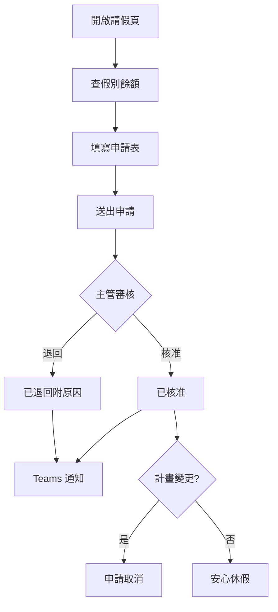
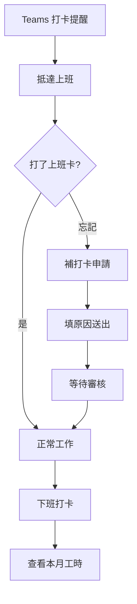
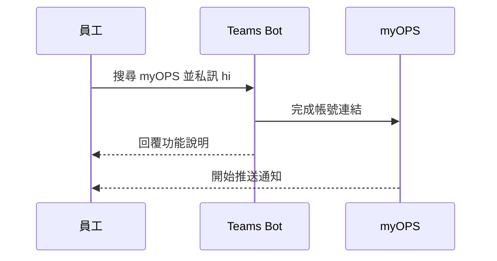

# myOPS — 一般員工使用說明

歡迎使用 myOPS（精拓生技營運管理系統）！這份說明書專為一般員工撰寫，帶你從第一次登入開始，一步步熟悉打卡、請假、加班、薪資查詢等日常功能。系統網址：**https://ops.cancerfree.io**

## 快速開始

### 系統需求

- **電腦**：使用近期版本的 Chrome、Edge、Safari 或 Firefox 瀏覽器即可，不需安裝任何軟體。
- **手機 / 平板**：直接用瀏覽器開啟 ops.cancerfree.io，介面會自動切換為行動版（手機有底部導覽列，平板有左上角選單鈕）。
- **驗證器 App**：首次登入需要設定雙因素驗證（MFA），請先在手機安裝 **Google Authenticator** 或 **Microsoft Authenticator**（App Store / Google Play 免費下載）。
- **公司帳號**：只能使用公司核發的 **@cancerfree.io** Microsoft 帳號登入，個人信箱無法使用。
- 登入頁下方有「快速開始指南」連結，內容與本章相同，忘記流程時可隨時查看。

### 首次登入（含 MFA 設定）

1. 開啟瀏覽器，前往 **ops.cancerfree.io**。
2. 點擊「**使用 Microsoft 帳號登入**」按鈕。
3. 在 Microsoft 登入頁輸入公司 Email 與密碼；若公司有條件式存取政策，依畫面指示完成。
4. 首次登入系統會要求設定 MFA：
   - 開啟手機上的驗證器 App，掃描畫面上的 **QR Code**（無法掃描時可改為手動輸入畫面提供的密鑰）。
   - 輸入 App 顯示的 **6 位數驗證碼**。
   - 點擊「驗證並啟用」完成設定。
5. 看到儀表板就代表登入成功，可以開始使用了！

### 後續每次登入

- 一樣點擊「使用 Microsoft 帳號登入」。
- 接著輸入驗證器 App 當下顯示的 6 位數一次性驗證碼（每 30 秒更新一次）。
- 驗證通過即進入系統。
- 若換了手機或驗證碼一直錯誤，請見「常見問題 FAQ」的 MFA 重置說明。

## 儀表板與公告

### 儀表板（登入後首頁）

- **今日待辦**：彙整你需要處理的事項，例如未確認的公告；若你有審核權限，也會列出待審請假與待審合約件數，點「立即處理」可直接前往。
- **今日打卡**：顯示你今天的上下班打卡狀態，一眼確認有沒有漏打。
- **最新公告**：列出近期公告，點「查看所有公告」進入公告列表。
- **快速入口**：打卡、請假、加班申請都能從儀表板快速進入。

### 公告閱讀與確認

- 進入「公告」頁可瀏覽全部公告，並依分類篩選：**人事公告 / 行政公告 / 法規・規章 / 緊急通知**。
- 重要公告需要點擊「**確認已讀**」，部分公告確認時會要求再輸入一次 MFA 驗證碼（雙重驗證），確保是本人確認。
- 尚未確認的公告會持續出現在儀表板的今日待辦提醒中，請盡快處理。
- 公告支援 **AI 翻譯**，可切換中文 / English / 日本語版本；若目前語言尚無譯文，會顯示原文。
- 公告發布時，已連結 Teams 通知的同仁也會收到 Teams 訊息提醒（見「個人設定與通知」）。

## 出勤、請假與加班

### 出勤打卡

- 進入「打卡」頁，點擊「**上班打卡**」或「**下班打卡**」即可，一天各一次。
- 打卡時系統會嘗試取得 GPS 位置；若無法取得，仍然可以打卡，只是紀錄不含座標。
- 「我的紀錄」分頁可查看本月每天的上下班時間與**工時統計**，可切換月份。
- **忘記打卡怎麼辦？** 點「**補打卡申請**」，選擇補打日期、類型（上班 / 下班）、時間，並填寫原因後送出，待審核通過即補登紀錄。
- 有連結 Teams 通知的同仁，平日早上與傍晚會收到 Bot 的打卡提醒訊息。

### 請假

- 「請假」頁有三個分頁：**假別餘額**、**申請請假**、**我的紀錄**。
- **查額度**：在「假別餘額」可看到各假別（年假、病假、事假、特休等）的剩餘額度，以及該假別是全薪、半薪或無薪。
- **送申請**：填寫假別、開始 / 結束日期（系統自動計算天數）、原因，並可指定**職務代理人**、上傳附件（如診斷證明）。
- **審核流程**：送出後由主管審核，核准或退回（退回必附原因）；結果會推送 Teams 通知。
- **取消請假**：已核准的請假若計畫改變，可在紀錄中申請取消。
- **團隊請假日曆**：用月曆視圖查看自己與團隊成員的請假排程，方便安排工作交接。

### 加班

- 「加班」頁分為**我的申請**與**新增加班**分頁。
- 申請時填寫：加班日期、**加班類型**（平日 / 假日 / 國定假日 / 專案 / 值班 / 緊急）、開始與結束時間（系統自動計算時數）、加班原因。
- 可選擇**關聯專案**（選填），方便專案負責人追蹤投入工時。
- 審核流程：送出 → 主管 → HR → 核准；退回時會附上原因，可修正後重新申請。
- **已核准的加班會計入薪資**，加班費依公司費率規則計算，下個薪資週期可在薪資單看到。

## 薪資、專案與文件

### 薪資查詢

- 「薪資」頁的「**我的薪資單**」列出每月薪資明細：**底薪、加班費、獎金、扣除項、應發合計、實發金額**。
- 扣除項包含**勞保、健保、勞退自提**等法定項目，明細逐項列出，方便核對。
- 薪資單發出時會收到 Teams 通知；只有狀態為「已發薪」的紀錄才是正式薪資單。
- 「**年度薪資彙總**」可查看整年度的薪資總覽，方便報稅或個人理財記錄。
- 薪資資料只有本人看得到，其他同事無法查看你的薪資。

### 專案參與

- 「專案」頁可瀏覽你參與的專案，查看專案名稱、負責人、狀態（進行中 / 已結案）。
- 任何員工都可以**建立專案**並指定負責人；成員的新增與管理由專案負責人進行。
- 專案頁可查看與該專案關聯的加班申請，了解團隊投入狀況。
- 申請加班時記得關聯到對應專案，工時統計才會準確。

### 文件與簽核確認

- 「文件」頁集中存放公司各類文件：公告、規章、保密協議（NDA）、合作備忘錄（MOU）、合約、內部文件等。
- 所有員工都可以**上傳文件**（支援 PDF、Word、圖片等格式），上傳後進入審核流程，由有權限的主管 / HR 核准後生效。
- 可依資料夾、類型、狀態篩選，或用名稱搜尋；點進文件可**下載**附件。
- 重要文件（如新規章）會要求「**確認閱讀**」，請點擊確認；未確認會列入儀表板待辦。
- 文件支援 **AI 翻譯**，一鍵產生中 / 英 / 日版本，跨國團隊閱讀無障礙。

## 個人設定與通知

### 個人設定

- 進入「個人設定」可修改**顯示名稱**，並查看自己的角色與身份。
- **語言**：介面支援繁體中文 / English / 日本語，切換後立即生效，Teams 通知也會以你選擇的語言發送。
- **主題**：可切換**淺色 / 深色模式**，依個人喜好與環境光線選擇。
- **MFA 管理**：可在此**重置 MFA**；重置後下次登入需重新掃描 QR Code 設定驗證器。

### 意見回饋（匿名）

- 從「回饋」進入提交表單，選擇類別：**工作環境 / 薪資福利 / 管理制度 / 其他**。
- 填寫詳細說明後送出；**提交完全匿名**，只有系統管理員能看到內容，請放心表達真實想法。

### Teams 通知

- myOPS 會透過 Microsoft Teams 的「**myOPS**」Bot 推送通知，包含：
  - **每日待辦摘要**（平日早上）：彙整你的未確認公告與待審事項。
  - **打卡提醒**（平日上班前與下班時間）。
  - **即時通知**：請假審核結果、薪資單發出、新公告發布。
- **重要：** Bot 無法主動傳訊給從未互動過的人。請先在 Teams 搜尋「**myOPS**」，對它**傳任意一則訊息（例如「hi」）**，Bot 回覆後即完成連結，之後就會收到通知。
- 通知語言跟著你在個人設定選擇的語言走。

### 手機與平板操作

- **手機**：畫面下方有**底部導覽列**（總覽、打卡、請假、文件），點「更多」可展開加班、公告、薪資、專案、回饋、設定等其餘功能。
- **平板**：點左上角的**選單鈕（漢堡圖示）**滑出完整側欄，點選項目或畫面其他位置即收合。
- 所有功能在行動裝置上皆可使用，按鈕已針對觸控優化，通勤途中也能順手打卡、請假。

## 工作流程圖

### 請假申請與審核流程

### 打卡日常流程（含補卡分支）

### Teams 通知連結（首次設定）

## 常見問題 FAQ

- **Q：登入時顯示帳號不被允許？**
  A：myOPS 只接受 **@cancerfree.io** 的公司 Microsoft 帳號，請確認沒有誤用個人帳號登入；若公司帳號仍無法登入，請聯絡系統管理員。

- **Q：換手機了，MFA 驗證碼進不去怎麼辦？**
  A：若還能登入，到「個人設定 → 雙重驗證 (MFA)」點「重置 MFA」，下次登入重新掃描 QR Code 即可；若已無法登入，請聯絡系統管理員協助重置。

- **Q：忘記打卡了怎麼補救？**
  A：到「打卡」頁點「補打卡申請」，填寫日期、類型（上班 / 下班）、時間與原因送出，審核通過後就會補登紀錄。

- **Q：收不到 Teams 通知？**
  A：最常見原因是還沒和 Bot 互動過。請在 Teams 搜尋「myOPS」並傳一則訊息（例如「hi」），收到 Bot 回覆即完成連結。

- **Q：請假被退回了該怎麼辦？**
  A：退回時主管必須填寫原因，會顯示在你的請假紀錄並推送 Teams 通知；依原因調整日期或補充說明後，重新送出申請即可。

- **Q：薪資單什麼時候看得到？**
  A：薪資完成內部確認並「發薪」後，你會收到 Teams 通知，即可在「薪資 → 我的薪資單」查看當月明細。

- **Q：介面可以改成英文或日文嗎？**
  A：可以。到「個人設定 → 語言」選擇 English 或日本語，介面立即切換，之後的 Teams 通知也會用該語言發送。

- **Q：意見回饋真的匿名嗎？**
  A：是的，回饋送出後不會顯示提交者身份，只有系統管理員能看到內容本身。

## 版本資訊

- **文件適用版本**：myOPS v0.3.1
- **文件更新日期**：2026-06-11
- **本版重點（與員工相關）**：
  - Teams 通知正式上線：每日待辦摘要、上下班打卡提醒、請假審核結果、薪資單發出、公告發布皆會推送至 Teams，並依個人語言設定發送。
  - 平板新增滑出式側欄選單，行動裝置觸控體驗優化（按鈕加大、表格可橫向捲動）。
  - 介面三語（繁中 / 英 / 日）全面補齊，包含錯誤訊息。
- 系統網址：https://ops.cancerfree.io ｜ 系統內建說明請見側欄「說明文件」頁。
