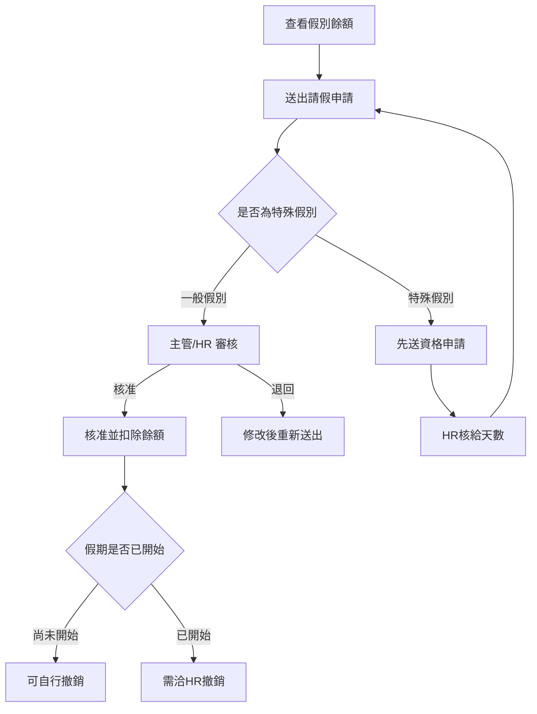
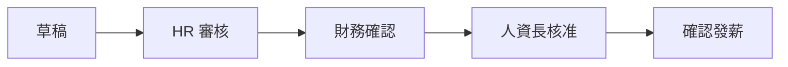
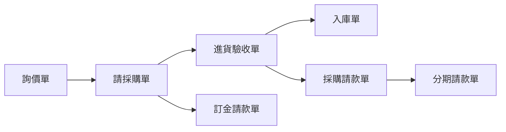

# myOPS 使用說明書 — 一般使用者

myOPS 是公司內部的人事、採購、薪資與行政作業系統。這份說明書以「一般使用者、日常操作」的角度整理，帶你認識每天會用到的功能：打卡請假、加班出差、薪資查詢、採購申請、簽核中心，以及文件公告等。如果畫面上有些按鈕或分頁你看不到，通常代表那個功能需要額外的權限（例如主管、人資或管理員），並非操作有誤。

## 快速開始

### 系統需求

- 用瀏覽器連上 **https://ops.cancerfree.io** 即可使用，不需要安裝任何軟體；手機、平板、電腦都能開啟，介面會依螢幕大小自動切換。
- 建議使用近期版本的 Chrome、Edge、Safari 等主流瀏覽器，打卡定位、庫存掃碼、附件上傳等功能才能正常運作。
- 使用打卡定位或掃碼功能時，瀏覽器會跳出「允許存取位置／相機」的權限請求，記得選擇允許。
- 只用公司核發的 Microsoft 帳號（@cancerfree.io）登入，個人信箱無法使用。
- 部分功能需要額外授權才能同步：例如請假、出差核准後要寫進你的 Outlook 行事曆，需要你先用公司 Microsoft 帳號完成行事曆存取授權，否則只會停留在 myOPS 裡、不會出現在你的 Outlook 上。

### 首次登入與初始設定

- 開啟 ops.cancerfree.io，點選用 Microsoft 帳號登入，輸入公司 Email 與密碼完成驗證。
- 首次登入系統會要求設定兩階段驗證（MFA）：用手機的 Authenticator 類 App（例如 Google Authenticator、Microsoft Authenticator）掃描畫面上的 QR Code 完成綁定。之後只要是核准、駁回這類重要操作，都要先用 App 產生的驗證碼再次確認身分。
- 登入後可以到「個人設定」修改顯示名稱、切換淺色／深色主題、切換介面語言（繁體中文／English／日本語）。
- 如果手機遺失或需要換一台裝置設定驗證器，可以在「個人設定」自行重置 MFA，下次登入再重新掃碼即可，不需要找管理員協助。
- 工作上如果需要接收簽核通知或用文字查詢待辦事項，記得沒有在 Microsoft Teams 封鎖公司的機器人 **Dr.Ave**，否則會完全收不到任何通知卡片。

## 出勤、請假與績效教育訓練

出勤打卡、請假、加班、出差與公司行事曆是每天都會用到的功能，彼此資料也會互相帶入（例如出差核准後可以直接建立報帳單）；績效考核與教育訓練則是配合公司排定的週期定期進行。

### 出勤與假勤管理

#### 打卡

- 上班、下班各點一次「打卡」；如果公司對你的部門開啟了「打卡範圍限制」，系統會先取得你目前的定位，位置必須落在允許範圍內才能打卡成功。
- 打卡頁會顯示你今天的上下班時間，以及這筆紀錄是不是系統自動幫你補上的。
- 到「我的紀錄」分頁，依年、月查詢自己過去的打卡紀錄與工時。
- 忘記打卡時可以用「補打卡」申請補登：填日期、上班或下班、時間與原因後送出，會進入簽核流程，等有權限的人核准後系統才會補上正式紀錄。
- 人資或管理員在同一頁多了「全員紀錄」分頁，可以查看、篩選整間公司的出勤紀錄，並能作廢或還原有問題的紀錄；如果你是用舊網址 `/admin/attendance` 進來，現在會自動轉址到這裡。

#### 請假

- 在「假別餘額」分頁查看自己各假別目前用了多少、還剩多少天；特休以到職週年計算，其他假別多以曆年計算。
- 到「我要請假」送出申請：選假別、起訖日期（單日可只請半天）、事由，也能指定代理人，系統會自動算出天數並檢查餘額夠不夠。
- 婚假、喪假、產假、產檢假、陪產（檢）假、安胎假、育嬰留停等需要審核資格的假別，要先到「特殊假申請」提出資格申請並附上證明文件，等人資核給天數後才能正式送出這個假別的請假單。
- 「我的紀錄」可以查看自己歷史請假單與目前狀態；還在審核中的申請可以自行取消，尚未開始的已核准假期也能自己撤銷（會退回餘額並移除 Outlook 上對應的事件），但假期一旦已經開始，就要請人資或管理員協助撤銷。
- 有部屬要審核、或本身是人資／管理員的人，會在「待審核」分頁看到需要自己處理的假單，核准與退回都需要先完成兩階段驗證；人資與管理員另外還能在「全員紀錄」查看全公司的假單。

#### 請假行事曆

- 用月曆檢視當月每一天有多少人請假，綠點代表已核准、黃點代表還在審核中。
- 點選某一天，下方會列出當天所有請假的人、假別、期間、天數與狀態。
- 勾選「只看我的部門」可以快速篩選同部門同事的請假狀況，方便排班或協調工作。
- 用左右箭頭切換月份；一般同事看到的是自己部門的範圍，人資或管理員則可以切換查看全公司並用部門下拉篩選。

#### 加班

- 到「新增申請」送出加班單：填日期、起訖時間，系統會自動判斷是工作日、休息日還是國定假日（週六週日會自動判定為休息日），也可以選填相關專案與加班事由。
- 系統會自動算出加班時數；如果跨過午夜，會自動算成隔天的加班。
- 「我的申請」可以查看自己所有加班單的歷史紀錄與目前狀態。
- 有審核權限的人（通常是你的直屬主管、相關專案的負責人，或人資／管理員）會在「待審核」分頁處理，核准或退回都需要完成兩階段驗證；核准後的加班會依工作日、休息日、國定假日對應的加班費率計入你的薪資。
- 人資或管理員可以在「全員紀錄」查看全公司的加班紀錄。

#### 出差管理

- 到「新增申請」送出出差單：填目的地、事由、起訖日期，也可以附上詳細行程。
- 送出後系統會自動指定你當時的直屬主管作為審核人，「我的出差」可以查看自己所有出差單的歷史與狀態，還在審核中的申請可以自行取消。
- 核准後會自動在你的 Outlook 行事曆建立整天的出差事件，如果之後被退回，這個事件也會自動移除。
- 出差結束後可以直接從「我的出差」點「建立報帳」，系統會自動帶入目的地與日期，省去重新輸入。
- 公司行事曆會顯示已核准的出差（只顯示目的地），人資與管理員可以在「全員紀錄」查看全公司的出差紀錄。

#### 公司行事曆

- 月曆會同時顯示公司活動（綠色）、同事請假中（藍色，只顯示「請假中」不會透露具體假別）與同事出差（紫色）。
- 點選某一天可以看到當天完整的活動、請假、出差清單，公司活動還會顯示活動說明。
- 對公司活動可以直接點「參加」「不參加」「未定」進行 RSVP，也能展開查看目前各狀態的人數與名單。
- 人資或管理員可以新增、編輯、刪除公司活動；活動異動會自動同步推播到全體已連結 Outlook 的同事行事曆上（推播是盡力而為，失敗不影響活動本身）。

### 績效與教育訓練

公司會分期開放績效考核週期，並替每位同仁指派教育訓練課程、追蹤個人證照效期。

#### 績效考核 — 我的考核

- 考核週期開放時，點「開始考核」啟動屬於自己這一期的考核紀錄。
- 新增自己的考核目標（標題、說明、權重百分比），所有目標的權重加總必須剛好等於 100% 才能送出。
- 送出後等主管核定；如果被退回，會看到退回原因，修改後可以再送一次。
- 目標核定通過後，針對每一項目標自己先打 1 到 5 分並填寫自評說明，全部評完才能送出自評。
- 主管完成評分並鎖定結果後，就能看到每項目標的自評分、主管給分、加權後的分數、最終總分、主管總評，以及當期每日報告 KPI 目標與實績的對照。

#### 績效考核 — 團隊考核

- 如果你有部屬，可以在同一個頁面切換看「團隊考核」，檢視每位部屬本期考核進度（設定目標中、待核定、待自評、待評分、已完成）。
- 核准或退回部屬送出的考核目標，退回時需要填寫原因，操作都需要完成兩階段驗證。
- 等部屬完成自評後，逐項目標打分、填評語，再填整體總分（可以打半分）與總評語，完成後鎖定這期考核。
- 可以同時查看部屬的自評分數、自評說明，以及當期每日報告 KPI 對照；人資或管理員則可以切換查看全公司所有人的考核進度。

#### 教育訓練 — 我的訓練

- 檢視自己被指派的訓練課程清單，必修課程會特別標示，也會看到每門課的時數與教材連結。
- 完成一門課程後，點「標記完成」上傳結業證明或相關附件（圖片或 PDF）並填寫備註。
- 頁面上方會顯示自己本年度累計完成的訓練時數，方便掌握進度。

#### 教育訓練 — 證照管理

- 新增自己的證照資料：證照名稱、發證機構、證號、發證日、到期日、上傳附件與備註。
- 系統會依到期日自動標示「即將到期」（到期日 30 天內）或「逾期」，方便提早安排換證。
- 可以隨時編輯自己已登錄的證照；如果需要刪除，或是想幫其他同事登錄證照，要請訓練管理者協助處理。

## 薪資、報帳與個人設定

薪資單需要走過人資、財務、人資長逐關確認才會正式發佈，一般同仁只會在流程走完後看到自己的薪資單；報帳、個人帳號設定與 AI 政策問答，則是每位同仁都會用到的日常小工具。

### 薪資管理

#### 薪資

- 打開「薪資」頁會看到「我的薪資單」分頁，列出自己最近 12 個月、已經走完全部審核流程（狀態為「人資長已核准」或「已發放」）的薪資單摘要，包含底薪、加班費、扣除項與實發金額。
- 點任一筆薪資單可以進入「薪資明細」查看完整組成。
- 薪資的計算、逐關審核與確認發薪都是由人資、財務、人資長等相關角色在背後處理，一般同仁不需要（也看不到）操作這些步驟，只需要等結果出現在自己的清單中即可。
- 如果本月薪資還在流程裡沒走完，你會暫時在清單裡看不到它，這是正常現象，不是系統出錯。

#### 薪資明細

- 點進某一筆薪資單，可以看到完整組成：應發項目（本薪、加班費、獎金、其他加項）、應扣項目（無薪假扣款、勞保費、健保費、勞退自願提繳、其他扣項）與實發金額。
- 也會看到雇主替你負擔的勞保費、健保費、勞退 6% 提繳金額，不只是自己實拿的部分。
- 如果系統掃描出這筆薪資有異常（例如加班超時、金額波動、無薪假扣款偏高），會在這裡顯示提示。
- 可以看到這筆薪資單的審核紀錄（誰在什麼時候確認、核准、發放），但沒有任何可以自己操作的按鈕，簽核動作要回到「薪資」主頁進行。
- 可以直接連到「年度薪資彙總」查看整年度的資料；只有自己已核准或已發放的薪資單才能被看到，就算知道網址直接輸入也看不到還沒完成審核的薪資單。

#### 年度薪資彙總

- 選擇年度（可以查當年及前後兩年），查看自己整年 1 到 12 月的薪資逐月明細與全年合計。
- 頁面上方有全年總收入、全年扣除、全年實發三張總覽卡。
- 還沒有薪資單的月份會顯示「—」，代表人資還沒建立當月薪資，不是系統錯誤。
- 人資或財務相關人員可以切換查看其他在職同仁的年度資料，一般同仁只能看到自己的。

### 報帳與個人設定

#### 員工報帳

- 新增報帳申請：選擇費用類別（差旅費、交際費、職工福利、文具印刷、雜支、其他費用），填費用日期、要歸入的申請月份（可以跟費用日期不同月，例如月底的收據算下個月報帳）、發票號碼（選填）、事由與金額（目前只支援台幣）。
- 上傳發票或收據照片、PDF 作為附件，可以上傳多張。
- 已核准的出差單可以一鍵帶入報帳表單，自動預填目的地與日期。
- 在「我的報帳」查看自己所有申請的狀態（待審核、已核准、已退回、已撥付、已取消）與審核人留下的備註；還在待審核狀態的申請可以自己取消。
- 如果具備報帳審核權限，會另外看到「待審核」分頁與全員記錄，並可以匯出明細；依規定不能審核自己送出的申請，核准、退回、撥付都需要先完成兩階段驗證。

#### 個人設定

- 修改自己的顯示名稱並儲存。
- 查看自己的 Email、角色與身份（唯讀，由人資或管理員指派，如果資訊有誤要請人資協助更新）。
- 切換淺色或深色主題，會立即套用並記在你的帳號上，換裝置登入也會是同一個主題。
- 切換介面語言（繁體中文、English、日本語），切換後系統會自動套用並導回本頁。
- 需要時可以自行重置兩階段驗證（MFA），下次登入時重新掃描 QR Code 設定即可。

#### AI 政策問答

- 在「說明」頁的問答框輸入問題（最多 500 字），AI 會依公司已發布的規章、公告、內部文件內容回答，並附上「參考了幾份公司文件」的資訊（目前只顯示篇數，不會列出可點的文件清單）。
- 回答會自動用你在個人設定裡選擇的介面語言呈現。
- 在 Teams 私訊公司機器人 Dr.Ave 打字問問題，只要不是「待簽」「請假」「薪資」這類既有指令，也會用同一套邏輯回答。
- 這個功能整體是否開放由管理員決定；如果被關閉，問一次就會被拒絕，問答框也會自動隱藏。

## 採購與庫存管理

從詢價比價、開立請採購單、驗收進貨、入庫出庫，到請款開票，整條採購流程都在這個模組群裡；金額愈大，需要經過的簽核關卡也愈多。多數功能需要具備「採購」相關權限才能操作，如果你完全看不到「採購」選單，代表帳號還沒被開通這項功能，請找管理員或人資協助開通。

### 詢價與請購

#### 詢價單

- 建立詢價單草稿：填請購日期、請購部門、請購人、指定負責詢價的人員、緊急程度、預計到貨日等基本資料。
- 在品項表格新增要採購的商品（商品名稱、編號、規格、單位、需求數量、用途說明、建議廠商）。
- 指定的詢價人員負責逐品項登錄多家廠商報價（廠商、單價、報價日期、備註），並勾選每個品項最終「採用」的那一筆報價，同一品項只能採用一筆；也可以上傳廠商報價單附件。
- 送簽後由詢價人員本人先簽核，再交部門主管簽核，兩關都需要完成兩階段驗證；簽核期間只有負責的詢價人員可以編輯內容，其他人（包含原本的請購人）看到的都是唯讀畫面。
- 核准後可以一鍵「轉採購單」，系統會自動帶入所有品項與採用的單價，如果全部品項都採用同一家廠商，還會一併帶入該廠商的聯絡與付款資料。

#### 請採購單

- 新增一張空白請採購單草稿，填表頭資料（日期、請購部門、緊急程度），選擇廠商後會自動帶出統編、聯絡人、付款條件等資訊。
- 用品項編輯器挑選商品（自動帶出商品編號、名稱、規格、單位）或手動新增品項，填單價與數量後系統會自動算出金額、小計、稅額與合計（稅額也可切換成手動輸入）。
- 草稿階段就可以先預覽這張單金額試算後大概會經過哪些簽核關卡，送簽前心裡有個準備。
- 送出後先由部門主管簽核；合計金額超過 3,000 元會多一關營運長（COO）簽核，超過 20,000 元還會再加一關執行長（CEO）簽核，金額愈大關卡愈多，每一關核准或駁回都需要完成兩階段驗證。
- 核准後可以「轉進貨驗收單」或「轉訂金請款單」接續後面流程；草稿狀態時建立人可以自由修改，一旦送出簽核就不能再改。

### 進貨與請款

#### 進貨驗收單

- 新增驗收單，可以選填來源請採購單號，系統會帶出該單的品項供對照；不填的話品項留空自行填寫。
- 填寫到貨、驗收、確認入庫的時間、廠商資訊，以及金額（小計、稅率、稅額、運費、合計）、發票號碼與日期。
- 上傳發票單據與出貨單據附件，可以直接線上檢視；如果是舊系統搬過來但檔案沒有一起搬的附件，會顯示提示文字，不會出現打不開的死連結。
- 如果已經先付過訂金，可以勾選「已付訂金」並填入對應的訂金請款單號與金額。
- 送簽後先由最後修改這張單的人確認，再由任一位採購同仁二次確認，兩關都需要兩階段驗證；核准後可以「轉入庫單」或「轉請款單」，具資產管理權限的同仁還可以直接把驗收品項轉為公司資產。

#### 採購：訂金請款單

- 通常由已核准的請採購單按「訂金請款」轉單自動產生草稿，銀行匯款資訊會自動帶入廠商主檔上登記的資料。
- 編輯草稿內容：訂金金額、合計金額、要求匯款期限（這是必填才能送簽的欄位）、實際匯款日期，以及可以覆寫的銀行匯款資訊。
- 送簽後由會計人員核准，核准的人不會是自己送出這張單的人（依規定不能自己審自己），核准需要完成兩階段驗證。
- 核准後，這筆訂金會自動顯示在對應的進貨驗收單上，標記「已付訂金」與金額，不用手動對帳。

#### 採購：採購請款單

- 通常由已核准的進貨驗收單按「請款」轉單產生草稿，會自動帶入廠商、統編、金額與來源單據資料。
- 編輯請款月份、金額（可調整並填調整備註）、是否分期付款、付款方式與條件、銀行資訊。
- 系統會擋下同一張請採購單被重複開立請款單的情況；如果需要分批付款，要在同一張單上另外「建立分期請款」，而不是重新開一張新的採購請款單。
- 送簽後由會計人員核准（一樣不能自己審自己送出的單），核准需要完成兩階段驗證。

#### 採購：分期請款單

- 只能從已核准且勾選「是否分期」的採購請款單上按「建立分期請款」產生，不能單獨無來源新建；期數由系統自動編號。
- 編輯這一期的請款月份、金額、發票號碼與日期，並上傳這一期的發票檔案（圖片或 PDF）。
- 可以隨時查看、下載已上傳的發票檔案。
- 送簽後同樣由會計人員核准，需要完成兩階段驗證。

### 廠商與商品主檔

#### 廠商主檔

- 瀏覽公司所有合作廠商的清冊，可以用編號、名稱、簡稱、類別、聯絡人、電話等關鍵字搜尋。
- 點開廠商可以看到完整資料，分成基本、聯絡、帳務、銀行四個區塊，包含填表人與相關附件連結。
- 在詢價單、請採購單等單據挑選廠商時，系統會自動帶入這裡登記的統編、聯絡人、付款條件等資訊，不用重複輸入。
- 新增或編輯廠商資料需要採購管理相關權限；一般同仁如果需要登錄新廠商，可以透過「廠商/商品審核評估」走簽核流程，核准後系統會自動把資料寫入這裡。

#### 商品主檔

- 瀏覽公司所有採購商品的清冊，可以用編號、名稱、規格、類別、品牌、料號等關鍵字搜尋，表格上直接看得到目前庫存量與單位換算關係。
- 點開商品可以看到詳細資料（規格、類別、品牌、來源、料號、預設部門）與目前庫存量。
- 詳情裡的「廠商報價」表格會列出各廠商過去對這個商品的報價紀錄，方便比價參考。
- 點商品名稱可以進入「商品出入庫分類帳」查看這個商品的完整庫存異動歷史。

#### 商品出入庫分類帳

- 從商品主檔點商品名稱進入，可以看到商品基本資料與目前庫存總量。
- 查看「目前在庫批號」清單：批號、儲位、倉庫、效期，效期在 90 天內或已經過期的批號會用顏色特別標示提醒。
- 選擇年度可以看到該年度的進貨量、出貨量與期末結餘。
- 展開逐筆異動明細，可以看到每一筆入庫、出庫、調整、作廢的紀錄與異動後的結餘，點單號可以連回對應的入庫單或出庫單詳情頁；這個頁面純粹查詢，資料是由入庫、出庫單過帳後自動產生的。

#### 廠商/商品審核評估

- 用兩個頁籤切換「廠商評估」與「商品評估」兩種表單。
- 廠商評估：填寫要登錄的新廠商完整資料（分基本、聯絡、帳務、地址、付款、銀行等區塊）並送簽，核准後系統會自動把資料寫入廠商主檔並產生廠商編號。
- 商品評估：填來源詢價單號與備註送簽，通常用來記錄比價的依據。
- 送簽後，廠商評估會由較高層級主管簽核，商品評估則由送單人自己的直屬主管簽核，兩者都需要完成兩階段驗證。

### 庫存作業

#### 採購：入庫單

- 手動新增入庫單草稿，填單頭資料（來源進貨驗收單號選填、單據日期、備註）與品項（商品、倉庫、批號選填、效期選填、數量）；也可以用掃碼槍或手機相機掃描貨號、庫存編號或批號，自動帶入品項並累加數量。
- 草稿狀態且尚未過帳前，都可以自由編輯或刪除自己建立的單子。
- 送簽後由建立這張單的人自己確認（等同自己審自己這一關），仍然需要完成兩階段驗證。
- 核准後按「入庫」正式過帳，系統會把數量寫入對應批號的庫存與異動分類帳，同時回填來源請購單的進貨進度。
- 如果過帳後發現有問題，可以執行「沖銷過帳」把數量退回，但如果這批貨已經被後續出庫用掉了，系統會擋下並提示。

#### 採購：出庫單

- 跟入庫單用同一套介面與掃碼機制，差別是這裡選的是「既有的庫存批號」而不是商品；填單頭（出貨單號選填、單據日期、備註）與品項（選批號、出庫數量）。
- 草稿狀態可以自由編輯或刪除；送簽後同樣由建立人自己確認，需要完成兩階段驗證。
- 核准後按「出庫」正式過帳，系統會從對應批號扣減庫存；如果庫存不足會被系統擋下，不會讓數量變成負的。
- 如果過帳後發現有誤，也可以執行「沖銷過帳」把扣減的量加回去。

#### 採購：庫存查詢／掃碼查詢

- 手機優先設計，方便直接在倉庫現場用掃碼槍或手機相機掃描貨號、庫存編號或批號查詢。
- 系統會依序比對商品貨號、庫存編號、批號，找到商品後列出它目前所有在庫批號、數量、所在倉庫與效期。
- 下方也有完整的庫存清單，可以用任何欄位關鍵字搜尋、排序，方便盤點或核對庫存；這個頁面純粹查詢，不會更動任何資料。

### 轉單與作廢

#### 採購：轉單（文件轉換鏈）

- 「轉單」不是獨立的頁面，而是嵌在已核准文件明細頁上的按鈕（例如已核准的進貨驗收單頁面上會有「請款」按鈕），按下去就會自動把上一張文件的內容複製成下一階段文件的草稿，省去重新輸入。
- 全系統一共有六條轉換鏈：詢價單轉請採購單、請採購單轉進貨驗收單或訂金請款單、進貨驗收單轉入庫單或採購請款單、採購請款單建立分期請款單。
- 只有「已核准」狀態的文件才能轉單，轉單本身不需要兩階段驗證（因為只是建立新草稿），但後續正式送簽核准仍然需要。
- 轉單後系統會自動帶入品項、金額、廠商等可以推導出來的欄位，剩下的部分需要自己補齊再照目標文件原本的流程送簽。

#### 採購：作廢／作廢並複製

- 已經核准或已經被駁回的單子，如果發現內容有誤，具採購管理權限的人可以執行「作廢」，填寫作廢原因後生效，操作需要完成兩階段驗證。
- 「作廢並複製」會在作廢的同時，另外複製出一張全新的草稿，方便修正錯誤後重新走一次流程。
- 目前這個作廢按鈕只出現在詢價單、請採購單、進貨驗收單的明細頁；入庫單、出庫單，以及訂金、採購、分期三種請款單目前介面上還沒有作廢按鈕，如果真的需要作廢這幾類單據，要請管理員協助處理。
- 任何文件一旦被作廢，它的明細頁都會清楚顯示「已作廢」與作廢原因，看得到這張單的人都能看到這個狀態。

## 簽核中心、文件公告與專案協作

簽核中心是全公司使用率最高的頁面之一，把原本要分別跑去各模組確認待審事項的動作集中在一個地方；這個章節同時也整理了文件、公告、合約、意見回饋，以及專案協作、每日填報、資產設備等功能。

### 簽核中心與 Teams 一鍵簽核

#### 簽核中心

- 打開這個頁面就能一次看到所有等待自己審核的事項，涵蓋請假、加班、補打卡、出差、報帳、文件/合約、薪資、採購共八大類，總筆數會顯示在頁面上方，全部清空時會顯示「太好了，全部清空」。
- 對請假、加班、補打卡、出差、文件合約、採購逐筆按「核准」或「駁回」，駁回時系統會先跳出視窗要求填寫理由才能送出。
- 報帳項目狀態為待審核時可以核准或駁回，已核准的報帳單按鈕會變成「標記已付款」。
- 薪資關卡按「核准」時，系統會自動依這筆薪資目前卡在哪一關（人資審核、財務確認、人資長核准、確認發薪）送出對應的動作，不需要自己先跑去薪資頁判斷。
- 每筆項目旁邊都有外部連結圖示，可以直接跳去該單據完整的詳情頁看更多資訊再決定；按右上角「重新整理」可手動重新抓取最新清單，如果核准/駁回失敗且原因是還沒完成兩階段驗證，畫面會明確告知要先完成才能繼續。

#### Teams 一鍵核准與簽核通知卡片

- 身為採購單據的核准人時，公司的 Teams 機器人 Dr.Ave 會直接把待審通知卡片推送給你，不用主動打開網頁。
- 如果這類單據金額在管理員設定的門檻內開放「一鍵直簽」，卡片上會有「核准」「退回」兩顆按鈕，直接在 Teams 點擊就能完成簽核，不需要再開瀏覽器、也不需要兩階段驗證。
- 如果不符合一鍵直簽的條件，卡片只會有一顆「前往簽核」按鈕，點擊會開啟 ops.cancerfree.io 對應的單據頁面，在網頁上完成核准（仍然需要兩階段驗證）。
- 點擊後會收到成功或失敗的回覆訊息，例如公司政策剛好調整導致這張單不能再一鍵核准時，會提示你改到網頁上處理。
- 如果你在 Teams 封鎖過 Dr.Ave，就算你是核准人也收不到任何通知卡片，這是需要自己在 Teams 解除封鎖的已知情況，不是系統故障；v1.0.5 版本也修好了一個相容性問題，之前部分帶按鈕的通知卡片點擊後會失敗，現在已經恢復正常。

#### Teams 文字指令查詢

- 私訊 Dr.Ave 打「待簽」或「pending」，可以查詢目前有幾筆採購相關的簽核正輪到自己處理。
- 打「請假」「休假」「特休」等關鍵字，可以查詢本年度各假別還剩多少天。
- 打「薪資」「薪水」等關鍵字，可以查詢當月薪資單目前處理到哪個階段。
- 如果問的不是以上三種關鍵字，例如問公司規定相關的問題，只要管理員開啟了 AI 政策問答功能，Dr.Ave 會自動用同一套邏輯幫你回答；沒開啟的話會回覆看不懂這個指令。
- 所有回覆都會用你自己帳號設定的介面語言顯示。

### 文件、公告與合約

#### 文件管理

- 依資料夾（共用、合約、內部、已封存）、文件類型、狀態、關鍵字搜尋並瀏覽自己有權限看到的文件。
- 上傳文件：填標題、選擇文件類型（系統會自動決定歸到哪個資料夾），選擇性上傳附件。
- 上傳合約類文件（NDA、MOU、合約、增補）時可以指定關聯公司、填到期日；如果這家公司已經有其他文件，系統會列出來供你勾選建立關聯。
- 上傳內部文件時可以選部門，送出後會直接自動核准，不需要等待審核；公告與合約類文件則會進入待審流程，由具權限的人核准或退回。
- 合約類文件只有上傳者本人、掛名的擁有者，或具核准權限的人才看得到，一般同事看不到別人上傳的合約；公告與法規類文件則所有同仁都能看到。

#### 文件詳情

- 檢視文件完整資訊（上傳者、上傳時間、關聯公司/部門、到期日、核准者），並下載附件。
- 如果是公告且自己是收件人，完成兩階段驗證後可以在這裡點「確認閱讀」。
- 檢視這份文件完整的處理歷程（上傳、核准、退回、翻譯、確認閱讀、催確認等記錄）。
- 具核准權限的人可以在這裡核准或退回待審文件（需要兩階段驗證，且不能核准自己上傳的文件）；具發布權限的人可以在這裡設定收件人並正式發布公告。

#### 公告

- 「待確認」分頁列出自己還沒讀完需要確認的公告，點卡片會進到文件詳情頁完成確認。
- 「全部」分頁可以用關鍵字或分類（人資、行政、法規、緊急）搜尋瀏覽所有已發布的公告。
- 具發布權限的人會多一個「發布報表」分頁，可以看每篇公告的收件與確認狀態，對還沒確認的人發送 Teams 提醒，也能匯出確認名單。
- 公告一律對所有登入同仁開放瀏覽，只有「發布報表」分頁與催確認、匯出的操作需要發布權限。

#### 公告詳情（獨立頁，目前無入口連結）

- 這是公告的獨立詳情頁，會依你的語言偏好自動顯示中文、英文或日文內容，有多語版本時也可以手動切換比對，並標示是否為 AI 翻譯。
- 如果是該公告的指定收件人且尚未確認，可以在這裡完成兩階段驗證後點「確認閱讀」，跟文件詳情頁的確認閱讀是同一套機制、狀態互通。
- 目前 myOPS 介面上沒有任何按鈕或連結會帶你到這一頁，公告清單一律導去文件詳情頁；如果你是靠直接輸入網址進來這裡，功能仍然正常，只是暫時沒有入口連結，不用擔心是操作錯誤。

#### 合約管理

- 瀏覽公司的 NDA、MOU、合約、增補文件清單，可以依類型、狀態、關聯公司、關鍵字搜尋。
- 到期日欄位會用顏色標示：已過期與 30 天內到期用紅色，31 到 90 天到期用橘色，一看就知道哪些合約快到期了。
- 一般同仁只能看到自己上傳或掛名擁有者的合約，看不到其他同事上傳的合約；具核准權限的人可以看到全部合約。
- 系統會在合約到期前 90 天與 30 天自動用 Teams 提醒具審核權限的人考慮是否續約。

#### 合約詳情

- 檢視合約詳細資訊（關聯公司、上傳者、上傳日期、檔案大小、到期日與剩餘天數提示）並下載附件。
- 檢視同一家公司名下其他相關文件（最多列出 10 筆），可以點擊直接跳轉比對。
- 檢視這份合約完整的處理歷程（核准、退回的時間與操作人）。
- 待審核時，具核准權限的人可以在這裡核准或退回（需要兩階段驗證，且不能核准自己上傳的合約），結果會用 Teams 通知上傳者，合約類文件還會額外通知公司高層。

### 意見回饋

#### 意見回饋（我的回饋）

- 檢視自己送出過的所有意見回饋，包含類型（功能建議或錯誤回報）、目前狀態、送出時間與附圖數量。
- 展開單筆回饋可以看到完整描述與附圖，點圖可以看原圖大小。
- 在留言串裡可以繼續回覆管理員；如果這則回饋已經被標記「完成」或「退回」，自己再追加留言會自動把狀態重新打開為「待處理」。

#### 送出意見回饋

- 選擇類型：功能建議或錯誤回報。
- 填標題與說明（兩者都必填）。
- 可以選擇性上傳一張截圖，方便說明問題。
- 送出後會自動導回「我的回饋」列表，狀態顯示為「待處理」；這是系統裡少數預設對所有人開放的功能。

### 專案協作與每日填報

#### 專案列表

- 瀏覽公司所有專案卡片：名稱、說明、負責人、目前狀態（進行中/已結案）、成員數與建立日期。
- 點「成員管理」可以開啟視窗查看某個專案目前的成員與角色，並選人加入該專案成員名單。
- 建立新專案需要具備專案管理權限或是管理員；如果你是專案負責人或成員，也可以直接輸入專案網址進入詳情頁查看更多資訊。

#### 專案詳情頁

- 查看單一專案的基本資料、起訖日期範圍、負責人與成員名單。
- 查看跟這個專案相關的加班申請紀錄（日期、申請人、時段、時數、簽核狀態）。
- 只有管理員、這個專案的負責人或成員才能進入這一頁，其他人存取會被導向沒有權限的畫面。

#### 每日填報

- 用日期選擇器切換日期（前一天、後一天、回到今天），資料以台北時區判定「今天」。
- 「今日行程」分頁：新增、編輯、刪除今天要做的行程項目並勾選完成狀態；如果之前已經建立過常用的行程樣板，可以點「從樣板填入」一次套用（尚未建立過樣板時不會出現這顆按鈕）。
- 行程項目左邊的圈圈點一下就是標記完成，儲存後主管即可在「團隊總覽」看到完成進度——這就是完成回報，不需要再另外填寫（原本獨立的「完成回報」分頁功能重複，已移除）。
- 「KPI」分頁會顯示主管或人資事先設定好的指標，輸入當日數值後系統會自動儲存，切換日期時還沒存的數值也不會遺失；如果還沒有人設定任何指標，畫面會提示聯繫主管。

#### 我的任務

- 查看被指派給自己的任務清單，包含優先度（高/中/低）、目前狀態（進行中/待確認/已完成）與截止日。
- 展開任務可以看到子任務清單（唯讀顯示，勾選子任務需要主管或觀看者權限）。
- 完成任務後點「標記完成」，狀態會變成「已完成，待確認」，等主管或觀看者確認後才會正式結案；已完成的任務會自動摺疊收在下方。

#### 團隊總覽

- 如果你是主管（在系統上被設為某個群組的觀看者），可以選擇群組與日期，查看該群組全體成員當天的行程與完成勾選彙整，包含每人完成數/總數的徽章。
- 可以建立新任務並指派給一位或多位成員，也可以確認成員標記完成、待確認的任務。
- 可以新增、編輯 KPI 指標（名稱、目標值、單位、週期），或停用、刪除既有指標，成員會在自己的「每日填報」看到這些指標。
- 如果只是一般成員身分進來看同群組夥伴的資料，只能看到行程與完成勾選狀態，看不到任何 KPI 數字。

### 資產與試劑耗材

#### 試劑耗材管理

- 用關鍵字（品名、目錄號）與類別（試劑、耗材、其他）搜尋、篩選品項清單。
- 查看每個品項的保存條件、目前總庫存量，如果庫存低於安全庫存會顯示提醒徽章。
- 展開品項可以看到底下所有批次：批號、效期（快到期或已過期會有特別標示）、數量、入庫日期、狀態、是否已開封。
- 切換到「到期提醒」分頁，可以看到未來 60 天內即將到期（或已經過期）的所有批次，依效期排序。
- 新增品項、入庫新批次，以及執行使用、開封、報廢等異動操作，需要具備試劑管理權限，一般同仁只能查看。

#### 資產設備 — 資產清單

- 用名稱、資產編號或序號搜尋，或依分類與狀態篩選公司資產清冊（IT 設備、實驗儀器、傢俱、其他）。
- 展開單筆資產可以看到詳細資訊（保管人、位置、購買資訊、校驗/保養週期與下次到期日）。
- 查看這個資產完整的歷史記錄（保養、校驗、維修、領用、歸還、備註），含附件下載連結。
- 編輯、刪除資產，或新增保養/校驗/領用等記錄，需要具備資產管理權限；一般同仁只能查看，不能修改。

#### 資產設備 — 到期提醒

- 列出全公司未來 60 天內即將到期或已經逾期的校驗/保養項目，依到期日排序並標示剩餘或逾期天數。
- 已經報廢的資產不會出現在這個清單裡。
- 這個清單純粹供查看提醒使用，如果需要實際處理，要到資產清單找到對應資產，由具資產管理權限的人新增校驗或保養記錄。

## 工作流程圖

### 請假申請與核准流程

從查看假別餘額到最終核准，以及請假開始後能否自行撤銷的分支，整體流程如下：

```mermaid
flowchart TD
    A[查看假別餘額] --> B[送出請假申請]
    B --> C{是否為特殊假別}
    C -->|一般假別| D["主管/HR 審核"]
    C -->|特殊假別| E[先送資格申請]
    E --> F[HR核給天數]
    F --> B
    D -->|核准| G[核准並扣除餘額]
    D -->|退回| H[修改後重新送出]
    G --> I{假期是否已開始}
    I -->|尚未開始| J[可自行撤銷]
    I -->|已開始| K[需洽HR撤銷]
```

- 婚假、喪假、產假等特殊假別要先走「資格申請」，人資核給天數後才能回到一般的請假流程。
- 核准後系統會自動扣除餘額，並在你的 Outlook 建立對應的請假事件。
- 假期還沒開始前，撤銷的主動權在自己手上；一旦假期已經開始，就需要請人資或管理員協助撤銷。

### 薪資單處理流程

薪資單要依序走過以下幾個階段，你只會在最後兩個階段看到自己的薪資單：

```mermaid
flowchart LR
    A[草稿] --> B["HR 審核"]
    B --> C[財務確認]
    C --> D[人資長核准]
    D --> E[確認發薪]
```

- 「草稿」「HR 審核」「財務確認」階段的薪資單，一般同仁在「我的薪資單」裡都看不到。
- 只有走到「人資長核准」或「確認發薪」（也就是畫面上顯示的「人資長已核准」「已發放」）之後，才會出現在你的清單裡。
- 如果本月薪資暫時查不到，通常代表流程還沒走完，耐心等候即可。

### 採購文件轉單鏈

從詢價比價到最終請款，各種採購文件之間是這樣互相銜接、一路轉單下去的：

```mermaid
flowchart LR
    A[詢價單] --> B[請採購單]
    B --> C[進貨驗收單]
    B --> D[訂金請款單]
    C --> E[入庫單]
    C --> F[採購請款單]
    F --> G[分期請款單]
```

- 只有「已核准」的文件才能按按鈕轉成下一階段的草稿，轉單時會自動帶入品項、金額、廠商等資料，省去重複輸入。
- 請採購單金額超過 3,000 元會多一關營運長簽核，超過 20,000 元還會再加一關執行長簽核，金額愈大流程愈長。
- 如果一張採購請款單需要分批付款，要在同一張單上「建立分期請款」逐期產生分期請款單，而不是重新開一張新的採購請款單。

## 常見問題 FAQ

**Q1：為什麼我在「薪資」頁的「我的薪資單」看不到最近這個月的薪資？**
薪資單要先走完人資審核、財務確認、人資長核准這幾道關卡，只有走到「人資長已核准」或「已發放」狀態的薪資單，才會出現在你的「我的薪資單」清單裡。如果本月薪資還在流程中，等流程走完就會出現，這不是系統異常。

**Q2：已經核准的請假，我可以自己取消嗎？**
如果假期還沒開始，可以自己在「我的紀錄」裡撤銷，系統會自動退回天數並移除 Outlook 上對應的行事曆事件。但假期已經開始的話，就不能自己撤銷，需要請人資或管理員協助處理。

**Q3：補打卡、加班、出差申請要找誰審核？為什麼需要「兩階段驗證」？**
這幾種申請預設都是先送給你的直屬主管審核，人資或管理員也可以協助處理；加班單如果關聯到某個專案，該專案的負責人也能審核。所有核准、退回動作都需要先完成兩階段驗證（MFA），這是為了確保簽核的人真的是本人，避免帳號被冒用亂簽。

**Q4：在 Teams 收到 Dr.Ave 的核准卡片，按了按鈕沒反應怎麼辦？**
最常見的原因是你曾經在 Teams 封鎖過 Dr.Ave，這樣即使你是核准人也完全收不到通知卡片，需要自己到 Teams 解除封鎖才能恢復。另外，v1.0.5 版本已經修好一個相容性問題：在那之前，部分帶按鈕的通知卡片點下去會失敗，現在已經正常可以使用。如果按鈕點了還是沒有反應，可以改用卡片上的「前往簽核」連結到網頁上處理。

**Q5：以前的「打卡紀錄管理」（/admin/attendance）網址不見了？**
這個功能從 v0.9.7 版本開始已經整合進「打卡」頁的「全員紀錄」分頁，舊網址現在會自動轉址過去，不是被移除，只是換了地方，操作方式基本相同。

**Q6：公告的另一個網址（/announcements/[id]）打開後好像找不到入口？**
這是公告的另一個詳情頁，目前系統裡沒有任何按鈕或連結會導向這裡，公告清單一律是導去文件詳情頁處理確認閱讀。如果你是直接輸入這個網址進來，頁面本身功能是正常的，只是暫時沒有入口連結，不算操作錯誤。

**Q7：每日填報的「今日行程」裡沒有看到「從樣板填入」按鈕？**
這個按鈕只有在你之前已經建立過行程樣板時才會出現；如果你從來沒有建立過樣板，系統就不會顯示這個按鈕，屬於正常現象，先手動新增幾筆常用行程之後即可設定樣板。

**Q8：訂金請款單、採購請款單、分期請款單，我自己送出後可以自己核准嗎？**
不行，這幾類請款單都是固定由會計人員核准，即使你自己有相關的採購權限，也不能核准自己送出的申請，這是為了做到職責分離、避免同一人審批自己送出的款項。核准前也一定要完成兩階段驗證。

## 版本資訊

- 文件適用版本：**myOPS v1.0.5**
- 適用角色：一般使用者（日常操作功能）
- 文件語言：繁體中文（台灣）
- 本文件涵蓋出勤假勤、績效教育訓練、薪資、報帳與個人設定、採購與庫存、簽核中心、文件公告合約、專案協作與每日填報、資產設備等模組截至 v1.0.5 的功能與操作方式。
- 若後續版本功能有調整，請留意公司公告或詢問管理員，取得最新版說明。
